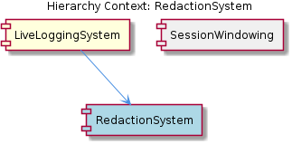
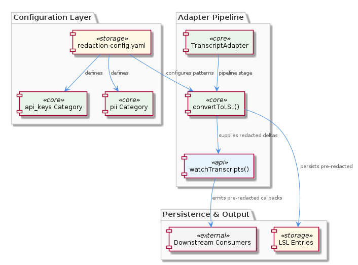

# RedactionSystem

**Type:** SubComponent

The redaction configuration lives at .specstory/config/redaction-config.yaml and uses category-based grouping, meaning operators can enable or disable entire classes of sensitive data (e.g., 'api_keys', 'pii') without editing individual patterns

# RedactionSystem — Technical Reference

## What It Is

RedactionSystem is a configuration-driven sensitive-data masking subsystem embedded within LiveLoggingSystem. Its operational surface spans two artifacts: the pattern configuration at `.specstory/config/redaction-config.yaml` and the `convertToLSL()` pipeline stage defined in the `TranscriptAdapter` base class at `lib/agent-api/transcript-api.js`. There are no dedicated code symbols for redaction — it is not a standalone class or service, but rather a concern that is wired into the adapter contract at the conversion boundary.

## Architecture and Design

The central architectural decision is that redaction is applied at the earliest possible point in the data pipeline: inside `convertToLSL()`, before any LSL entry is written to disk or surfaced to consumers. This placement is deliberate and consequential — it means the redaction guarantee is structural rather than advisory. No downstream layer, whether file persistence, session windowing, or the watch interface, can receive un-redacted content, because the sanitized form is the only form that ever exits the conversion step.

The YAML configuration uses category-based grouping (e.g., `api_keys`, `pii`) rather than a flat list of patterns. This is a meaningful design choice: operators reason about compliance in terms of data classes, not individual regex expressions. Enabling or disabling an entire class of sensitive data is a single config edit, not a code change. The practical consequence is that compliance concerns are fully isolated from `TranscriptAdapter` and the converter layers — the adapter applies whatever patterns the config declares, with no awareness of what those patterns represent semantically.

The relationship between RedactionSystem and its sibling SessionWindowing is worth noting. SessionWindowing partitions output into windowed files keyed by `LSLMetadata.timeWindow` (`HHMM-HHMM` intervals), meaning a single logical session may span multiple files. Because redaction occurs before any LSL entry is written, every windowed file — regardless of how sessions are reconstructed by joining files — contains only pre-redacted content. There is no scenario in which a session join surfaces unmasked data from an earlier window.

## Implementation Details

Mechanically, redaction operates inside the `convertToLSL()` method, which is one of the five abstract methods that concrete `TranscriptAdapter` subclasses must implement. The base class contract defined in `lib/agent-api/transcript-api.js` does not dictate *how* redaction is applied within that method, but the placement means every adapter implementation must pass entries through the pattern-matching logic before returning LSL entries. The YAML config supplies the active pattern set at runtime, and the category grouping means the matching loop iterates over enabled categories and their constituent patterns rather than a monolithic list.

The `watchTranscripts()` method — notably the one concrete (non-abstract) method on `TranscriptAdapter` — fires registered callbacks with delta entries, where those deltas are already the output of `convertToLSL()`. This means the watch interface inherits the redaction guarantee automatically, without any additional filtering step in the polling loop. The existing O(n) poll cycle over total entry count (using a `lastEntryCount` integer cursor) applies to already-redacted entries, so the watch path cannot be used as a side-channel to observe sensitive data.

## Integration Points

RedactionSystem's only hard dependency is the YAML config file at `.specstory/config/redaction-config.yaml`. Its integration with LiveLoggingSystem is implicit — any `TranscriptAdapter` subclass (whether for Claude Code, Copilot CLI, or a future agent) that correctly implements `convertToLSL()` with the config-driven pattern matching inherits the redaction behavior. There is no separate registration or injection step.

Downstream consumers of the watch interface receive pre-redacted deltas and have no interface to request raw content. This is not an access-control boundary enforced at runtime — it is a consequence of where in the pipeline conversion occurs.

## Usage Guidelines

**Adding a new pattern** requires only editing `.specstory/config/redaction-config.yaml` — no code changes to `TranscriptAdapter` or any concrete adapter. Patterns should be placed under the appropriate existing category (`api_keys`, `pii`, etc.) or a new category can be introduced if the data class is genuinely distinct. Keeping categories semantically coherent preserves the operator model of enabling/disabling by data class.

**Implementing a new `TranscriptAdapter`** subclass (e.g., for a new agent) must apply the redaction config inside `convertToLSL()`. Since `watchTranscripts()` is a shared concrete implementation that calls into `convertToLSL()`, a subclass that skips redaction in its conversion step will silently expose sensitive data through the watch interface. This is the primary risk surface in the current design — there is no base-class enforcement that redaction was applied.

**Performance note:** The `watchTranscripts()` polling loop is O(n) in total entry count. If redaction pattern matching is computationally expensive (many patterns, large entries), this cost is paid on every poll cycle for every entry up to the cursor. For long-running sessions with large entry counts, this compound cost could become visible. Pattern lists should be kept lean, and category-level disabling of unused pattern classes is the primary mitigation available without code changes.

## Hierarchy Context

### Parent
- [LiveLoggingSystem](./LiveLoggingSystem.md) -- [LLM] The `TranscriptAdapter` abstract base class in `lib/agent-api/transcript-api.js` defines a pluggable adapter contract that decouples the LSL pipeline from specific agent implementations. The five abstract methods — `getAgentType()`, `getTranscriptDirectory()`, `readTranscripts()`, `convertToLSL()`, and `getCurrentSession()` — establish a clear interface that concrete adapters (e.g., for Claude Code and Copilot CLI) must implement. This pattern means the core LSL infrastructure never directly references agent-specific transcript formats or filesystem layouts. A new developer adding support for a third agent (say, Cursor or Aider) would subclass `TranscriptAdapter` and implement only these five methods without touching the converter, file manager, or validation layers. The `watchTranscripts()` method is notably NOT abstract — it is a concrete polling implementation shared by all adapters, using `setInterval` with a default 1000ms interval and a `lastEntryCount` integer cursor that advances only when new entries are detected, then fires registered callbacks with only the delta entries. This means the watch mechanism is O(n) in total entry count per poll cycle, which could become a performance concern for very long sessions.

### Siblings
- [SessionWindowing](./SessionWindowing.md) -- LSLMetadata.timeWindow field drives file partitioning, with values formatted as 'HHMM-HHMM' hourly intervals, meaning log consumers must reconstruct full sessions by joining multiple windowed files

---

*Generated from 4 observations*
