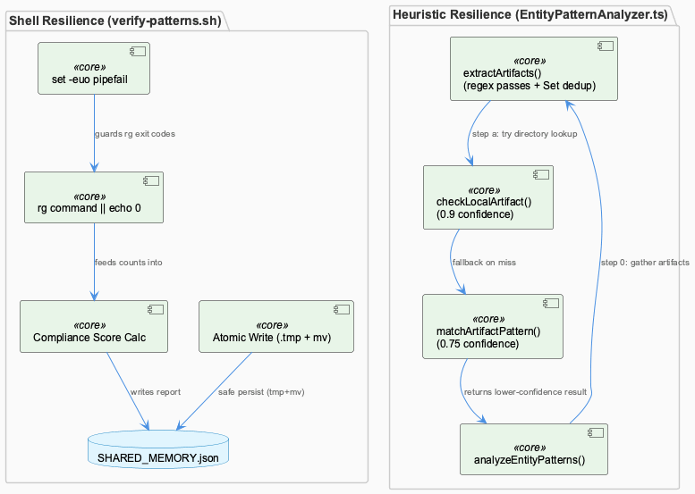
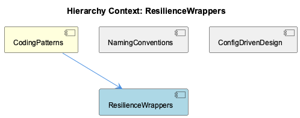

# ResilienceWrappers

**Type:** SubComponent

[Code References] scripts/knowledge-management/verify-patterns.sh:6 - `set -euo pipefail` establishes strict-mode baseline; scripts/knowledge-management/verify-patterns.sh (CONSOLE_LOG_COUNT/LOGGER_COUNT block) - `|| echo "0"` fallback guards against ripgrep's no-match exit code; scripts/knowledge-management/verify-patterns.sh (SHARED_MEMORY update block near end) - atomic `.tmp` + `mv` write pattern for JSON persistence; scripts/knowledge-management/verify-patterns.sh (SCORE calculation) - `SCORE=$((PASSED_CHECKS * 100 / TOTAL_CHECKS))` lacks an explicit divide-by-zero guard; src/ontology/heuristics/EntityPatternAnalyzer.ts - `analyzeEntityPatterns()` method implementing layered fallback (0.9 then 0.75 confidence); src/ontology/heuristics/EntityPatternAnalyzer.ts - `extractArtifacts()` private method combining four regex passes into a deduplicated Set; src/ontology/heuristics/EntityPatternAnalyzer.ts - `checkLocalArtifact()` and `matchArtifactPattern()` private methods implementing the two-step Layer 1 lookup

# ResilienceWrappers — Technical Insight Document

## What It Is

ResilienceWrappers, as a SubComponent under the CodingPatterns umbrella, is best understood not as a family of network-resilience decorators but as a documentation label applied to two concrete files that exhibit defensive/guard-rail coding idioms: `scripts/knowledge-management/verify-patterns.sh` and `src/ontology/heuristics/EntityPatternAnalyzer.ts`. Unlike the CircuitBreakerManager or CachingMechanism siblings referenced in the parent CodingPatterns description — which wrap external service/network calls with retry and caching semantics — neither file here makes network calls. Instead, they demonstrate resilience through shell-level defensive defaults and layered-fallback classification logic respectively. This distinction matters for anyone navigating the codebase expecting classic circuit-breaker machinery: what they'll actually find is "fail-safe local tooling," not service-call wrapping.

## Architecture and Design

The two files implement resilience through entirely different mechanisms suited to their runtime environments. `verify-patterns.sh` operates under `set -euo pipefail` (line 6) — a strict-mode baseline that would normally abort execution on any non-zero exit — but pairs this with pervasive `command || echo "0"` guards around every `rg` (ripgrep) invocation (CONSOLE_LOG_COUNT, LOGGER_COUNT, USESTATE_COUNT, REDUX_COUNT, UNDOCUMENTED_FUNCTIONS). This converts ripgrep's expected "no matches found" exit code into a safe default rather than a script-killing error — the shell equivalent of a try/catch-with-fallback.

`EntityPatternAnalyzer.ts` takes a different approach entirely: `analyzeEntityPatterns()` implements ordered-fallback resolution rather than error handling. It tries `checkLocalArtifact()` (high-confidence, 0.9, directory-based lookup) first, and only degrades to `matchArtifactPattern()` (lower-confidence, 0.75, regex-based lookup) if the first attempt fails, returning `null` only when neither path resolves anything. This is a "fail open with reduced confidence" idiom, contrasting with fail-closed error propagation.

## Implementation Details

In `verify-patterns.sh`, a second resilience idiom protects the knowledge-base read/write cycle: the script guards access to `$SHARED_MEMORY` with an existence check (`if [ -f "$SHARED_MEMORY" ]`), then performs an atomic write via `jq ... "$SHARED_MEMORY" > "$SHARED_MEMORY.tmp" && mv "$SHARED_MEMORY.tmp" "$SHARED_MEMORY"`. This write-to-tmp-then-rename pattern is a lightweight, dependency-free analogue to transactional writes, preventing corruption if the script is killed mid-write.

However, the script's compliance-scoring arithmetic (`SCORE=$((PASSED_CHECKS * 100 / TOTAL_CHECKS))`) reveals a latent robustness gap: `TOTAL_CHECKS` is only safe from divide-by-zero because two unconditional checks (ConditionalLoggingPattern, Documentation) always execute alongside conditional ones (e.g., the Redux check, gated on `package.json` containing "react"). This is resilience-by-accident rather than resilience-by-design — removing those unconditional checks would break the arithmetic with no guard in place.

On the TypeScript side, `extractArtifacts()` combines four independent regex passes (filePathPattern, npmPattern, classPattern, dirPattern) into a deduplicated `Set<string>`, with no schema validation of the underlying strings — mirroring verify-patterns.sh's own textual (rather than structural) parsing of `rg` output.

## Integration Points

`verify-patterns.sh` sits alongside sibling concerns already documented under NamingConventions (its console.log-vs-Logger checks enforcing ConditionalLoggingPattern) and ConfigDrivenDesign (its role as the enforcement mechanism reading/writing `TransferablePattern` entries in `$SHARED_MEMORY`). ResilienceWrappers describes the same script's *defensive* posture — the `|| echo "0"` and atomic-write idioms — as opposed to its config-driven or naming-convention aspects. The script couples report generation, scoring, and knowledge-base mutation in a single linear flow rather than separating concerns into functions or modules, meaning its resilience idioms are inline throughout rather than centralized in one wrapper.

`EntityPatternAnalyzer.ts` diverges from the parent CodingPatterns convention of "externalizing policy from mechanism": its `teamDirectories` and `artifactPatterns` classification rules are hardcoded as class-internal literals rather than pulled from a config file (unlike `config/task-taxonomy.yaml`-style externalization elsewhere in the project), meaning rule changes require code edits and a rebuild.

## Usage Guidelines

Developers should not expect ResilienceWrappers to represent CircuitBreakerManager/CachingMechanism-style network wrapping — no evidence of external call decoration exists in either file. When modifying `verify-patterns.sh`, preserve the `|| echo "0"` guards on any new `rg` invocations to maintain strict-mode compatibility, and retain the atomic tmp-then-`mv` pattern for any further `$SHARED_MEMORY` writes. Be cautious when refactoring the compliance-scoring block: removing the unconditional checks without adding an explicit `TOTAL_CHECKS` guard will reintroduce a divide-by-zero risk. Note also that the script's `CLAUDE_REPO` resolution is physically coupled to its location at `scripts/knowledge-management/verify-patterns.sh`, so relocating it requires setting `CODING_TOOLS_PATH`/`CODING_REPO` explicitly. For `EntityPatternAnalyzer.ts`, any change to team-ownership or artifact-matching rules should be understood as a code change, not a config change, until such rules are externalized in line with the broader ConfigDrivenDesign convention.

## Hierarchy Context

### Parent
- [CodingPatterns](./CodingPatterns.md) -- CodingPatterns serves as a catch-all component for general programming wisdom, design patterns, conventions, and best practices that are applied across the Coding project but do not belong to any single functional subsystem. Rather than being a discrete module with its own directory, it manifests as recurring architectural idioms observed across the codebase—such as adapter patterns for storage backends, lazy initialization patterns for agent classes, circuit-breaker and caching wrappers around external services, and shared concurrency utilities like work-stealing task distribution. These patterns are documented in docs/architecture/*.md files and implemented consistently across SubComponents like GraphDatabaseManager, LLMServiceProvider, and CircuitBreakerManager.

Because no representative source files were directly attributed to this component, its presence is inferred from cross-cutting conventions referenced in the broader Existing Knowledge graph (e.g., Detail-level entities like ProviderRegistryManager and GraphDatabaseManager) and from architecture documentation describing system-wide approaches (health monitoring, LLM routing, memory systems). The component effectively functions as a conceptual umbrella capturing idiomatic code style, naming conventions (e.g., *Manager, *Adapter, *Service suffixes), and best-practice enforcement mechanisms like the ConstraintMonitoringService and egress-lint-allowlist.json.

Key architectural patterns include the consistent use of dependency-injected registries (ProviderRegistryManager), decorator-like wrapping of network calls (CircuitBreakerManager, CachingMechanism), and configuration-driven behavior (config/features.yaml, config/agent-profiles.json) rather than hardcoded logic, reflecting a broader project convention of externalizing policy from mechanism.

### Siblings
- [NamingConventions](./NamingConventions.md) -- [LLM] scripts/knowledge-management/verify-patterns.sh implements a self-contained compliance checker that greps the codebase for `console.log` calls versus `Logger.*` calls to enforce the ConditionalLoggingPattern naming/usage convention referenced in the parent CodingPatterns component. The script hardcodes its resolution of `CLAUDE_REPO` via `CODING_TOOLS_PATH`/`CODING_REPO` env vars with a fallback to a path derived two directories up from `SCRIPT_DIR`, which ties the script's correctness to its physical location at `scripts/knowledge-management/verify-patterns.sh` — moving the file would silently break the repo-root inference unless the env vars are set.
- [ConfigDrivenDesign](./ConfigDrivenDesign.md) -- [LLM] scripts/knowledge-management/verify-patterns.sh is the concrete enforcement mechanism for the ConfigDrivenDesign/CodingPatterns umbrella described in the parent context. Rather than encoding pattern rules directly in application logic, it externalizes 'compliance checks' (ConditionalLoggingPattern, ReduxStateManagementPattern, NetworkAwareInstallationPattern) as ripgrep-based heuristics run against the tree, and reads a `TransferablePattern` list with `significance >= 8` out of a JSON knowledge-base file (`$SHARED_MEMORY`) via `jq`. This is a textbook instance of the 'monitoring-as-code' convention called out in the parent observations (ConstraintMonitoringService, health-verification-rules.json) — the script itself contains no hardcoded assertions about what 'compliant' code looks like beyond what's already declared in data (the pattern list), and it writes its score back into that same JSON file (`.metadata.last_pattern_verification`, `.metadata.pattern_compliance_score`), making the knowledge base both the source of truth and the sink for compliance telemetry.

---

*Generated from 9 observations*
