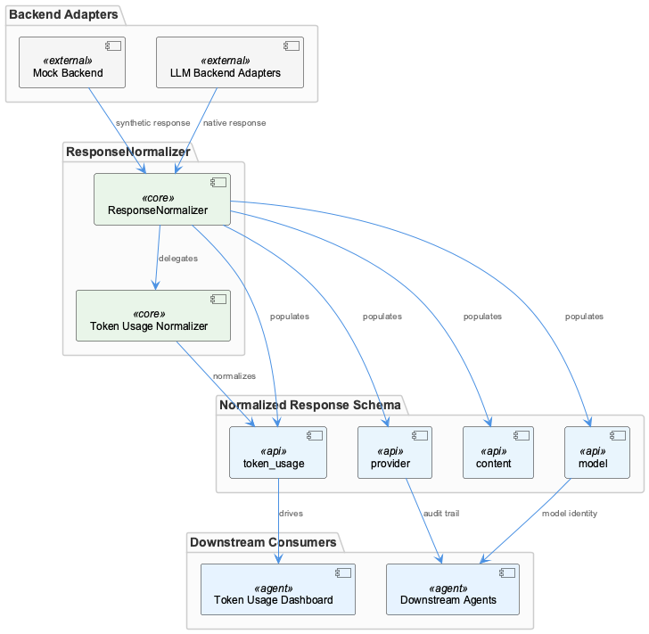
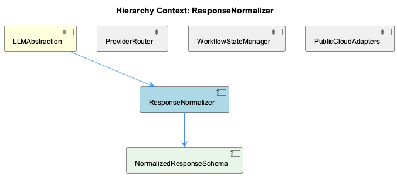

# ResponseNormalizer

**Type:** SubComponent

The normalized response schema carries four fields—content, model, provider, and token usage—as specified in the LLMAbstraction description, meaning every backend adapter must map its native response to this contract

# ResponseNormalizer

## What It Is

ResponseNormalizer is a SubComponent of LLMAbstraction responsible for enforcing a strict, provider-agnostic output contract across all backend adapters. It sits at the boundary between raw provider responses and the rest of the system, ensuring that regardless of which backend served a request—Anthropic, OpenAI, Docker Model Runner, rapid-llm-proxy, or the mock service—downstream consumers always receive the same four-field structure defined by NormalizedResponseSchema: **content**, **model**, **provider**, and **token usage**.

Token usage normalization is significant enough to have dedicated documentation at `docs/architecture/token-usage.md`, which directly connects ResponseNormalizer to the Token Usage Dashboard feature. This elevates ResponseNormalizer beyond a simple data-mapping utility; it is an active enabler of observable, auditable LLM infrastructure.

## Architecture and Design

The central design decision in ResponseNormalizer is the **strict four-field contract** enforced by NormalizedResponseSchema. By mandating exactly these fields—no more, no fewer—the design creates a clean seam between provider-specific adapter logic and all downstream consumers. This means ProviderRouter can select any backend through its environment-variable priority chain (RAPID_LLM_PROXY_URL → LLM_CLI_PROXY_URL → LLM_PROXY_URL) without downstream agents needing awareness of which provider was chosen; ResponseNormalizer absorbs that variability.

A deliberate trade-off embedded in this design is **completeness over sparseness**: even the mock backend must populate the `model` field with a synthetic identifier. This prevents conditional handling downstream—consumers never need to branch on whether a field might be absent. The implication is that every adapter, including lightweight test doubles, carries a full normalization responsibility.

The inclusion of the `provider` field is an architectural choice that favors **auditability without state coupling**. Rather than requiring downstream agents or dashboards to cross-reference workflow-progress.json (managed by WorkflowStateManager) to determine which backend served a call, the normalized response is self-describing. This keeps read paths for audit and dashboard features decoupled from the runtime state file.

## Implementation Details

NormalizedResponseSchema is the child component that codifies the contract: four fields, strictly enforced, applied uniformly. Each of the PublicCloudAdapters—Anthropic and OpenAI—must translate their native response envelopes into this shape. Because those two providers differ in request schemas, authentication headers (ANTHROPIC_API_KEY vs. OPENAI_API_KEY), and response envelope structure, each adapter performs its own field mapping before handing off to the normalized shape.

Token usage normalization deserves particular attention. Because different providers represent token counts differently in their native responses, the mapping logic for the `token usage` field is non-trivial enough to warrant dedicated documentation in `docs/architecture/token-usage.md`. This suggests the normalization for that field likely involves provider-specific extraction logic that must be maintained per adapter as provider APIs evolve.

The `model` field requirement for the mock backend implies a configuration point—likely a hardcoded or configurable synthetic model identifier—ensuring that the mock service participates fully in the normalized contract. This makes mock responses structurally indistinguishable from real provider responses, which is valuable for integration testing and dashboard feature development.

## Integration Points

ResponseNormalizer's primary integration is with the full adapter surface of LLMAbstraction. Every backend adapter—public cloud, DMR, rapid-llm-proxy, and mock—must produce output conforming to NormalizedResponseSchema before that output leaves the LLMAbstraction layer. ProviderRouter determines which adapter is invoked, but ResponseNormalizer determines what that adapter must produce.

Downstream, the `provider` field enables the Token Usage Dashboard and any audit tooling to attribute calls to specific backends without querying WorkflowStateManager or the workflow-progress.json state file. This creates a clean one-way data flow: routing decisions live in state, but response attribution is carried in the response itself.

The `token usage` field as documented in `docs/architecture/token-usage.md` is the primary bridge between ResponseNormalizer and the Token Usage Dashboard feature, making that documentation a critical maintenance touchpoint whenever provider response envelopes change.

## Usage Guidelines

Every adapter added to LLMAbstraction must fully implement the NormalizedResponseSchema contract—all four fields are mandatory with no optional exceptions. Developers adding a new backend should treat the mock backend's requirement to carry a synthetic `model` identifier as the baseline: if the mock must be complete, all adapters must be complete.

When a provider updates its response envelope (e.g., changes how token counts are reported), the corresponding adapter's normalization logic and the `docs/architecture/token-usage.md` documentation should be updated together. Drift between implementation and documentation here directly impacts the Token Usage Dashboard's accuracy.

Downstream consumers—agents, dashboards, audit tooling—should rely on the `provider` field in the normalized response rather than inspecting workflow-progress.json for attribution. This is the intended decoupling: the state file governs routing decisions at request time; the normalized response governs attribution at consumption time. Mixing these two sources of truth would undermine the auditability guarantee that ResponseNormalizer's design intentionally provides.

---

**Architectural Patterns Identified:** Adapter/Normalizer pattern with a strict output contract; self-describing responses for auditability decoupling.

**Key Trade-offs:** Completeness mandate (all fields always present) over flexibility—increases adapter implementation cost but eliminates downstream conditional logic and enables uniform dashboard/audit features.

**Scalability Consideration:** Adding new backends scales linearly with adapter effort; the normalized contract itself does not need to change, preserving downstream stability.

**Maintainability:** The four-field constraint is a maintenance asset—it creates a single, narrow interface to verify when providers change. The dedicated `docs/architecture/token-usage.md` page signals that token normalization is the highest-churn area and warrants its own review discipline.

## Hierarchy Context

### Parent
- [LLMAbstraction](./LLMAbstraction.md) -- LLMAbstraction is the provider-agnostic layer that routes LLM calls across multiple backends: public cloud providers (Anthropic, OpenAI), a local Docker Model Runner (DMR), a rapid-llm-proxy middleware, and a mock service for testing. The architecture centers on a workflow-progress.json state file that stores global and per-agent LLM mode overrides (mock/local/public), enabling dynamic runtime switching without code changes. Provider selection flows through environment variables (RAPID_LLM_PROXY_URL, LLM_CLI_PROXY_URL, LLM_PROXY_URL) with a defined priority chain, and all providers normalize their responses to a shared shape containing content, model, provider, and token usage fields.

### Children
- [NormalizedResponseSchema](./NormalizedResponseSchema.md) -- As documented in the LLMAbstraction component description, the schema mandates exactly four fields—content, model, provider, and token usage—creating a strict normalization contract for all provider adapters.

### Siblings
- [ProviderRouter](./ProviderRouter.md) -- Provider selection follows a defined priority chain across three environment variables—RAPID_LLM_PROXY_URL, LLM_CLI_PROXY_URL, and LLM_PROXY_URL—meaning the first set variable wins, as documented in docs/architecture/system-overview.md
- [WorkflowStateManager](./WorkflowStateManager.md) -- workflow-progress.json acts as the single source of truth for LLM mode state, storing both a global override and per-agent overrides, as described in the LLMAbstraction parent component description
- [PublicCloudAdapters](./PublicCloudAdapters.md) -- Anthropic and OpenAI are listed as distinct backends, requiring separate adapters because their request schemas, authentication headers (ANTHROPIC_API_KEY vs OPENAI_API_KEY as documented), and response envelopes differ

---

*Generated from 4 observations*
