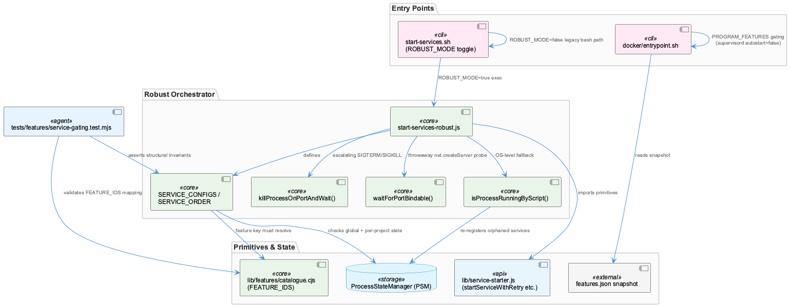
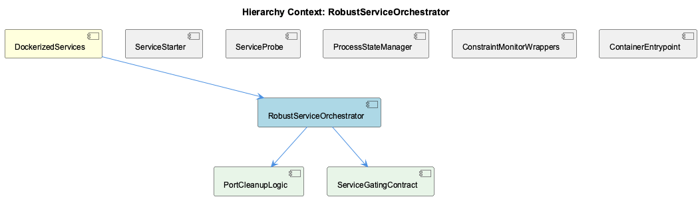

# RobustServiceOrchestrator

**Type:** SubComponent

# RobustServiceOrchestrator — Technical Insight Document

## What It Is

RobustServiceOrchestrator is implemented primarily in `scripts/start-services-robust.js`, and is invoked as the default startup path via `start-services.sh` when the `ROBUST_MODE` environment variable is `true` (its default). It is best understood not as a thin consumer of the layered process-management primitives described for the parent component, DockerizedServices, but as a thicker composition layer sitting atop `lib/service-starter.js`. While it imports core primitives from that module — `startServiceWithRetry`, `createHttpHealthCheck`, `createPidHealthCheck`, `isPortListening`, `isTcpPortListening`, `isProcessRunning`, and `sleep` — it also defines substantial orchestration logic locally, including `isProcessRunningByScript`, `killProcessOnPortAndWait`, and `waitForPortBindable`. This makes it the operational core that decides what services start, in what order, under what feature gates, and how failures are tolerated or escalated.

## Architecture and Design

The orchestrator's design centers on `SERVICE_CONFIGS` and `SERVICE_ORDER`, both exported from `start-services-robust.js`, which together define a declarative service registry with per-service `startFn`, `required`, and `feature` metadata. Several architectural patterns recur throughout: retry-with-backoff and graceful degradation (via `startServiceWithRetry` combined with the `required` flag), registry self-healing/reconciliation, and a conservative-primitive/deferred-verdict approach to readiness probing.

The registry self-healing pattern is most visible in the `transcriptMonitor` and `liveLoggingCoordinator` entries of `SERVICE_CONFIGS`, whose `startFn()` implementations perform a triple-layer duplicate-detection check: first a global `psm.isServiceRunning('...', 'global')` lookup, then a per-project PSM check, and finally an OS-level `pgrep` fallback via `isProcessRunningByScript('enhanced-transcript-monitor.js')`. This reflects a deliberate design stance that the ProcessStateManager registry is authoritative-but-not-trusted — it can drift from true OS state after ungraceful container stops, the same failure mode the parent DockerizedServices context describes — so orphaned processes discovered via `pgrep` are re-registered into PSM (`psm.registerService(...)`) to repair drift rather than merely working around it.

The child component PortCleanupLogic embodies a second conservative-primitive pattern: `killProcessOnPortAndWait()` performs graduated SIGTERM-then-SIGKILL escalation (escalating only after `maxWaitMs/2`), while `waitForPortBindable()` deliberately avoids HTTP-level `isPortListening()` checks, since a kernel can hold a lingering socket after a crash with nothing responding to probes — instead using a throwaway `net.createServer().listen()` probe. This mirrors the SPEC R6 conservative-verdict design in the sibling ServiceProbe component but is an independently-built, parallel implementation rather than a shared one. Notably, nothing in the visible source composes these two functions automatically; each `startFn` must call both explicitly, making the cleanup guarantee a manual convention rather than an enforced invariant.

## Implementation Details

Key local functions include `isProcessRunningByScript()` (`start-services-robust.js:58-77`), which shells out to `pgrep`-style matching to find orphaned processes; `killProcessOnPortAndWait()` (`:88-149`), which enumerates PIDs via `lsof -ti:${port}`, sends SIGTERM, polls `checkPortInUse()` at a default 200ms interval, and escalates to SIGKILL past the halfway timeout mark; and `waitForPortBindable()` (`:161-176`), which repeatedly attempts to bind a throwaway server socket rather than trust HTTP-level checks.

The child entity ServiceGatingContract governs a third layer of behavior: `startOneService` consults `loadFeatures()` per-service against each config's `feature` key before invoking `startFn`, distinguishing a "disabled" outcome (feature off, never attempted) from a "degraded" outcome (feature on, attempted, failed) — a distinction codified as a first-class result state rather than log text, and directly exercised by `tests/features/service-gating.test.mjs:98-104`.

## Integration Points

RobustServiceOrchestrator sits under DockerizedServices and coordinates two children — PortCleanupLogic and ServiceGatingContract — while depending on primitives from sibling ServiceStarter (`lib/service-starter.js`) and ServiceProbe, and reading/writing state through ProcessStateManager. Its feature-gating logic is deliberately duplicated: the Node-side `SERVICE_CONFIGS.feature` check runs on the host, while ContainerEntrypoint's `docker/entrypoint.sh` independently re-implements the same fail-open semantics in bash via a `node -e` one-liner and a hardcoded `PROGRAM_FEATURES` mapping against `/coding/.coding/runtime/features.json`, rather than sharing `lib/features/catalogue.cjs` or `lib/features/index.mjs` directly. Structural correctness of the Node-side contract is enforced only by `tests/features/service-gating.test.mjs`, which asserts every `SERVICE_CONFIGS` entry declares a valid `feature` resolvable in `FEATURE_IDS`, that `SERVICE_ORDER` and `SERVICE_CONFIGS` share identical key sets, and that `transcriptMonitor`/`liveLoggingCoordinator` remain the first two entries in `SERVICE_ORDER` since later services register against them.

## Usage Guidelines

Developers extending `SERVICE_CONFIGS` must add a valid `feature` entry matching `lib/features/catalogue.cjs`'s `FEATURE_IDS`, keep `SERVICE_ORDER` and `SERVICE_CONFIGS` key sets identical, and preserve the `transcriptMonitor`/`liveLoggingCoordinator` ordering contract — all enforced only by tests, not types or build guarantees. When implementing a new `startFn`, both `killProcessOnPortAndWait()` and `waitForPortBindable()` should be explicitly composed if port-conflict resilience is required, since no automatic chaining exists. Any change to feature semantics must be manually mirrored into `docker/entrypoint.sh`'s `PROGRAM_FEATURES` string, since no test currently verifies host/container gating-vocabulary consistency. Finally, the `ROBUST_MODE=false` legacy bash path in `start-services.sh` remains a live parallel implementation that the project's own CLAUDE.md forbids ("NO PARALLEL VERSIONS"); it should be treated as a deprecation candidate rather than a maintained alternative.

## Code Evidence

Key code artifacts grounding this entity's analysis:

- No populated <code_graph> data was supplied for this component (the <code_graph> block is empty), so no call-graph-verified relationships between RobustServiceOrchestrator and other components (e.g., ProcessStateManager, service-starter.js exports) can be asserted with graph-level confidence; all relationships cited above are derived from direct reading of the provided source files (scripts/start-services-robust.js, start-services.sh, docker/entrypoint.sh, tests/features/service-gating.test.mjs) rather than from graph traversal.

## Hierarchy Context

### Parent
- [DockerizedServices](./DockerizedServices.md) -- [LLM] The DockerizedServices architecture enforces a strict separation between process spawning and process lifecycle management via a consistent wrapper pattern in scripts/api-service.js and scripts/dashboard-service.js. Rather than letting supervisord directly manage the underlying Node processes (dashboard-server.js on port 3031, or 'npm run dev' for the Next.js dashboard on port 3030), each wrapper script spawns the actual service as a child process and immediately registers it with the ProcessStateManager (PSM) under a well-known name like 'constraint-api-child'. This indirection allows the PSM to maintain a canonical, queryable registry of running services independent of supervisord's own state tracking, which is critical when other components (health-coordinator, CLI tooling) need to introspect or manage services without going through supervisorctl. The wrappers also forward SIGTERM/SIGINT to the child and unregister from PSM on exit, ensuring the PSM registry never drifts from actual OS process state even during ungraceful container stops.

### Children
- [PortCleanupLogic](./PortCleanupLogic.md) -- [LLM] scripts/start-services-robust.js implements two independent, layered port-release strategies that are never unified: killProcessOnPortAndWait(port, options) actively frees a port by shelling out to `lsof -ti:${port}` to enumerate PIDs, sending SIGTERM to all of them, polling checkPortInUse() every pollIntervalMs (default 200ms), and escalating to SIGKILL only after maxWaitMs/2 has elapsed — a graduated-force pattern that trades a slower best case for avoiding data-loss from an immediate SIGKILL. This is distinct in purpose from waitForPortBindable(port, options), which does not kill anything; it passively waits for the kernel to release a socket by repeatedly attempting a throwaway `net.createServer().listen(port, host)` probe, closing it immediately on success. The two are meant to be composed (kill, then confirm bindability) but nothing in the visible source actually calls waitForPortBindable() from within killProcessOnPortAndWait() or vice versa — each SERVICE_CONFIGS.startFn would need to invoke both explicitly, which is a fragile manual composition rather than a single guaranteed cleanup primitive.
- [ServiceGatingContract](./ServiceGatingContract.md) -- [LLM] The ServiceGatingContract is not one mechanism but three independently-evolving gating layers that must stay in agreement without any shared code: (1) `SERVICE_CONFIGS[key].feature` checked inside `startOneService` in scripts/start-services-robust.js against `loadFeatures()`, (2) the bash-side `PROGRAM_FEATURES` string in docker/entrypoint.sh mapped through a `node -e` one-liner reading `/coding/.coding/runtime/features.json`, and (3) the structural test suite in tests/features/service-gating.test.mjs that only validates layer (1) against `lib/features/catalogue.cjs`'s `FEATURE_IDS`. There is no test asserting that entrypoint.sh's `PROGRAM_FEATURES` mapping stays consistent with either the host feature catalogue or the container's own supervisord.conf `[program:...]` sections apart from the comment's claim of `tests/features/container-gating.test.mjs` — meaning the host-side and container-side gating vocabularies could drift silently if `lib/features/catalogue.cjs` gains a feature id that is never added to the bash string.

### Siblings
- [ServiceStarter](./ServiceStarter.md) -- [LLM] The component enforces feature-gating at two independent layers that must stay in sync: the container-side layer in docker/entrypoint.sh reads a flat host-written snapshot (/coding/.coding/runtime/features.json) and rewrites it into a supervisord include (/etc/supervisor/features.d/disabled.conf) that flips `autostart=false` for programs whose feature is off, while the host-side layer in scripts/start-services-robust.js consults `loadFeatures()` per-service via `startOneService()` before invoking each service's `startFn`. Both layers deliberately fail toward 'everything enabled' — entrypoint.sh explicitly comments that a missing/unreadable snapshot leaves the features directory empty ('starts everything — the historical behaviour'), and an unrecognized feature name in the snapshot is treated as enabled by the inline `node -e` script (`value === false ? "false" : "true"`) rather than defaulting to disabled. This is a considered fail-open design: an incomplete config produces a container that does too much rather than one that silently does nothing, which the comments call easier to diagnose.
- [ServiceProbe](./ServiceProbe.md) -- [LLM] docker/entrypoint.sh implements a fail-open feature-gating layer that sits strictly between the host's feature resolver and supervisord: it reads a flat JSON snapshot at /coding/.coding/runtime/features.json (written by the host, never by the container) and, for each entry in the PROGRAM_FEATURES mapping (e.g. 'semantic-analysis:knowledge', 'constraint-monitor:constraints', 'health-dashboard:health'), uses `node -e` (not jq, since jq isn't installed in the image) to decide whether to emit an `autostart=false` override into /etc/supervisor/features.d/disabled.conf. Critically, the script comments explain the asymmetric fail-open design: a missing or unparseable snapshot leaves the override directory empty, which starts EVERYTHING, because the authors judged that a container silently running nothing due to a late-arriving JSON file would be a much harder failure mode to diagnose than one that over-starts. An unknown feature key in the snapshot also reads as enabled by default, guarding against an old host snapshot silently disabling a newer program it doesn't know about.
- [ProcessStateManager](./ProcessStateManager.md) -- [CGR] ProcessStateManager (class) in process-state-manager.js
- [ConstraintMonitorWrappers](./ConstraintMonitorWrappers.md) -- [LLM] docker/entrypoint.sh implements a fail-open feature-gating layer that translates the host's `~/.coding/features.yaml` (never mounted into the container) into a supervisord include directory. It reads a flat snapshot at `/coding/.coding/runtime/features.json` and, for each entry in the `PROGRAM_FEATURES` mapping (e.g. `constraint-monitor:constraints`, `constraint-dashboard:constraints`, `constraint-dashboard-api:constraints`), shells out to `node -e` (not `jq`, which isn't installed in the image) to read `snap.features?.[feature]` and writes `[program:<name]\nautostart=false` into `/etc/supervisor/features.d/disabled.conf` when the value is explicitly `false`. An unknown feature key or a missing snapshot file both resolve to 'enabled', which the comment block explicitly frames as deliberate: a stale/older host snapshot must never silently turn a program off, and a late-arriving JSON file must never leave the container running nothing.
- [ContainerEntrypoint](./ContainerEntrypoint.md) -- [LLM] docker/entrypoint.sh implements a two-phase startup contract: first a blocking `wait_for_service()` loop that TCP-probes Qdrant and Redis via `/dev/tcp/$host/$port` redirection, then an `.env` loader that explicitly excludes `*_API_KEY|*_TOKEN|*_MANAGEMENT_KEY` variables with a `continue` in the `case` statement. This exclusion is the container-side half of the T2 egress lockdown documented inline: even though the host's `.env` is bind-mounted into the container, raw provider credentials are deliberately never exported into the container's process environment, forcing all LLM/embedding calls through the host's `llm-cli-proxy` on port 12435 rather than allowing an in-container SDK client to dial a provider directly. This is a security boundary enforced by omission, not by network policy.

---

*Generated from 10 observations*
