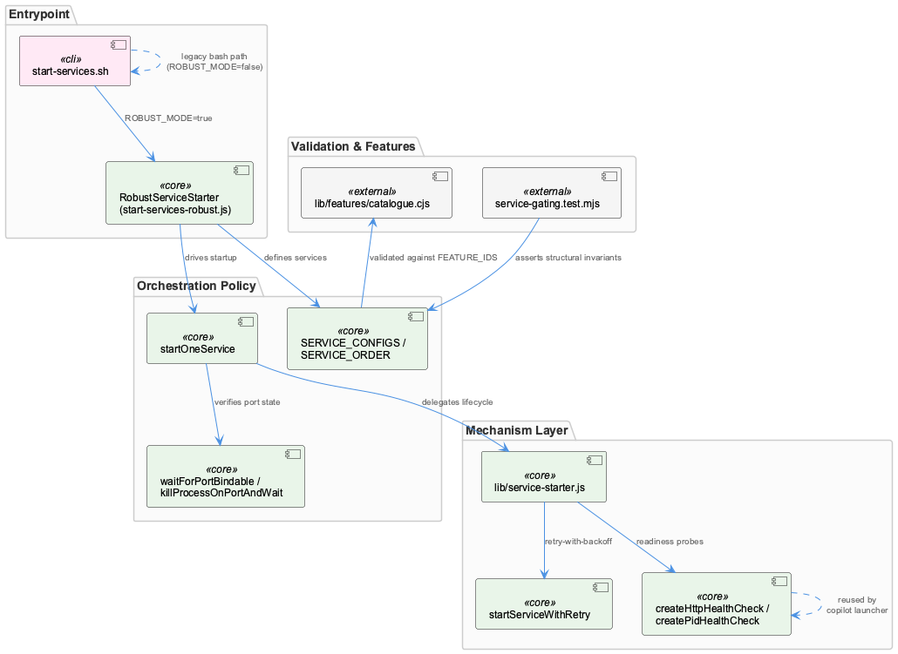
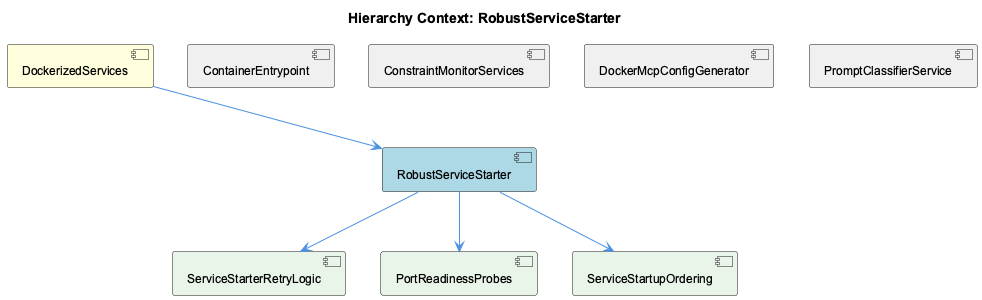

# RobustServiceStarter

**Type:** SubComponent

# RobustServiceStarter — Technical Insight Document

## What It Is

RobustServiceStarter is implemented in `scripts/start-services-robust.js`, which serves as the concrete orchestrator for launching supervised processes such as `transcriptMonitor` and `liveLoggingCoordinator`. It is invoked from `start-services.sh` when the `ROBUST_MODE` flag (default `true`) selects the Node-based orchestrator over a legacy bash startup path. As a SubComponent of DockerizedServices, it operationalizes the parent's stated goal of health-check-driven readiness — but where the parent (via `lib/service-probe.js`) is concerned with polling dockerized services like the semantic analysis MCP and constraint monitor, RobustServiceStarter is the layer that decides *when and how* to start, retry, and gate local supervised services before those downstream checks even apply.

## Architecture and Design

The core architectural pattern is separation of orchestration policy from mechanism. `start-services-robust.js` imports generic primitives — `startServiceWithRetry`, `createHttpHealthCheck`, `createPidHealthCheck`, `isPortListening`, `isTcpPortListening`, `isProcessRunning`, `sleep` — from `lib/service-starter.js`, which centralizes spawning/lifecycle logic. RobustServiceStarter itself only wires specific services into this machinery via `SERVICE_CONFIGS`, declaring per-service required/optional classification, `maxRetries`, `timeout`, `startFn`, and `healthCheckFn`.

A second defining pattern is the feature-gated service catalogue: every entry in `SERVICE_CONFIGS` must declare a feature, and `tests/features/service-gating.test.mjs` enforces that each declared feature is real against `FEATURE_IDS` from `lib/features/catalogue.cjs`. This turns what could be an informal list into a load-bearing, test-validated data structure.

Third, the dual-mode entrypoint in `start-services.sh` means the "robust" behavior is opt-out, not exclusive — a legacy bash path (with manual docker-compose/lsof/pkill orchestration, seen concretely in sibling ConstraintMonitorServices) coexists in the same script, creating a risk of behavioral drift between the two paths since they are not enforced to stay equivalent.

## Implementation Details

`startOneService`, exercised by `tests/features/service-gating.test.mjs`, drives feature-gated startup with blocking semantics for required services — required services block downstream progress on failure, while optional ones degrade gracefully. This retry contract is detailed further in child ServiceStarterRetryLogic: `transcriptMonitor` and `liveLoggingCoordinator` are both `required:true`, `maxRetries:3`, `timeout:20000`, with `startFn` implementations layering PSM-global, PSM-per-project, and OS-level `pgrep` checks before spawning — making "retry" a guarded idempotent start rather than a naive respawn loop, avoiding duplicate processes across parallel sessions.

Port readiness is handled by `waitForPortBindable()` and `killProcessOnPortAndWait()`, functionality captured conceptually by child PortReadinessProbes (though not a standalone module). These functions address a narrower failure mode than HTTP polling: a just-crashed process can leave the kernel holding a TCP socket briefly, causing HTTP-based `isPortListening` checks to false-negative or plain bind attempts to throw `EADDRINUSE`. The code deliberately probes via a throwaway `net.createServer().listen()` rather than inferring readiness from log output, conserving retry budget as noted in the function's own comments.

Startup sequencing is governed by `SERVICE_ORDER` and `SERVICE_CONFIGS`, the implementation surface of child ServiceStartupOrdering. The test suite asserts these two structures cover each other exactly and that `transcriptMonitor`/`liveLoggingCoordinator` must occupy the first two slots — converting ordering from an implicit code-layout consequence into a checked invariant.

## Integration Points

RobustServiceStarter depends on `lib/service-starter.js` for all generic retry and health-check primitives, and on `lib/features/catalogue.cjs` for feature validation. It is invoked conditionally from `start-services.sh` via the `ROBUST_MODE` flag, sitting alongside — but architecturally distinct from — the legacy path that provisions ConstraintMonitorServices. Its parent, DockerizedServices, relies on the same underlying health-check machinery family (`lib/service-probe.js`) used elsewhere; per session records, this probe machinery is also reused by the `coding --copilot` launcher's health check, meaning any change to probe timing or endpoint behavior has cross-cutting effects across multiple entry points, not just this starter. Notably, sibling ContainerEntrypoint (`docker/entrypoint.sh`) performs a comparatively weaker TCP-level readiness check for Qdrant/Redis before invoking supervisord — a looser guarantee than the HTTP-endpoint polling this component's ecosystem otherwise favors, and a reminder that a "TCP-open" or "Docker up" state is not equivalent to internal-process health, as also emphasized in the session record on the coding-services Docker container health verification workflow.

## Usage Guidelines

Developers adding a new supervised service must update `SERVICE_CONFIGS` and `SERVICE_ORDER` together and assign a valid feature ID — omitting either will fail `tests/features/service-gating.test.mjs`, since the test enforces exact mutual coverage and requires `transcriptMonitor`/`liveLoggingCoordinator` to start first. When implementing `startFn`, follow the guarded idempotent-start pattern already used for required services (PSM-global, PSM-per-project, `pgrep` checks) rather than a naive spawn to avoid duplicate processes across parallel sessions. When working with port cleanup logic, prefer the `waitForPortBindable()`/`killProcessOnPortAndWait()` bind-probe approach over HTTP-based readiness checks in scenarios involving recently-crashed processes, to avoid false negatives and wasted retry budget. Finally, because `start-services.sh` still maintains a legacy non-robust path, any change to retry/health-check semantics in `start-services-robust.js` should be evaluated against whether equivalent behavior is needed (or intentionally not needed) in the legacy path to avoid silent behavioral divergence.

## Work Record

What working sessions recorded about this entity — decisions taken, problems hit, and why things are the way they are:

- The 'Coding-Services Docker Container — Health Verification Workflow' record establishes that after a docker-compose rebuild, supervised processes and health endpoints must be explicitly confirmed live before downstream pipelines (e.g. wave-analysis) proceed — a container reporting 'up' in Docker does not guarantee its internal processes are healthy, so this verification is a manual/scripted gate rather than an automatic consequence of container start.
- The 'coding --copilot Launcher Health Check' record establishes that the same ServiceProbe-based health-check machinery is reused between the coding-services container verification flow and the copilot launcher's own health check, meaning any change to probe timing or endpoint behavior has cross-cutting effects on multiple entry points rather than being isolated to one command.

## Hierarchy Context

### Parent
- [DockerizedServices](./DockerizedServices.md) -- [LLM] lib/service-probe.js implements the health-check polling logic that determines readiness of dockerized services (semantic analysis MCP, constraint monitor) before dependent processes proceed. Rather than a single fixed timeout, the probe pattern issues periodic requests against known health endpoints and treats consecutive failures within a window as the signal for 'not ready' versus 'transiently slow', which matters in a Docker context where container startup order and cold-start times (loading models, connecting to databases) are highly variable across restarts.

### Children
- [ServiceStarterRetryLogic](./ServiceStarterRetryLogic.md) -- [LLM] scripts/start-services-robust.js's SERVICE_CONFIGS object defines the retry logic contract per-service: transcriptMonitor and liveLoggingCoordinator are both marked required:true with maxRetries:3 and timeout:20000, and their startFn implementations layer multiple existence checks (PSM global, PSM per-project, OS-level pgrep) before spawning, meaning the 'retry' in ServiceStarterRetryLogic is not a naive respawn loop but a guarded idempotent start that avoids duplicate processes across parallel sessions.
- [PortReadinessProbes](./PortReadinessProbes.md) -- [LLM] The code actually supplied is start-services-robust.js, start-services.sh, docker/entrypoint.sh, prompt-classifier-service.mjs, and a service-gating test — none of which define a component or function named 'PortReadinessProbes'. The closest relatives are waitForPortBindable() and killProcessOnPortAndWait() in scripts/start-services-robust.js, which perform TCP bind probing and port-cleanup-with-wait, but these are two discrete utility functions embedded in a larger orchestrator file, not a standalone 'PortReadinessProbes' module, class, or exported unit. Treating them as the named component would be an inference from thematic similarity (both are about port readiness) rather than direct evidence.
- [ServiceStartupOrdering](./ServiceStartupOrdering.md) -- [LLM] SERVICE_ORDER and SERVICE_CONFIGS in scripts/start-services-robust.js constitute the concrete implementation of 'ServiceStartupOrdering': the test file tests/features/service-gating.test.mjs explicitly asserts that these two structures cover each other exactly and that the live-logging pair (transcriptMonitor, liveLoggingCoordinator) must occupy the first two slots. This turns startup ordering from an implicit consequence of code layout into a checked invariant — adding a service without updating SERVICE_ORDER is a test failure, not a runtime surprise discovered later.

### Siblings
- [ContainerEntrypoint](./ContainerEntrypoint.md) -- [LLM] docker/entrypoint.sh implements the ContainerEntrypoint directly: it blocks on wait_for_service() TCP checks for Qdrant and Redis before ever invoking supervisord via `exec "$@"`, meaning the container's supervised process tree (feeding into service-probe/service-starter health checks described in the parent) only begins after database reachability is confirmed at the raw TCP level — a weaker guarantee than the HTTP health-endpoint polling the parent describes, since a TCP-open Qdrant/Redis could still be mid-cold-start.
- [ConstraintMonitorServices](./ConstraintMonitorServices.md) -- [LLM] start-services.sh's legacy path (invoked when ROBUST_MODE=false) contains the only executable logic for provisioning constraint-monitor in this file set: it conditionally `git clone`s `github.com/fwornle/constraint-monitor.git` into `integrations/constraint-monitor` if absent, runs `npm install --production`, then either `docker-compose up -d` (preferred, checking for `qdrant`/`redis` containers reporting `Up.*healthy`) or falls back to raw `docker run` for `constraint-monitor-qdrant` (ports 6333/6334) and `constraint-monitor-redis` (port 6379). It further starts `constraint-monitor`'s own dashboard (`PORT=3030 npm run dashboard`) and API (`npm run api`, implicitly port 3031) as background shell jobs when the docker-compose path isn't used, with success/failure captured only in shell-local `CONSTRAINT_MONITOR_STATUS`/`_WARNING` variables printed to console — there is no structured health object returned to a caller.
- [DockerMcpConfigGenerator](./DockerMcpConfigGenerator.md) -- [LLM] No file among the supplied sources — docker/entrypoint.sh, scripts/prompt-classifier-service.mjs, scripts/start-services-robust.js, start-services.sh, tests/features/service-gating.test.mjs — defines, imports, or references a class, function, or module named 'DockerMcpConfigGenerator'. The closest thematic neighbors are docker/entrypoint.sh's feature-gating block (lines building /etc/supervisor/features.d/disabled.conf from a features.json snapshot) and lib/service-starter.js (referenced by start-services-robust.js), neither of which generates MCP configuration.
- [PromptClassifierService](./PromptClassifierService.md) -- [SESSION] A live-network dial failure was traced to the classifier holding one fixed backend URL from boot: two --pi turns hit 'classifier HTTP 502' when the network changed and the laptop backend went unreachable while the on-prem cluster destination stayed up; config/prompt-classifier.yaml now declares an ordered backend list with first-enabled-network-match, mirroring llm-routing.yaml's offload target pattern.

---

*Generated from 10 observations*
