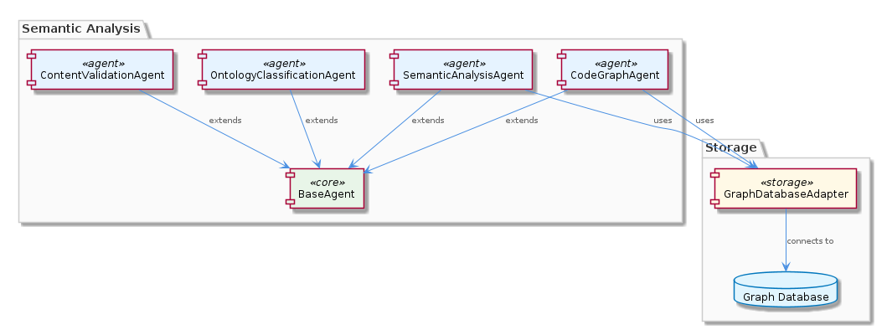
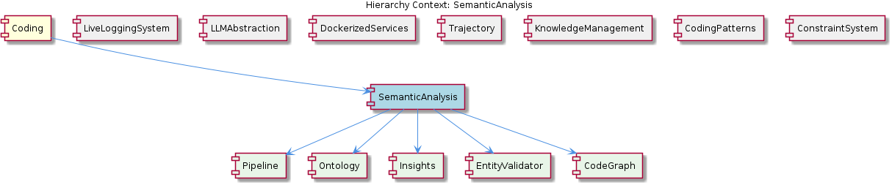

# SemanticAnalysis

**Type:** Component

[LLM] The SemanticAnalysis component utilizes a multi-agent system architecture, with agents such as OntologyClassificationAgent, SemanticAnalysisAgent, and CodeGraphAgent, to process git history and LSL sessions. This is evident in the code files, such as integrations/mcp-server-semantic-analysis/src/agents/ontology-classification-agent.ts, integrations/mcp-server-semantic-analysis/src/agents/semantic-analysis-agent.ts, and integrations/mcp-server-semantic-analysis/src/agents/code-graph-agent.ts, which define the respective agents and their responsibilities. The use of multiple agents allows for a modular and scalable design, enabling the processing of large amounts of data and the integration of new agents as needed.

## What It Is  

The **SemanticAnalysis** component lives under the **Coding** knowledge hierarchy and is implemented in the `integrations/mcp-server-semantic-analysis` folder. Its core source files include:

* `src/agents/base-agent.ts` – the abstract `BaseAgent` that defines the common `execute(input, context)` contract, confidence calculation, and issue detection.  
* `src/agents/ontology-classification-agent.ts` – the **OntologyClassificationAgent** that drives the ontology‑based pipeline.  
* `src/agents/semantic-analysis-agent.ts` – the **SemanticAnalysisAgent** that applies NLP/ML techniques to code and conversation data.  
* `src/agents/code-graph-agent.ts` – the **CodeGraphAgent** that builds a knowledge graph of code entities.  
* `src/agents/content-validation-agent.ts` – the **ContentValidationAgent** that validates entity content and flags stale data.  
* `src/storage/graph-database-adapter.ts` – the **GraphDatabaseAdapter** that abstracts persistence to a graph database.  

Together these files deliver a modular, multi‑agent system that ingests Git history and LSL (Live‑Logging‑System) sessions, extracts semantic meaning, classifies entities against an ontology, validates the results, and persists a code‑entity graph for downstream insight generation.  

---

## Architecture and Design  

SemanticAnalysis adopts a **multi‑agent architecture** in which each functional concern is encapsulated in a dedicated agent class. The agents share a common execution contract (`execute(input, context)`) defined in `BaseAgent`. This pattern gives the component a **pipeline‑style orchestration**: agents can be chained, reordered, or swapped without touching the surrounding infrastructure.  

The **BaseAgent** supplies cross‑cutting concerns—confidence scoring and issue detection—so that every concrete agent inherits robust error handling and result quality metrics. This is an application of the **Template Method** pattern: the abstract base defines the skeleton of execution while concrete agents implement the domain‑specific steps.  

Persistence is abstracted through the **GraphDatabaseAdapter** (`integrations/mcp-server-semantic-analysis/src/storage/graph-database-adapter.ts`). By exposing a uniform interface for graph CRUD operations, the component decouples its agents from any particular graph‑store implementation (e.g., Graphology + LevelDB, Neo4j, etc.). This follows the **Adapter** pattern and supports future database substitution with minimal code churn.  

The component sits within the broader **Coding** parent, sharing the same graph‑database infrastructure used by sibling components such as **KnowledgeManagement**, **CodingPatterns**, and **ConstraintSystem**. Its child modules—**Pipeline**, **Ontology**, **Insights**, **EntityValidator**, and **CodeGraph**—are concrete realizations of the agent responsibilities and downstream consumers of the generated knowledge graph.  

  

---

## Implementation Details  

### BaseAgent (`src/agents/base-agent.ts`)  
* Defines `async execute(input: any, context: any): Promise<AgentResult>` as the entry point.  
* Implements `calculateConfidence(output)` and `detectIssues(output)` which are invoked automatically after a concrete agent’s core logic.  
* Provides logging hooks and a standardized result envelope (`{ data, confidence, issues }`).  

### OntologyClassificationAgent (`src/agents/ontology-classification-agent.ts`)  
* Consumes raw entities from Git/LSL payloads.  
* Calls an internal **OntologyService** (not shown) to map entities to the system’s ontology hierarchy.  
* Emits classified entities that feed the **SemanticAnalysisAgent** and **CodeGraphAgent**.  

### SemanticAnalysisAgent (`src/agents/semantic-analysis-agent.ts`)  
* Receives classified entities and conversation transcripts.  
* Applies NLP pipelines (tokenization, embedding, similarity scoring) and ML models to surface semantic relationships.  
* Returns enriched entity objects that include extracted intents, topics, and confidence scores.  

### CodeGraphAgent (`src/agents/code-graph-agent.ts`)  
* Takes the enriched entities and constructs a directed graph of code symbols, call relationships, and ownership links.  
* Persists the graph via `GraphDatabaseAdapter`.  
* Exposes query methods used by downstream **Insights** generation.  

### ContentValidationAgent (`src/agents/content-validation-agent.ts`)  
* Runs consistency checks on the persisted graph (e.g., dangling references, stale timestamps).  
* Flags entities that need re‑analysis, feeding them back into the pipeline.  

### GraphDatabaseAdapter (`src/storage/graph-database-adapter.ts`)  
* Implements `saveNode`, `saveEdge`, `query`, and `exportJSON`.  
* Encapsulates the underlying graph store (Graphology + LevelDB in the current implementation) and isolates agents from storage specifics.  

The child **InsightGenerator** (`src/insights/insight-generator.ts`) reads the persisted graph, applies rule‑based and ML‑driven heuristics, and produces the final **Insights** objects consumed by the UI or other services.  

  

---

## Integration Points  

1. **LiveLoggingSystem (Sibling)** – Supplies LSL session streams that the **SemanticAnalysisAgent** consumes. The transcript format is normalized by the LiveLoggingSystem’s `TranscriptAdapter`, ensuring a stable input contract.  
2. **LLMAbstraction (Sibling)** – Provides the language‑model services used by the **SemanticAnalysisAgent** for embedding generation and intent extraction. Calls are routed through `lib/llm/llm-service.ts`.  
3. **KnowledgeManagement (Sibling)** – Shares the same `GraphDatabaseAdapter` implementation, allowing the semantic graph to be queried alongside other knowledge graphs (e.g., constraints, patterns).  
4. **Pipeline (Child)** – Orchestrates the sequential execution of agents; the pipeline definition resides in `ontology-classification-agent.ts` but can be extended to insert additional agents.  
5. **EntityValidator (Child)** – Directly consumes output from **ContentValidationAgent** to enforce data integrity before persisting to the graph.  
6. **CodeGraph (Child)** – The **CodeGraphGenerator** (`integrations/code-graph-rag/src/code-graph-generator.ts`) may pull from the same persisted graph to feed retrieval‑augmented generation (RAG) services.  

All external interactions are mediated through well‑typed interfaces (e.g., the `execute` method, the adapter APIs), minimizing coupling and making the component replaceable in a larger micro‑service landscape.

---

## Usage Guidelines  

* **Agent Registration** – When adding a new agent, extend `BaseAgent` and implement `execute`. Register the agent in the pipeline configuration (typically a JSON or TypeScript array in `pipeline.ts`). The `execute(input, context)` signature must be preserved to ensure downstream compatibility.  
* **Confidence Propagation** – Consumers of agent output should respect the `confidence` field; low‑confidence results are candidates for re‑analysis by the **ContentValidationAgent**.  
* **Graph Transactions** – All modifications to the knowledge graph must go through `GraphDatabaseAdapter`. Direct access to the underlying Graphology instance is discouraged to keep the storage layer swappable.  
* **Error Handling** – Throwing exceptions inside an agent will be caught by `BaseAgent`, which will populate the `issues` array. Agents should prefer returning structured issue objects rather than unstructured logs.  
* **Performance Tuning** – Heavy NLP/ML workloads in **SemanticAnalysisAgent** should be off‑loaded to worker threads or async queues; the component already supports async `execute` calls, so scaling out is a matter of increasing the worker pool size.  

---

## Summary of Requested Items  

### 1. Architectural patterns identified  
* **Multi‑Agent System** – each concern is an isolated agent.  
* **Template Method** – `BaseAgent` defines the execution skeleton.  
* **Adapter** – `GraphDatabaseAdapter` abstracts the graph store.  
* **Pipeline/Chain of Responsibility** – agents are composed sequentially via the Pipeline child.  

### 2. Design decisions and trade‑offs  
* **Modularity vs. Coordination Overhead** – agents are loosely coupled, which eases extension but requires a well‑defined pipeline and context propagation.  
* **Unified `execute` contract** – simplifies orchestration but forces all agents to conform to a generic input/output shape, potentially limiting highly specialized signatures.  
* **GraphDatabaseAdapter abstraction** – future‑proofs storage choice but adds an indirection layer that may incur minor latency.  

### 3. System structure insights  
* The component is a **child** of the root **Coding** component, sharing the graph‑database infrastructure with siblings.  
* Its **children** (Pipeline, Ontology, Insights, EntityValidator, CodeGraph) represent concrete stages that consume and produce data for each other.  
* The component’s agents act as **service providers** to sibling components (e.g., LiveLoggingSystem) while also being **service consumers** of LLMAbstraction.  

### 4. Scalability considerations  
* Agent execution is asynchronous; adding parallel workers or distributing agents across processes can scale to large Git histories and high‑volume LSL streams.  
* The graph store (Graphology + LevelDB) is designed for append‑only workloads; for massive graphs, swapping to a dedicated graph DB (e.g., Neo4j) is supported by the adapter pattern.  
* Confidence‑based re‑analysis enables selective recomputation, reducing unnecessary processing as the knowledge base grows.  

### 5. Maintainability assessment  
* **High** – the clear `BaseAgent` contract, isolated agents, and storage adapter promote clean separation of concerns.  
* Adding new functionality typically involves creating a new agent subclass and updating the pipeline, leaving existing agents untouched.  
* The reliance on shared adapters and common utilities (e.g., LLMService) encourages code reuse across siblings, reducing duplication.  
* Potential maintenance burden lies in keeping the pipeline configuration synchronized with agent dependencies; thorough integration tests are recommended.

## Hierarchy Context

### Parent
- [Coding](./Coding.md) -- Root node of the coding project knowledge hierarchy, encompassing all development infrastructure knowledge. The project consists of 8 major components: LiveLoggingSystem: [LLM] The LiveLoggingSystem component's modular architecture allows for easy extension and modification of agent-specific transcript formats. This is ; LLMAbstraction: [LLM] The LLMAbstraction component utilizes the LLMService class (lib/llm/llm-service.ts) as a single entry point for all LLM operations. This class i; DockerizedServices: [LLM] The DockerizedServices component utilizes a microservices architecture, with each sub-component responsible for a specific service or functional; Trajectory: [LLM] The Trajectory component's architecture is characterized by its use of adapters, such as the SpecstoryAdapter, to connect to different extension; KnowledgeManagement: [LLM] The KnowledgeManagement component utilizes the GraphDatabaseAdapter (integrations/mcp-server-semantic-analysis/src/storage/graph-database-adapte; CodingPatterns: [LLM] The CodingPatterns component utilizes the GraphDatabaseAdapter class in storage/graph-database-adapter.ts for persistence, allowing for automati; ConstraintSystem: [LLM] The ConstraintSystem component utilizes the GraphDatabaseAdapter for persistence, which is implemented in the storage/graph-database-adapter.ts ; SemanticAnalysis: [LLM] The SemanticAnalysis component utilizes a multi-agent system architecture, with agents such as OntologyClassificationAgent, SemanticAnalysisAgen.

### Children
- [Pipeline](./Pipeline.md) -- The batch processing pipeline is defined in integrations/mcp-server-semantic-analysis/src/agents/ontology-classification-agent.ts, which outlines the responsibilities of the OntologyClassificationAgent.
- [Ontology](./Ontology.md) -- The OntologyClassificationAgent in integrations/mcp-server-semantic-analysis/src/agents/ontology-classification-agent.ts is responsible for classifying entities based on the ontology.
- [Insights](./Insights.md) -- The insight generation is performed by the InsightGenerator class in integrations/mcp-server-semantic-analysis/src/insights/insight-generator.ts.
- [EntityValidator](./EntityValidator.md) -- The entity validation is performed by the EntityValidator class in integrations/mcp-server-semantic-analysis/src/entity-validator.ts.
- [CodeGraph](./CodeGraph.md) -- The code graph generation is performed by the CodeGraphGenerator class in integrations/code-graph-rag/src/code-graph-generator.ts.

### Siblings
- [LiveLoggingSystem](./LiveLoggingSystem.md) -- [LLM] The LiveLoggingSystem component's modular architecture allows for easy extension and modification of agent-specific transcript formats. This is achieved through the use of the TranscriptAdapter, which is implemented in the lib/agent-api/transcript-api.js file. The TranscriptAdapter provides a standardized interface for handling different agent formats, such as Claude Code and Copilot CLI, and converting them to the unified LSL format. For example, the ClaudeCodeTranscriptAdapter class in lib/agent-api/transcripts/claudia-transcript-adapter.js extends the TranscriptAdapter class and provides a specific implementation for handling Claude Code transcripts.
- [LLMAbstraction](./LLMAbstraction.md) -- [LLM] The LLMAbstraction component utilizes the LLMService class (lib/llm/llm-service.ts) as a single entry point for all LLM operations. This class is responsible for managing mode routing, caching, and provider fallback. For instance, the LLMService class includes a method for making LLM requests, which first checks the cache for a valid response before proceeding to make an actual request. This is evident in the use of the cache object within the LLMService class, where it attempts to retrieve a cached response before making a request to the provider. The cache is implemented using a simple in-memory object, where the keys are the request parameters and the values are the corresponding responses.
- [DockerizedServices](./DockerizedServices.md) -- [LLM] The DockerizedServices component utilizes a microservices architecture, with each sub-component responsible for a specific service or functionality. For instance, the LLM Service (lib/llm/llm-service.ts) acts as a high-level facade for all LLM operations, handling mode routing, caching, circuit breaking, and provider fallback. This modular design enables efficient and scalable operation, as well as easier maintenance and updates. The Service Starter (lib/service-starter.js) provides robust service startup with retry, timeout, and graceful degradation, using exponential backoff and health verification. This ensures that services are started reliably and with minimal downtime.
- [Trajectory](./Trajectory.md) -- [LLM] The Trajectory component's architecture is characterized by its use of adapters, such as the SpecstoryAdapter, to connect to different extensions and services. This is evident in the lib/integrations/specstory-adapter.js file, where the SpecstoryAdapter class is defined. The component's behavior is defined by its methods, including logConversation and connectViaHTTP, which enable logging and connection to the Specstory extension. For instance, the logConversation method in SpecstoryAdapter (lib/integrations/specstory-adapter.js:134) implements logging functionality, while the createLogger function from ../logging/Logger.js facilitates modular and flexible logging capabilities.
- [KnowledgeManagement](./KnowledgeManagement.md) -- [LLM] The KnowledgeManagement component utilizes the GraphDatabaseAdapter (integrations/mcp-server-semantic-analysis/src/storage/graph-database-adapter.ts) for persisting data in a graph database with automatic JSON export synchronization. This design decision enables efficient storage and retrieval of knowledge entities and relationships, which is crucial for the system's overall goals of knowledge discovery and insight generation. Furthermore, the use of Graphology+LevelDB persistence ensures a scalable and performant solution for managing the knowledge graph.
- [CodingPatterns](./CodingPatterns.md) -- [LLM] The CodingPatterns component utilizes the GraphDatabaseAdapter class in storage/graph-database-adapter.ts for persistence, allowing for automatic JSON export sync. This design decision enables seamless data synchronization and provides a robust foundation for the project's data management. The GraphDatabaseAdapter class is responsible for handling graph data storage and retrieval, making it a critical component of the project's architecture. By using this adapter, the CodingPatterns component can focus on its primary functionality, leaving data management to the GraphDatabaseAdapter.
- [ConstraintSystem](./ConstraintSystem.md) -- [LLM] The ConstraintSystem component utilizes the GraphDatabaseAdapter for persistence, which is implemented in the storage/graph-database-adapter.ts file. This adapter enables the system to store and manage constraints in a graph database, utilizing Graphology and LevelDB for efficient data storage and retrieval. The adapter also features automatic JSON export sync, allowing for seamless data exchange between the graph database and other components. For example, the ContentValidationAgent, located in integrations/mcp-server-semantic-analysis/src/agents/content-validation-agent.ts, relies on the GraphDatabaseAdapter to retrieve and validate entity content against configured rules.

---

*Generated from 7 observations*
