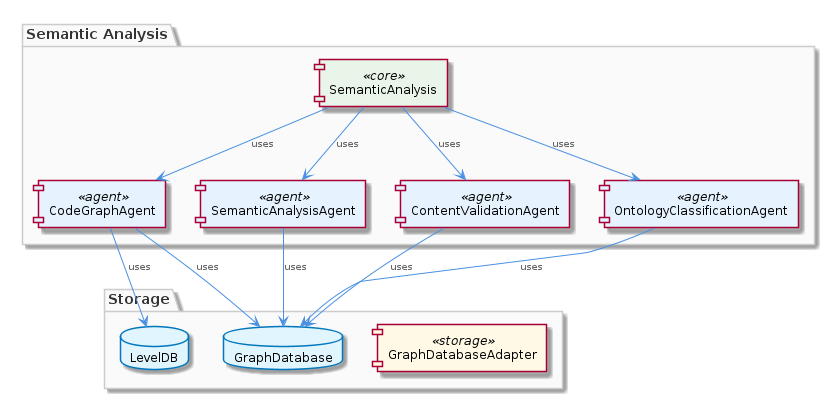
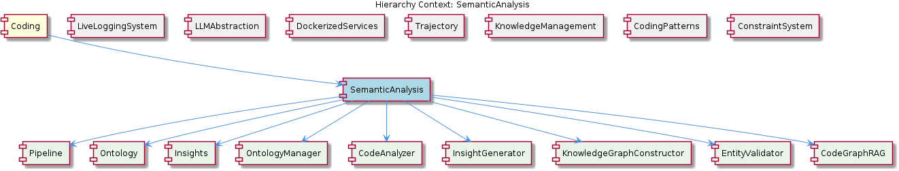

# SemanticAnalysis

**Type:** Component

[LLM] The ContentValidationAgent, implemented in the file integrations/mcp-server-semantic-analysis/src/agents/content-validation-agent.ts, is responsible for validating entity content and detecting staleness in observations and insights. This agent checks the entity content against a set of predefined rules and constraints, ensuring that the content is consistent and up-to-date. The agent also integrates with the SemanticAnalysisAgent to detect staleness in observations and insights, enabling the component to update and refresh the knowledge graph as necessary. The use of a content validation agent ensures that the component provides accurate and reliable insights, and helps to maintain the integrity of the knowledge graph.

## What It Is  

The **SemanticAnalysis** component lives under the `integrations/mcp-server-semantic-analysis/src/` tree and is realized as a collection of tightly‑focused agents.  The primary agents are:

* `ontology-classification-agent.ts` – classifies observations against the shared ontology.  
* `semantic-analysis-agent.ts` – walks the code‑base and Git history, extracts AST information with **Tree‑sitter**, and forwards the raw semantic payload to downstream agents.  
* `code-graph-agent.ts` – builds a knowledge graph of code entities using **Memgraph** and the **GraphDatabaseAdapter** (see `storage/graph-database-adapter.js`).  
* `content-validation-agent.ts` – validates entity content, flags stale observations, and triggers refreshes of the graph.

Together these agents form a **multi‑agent architecture** that turns raw source files into a persistent, queryable graph of code concepts, classifications, and derived insights.  The component is a child of the top‑level **Coding** node and shares its ecosystem with siblings such as **LiveLoggingSystem**, **LLMAbstraction**, and **KnowledgeManagement**.  Its own children – Pipeline, Ontology, Insights, OntologyManager, CodeAnalyzer, InsightGenerator, KnowledgeGraphConstructor, EntityValidator, and CodeGraphRAG – realize the end‑to‑end workflow from raw code to actionable insight.



---

## Architecture and Design  

SemanticAnalysis adopts an **agent‑based modular architecture**.  Each agent encapsulates a single responsibility and communicates through shared data structures (the graph) rather than direct method calls.  This design mirrors the **pipeline/DAG pattern** observed in the child **Pipeline** component, where steps declare explicit `depends_on` edges and are topologically sorted before execution.  The agents therefore act as nodes in a directed acyclic graph, enabling deterministic ordering while still allowing parallel execution.

Concurrency is achieved via a **work‑stealing** model implemented in the `runWithConcurrency` helper.  A single atomic index counter is shared among all active agents; each worker atomically fetches the next index, processes the corresponding file or entity, and then repeats until the counter exceeds the workload size.  This approach eliminates lock contention and scales efficiently across CPU cores, a crucial trait for the “large‑scale codebases” the component targets.

Persistence is abstracted through the **Adapter pattern**: `storage/graph-database-adapter.js` presents a uniform API for Graphology + LevelDB operations while hiding the specifics of the underlying **Memgraph** engine.  Agents such as `CodeGraphAgent` interact only with the adapter, which also handles automatic JSON export sync, guaranteeing that the in‑memory graph and the on‑disk representation stay consistent.

The component also leverages **ontology‑driven classification**.  The `OntologyClassificationAgent` (implemented in `ontology-classification-agent.ts`) consults the **OntologyManager** (a child component) to map raw observations onto a hierarchical ontology.  This enables downstream agents, especially the `InsightGenerator`, to produce higher‑level, semantically rich insights rather than raw syntactic data.

---

## Implementation Details  

### Agents  

* **OntologyClassificationAgent** (`integrations/mcp-server-semantic-analysis/src/agents/ontology-classification-agent.ts`)  
  - Receives raw observations (e.g., function declarations) and queries the `OntologyManager` to locate the appropriate ontology node.  
  - Emits classified entities that are stored in the graph via the `GraphDatabaseAdapter`.  

* **SemanticAnalysisAgent** (`semantic-analysis-agent.ts`)  
  - Walks every source file and Git commit, invoking **Tree‑sitter** to produce an AST.  
  - Extracts function calls, variable declarations, control‑flow constructs, and packages them into a canonical “observation” object.  
  - Calls `OntologyClassificationAgent` to enrich each observation with ontology tags.  

* **CodeGraphAgent** (`code-graph-agent.ts`)  
  - Consumes the classified observations and creates vertices/edges in the graph (e.g., “function A calls function B”).  
  - Persists the graph using `GraphDatabaseAdapter`, which writes to **Graphology** in‑memory structures and syncs to **LevelDB** on disk.  

* **ContentValidationAgent** (`content-validation-agent.ts`)  
  - Periodically scans stored entities, applying a rule set defined in the component’s configuration.  
  - Detects “staleness” (e.g., a function that has been removed from the codebase) and triggers a refresh cycle by notifying `SemanticAnalysisAgent`.  

### Concurrency  

The `runWithConcurrency` function (found in the component’s core utilities) creates a pool of worker promises.  Each worker repeatedly:

```ts
const idx = Atomics.add(sharedCounter, 0, 1);
if (idx >= workItems.length) break;
process(workItems[idx]);
```

This lock‑free pattern ensures that all agents can pull work from a common queue without blocking each other, dramatically reducing the wall‑clock time for batch analyses.

### Persistence  

`storage/graph-database-adapter.js` implements methods such as `addNode`, `addEdge`, `query`, and `exportToJson`.  It hides the dual‑store nature (Graphology for fast traversal, LevelDB for durability) and provides automatic JSON export after each transaction, which downstream services (e.g., the **CodeGraphRAG** child) can consume for retrieval‑augmented generation.

### Child Components  

* **Pipeline** – orchestrates the DAG execution; each agent registers its `depends_on` list, and the pipeline performs a topological sort before launching `runWithConcurrency`.  
* **OntologyManager** – maintains upper and lower ontology layers, exposing lookup APIs used by the classification agent.  
* **CodeAnalyzer** – a thin wrapper around Tree‑sitter used by `SemanticAnalysisAgent` to isolate parsing logic.  
* **InsightGenerator** – consumes the fully‑populated graph, runs pattern‑matching queries, and emits high‑level insights (e.g., “circular dependency detected”).  
* **EntityValidator** – mirrors the responsibilities of `ContentValidationAgent` at a finer granularity, ensuring each graph node adheres to schema constraints.  

---

## Integration Points  

SemanticAnalysis sits at the intersection of several system‑wide services:

* **GraphDatabaseAdapter** – shared with the sibling **KnowledgeManagement** component, enabling a unified knowledge graph across the entire Coding domain.  
* **LLMAbstraction** – although not directly referenced in the observations, downstream agents such as **InsightGenerator** can call the LLM service (via `lib/llm/llm-service.ts`) to enrich insights with natural‑language explanations.  
* **LiveLoggingSystem** – the component’s internal logging (`integrations/mcp-server-semantic-analysis/src/logging.ts`) follows the same unified logging interface used by LiveLoggingSystem, ensuring consistent telemetry.  
* **Trajectory** – both components employ the same work‑stealing concurrency primitive, suggesting a shared utility library for parallel processing.  

The relationship diagram below visualizes these connections, highlighting the flow from source files → agents → graph → insights → external consumers.



---

## Usage Guidelines  

1. **Add New Language Support** – Extend `CodeAnalyzer` with a new Tree‑sitter grammar, then update `SemanticAnalysisAgent` to invoke the parser for the additional file extensions.  Because agents are decoupled, no changes to the graph or ontology layers are required.  

2. **Extend the Ontology** – Modify the JSON/YAML files consumed by `OntologyManager` and re‑run the `OntologyClassificationAgent`.  The adapter automatically propagates new classifications into the graph; however, remember to version the ontology to avoid breaking existing insight queries.  

3. **Scale Concurrency** – The `runWithConcurrency` helper reads a `MAX_WORKERS` environment variable.  For large repositories, increase this value proportionally to the number of CPU cores, but monitor memory pressure because each worker holds its own AST tree.  

4. **Validate Graph Integrity** – After any bulk import or massive code refactor, execute `ContentValidationAgent` (or invoke its CLI wrapper) to purge stale nodes.  This prevents the graph from accumulating orphaned entities that could skew insight generation.  

5. **Logging and Observability** – Use the shared `logging.ts` module to emit structured logs (`{agent, step, status}`) that can be consumed by the **LiveLoggingSystem** for real‑time dashboards.  Consistent log keys enable correlation across sibling components.  

---

### Architectural Patterns Identified  

1. **Agent‑Based Modular Architecture** – each functional concern is encapsulated in a dedicated agent.  
2. **Pipeline / DAG Execution Model** – explicit `depends_on` edges and topological sorting.  
3. **Work‑Stealing Concurrency** – shared atomic counter drives parallel processing.  
4. **Adapter Pattern** – `GraphDatabaseAdapter` abstracts Graphology + LevelDB persistence.  
5. **Ontology‑Driven Classification** – separation of raw observations from semantic tags.  

### Design Decisions and Trade‑offs  

| Decision | Rationale | Trade‑off |
|----------|-----------|-----------|
| Multi‑agent decomposition | Enables independent development, testing, and scaling of each concern (parsing, classification, graph building, validation). | Increases coordination complexity; agents must agree on shared schemas. |
| Graph‑database persistence (Graphology + LevelDB) | Provides fast traversal for insight queries and durable on‑disk storage. | Adds operational overhead (running Memgraph, managing LevelDB files). |
| Work‑stealing concurrency | Maximizes CPU utilization for large codebases without central scheduler bottlenecks. | Requires careful atomic operations; debugging race conditions can be harder. |
| Ontology‑centric design | Allows high‑level, domain‑aware insights rather than raw syntactic data. | Ontology maintenance becomes a critical path; changes may ripple through all agents. |
| Automatic JSON export sync | Guarantees that external consumers (e.g., RAG services) always see the latest graph state. | Potential I/O cost on every transaction; may need throttling for very high throughput. |

### System Structure Insights  

* **Hierarchical Ownership** – SemanticAnalysis is a child of the **Coding** root, inheriting shared utilities (logging, concurrency primitives) and contributing to the global knowledge graph used by siblings.  
* **Clear Separation of Concerns** – Agents, adapters, and child components each live in their own directories (`agents/`, `storage/`, `src/agents/`), mirroring the logical layers (parsing → classification → graph construction → validation).  
* **Reusable Infrastructure** – The same `GraphDatabaseAdapter` and work‑stealing utility appear in **KnowledgeManagement** and **Trajectory**, indicating a common infrastructure layer across the codebase.  

### Scalability Considerations  

* **Horizontal Scaling** – Because agents are stateless aside from the shared graph, additional worker processes or even separate machines could be added to the `runWithConcurrency` pool, provided they can access the same Memgraph instance.  
* **Graph Size Management** – LevelDB’s append‑only nature and Graphology’s in‑memory representation mean that extremely large graphs may exceed RAM.  Strategies such as sharding the graph or streaming queries become necessary beyond a certain threshold.  
* **Concurrency Limits** – The atomic counter model scales well up to the number of physical cores; beyond that, context‑switch overhead may dominate, so `MAX_WORKERS` should be tuned per deployment environment.  

### Maintainability Assessment  

* **Strengths** – The agent‑centric layout makes unit testing straightforward (each agent can be mocked in isolation).  The adapter isolates persistence concerns, allowing a future swap to a different graph store without touching agent logic.  Explicit DAG definitions in the **Pipeline** give a clear execution contract.  
* **Weaknesses** – The overall system spans many files and languages (TypeScript, JavaScript), which can increase cognitive load for newcomers.  Ontology drift is a hidden risk; without automated schema validation, mismatches between agents and the ontology may surface only at runtime.  The work‑stealing concurrency, while performant, can be opaque when debugging deadlocks or race conditions.  

Overall, the design favors **extensibility and performance** at the cost of added coordination overhead, a trade‑off that aligns with the component’s goal of delivering fast, semantic insights over massive code repositories.

## Hierarchy Context

### Parent
- [Coding](./Coding.md) -- Root node of the coding project knowledge hierarchy, encompassing all development infrastructure knowledge. The project consists of 8 major components: LiveLoggingSystem: [LLM] The LiveLoggingSystem component utilizes a modular architecture, with separate components for logging, transcript processing, and configuration ; LLMAbstraction: [LLM] The LLMAbstraction component uses a provider-agnostic approach, allowing for easy switching between different LLM providers. This is achieved th; DockerizedServices: [LLM] The DockerizedServices component utilizes dependency injection to manage complex workflows and handle multiple requests efficiently. This is evi; Trajectory: [LLM] The Trajectory component utilizes the SpecstoryAdapter class, defined in lib/integrations/specstory-adapter.js, for logging conversations and ev; KnowledgeManagement: [LLM] The KnowledgeManagement component utilizes a GraphDatabaseAdapter for persistence, which is implemented in the file integrations/mcp-server-sema; CodingPatterns: [LLM] The CodingPatterns component utilizes a graph-based approach for code analysis, as seen in the integrations/code-graph-rag/README.md file, which; ConstraintSystem: [LLM] The ConstraintSystem component utilizes a GraphDatabaseAdapter for persistence, which is implemented in the storage/graph-database-adapter.ts fi; SemanticAnalysis: [LLM] The SemanticAnalysis component employs a multi-agent architecture, utilizing agents such as the OntologyClassificationAgent, SemanticAnalysisAge.

### Children
- [Pipeline](./Pipeline.md) -- The Pipeline coordinator uses a DAG-based execution model with topological sort in batch-analysis steps, each step declaring explicit depends_on edges, as seen in the integrations/mcp-server-semantic-analysis/src/agents/ontology-classification-agent.ts file.
- [Ontology](./Ontology.md) -- The OntologyManager uses a hierarchical structure to organize the ontology system, with upper and lower ontology definitions, as seen in the integrations/mcp-server-semantic-analysis/src/agents/ontology-manager.ts file.
- [Insights](./Insights.md) -- The InsightGenerator utilizes the CodeAnalyzer to extract meaningful insights from code files and git history, as referenced in the integrations/mcp-server-semantic-analysis/src/agents/insight-generator.ts file.
- [OntologyManager](./OntologyManager.md) -- The OntologyManager uses a hierarchical structure to organize the ontology system, with upper and lower ontology definitions, as seen in the integrations/mcp-server-semantic-analysis/src/agents/ontology-manager.ts file.
- [CodeAnalyzer](./CodeAnalyzer.md) -- The CodeAnalyzer utilizes a parsing mechanism to extract insights from code files, as implemented in the integrations/mcp-server-semantic-analysis/src/agents/code-analyzer.ts file.
- [InsightGenerator](./InsightGenerator.md) -- The InsightGenerator utilizes the CodeAnalyzer to extract meaningful insights from code files and git history, as referenced in the integrations/mcp-server-semantic-analysis/src/agents/insight-generator.ts file.
- [KnowledgeGraphConstructor](./KnowledgeGraphConstructor.md) -- The KnowledgeGraphConstructor utilizes Memgraph to store and manage the knowledge graph, as implemented in the integrations/mcp-server-semantic-analysis/src/agents/knowledge-graph-constructor.ts file.
- [EntityValidator](./EntityValidator.md) -- The EntityValidator utilizes a set of predefined rules to validate entity content, as implemented in the integrations/mcp-server-semantic-analysis/src/agents/entity-validator.ts file.
- [CodeGraphRAG](./CodeGraphRAG.md) -- The CodeGraphRAG utilizes a graph database to store and manage the code graph, as implemented in the integrations/code-graph-rag/README.md file.

### Siblings
- [LiveLoggingSystem](./LiveLoggingSystem.md) -- [LLM] The LiveLoggingSystem component utilizes a modular architecture, with separate components for logging, transcript processing, and configuration validation. This is evident in the directory structure, where the 'integrations' folder contains subfolders for 'browser-access', 'code-graph-rag', and 'copi', each representing a distinct aspect of the system. For instance, the 'copi' subfolder contains files such as 'INSTALL.md' and 'USAGE.md', which provide installation and usage guidelines for the Copi component. The 'lib/agent-api' folder contains the TranscriptAdapter abstract base class, which is responsible for reading and converting transcripts from different agent formats. The 'scripts' folder contains the LSLConfigValidator, which is used for validating and optimizing LSL configuration. The logging module, located in 'integrations/mcp-server-semantic-analysis/src/logging.ts', provides a unified logging interface and is used throughout the system.
- [LLMAbstraction](./LLMAbstraction.md) -- [LLM] The LLMAbstraction component uses a provider-agnostic approach, allowing for easy switching between different LLM providers. This is achieved through the ProviderRegistry class (lib/llm/provider-registry.js), which manages the different LLM providers and their configurations. For instance, the AnthropicProvider class (lib/llm/providers/anthropic-provider.ts) is used to interact with the Anthropic API, while the DMRProvider class (lib/llm/providers/dmr-provider.ts) is used for local LLM inference. The use of a provider registry enables the component to be highly flexible and scalable, as new providers can be easily added or removed without affecting the overall architecture.
- [DockerizedServices](./DockerizedServices.md) -- [LLM] The DockerizedServices component utilizes dependency injection to manage complex workflows and handle multiple requests efficiently. This is evident in the lib/llm/llm-service.ts file, where the LLMService class is used for high-level LLM operations, including mode routing, caching, and provider fallback. The use of dependency injection allows for loose coupling between components, making it easier to test and maintain the codebase. Furthermore, the ServiceStarter class in lib/service-starter.js provides robust service startup with retry, timeout, and graceful degradation, ensuring that the component can recover from failures and provide a responsive user experience.
- [Trajectory](./Trajectory.md) -- [LLM] The Trajectory component utilizes the SpecstoryAdapter class, defined in lib/integrations/specstory-adapter.js, for logging conversations and events via Specstory. This class follows a specific pattern of constructor() + initialize() + logConversation() for its initialization and logging functionality. The logConversation() method employs a work-stealing concurrency pattern via a shared atomic index counter, allowing for efficient and concurrent logging of conversations and events.
- [KnowledgeManagement](./KnowledgeManagement.md) -- [LLM] The KnowledgeManagement component utilizes a GraphDatabaseAdapter for persistence, which is implemented in the file integrations/mcp-server-semantic-analysis/src/storage/graph-database-adapter.ts. This adapter provides an interface for agents to interact with the central Graphology + LevelDB knowledge graph. The adapter also includes automatic JSON export sync, ensuring that the knowledge graph remains up-to-date. Furthermore, the migrateGraphDatabase script, located in scripts/migrate-graph-db-entity-types.js, is used to update entity types in the live LevelDB/Graphology database, demonstrating a clear focus on data consistency and integrity.
- [CodingPatterns](./CodingPatterns.md) -- [LLM] The CodingPatterns component utilizes a graph-based approach for code analysis, as seen in the integrations/code-graph-rag/README.md file, which describes the Graph-Code RAG system. This system is used for graph-based code analysis and implies the use of graph structures and algorithms within the CodingPatterns component. The entity validation is performed by the EntityValidator class in integrations/mcp-server-semantic-analysis/src/agents/ontology-classification-agent.ts, suggesting a structured approach to validating entities within the coding patterns. Furthermore, the batch processing pipeline is defined in integrations/mcp-server-semantic-analysis/src/agents/ontology-classification-agent.ts, indicating that the CodingPatterns component may leverage batch processing for efficient handling of coding pattern analysis.
- [ConstraintSystem](./ConstraintSystem.md) -- [LLM] The ConstraintSystem component utilizes a GraphDatabaseAdapter for persistence, which is implemented in the storage/graph-database-adapter.ts file. This adapter enables the system to store and retrieve graph structures using Graphology and LevelDB, with automatic JSON export sync. The use of Graphology allows for efficient graph operations, while LevelDB provides a robust and scalable storage solution. The GraphDatabaseAdapter class in storage/graph-database-adapter.ts is responsible for managing the graph database, including creating and deleting graphs, as well as handling graph queries. The automatic JSON export sync feature ensures that the graph data is consistently updated and available for other components to access.

---

*Generated from 5 observations*
