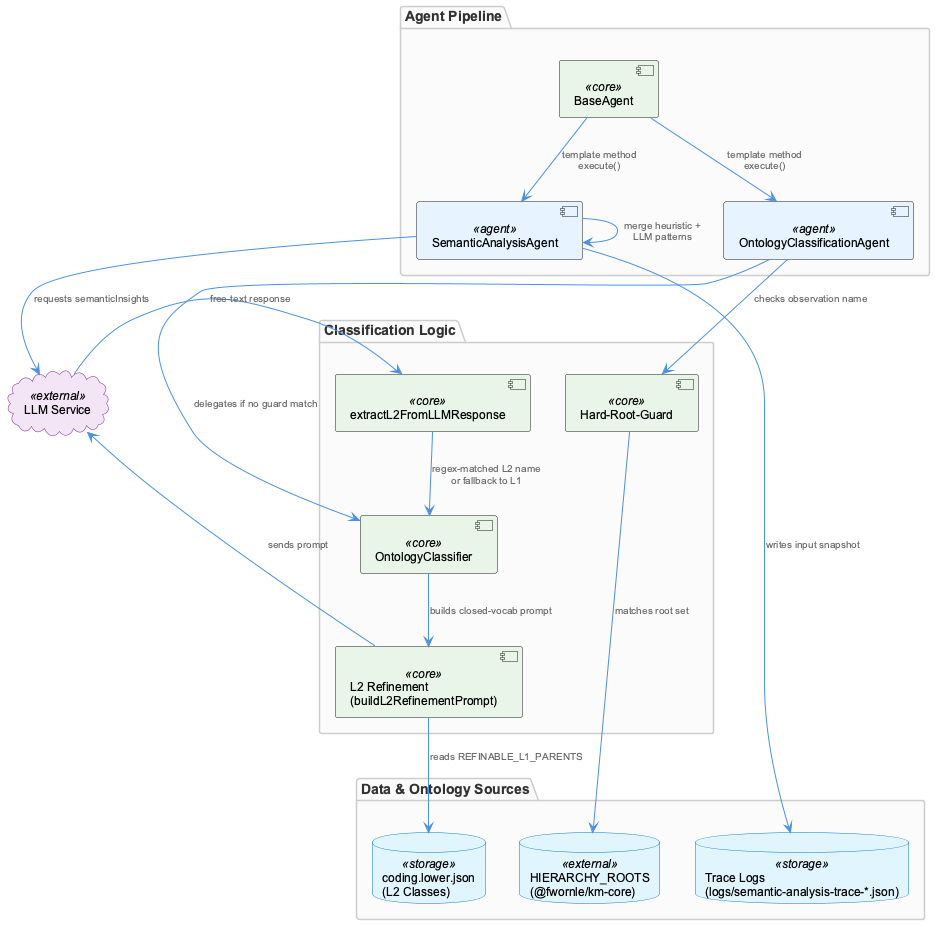
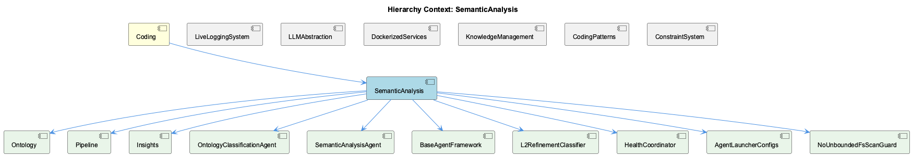

# SemanticAnalysis

**Type:** Component

[LLM] The existence of ontology-classification-agent.hierarchy-roots.test.ts as a distinct test file from ontology-classification-agent.test.ts reveals a deliberate architectural decision to treat 'hierarchy-root detection' as a specialized sub-problem within classification. Hierarchy roots are presumably the top-level nodes of the ontology tree (e.g. major component or domain categories), and detecting them correctly is likely more error-prone or has different edge cases (e.g. avoiding duplicate roots, merging near-synonymous root candidates) than classifying a leaf-level entity under an existing branch. This suggests the ontology-classification-agent.ts source file contains a clearly separated function or code path—possibly named something like detectHierarchyRoot() or isRootCandidate()—that a new contributor should locate and test independently when modifying root-detection heuristics.

# SemanticAnalysis — Technical Insight Document

## What It Is

SemanticAnalysis is a batch-analysis pipeline implemented primarily in two agent modules: `semantic-analysis-agent.ts` and `ontology-classification-agent.ts`. It is the component within the Coding project responsible for turning raw historical data—git history and LSL (Language/Session Log) session data—into structured, hierarchically-classified knowledge entities. As a component under the Coding parent, it fills a distinct role alongside its siblings LiveLoggingSystem, LLMAbstraction, DockerizedServices, KnowledgeManagement, CodingPatterns, and ConstraintSystem: it is the semantic-extraction-and-classification layer that transforms raw activity data into knowledge suitable for persistence.

The component is decomposed into three child components that mirror its internal stages: Pipeline (sequencing/coordination), Ontology (classification into a hierarchy), and Insights (higher-order pattern derivation from classified entities). This tri-partite structure reflects a deliberate separation between raw extraction, structural classification, and downstream synthesis.

## Architecture and Design

The defining architectural pattern is a two-stage, decoupled pipeline: extraction and classification are handled by separate agents so each can be independently tuned, tested, or replaced. `semantic-analysis-agent.ts` extracts raw entities and relationships; `ontology-classification-agent.ts` maps those entities into a hierarchical ontology. This mirrors the Pipeline child component's description of a coordinator agent sequencing execution across both files, and is reinforced by the Ontology child component, which explicitly consumes semantic-analysis-agent.ts output for hierarchy placement.

Both core agents inherit from a shared `base-agent.ts`, indicating a template-method/shared-utility pattern that centralizes cross-cutting concerns: prompt construction, structured response parsing, retry-on-failure logic, and likely proxy/rate-limit selection (consistent with project-wide config keys like `LLM_PROXY_URL`, `RAPID_LLM_PROXY_URL`, `LLM_CLI_PROXY_URL`). This is architecturally consistent with the mode-resolution layering seen in sibling component LLMAbstraction, suggesting SemanticAnalysis's agents likely participate in that same dispatch hierarchy rather than reimplementing it.

A further design decision is treating "hierarchy-root detection" as a specialized sub-problem within classification, evidenced by the standalone test file `ontology-classification-agent.hierarchy-roots.test.ts` distinct from `ontology-classification-agent.test.ts`. This implies a clearly separated code path inside the classification agent for detecting top-level ontology nodes, which carries different edge cases (duplicate/near-synonymous root merging) than routine leaf classification.

## Implementation Details

`semantic-analysis-agent.ts` must reconcile two structurally different input formats—code-centric git diffs/commits and conversational/session-based LSL logs—into a unified entity schema before classification can occur. This strongly implies format-specific adapters or normalization functions (within the agent file or a preprocessing module it calls) that convert both source types into a common intermediate representation. Any future input source would need an equivalent adapter to remain compatible with `ontology-classification-agent.ts`.

Because git history is a primary input, the semantic-analysis agent likely integrates with git log/diff parsing utilities upstream, converting commit messages, diffs, and file-change patterns into candidate semantic entities (feature additions, refactors, bug fixes). The quality of downstream ontology classification is thus bounded by the fidelity of this git-history parsing—noisy or uninformative commit data propagates as low-quality entities.

The shared `base-agent.ts` base class is the key implementation artifact for consistency: new agent stages should subclass it rather than reimplementing LLM-invocation boilerplate, preserving uniform error handling and telemetry across the pipeline.

## Integration Points

SemanticAnalysis's stated output—persisted structured knowledge entities—establishes it as a data-producing subsystem feeding a larger persistent knowledge graph, consistent with the "Graph-Based Knowledge Storage Architecture" documented for sibling component KnowledgeManagement (docs/architecture/memory-systems.md). This means schema changes to entities emitted by `semantic-analysis-agent.ts` or classification labels from `ontology-classification-agent.ts` carry downstream compatibility implications for whatever storage layer (e.g., the VKB server described under KnowledgeManagement) ultimately consumes them.

Internally, the Insights child component depends on Ontology's classified output rather than operating on raw extraction data directly—insight generation is explicitly downstream of classification, not a parallel consumer of raw git/LSL data. The Pipeline child component's coordinator agent is the integration glue sequencing semantic-analysis-agent.ts and ontology-classification-agent.ts execution.

Externally, both core agents' reliance on `base-agent.ts` for LLM invocation suggests integration with the project's broader LLM dispatch/proxy configuration, aligning it with patterns established in LLMAbstraction.

## Usage Guidelines

Developers extending the pipeline with a new agent stage should subclass `base-agent.ts` rather than duplicating LLM-calling logic, ensuring consistent retry, parsing, and telemetry behavior. When modifying ontology root-detection heuristics, locate and test the dedicated root-detection code path in `ontology-classification-agent.ts` independently, using `ontology-classification-agent.hierarchy-roots.test.ts` as the canonical test target rather than the general classification test file.

Any change to the shape of extracted entities or classification labels should be treated as a schema-versioning concern, given downstream consumption by the persistent knowledge graph—coordinate such changes rather than modifying entity shapes ad hoc. Finally, when adding a new input data source beyond git history and LSL sessions, implement a corresponding normalization adapter so the unified entity schema consumed by `ontology-classification-agent.ts` remains stable.

## Hierarchy Context

### Parent
- [Coding](./Coding.md) -- Root node of the coding project knowledge hierarchy, encompassing all development infrastructure knowledge. The project consists of 7 major components: LiveLoggingSystem: [LLM] The LiveLoggingSystem is structured as a pipeline with distinct, separable stages: configuration validation, session windowing, file routing, cl; LLMAbstraction: [LLM] The LLMAbstraction component implements a mode-resolution hierarchy that is critical for understanding how any given agent call is actually disp; DockerizedServices: DockerizedServices provides the containerization and process-management layer that wraps Coding's various services (semantic analysis MCP, constraint ; KnowledgeManagement: [LLM] The KnowledgeManagement component centers on a graph-based knowledge storage architecture (documented in docs/architecture/memory-systems.md) th; CodingPatterns: [LLM] CodingPatterns has no dedicated source directory or module of its own within the Coding project; it exists purely as a conceptual grouping label; ConstraintSystem: The ConstraintSystem provides rule-based validation and enforcement for tool calls and file operations during Claude Code sessions, plus a hook infras; SemanticAnalysis: [LLM] The batch-analysis workflow is structured as a multi-stage pipeline where semantic-analysis-agent.ts is responsible for extracting raw entities .

### Children
- [Pipeline](./Pipeline.md) -- Pipeline stages include a coordinator agent that sequences execution across semantic-analysis-agent.ts and ontology-classification-agent.ts, matching the two-stage extraction/classification split described for SemanticAnalysis
- [Ontology](./Ontology.md) -- ontology-classification-agent.ts consumes entities produced by semantic-analysis-agent.ts and assigns them positions within an upper/lower ontology hierarchy
- [Insights](./Insights.md) -- Insight generation consumes ontology-classified entities to derive higher-order patterns, rather than operating directly on raw git/LSL extraction output

### Siblings
- [LiveLoggingSystem](./LiveLoggingSystem.md) -- [LLM] The LiveLoggingSystem is structured as a pipeline with distinct, separable stages: configuration validation, session windowing, file routing, classification, and transcript capture. This separation is evident in the presence of scripts/validate-lsl-config.js as a standalone pre-flight check that runs independently of the main logging.ts pipeline, meaning developers can validate configuration changes (session window durations, file routing rules) without triggering the full logging pipeline. This design supports fail-fast behavior: catching misconfiguration before any live session data is captured, rather than discovering issues mid-capture when data loss or malformed logs could occur.
- [LLMAbstraction](./LLMAbstraction.md) -- [LLM] The LLMAbstraction component implements a mode-resolution hierarchy that is critical for understanding how any given agent call is actually dispatched. getLLMMode() in llm-mock-service.ts checks, in strict order: a per-agent override (allowing individual agents to be pinned to mock/local/public independently of global state), then a global mode setting, then a legacy mockLLM boolean flag (retained for backward compatibility with older config schemas), and finally falls back to 'public' as the safe default. This layered precedence means a developer debugging unexpected LLM behavior for a specific agent must check all four levels rather than assuming the global setting applies uniformly—per-agent overrides silently win even if the global mode says otherwise, which is a common source of confusion during multi-agent experiments.
- [DockerizedServices](./DockerizedServices.md) -- DockerizedServices provides the containerization and process-management layer that wraps Coding's various services (semantic analysis MCP, constraint monitor API/dashboard, graphify, LLM services) so they can run reliably both inside Docker containers and as standalone Node processes managed by a Global Service Coordinator. The layer combines Docker artifacts (docker-compose.yml, Dockerfile.coding-services, supervisord.conf, entrypoint.sh) with a set of Node.js wrapper scripts (api-service.js, dashboard-service.js) that spawn actual backend processes, forward signals, and register/unregister with a ProcessStateManager (PSM) for lifecycle tracking.

A core architectural pattern is robust startup with retry/backoff and health verification, implemented in lib/service-starter.js's startServiceWithRetry(), which wraps a start function and a health-check function with timeouts (via withDeadline) and exponential backoff, distinguishing required vs optional services for graceful degradation. Complementing this, lib/utils/service-probe.js implements liveness probes (probeHttpHealth, probeTcpPort) used by scripts/health-coordinator.js to poll services every 5 seconds per config/health-verification-rules.json, strictly avoiding false-positive 'healthy' states per its SPEC R6 invariant.

Service wrappers such as api-service.js and dashboard-service.js follow a consistent pattern: resolve CODING_REPO-relative paths, verify target files/directories exist, spawn the real process with stdio inherited, forward SIGTERM/SIGINT, and asynchronously register/unregister with ProcessStateManager for centralized process tracking across the dockerized/global service fleet. Mock-mode support (llm-mock-service.ts) allows service behavior (LLM calls) to be swapped for deterministic mocks driven by a shared workflow-progress.json state file, aiding testing inside containers where CODING_ROOT may differ from host paths.
- [KnowledgeManagement](./KnowledgeManagement.md) -- [LLM] The KnowledgeManagement component centers on a graph-based knowledge storage architecture (documented in docs/architecture/memory-systems.md) that replaced or augments a prior LevelDB-based store. The VKB (Virtual Knowledge Base) server acts as the primary runtime interface for querying and mutating the graph, exposing entity persistence operations that downstream agents (like code-graph-agent.ts) rely on rather than talking to the storage layer directly. This separation of concerns means the VKB server is the single choke point for consistency guarantees, caching, and decay tracking logic, so any schema change to entities must be coordinated through it rather than through ad-hoc script access.
- [CodingPatterns](./CodingPatterns.md) -- [LLM] CodingPatterns has no dedicated source directory or module of its own within the Coding project; it exists purely as a conceptual grouping label applied during component analysis to catch conventions that recur across many subsystems but are not owned by any single one. A new developer searching for 'CodingPatterns.ts' or 'patterns/' will find nothing—the actual pattern implementations live scattered inside the real subsystems (wave agents, adapters, managers) and are only retroactively categorized as 'CodingPatterns' during architecture synthesis. This means any onboarding effort to understand this component should redirect to CLAUDE.md and docs/architecture/ rather than expecting a browsable codebase location.
- [ConstraintSystem](./ConstraintSystem.md) -- The ConstraintSystem provides rule-based validation and enforcement for tool calls and file operations during Claude Code sessions, plus a hook infrastructure that lets agent-agnostic events (pre-tool, post-tool, startup, shutdown, etc.) trigger scripts, commands, or modules. It is composed of a hook configuration layer (lib/agent-api/hooks/hook-config.js) that loads and merges user-level (~/.coding-tools/hooks.json) and project-level (.coding/hooks.json) configs, and a central UnifiedHookManager (lib/agent-api/hooks/hook-manager.js) that registers, prioritizes, and dispatches handlers per event across all supported agents. Violations detected during live sessions are captured and persisted via the ViolationCaptureService (scripts/violation-capture-service.js), which writes JSONL logs and maintains rolling statistics for dashboard consumption.

Architecturally, the system favors a layered configuration-merge pattern (defaults → user → project) with validation warnings rather than hard failures, and a priority-sorted handler registry keyed by event name. Constraint violations flow from live session monitoring into a persistent JSON store capped at 1000 entries, with statistics (severity breakdown, most common violation, per-session averages) computed on write. The system also integrates with content/documentation validation (ContentValidationAgent in integrations/semantic-analysis) which, while primarily about entity staleness, shares the same validation-issue/severity taxonomy pattern used elsewhere in constraint reporting, and with the System Health Dashboard's workflow visualization hooks (React-side, distinct from the agent-api hook system) for rendering constraint/violation data.

---

*Generated from 6 observations*
