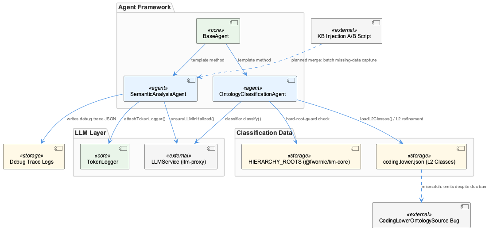
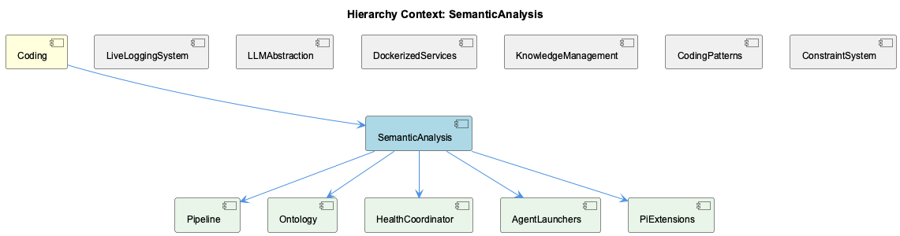

# SemanticAnalysis

**Type:** Component

## What It Is

SemanticAnalysis is the component that owns the pipeline transforming captured knowledge into classified, ontology-aware structures. It is implemented across a set of agents and pure functions: `BaseAgent` (src/agents/base-agent.ts), `OntologyClassificationAgent` (src/agents/ontology-classification-agent.ts), and the L2 refinement helpers (`loadL2Classes`, `buildL2RefinementPrompt`, `extractL2FromLLMResponse`). Its children — Pipeline, Ontology, Insights, OntologyClassificationAgent, SemanticAnalysisAgent, and L2SubsystemClassifier — reflect its role as the umbrella for classification, ontology management, and insight extraction under the parent Coding component.

## Architecture and Design

The core architectural pattern is a shared execution envelope: `BaseAgent.execute()` fixes the sequence `process() -> calculateConfidence() -> detectIssues() -> generateRouting()`, so every specialized agent (SemanticAnalysisAgent, OntologyClassificationAgent) inherits consistent confidence scoring and routing without reimplementing orchestration. The `AgentExecutionContext` (stepName, workflowId, retryAttempt, upstreamContexts, retryGuidance) decouples retry/orchestration concerns from analysis logic, letting agents focus purely on their abstract hooks.

Within OntologyClassificationAgent, classification is deliberately layered: a hard-root guard intercepts the five HIERARCHY_ROOTS (CollectiveKnowledge, Coding, DynArch, Timeline, Normalisa) from `@fwornle/km-core`, mapping them to fixed classes with `classificationMethod='hard-root-guard'` and bypassing the LLM classifier entirely — an anti-drift measure protecting the hierarchy's foundational anchors. All other entities pass through standard L1 classification (from upper.json/coding-ontology.json) and, if categorized as Component, SubComponent, or Detail (REFINABLE_L1_PARENTS), an L2 refinement pass sourced from coding.lower.json via km-core's OntologyRegistry.

A migration-seam pattern is also visible: a `LegacyOntologyAdapter` wraps the new OntologyRegistry so the older, project-specific `OntologyValidator` and `OntologyClassifier` continue operating unmodified after a refactor deleted the prior ontology-loading class — trading an extra indirection layer for preservation of battle-tested logic.

## Implementation Details

L2 refinement logic is factored out of the stateful agent into three pure, independently testable functions. `loadL2Classes` filters the OntologyRegistry to classes whose `extends` matches REFINABLE_L1_PARENTS; `buildL2RefinementPrompt` constructs the LLM prompt only when such classes exist; `extractL2FromLLMResponse` parses free-text LLM output using a token-boundary regex (`(^|[^A-Za-z0-9_])name([^A-Za-z0-9_]|$)`) to find embedded class names while rejecting superstring hallucinations (e.g., 'SuperEtmDaemonX' not matching 'EtmDaemon'). This separation lets tests exercise edge cases — empty registries, malformed lower.json, hallucinated names — without instantiating a full agent or mocking an LLM.

Ontology loading is chain-based: upper.json, then coding-ontology.json, then coding.lower.json, mirrored in tests via tmpdir-isolated fixtures copied from `.data/ontologies/`. Missing or malformed lower-ontology data resolves to an empty class set rather than throwing, causing the agent to skip L2 refinement and fall back to L1 alone — a "safe default over hard failure" pattern applied consistently across missing files and hallucinated class names.

Separately, SemanticAnalysisAgent's output feeds a distinct validation concern: Taxonomy Stability Validation via Disjoint Sample Re-derivation, which measures whether an intent-derived taxonomy over insights/observations is reproducible by re-deriving it from disjoint samples and comparing agreement — treating taxonomy stability as an empirical property rather than an assumed guarantee of the clustering algorithm.

## Integration Points

SemanticAnalysis sits under Coding as parent, alongside siblings LiveLoggingSystem, LLMAbstraction, DockerizedServices, KnowledgeManagement, CodingPatterns, and ConstraintSystem. Notably, LiveLoggingSystem reuses the same `ontology-classification-agent.ts` for classifying captured session content and tests hierarchy-root validation separately, showing that this classification logic is shared infrastructure, not siloed to SemanticAnalysis alone.

Internally, Pipeline is the consumer/producer surface where classification results and L2-sourced references are emitted; Ontology governs the class definitions (including in-flight work adding an Intent class); Insights receives classification-adjacent output and integrates embedding-based dedup on the `writeInsight` path; OntologyClassificationAgent and SemanticAnalysisAgent are the concrete agent implementations; and L2SubsystemClassifier is presumably a further specialization of the L2 refinement machinery.

## Usage Guidelines

Developers must not assume the emission path matches documentation: the unresolved Pipeline CodingLowerOntologySource Emission Bug shows the pipeline currently emits a `CodingLowerOntologySource` reference that documentation says should never be produced — a genuine gap between the intended L2 source model and production behavior, not a doc error. Anyone touching L2 refinement output should verify actual emission rather than trusting the documented contract.

When adding new agents, extend `BaseAgent` and implement only the abstract hooks — do not reimplement retry/routing logic. When modifying ontology classification, remember the hard-root guard is intentional and must not be "fixed" toward LLM-based classification for the five HIERARCHY_ROOTS. When touching L2 refinement, prefer extending the pure functions (`loadL2Classes`, `buildL2RefinementPrompt`, `extractL2FromLLMResponse`) rather than embedding logic in the agent, to preserve testability. Finally, downstream KB viewer/dashboard code relying on a "fixed spine" taxonomy should be aware that stability is validated empirically (disjoint sample re-derivation), not guaranteed by design alone.

## Work Record

What working sessions recorded about this entity — decisions taken, problems hit, and why things are the way they are:

- Pipeline CodingLowerOntologySource Emission Bug documents an unresolved defect where the pipeline emits a CodingLowerOntologySource reference in output despite documentation stating this source type should never be produced, indicating a gap between the L2 refinement design and current emission behavior
- Pipeline CodingLowerOntologySource Emission Bug documents an unresolved defect where the pipeline's output contains a CodingLowerOntologySource reference despite project documentation stating this source type should never be produced by design — indicating a live discrepancy between the intended L2 refinement source model (coding.lower.json feeding OntologyRegistry, itself feeding classification decisions) and what the emission path in production actually surfaces to output. This is flagged as a genuine gap rather than a documentation error, meaning a new developer investigating L2 refinement output should not assume the current emission behavior matches the documented source-type contract.

## Hierarchy Context

### Parent
- [Coding](./Coding.md) -- Root node of the coding project knowledge hierarchy, encompassing all development infrastructure knowledge. The project consists of 7 major components: LiveLoggingSystem: [LLM] The classification layer for LiveLoggingSystem is implemented in ontology-classification-agent.ts, which categorizes captured session content as; LLMAbstraction: [SESSION] 'LLM Routing Tier Priority' establishes that LLM requests must follow fallback tier order — max-subscription models first, then work/GH Copi; DockerizedServices: [LLM] lib/service-probe.js implements the health-check polling logic that determines readiness of dockerized services (semantic analysis MCP, constrai; KnowledgeManagement: [SESSION] Wave Insight Persistence work record establishes that Wave 4 wrote 73 insight documents but zero Insight graph nodes, because the History si; CodingPatterns: [SESSION] Documentation Style Guide for Diagrams and Markdown establishes that .puml source files must live in docs/puml/ and generated diagram artifa; ConstraintSystem: [SESSION] Statusline Click-Report Feature establishes that clicking the 'constraints' field in the tmux statusline opens or focuses the constraint-mon; SemanticAnalysis: [SESSION] Pipeline CodingLowerOntologySource Emission Bug documents an unresolved defect where the pipeline emits a CodingLowerOntologySource referenc.

### Children
- [Pipeline](./Pipeline.md) -- [SESSION] Pipeline CodingLowerOntologySource Emission Bug tracks an unresolved defect where the pipeline emits a CodingLowerOntologySource reference in output despite documentation stating this source type should never be produced, indicating a gap between L2 refinement design and current emission behavior.
- [Ontology](./Ontology.md) -- [SESSION] Coding Ontology — Intent Class Addition explores adding a new Intent class to the coding ontology so entities can be classified by session intent, distinct from the KB's separate intent-spine taxonomy work.
- [Insights](./Insights.md) -- [SESSION] writeInsight Embedding-Based Dedup Integration tracks embedding-based near-duplicate detection being wired into the writeInsight path behind a dry-run flag so live writes are unaffected until latency/precision are validated.
- [OntologyClassificationAgent](./OntologyClassificationAgent.md) -- [SESSION] Coding Ontology — Intent Class Addition is scoped as a distinct ontology-file investigation, separate from classification agent logic but affects what classes this agent can assign.
- [SemanticAnalysisAgent](./SemanticAnalysisAgent.md) -- [SESSION] Taxonomy Stability Validation via Disjoint Sample Re-derivation validates that an intent-derived taxonomy is stable enough to serve as a fixed spine by re-deriving it independently from disjoint data samples and measuring agreement.
- [L2SubsystemClassifier](./L2SubsystemClassifier.md) -- [SESSION] Pipeline CodingLowerOntologySource Emission Bug is the unresolved defect most directly attributable to this component's L2 refinement design, since the classifier is meant to prevent CodingLowerOntologySource from ever being emitted.

### Siblings
- [LiveLoggingSystem](./LiveLoggingSystem.md) -- [LLM] The classification layer for LiveLoggingSystem is implemented in ontology-classification-agent.ts, which categorizes captured session content as it flows through the logging pipeline. Its hierarchy-root validation logic is tested separately in ontology-classification-agent.hierarchy-roots.test.ts, indicating that root-node classification (i.e., correctly assigning top-level ontology categories rather than leaf nodes) is treated as a distinct correctness concern from general classification accuracy — likely because incorrect root assignment cascades into misfiled session data across the entire per-person or per-project vault structure.
- [LLMAbstraction](./LLMAbstraction.md) -- [SESSION] 'LLM Routing Tier Priority' establishes that LLM requests must follow fallback tier order — max-subscription models first, then work/GH Copilot models, then Groq Llama-70B only as a last resort — rather than demoting to lower-tier providers as primary
- [DockerizedServices](./DockerizedServices.md) -- [LLM] lib/service-probe.js implements the health-check polling logic that determines readiness of dockerized services (semantic analysis MCP, constraint monitor) before dependent processes proceed. Rather than a single fixed timeout, the probe pattern issues periodic requests against known health endpoints and treats consecutive failures within a window as the signal for 'not ready' versus 'transiently slow', which matters in a Docker context where container startup order and cold-start times (loading models, connecting to databases) are highly variable across restarts.
- [KnowledgeManagement](./KnowledgeManagement.md) -- [SESSION] Wave Insight Persistence work record establishes that Wave 4 wrote 73 insight documents but zero Insight graph nodes, because the History sidebar filters strictly to entityType 'Insight' — documents alone are invisible to graph queries
- [CodingPatterns](./CodingPatterns.md) -- [SESSION] Documentation Style Guide for Diagrams and Markdown establishes that .puml source files must live in docs/puml/ and generated diagram artifacts have defined placement rules, enforcing a convention for the docs pipeline to render correctly.
- [ConstraintSystem](./ConstraintSystem.md) -- [SESSION] Statusline Click-Report Feature establishes that clicking the 'constraints' field in the tmux statusline opens or focuses the constraint-monitor dashboard tab, integrating HookManagementSystem-driven violation data with the dashboard UI

---

*Generated from 8 observations*
