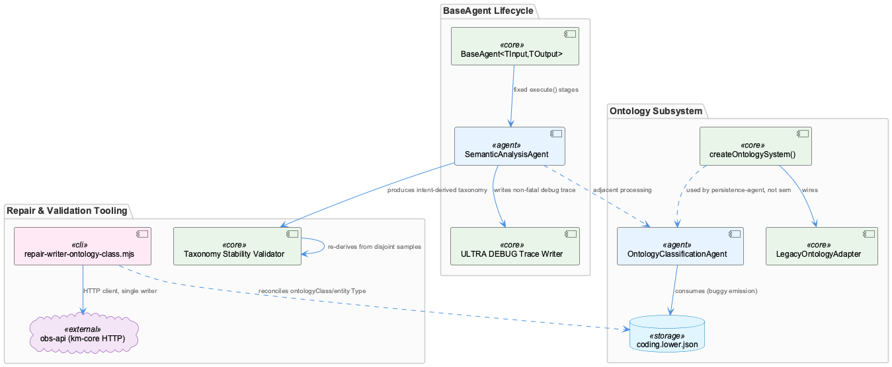
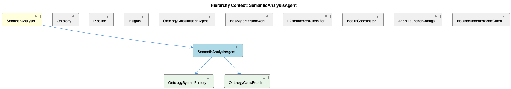

# SemanticAnalysisAgent

**Type:** SubComponent

## What It Is

SemanticAnalysisAgent is implemented at `semantic-analysis-agent.ts`, as part of the parent SemanticAnalysis component. Critically, the retrieved code files for this investigation — `scripts/health-coordinator.js`, `scripts/repair-writer-ontology-class.mjs`, `src/ontology/index.ts`, `tests/integration/health-coordinator-etm-expected.test.mjs`, and `config/agents/copilot.sh` — do not themselves reference SemanticAnalysisAgent or its lifecycle methods. Nearly everything known about the agent's internal structure derives from parent-context summary rather than directly inspected source, a gap explicitly flagged in the observations. What follows should be read with that provenance distinction in mind: session-level behavioral findings (taxonomy stability, the CodingLowerOntologySource bug) are grounded in direct records, while lifecycle/implementation details are inherited context, not verified code.

## Architecture and Design

The agent is described as extending `BaseAgent<TInput, TOutput>` (base-agent.ts), which fixes a five-stage `execute()` lifecycle — `process → calculateConfidence → detectIssues → generateRouting → applyCorrections → buildMetadata` — wrapped uniformly in try/catch. This is a Template Method pattern: SemanticAnalysisAgent is expected to override each stage discretely rather than inlining logic into a single method, mirroring the sibling BaseAgentFramework's contract.

Downstream, the agent's outputs feed a taxonomy-derivation process treated as a fixed "spine" for later KB stages (shared conceptual ground with sibling OntologyClassificationAgent, whose L1/L2 categorical output depends on the same stability guarantee). A related Adapter pattern appears one layer down: `src/ontology/index.ts`'s `createOntologySystem()` wires a `LegacyOntologyAdapter` around km-core's `OntologyRegistry`, exposed via the legacy `OntologyValidator`/`OntologyClassifier` interfaces — this factory is the likely referent of child component OntologySystemFactory, though its doc comment indicates it is actually consumed by persistence-agent.ts rather than confirmed as SemanticAnalysisAgent's own construction path.

## Implementation Details

Per parent-context description, the agent writes a per-run "ULTRA DEBUG" trace file to `logs/semantic-analysis-trace-<timestamp>.json`, capturing full `gitAnalysis`/`vibeAnalysis`/`codeGraphAnalysis` input payloads before processing. This write is explicitly non-fatal — a side-channel logging pattern isolating debug instrumentation from the primary analysis path, so filesystem/logging failures cannot degrade or abort actual output.

The child component OntologyClassRepair maps to `scripts/repair-writer-ontology-class.mjs`, an offline repair script enforcing that `ontologyClass` equals `entityType` or one of its ancestors. Its `loadParentMap()` builds a `Map<className, parentName>` from JSON files under `.data/ontologies/obs-api/`, and `chainOf(cls, parent)` walks that map cycle-safely to validate ancestry. Its `arbitrate()` function resolves conflicts using the attaching graph edge (contains/parent-child vs has_insight) rather than `metadata.hierarchyLevel` — the script's own audit found hierarchyLevel agreed with actual tree depth only 3 of 36 disagreement cases, justifying edge-arbitrated resolution over stored metadata.

The other child, OntologySystemFactory (`createOntologySystem()`), is a hard construction gate: it throws distinct errors if `inferenceEngine` or `LegacyOntologyAdapter` are missing, with an explicit "NO MOCK FALLBACK" — callers must supply a real LLM engine from SemanticAnalyzer.

## Integration Points

SemanticAnalysisAgent sits under the SemanticAnalysis parent alongside siblings Ontology, Pipeline, Insights, OntologyClassificationAgent, and BaseAgentFramework. The intent-derived taxonomy it produces is validated via disjoint-sample re-derivation, agreement between two independent derivations serving as a precondition for "freezing" the spine before OntologyClassificationAgent and other consumers depend on it. This connects to sibling Insights' "intent spine" derivation, which clusters insights into Intent entities via aggregate edges. A live, unresolved cross-cutting defect — the CodingLowerOntologySource Emission Bug — implicates the pipeline's lower-ontology emission path near `coding.lower.json` consumption in OntologyClassificationAgent or its upstream producers, and is documented at the Ontology, Pipeline, and parent SemanticAnalysis level alike, suggesting SemanticAnalysisAgent's output is one of the upstream suspects.

OntologyClassRepair's `repair-writer-ontology-class.mjs` operates purely as an HTTP client against km-core's `obs-api` (:12436), never touching LevelDB directly, keeping obs-api the single writer of record — an integration boundary worth preserving when reasoning about consistency.

## Usage Guidelines

Developers should not treat a populated confidence/issues/routing field in SemanticAnalysisAgent's `AgentResponse` as proof that meaningful domain analysis ran — BaseAgent's uniform envelope populates these fields regardless, so a filled field only confirms lifecycle completion, not analytical substance. The ULTRA DEBUG trace files are diagnostic-only and safe to ignore in production reasoning, but should be the first artifact consulted when debugging multi-source correlation issues across git/vibe/code-graph inputs. When touching the lower-ontology emission path (coding.lower.json), engineers should treat current CodingLowerOntologySource output as known-bad, not spec-compliant, since it contradicts documented invariants and remains unresolved. Anyone modifying OntologySystemFactory's construction path must supply real dependencies — there is no mock fallback for the inference engine. Finally, since retrieval commonly surfaces adjacent-but-unrelated files (as with the unrelated Phase 33 HealthCoordinator daemon here), future investigations of SemanticAnalysisAgent should verify direct code references before treating retrieved files as authoritative.

## Work Record

What working sessions recorded about this entity — decisions taken, problems hit, and why things are the way they are:

- Taxonomy Stability Validation via Disjoint Sample Re-derivation validates that an intent-derived taxonomy produced from SemanticAnalysisAgent-adjacent processing is stable and reproducible by re-deriving it independently from disjoint data samples.
- Pipeline CodingLowerOntologySource Emission Bug records an unresolved defect where the SemanticAnalysis pipeline emits a CodingLowerOntologySource reference in its output despite project documentation stating this source type should never be produced. The record identifies the likely fault zone as the lower-ontology emission path near coding.lower.json consumption in OntologyClassificationAgent or its upstream producers, and frames it as a live discrepancy between documented invariants and observed behavior rather than a resolved or understood bug — a developer touching that path should treat the current emission behavior as known-bad, not spec-compliant.
- Taxonomy Stability Validation via Disjoint Sample Re-derivation establishes that intent-derived taxonomies produced by SemanticAnalysisAgent were validated by re-deriving the taxonomy independently from two disjoint data samples and measuring agreement between the derivations, rather than by inspecting a single run's output. The record ties this methodology directly to the taxonomy's role as a fixed 'spine' for downstream KB stages: because instability in the spine would propagate structural drift into every consumer that depends on it staying fixed, reproducibility across disjoint samples was treated as a precondition for freezing the taxonomy, not an optional sanity check performed after the fact.

## Hierarchy Context

### Parent
- [SemanticAnalysis](./SemanticAnalysis.md) -- [SESSION] Pipeline CodingLowerOntologySource Emission Bug documents an unresolved defect where the pipeline emits a CodingLowerOntologySource reference in output despite documentation stating this source type should never be produced

### Children
- [OntologySystemFactory](./OntologySystemFactory.md) -- [LLM] src/ontology/index.ts's createOntologySystem() is the factory function this component almost certainly maps to, despite the name mismatch with 'OntologySystemFactory': it takes a config, a required inferenceEngine, and a required LegacyOntologyAdapter, and explicitly throws two distinct errors ('createOntologySystem requires an inferenceEngine...' and 'createOntologySystem requires a LegacyOntologyAdapter...') rather than silently defaulting either dependency. The doc comment is explicit that there is 'NO MOCK FALLBACK' for the inference engine — callers must supply a real LLM engine from SemanticAnalyzer, making the factory a hard construction gate rather than a convenience wrapper.
- [OntologyClassRepair](./OntologyClassRepair.md) -- [LLM] scripts/repair-writer-ontology-class.mjs is the OntologyClassRepair component itself: an offline, standalone script enforcing the invariant that `ontologyClass` must equal `entityType` or one of its ancestors in the ontology registry. `loadParentMap()` builds a `Map<className, parentName>` by reading every JSON file under `.data/ontologies/obs-api/` and pulling `body.extends ?? body.parent`, then `chainOf(cls, parent)` walks that map from a class up to its root (cycle-safe via a `seen` set) so a row is legal only if `chainOf(entityType, parent).includes(ontologyClass)`.

### Siblings
- [Ontology](./Ontology.md) -- [SESSION] Pipeline CodingLowerOntologySource Emission Bug documents an unresolved defect where the pipeline emits a CodingLowerOntologySource reference in output despite documentation stating this source type should never be produced, indicating a gap between the lower-ontology source contract and actual emission behavior.
- [Pipeline](./Pipeline.md) -- [SESSION] Pipeline CodingLowerOntologySource Emission Bug tracks an unresolved defect where the pipeline emits a CodingLowerOntologySource reference in its output despite documentation stating this source type should never be produced, indicating a mismatch between the pipeline's source-tagging logic and its own contract.
- [Insights](./Insights.md) -- [SESSION] Intent Spine Derivation Pipeline describes deriving an 'intent spine' by clustering insights into Intent entities via aggregate edges, consolidating five prior ad-hoc scripts into one producer script.
- [OntologyClassificationAgent](./OntologyClassificationAgent.md) -- [SESSION] Taxonomy Stability Validation via Disjoint Sample Re-derivation establishes that intent-derived taxonomies produced by SemanticAnalysisAgent were validated for stability by re-deriving the taxonomy independently from disjoint data samples and measuring agreement between the two derivations, rather than by inspecting a single run's output. This methodology exists because the taxonomy serves as a fixed 'spine' for downstream KB stages — instability would propagate structural drift into every consumer that depends on the taxonomy being held fixed, so reproducibility across disjoint samples was treated as a precondition for freezing the spine rather than an optional sanity check. This bears on OntologyClassificationAgent because its L1/L2 output is exactly the kind of categorical assignment such a spine depends on staying stable run-to-run.
- [BaseAgentFramework](./BaseAgentFramework.md) -- [LLM] None of the five files retrieved for this request — scripts/health-coordinator.js, scripts/repair-writer-ontology-class.mjs, src/ontology/index.ts, tests/integration/health-coordinator-etm-expected.test.mjs, and config/agents/copilot.sh — define, import, or reference a class named BaseAgent, BaseAgentFramework, or any of the five lifecycle methods (process(), calculateConfidence(), detectIssues(), generateRouting(), applyCorrections(), buildMetadata()) that the parent context attributes to base-agent.ts. The <code_graph> block supplied for this request is also empty, so there is no structural (call-graph) evidence tying these files to the framework either. This is a retrieval mismatch, not a finding about the framework's design.
- [L2RefinementClassifier](./L2RefinementClassifier.md) -- [LLM] None of the supplied code files (scripts/health-coordinator.js, scripts/repair-writer-ontology-class.mjs, src/ontology/index.ts, tests/integration/health-coordinator-etm-expected.test.mjs, config/agents/copilot.sh) implement or reference loadL2Classes(), buildL2RefinementPrompt(), or extractL2FromLLMResponse() — the three functions the parent context attributes to L2RefinementClassifier's implementation in ontology-classification-agent.ts. That file is absent from the supplied evidence.
- [HealthCoordinator](./HealthCoordinator.md) -- [LLM] scripts/health-coordinator.js implements the actual HealthCoordinator daemon: a single-owner in-memory state object (currentState) exposed over HTTP (GET /health, GET /health/state, POST /signals, POST /health/refresh) and refreshed on a 5s tick that iterates a check registry loaded from config/health-verification-rules.json. This is the concrete component behind the 'HealthCoordinator' label in the parent context, though the parent's observations (SemanticAnalysisAgent, OntologyClassificationAgent, BaseAgent lifecycle) describe an entirely different subsystem.
- [AgentLauncherConfigs](./AgentLauncherConfigs.md) -- [LLM] The supplied code files (health-coordinator.js, repair-writer-ontology-class.mjs, src/ontology/index.ts, health-coordinator-etm-expected.test.mjs, config/agents/copilot.sh) contain no reference to an 'AgentLauncherConfigs' class, module, or file. config/agents/copilot.sh is an agent definition sourced by launch-agent-common.sh, which is thematically adjacent to an 'agent launcher' concept but is not itself a config aggregation component named AgentLauncherConfigs.
- [NoUnboundedFsScanGuard](./NoUnboundedFsScanGuard.md) -- [LLM] None of the supplied code files implement or reference anything resembling a filesystem-scan bound or guard. `scripts/health-coordinator.js` owns health-state polling and Docker/service/LSL checks; `scripts/repair-writer-ontology-class.mjs` repairs `ontologyClass` vs `entityType` mismatches over HTTP against obs-api; `src/ontology/index.ts` wires `LegacyOntologyAdapter`/`OntologyValidator`/`OntologyClassifier`; the test file asserts ETM-expectation lifecycle invariants; `config/agents/copilot.sh` configures the CoPilot agent launch. None of these touch directory traversal, `fs.readdir`/`fs.walk` recursion, or any depth/size/count ceiling that a name like 'NoUnboundedFsScanGuard' would imply.

---

*Generated from 11 observations*
