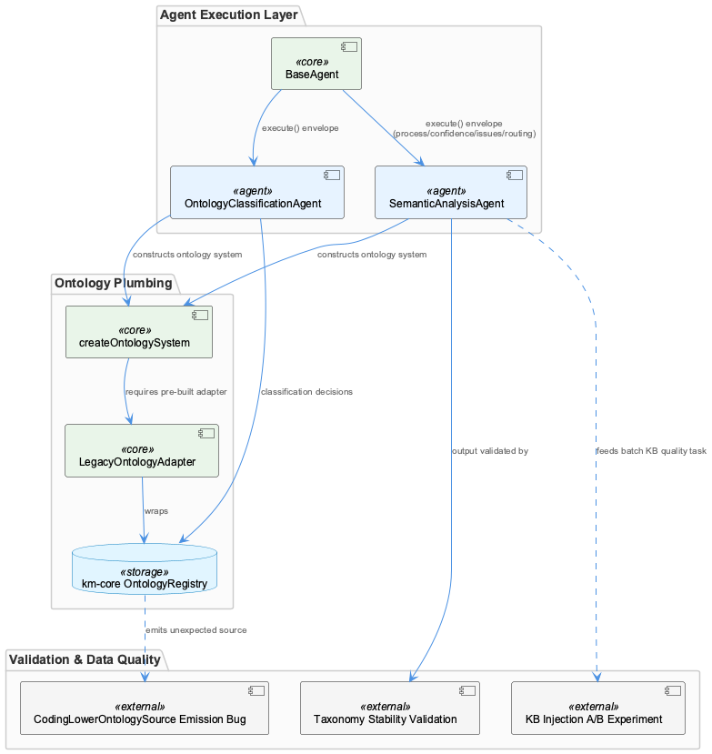
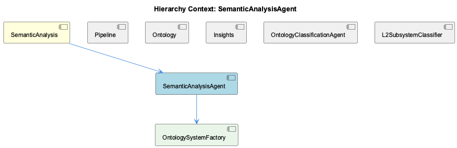

# SemanticAnalysisAgent

**Type:** SubComponent

## What It Is

SemanticAnalysisAgent's concrete implementation file was not present among the supplied sources — none of the five retrieved files (integrations/system-health-dashboard/src/components/batch-progress.tsx, scripts/health-coordinator.js, scripts/repair-writer-ontology-class.mjs, src/ontology/index.ts, tests/integration/health-coordinator-etm-expected.test.mjs) define, import, or reference a class or module named SemanticAnalysisAgent. What can be established comes from parent/session context rather than code: SemanticAnalysisAgent is a SubComponent of SemanticAnalysis, a sibling to Pipeline, Ontology, Insights, OntologyClassificationAgent, and L2SubsystemClassifier, and it contains a child, OntologySystemFactory, whose actual implementation lives in src/ontology/index.ts as `createOntologySystem`. The agent participates in validating the stability of an intent-derived taxonomy over insights/observations by re-deriving that taxonomy independently from disjoint data samples and measuring agreement — treating taxonomy stability as an empirically measured property rather than a built-in assumption of the clustering algorithm.

## Architecture and Design

Per parent context, SemanticAnalysisAgent inherits BaseAgent's (src/agents/base-agent.ts) template-method execution envelope, which fixes the sequence process() → calculateConfidence() → detectIssues() → generateRouting() for all subclasses. This is a deliberate separation of concerns: retry/orchestration logic and the AgentExecutionContext (stepName, workflowId, retryAttempt, upstreamContexts, retryGuidance) are owned entirely by BaseAgent, leaving SemanticAnalysisAgent to implement only its abstract analysis hooks rather than reimplementing routing or retry semantics.

The agent's child, OntologySystemFactory, encapsulates a fail-safe factory validation pattern in `createOntologySystem` (src/ontology/index.ts:76-141), which hard-throws if a real inferenceEngine or a pre-built LegacyOntologyAdapter is missing rather than degrading silently or falling back to mocks. This factory also embodies an adapter/migration-seam pattern — LegacyOntologyAdapter wraps km-core's OntologyRegistry so that OntologyValidator and OntologyClassifier can operate unmodified, a Phase 42-03 refactor artifact that deleted a prior legacy ontology-loading class. Because SemanticAnalysisAgent and OntologyClassificationAgent are sibling agents sharing this ontology plumbing, this factory is inferred (not directly observed) to sit on SemanticAnalysisAgent's call path as well.

## Implementation Details

The only concretely observed implementation detail belonging to SemanticAnalysisAgent's subtree is OntologySystemFactory's `createOntologySystem(config, inferenceEngine, adapter)`, an async function that validates its two required arguments with explicit throws ("createOntologySystem requires an inferenceEngine... No mock fallback is provided" and "createOntologySystem requires a LegacyOntologyAdapter"), then constructs an `OntologyValidator(adapter)`, a heuristic classifier via `createHeuristicClassifier()`, and an `OntologyClassifier(adapter, validator, heuristicClassifier, inferenceEngine)`, bundling these together with `config` into an `OntologySystem` object. Beyond this factory, no supplied file shows the actual process() hook, calculateConfidence() logic, or detectIssues() implementation that would reveal what semantic analysis SemanticAnalysisAgent performs — this must be treated as an open gap rather than inferred from thematically adjacent code.

On the session/work-record side, SemanticAnalysisAgent is tied to "Taxonomy Stability Validation via Disjoint Sample Re-derivation," a validation technique run against output the agent helps produce: an intent-derived taxonomy over insights/observations, validated by splitting data into disjoint samples, independently re-deriving the taxonomy from each, and measuring agreement between the two derivations.

## Integration Points

SemanticAnalysisAgent's taxonomy-validation work is explicitly distinguished from the L1/L2 ontology classification pipeline implemented in OntologyClassificationAgent — the two agents feed related but separately validated layers of the knowledge base's category structure. This same L2 refinement design is where the unresolved CodingLowerOntologySource emission bug lives: the pipeline emits this source-type reference despite documentation stating it should never be produced, a defect most directly attributable to L2SubsystemClassifier's failure to prevent the emission, downstream of coding.lower.json feeding km-core's OntologyRegistry. Any investigation of SemanticAnalysisAgent's role in producing or forwarding such output should not assume current emission behavior matches the documented contract.

Structurally, SemanticAnalysisAgent likely depends on the ontology system assembled by its child OntologySystemFactory (createOntologySystem in src/ontology/index.ts), which centralizes validator/classifier/adapter wiring behind one factory call rather than requiring consumers to assemble OntologyValidator/OntologyClassifier directly. This mirrors how sibling OntologyClassificationAgent consumes the same factory output. Additionally, SemanticAnalysisAgent inherits BaseAgent's AgentExecutionContext, implying its process() hook can consume upstream agents' outputs and prior-failure retryGuidance within a shared workflow — though this integration point is inferred from parent-context description, not confirmed in code.

## Usage Guidelines

Given the gaps in direct evidence, developers should treat any description of SemanticAnalysisAgent's specific analysis logic as unconfirmed until the actual agent file (likely src/agents/semantic-analysis-agent.ts or similar, not supplied here) is retrieved. When working with the ontology plumbing shared with OntologyClassificationAgent, always construct OntologySystem via `createOntologySystem` rather than assembling OntologyValidator/OntologyClassifier manually, since the factory enforces fail-fast validation (no mock fallback for inferenceEngine or adapter) — this is a deliberate design decision favoring loud failure over silent degradation.

Because retry/orchestration is decoupled into BaseAgent, any change to SemanticAnalysisAgent's analysis behavior should be scoped to its <AWS_SECRET_REDACTED> hooks without touching the inherited execute() envelope. When reasoning about taxonomy or classification output, keep in mind the documented split: SemanticAnalysisAgent's intent-derived taxonomy stability work is a separate validation track from OntologyClassificationAgent's L1/L2 classification, and neither should be conflated with the still-unresolved CodingLowerOntologySource emission defect tracked against Pipeline and L2SubsystemClassifier. Finally, future retrieval for this component should target agent-specific files directly (e.g., an `agents/semantic-analysis-agent.ts`) rather than ontology or health-coordinator files matched on thematic proximity, since the current evidence base is largely inferential.

## Work Record

What working sessions recorded about this entity — decisions taken, problems hit, and why things are the way they are:

- Taxonomy Stability Validation via Disjoint Sample Re-derivation validates that an intent-derived taxonomy is stable enough to serve as a fixed spine by re-deriving it independently from disjoint data samples and measuring agreement.
- KB Injection A/B Experiment — Task Design tracks a planned merge of a viewer-executable research script for KB data quality with batch processing to capture missing information in a single pass rather than sequentially.
- Taxonomy Stability Validation via Disjoint Sample Re-derivation, a work record associated directly with SemanticAnalysisAgent, establishes that the intent-derived taxonomy over insights/observations is validated by independently re-deriving it from disjoint data samples and measuring agreement between the two derivations, treating taxonomy stability as an empirically measured property rather than an assumption baked into the clustering algorithm. This validation step is run against output that SemanticAnalysisAgent helps produce, distinct from the L1/L2 ontology classification pipeline implemented in OntologyClassificationAgent — the two agents feed related but separately validated layers of the knowledge base's category structure.
- Pipeline CodingLowerOntologySource Emission Bug documents a live, unresolved discrepancy in which the pipeline emits a CodingLowerOntologySource reference in output despite project documentation stating this source type should never be produced. The bug is scoped to the emission path downstream of the L2 refinement source model — coding.lower.json feeding km-core's OntologyRegistry, itself feeding classification decisions — and is flagged as a genuine implementation gap rather than a documentation error, meaning any investigation of SemanticAnalysisAgent's role in producing or forwarding this output should not assume current emission behavior matches the documented source-type contract.

## Hierarchy Context

### Parent
- [SemanticAnalysis](./SemanticAnalysis.md) -- [SESSION] Pipeline CodingLowerOntologySource Emission Bug documents an unresolved defect where the pipeline emits a CodingLowerOntologySource reference in output despite documentation stating this source type should never be produced, indicating a gap between the L2 refinement design and current emission behavior

### Children
- [OntologySystemFactory](./OntologySystemFactory.md) -- [LLM] The actual factory implementation for an ontology system lives in src/ontology/index.ts as the exported async function `createOntologySystem(config, inferenceEngine, adapter)`. It is the only supplied file that behaves like an 'OntologySystemFactory': it validates two required arguments with hard throws ('createOntologySystem requires an inferenceEngine... No mock fallback is provided' and 'createOntologySystem requires a LegacyOntologyAdapter'), then constructs an `OntologyValidator(adapter)`, a heuristic classifier via `createHeuristicClassifier()`, and an `OntologyClassifier(adapter, validator, heuristicClassifier, inferenceEngine)`, returning them bundled with `config` as an `OntologySystem` object.

### Siblings
- [Pipeline](./Pipeline.md) -- [SESSION] Pipeline CodingLowerOntologySource Emission Bug tracks an unresolved defect where the pipeline emits a CodingLowerOntologySource reference in output despite documentation stating this source type should never be produced, indicating a gap between L2 refinement design and current emission behavior.
- [Ontology](./Ontology.md) -- [SESSION] Coding Ontology — Intent Class Addition explores adding a new Intent class to the coding ontology so entities can be classified by session intent, distinct from the KB's separate intent-spine taxonomy work.
- [Insights](./Insights.md) -- [SESSION] writeInsight Embedding-Based Dedup Integration tracks embedding-based near-duplicate detection being wired into the writeInsight path behind a dry-run flag so live writes are unaffected until latency/precision are validated.
- [OntologyClassificationAgent](./OntologyClassificationAgent.md) -- [SESSION] Coding Ontology — Intent Class Addition is scoped as a distinct ontology-file investigation, separate from classification agent logic but affects what classes this agent can assign.
- [L2SubsystemClassifier](./L2SubsystemClassifier.md) -- [SESSION] Pipeline CodingLowerOntologySource Emission Bug is the unresolved defect most directly attributable to this component's L2 refinement design, since the classifier is meant to prevent CodingLowerOntologySource from ever being emitted.

---

*Generated from 10 observations*
