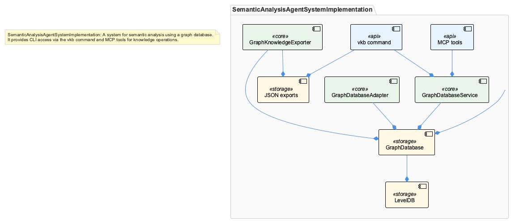
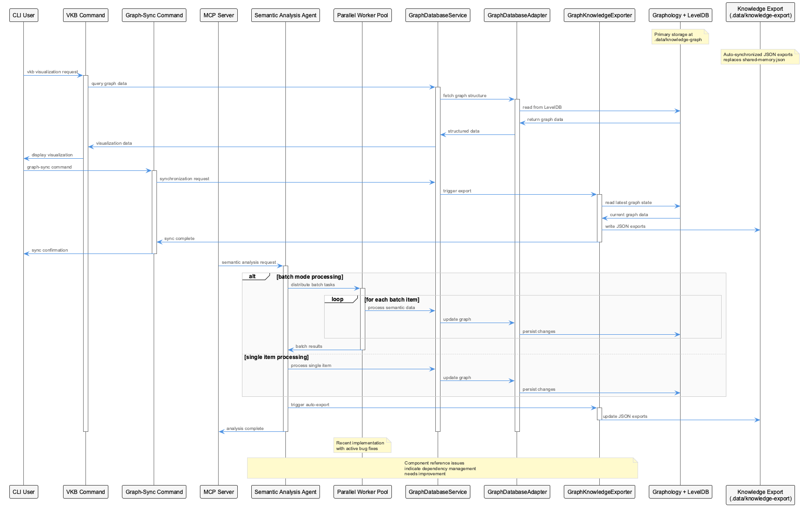
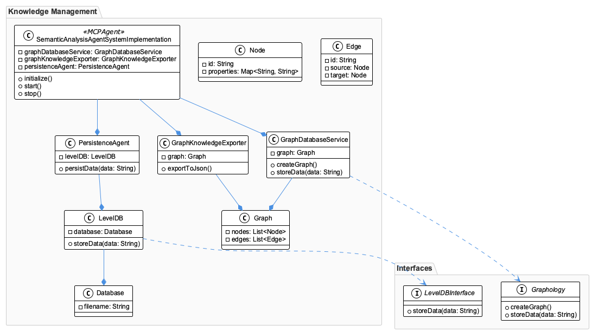
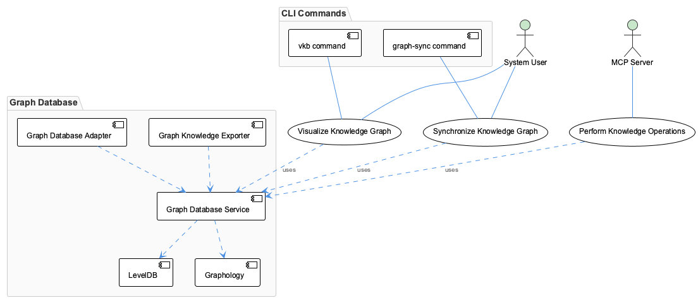

# SemanticAnalysisAgentSystemImplementation

**Type:** GraphDatabase

The system uses Graphology + LevelDB at .data/knowledge-graph for primary graph storage with verified components GraphDatabaseService, GraphKnowledgeExporter, and GraphDatabaseAdapter managing the dat...

## What It Is

- Recent parallel worker implementation for batch mode semantic analysis indicates performance optimization efforts, with active bug fixes for insight generation and PlantUML generation agents

- The system provides CLI access through vkb command for visualization and graph-sync command for synchronization, with MCP server integration at integrations/mcp-server-semantic-analysis/src

- Auto-synchronized JSON exports are maintained at .data/knowledge-export directory, removing dependency on the previously used shared-memory.json approach

- Current architecture shows component reference issues and stale observations, indicating need for improved dependency management and documentation synchronization

## Diagrams

### Architecture

### Sequence

### Class

### Use cases

---

*Generated from 5 observations*
