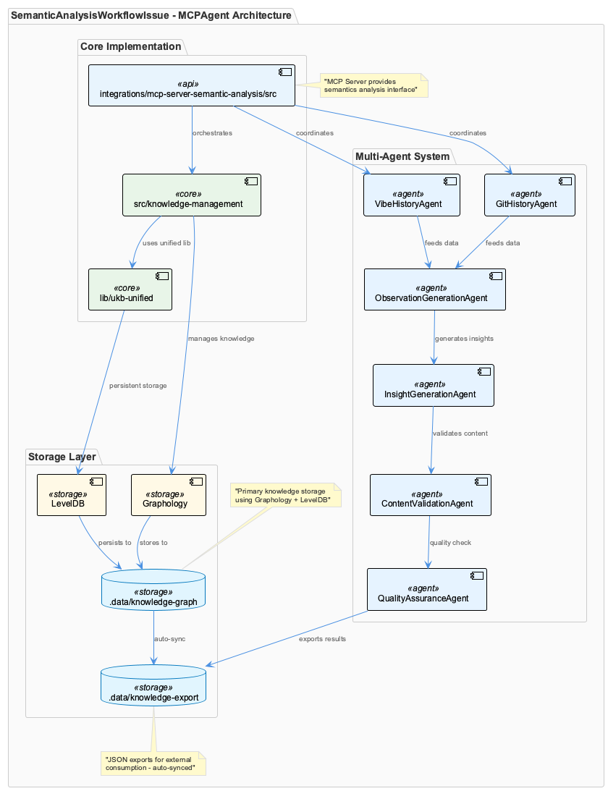
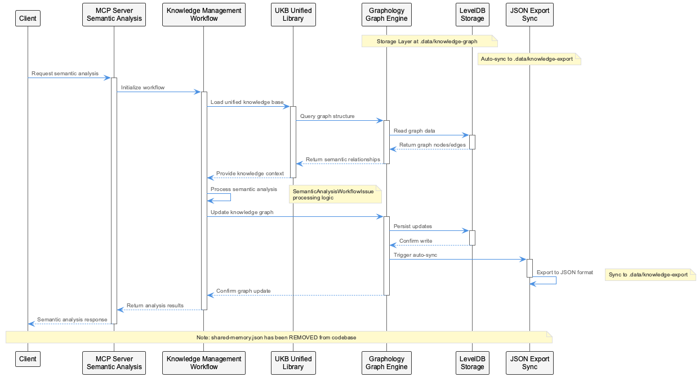
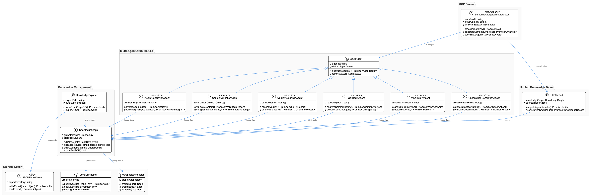
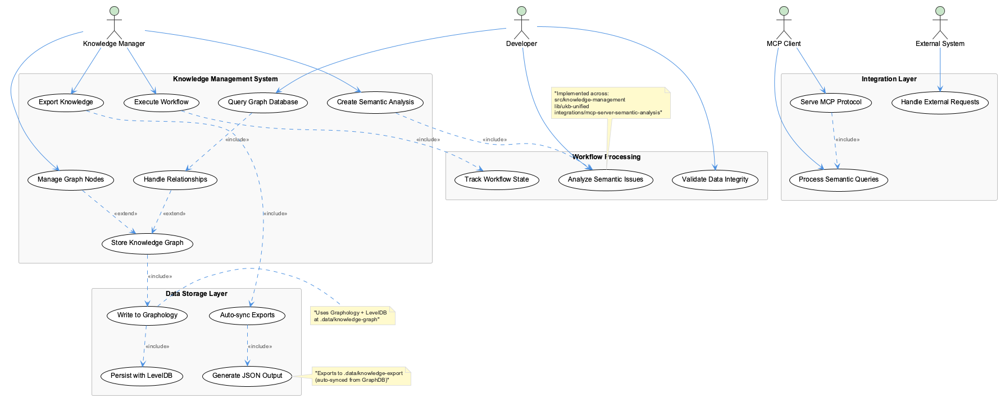

# SemanticAnalysisWorkflowIssue

**Type:** MCPAgent

Uses multi-agent architecture: GitHistoryAgent, VibeHistoryAgent, ObservationGenerationAgent, InsightGenerationAgent, ContentValidationAgent, QualityAssuranceAgent

# SemanticAnalysisWorkflowIssue: Deep Architectural Analysis

## Core Purpose and Problem Domain

The `SemanticAnalysisWorkflowIssue` represents a sophisticated knowledge processing pipeline designed to extract, analyze, and synthesize semantic meaning from complex technical systems. This MCP (Model Context Protocol) agent serves as the orchestrating component for transforming raw observational data into actionable insights through a multi-stage analytical workflow.

The entity addresses the fundamental challenge of knowledge management in large-scale software systems: how to automatically capture, process, and maintain semantic understanding of evolving codebases and their associated artifacts. Rather than relying on static documentation or manual knowledge curation, this system implements a dynamic, agent-driven approach to semantic analysis that can adapt to changing system states and requirements.

## Architectural Patterns and Design Philosophy

### Multi-Agent Orchestration Pattern

The system employs a sophisticated multi-agent architecture that decomposes semantic analysis into specialized, composable units. Each agent—GitHistoryAgent, VibeHistoryAgent, ObservationGenerationAgent, InsightGenerationAgent, ContentValidationAgent, and QualityAssuranceAgent—represents a distinct analytical capability with clear separation of concerns.

This design follows the Single Responsibility Principle at the agent level, where each component has a well-defined role in the semantic analysis pipeline. The orchestration pattern allows for parallel processing of different analytical dimensions while maintaining coherent integration of results.

### Hybrid Storage Strategy

The architectural decision to combine Graphology with LevelDB for knowledge storage reveals a nuanced understanding of semantic data requirements. Graphology provides the graph-theoretic operations necessary for semantic relationship modeling, while LevelDB offers the persistence and performance characteristics needed for large-scale knowledge storage.

The dual-export mechanism (GraphDB primary storage with JSON export synchronization) implements a polyglot persistence pattern that balances operational efficiency with data accessibility. This approach allows the system to leverage graph database capabilities for complex queries while maintaining human-readable exports for debugging, integration, and backup purposes.

## Implementation Architecture and Technical Decisions

### Distributed Component Strategy

The implementation spans three distinct locations (`src/knowledge-management`, `lib/ukb-unified`, `integrations/mcp-server-semantic-analysis/src`), indicating a modular architecture that separates concerns across different abstraction levels. This distribution suggests a clean separation between core knowledge management logic, unified knowledge base utilities, and MCP-specific integration layers.

The removal of `shared-memory.json` from the codebase represents a significant architectural evolution away from file-based shared state toward more robust, database-backed knowledge persistence. This decision eliminates common concurrency issues and improves system reliability by centralizing state management in the graph database layer.

### Data Flow and Processing Pipeline

The agent chain creates a sophisticated data processing pipeline where each stage adds incremental semantic understanding. The flow from observation generation through insight synthesis to quality assurance implements a progressive refinement pattern that builds semantic understanding iteratively.

This pipeline architecture enables sophisticated error handling and quality control mechanisms, where downstream agents can validate and refine the outputs of upstream components. The ContentValidationAgent and QualityAssuranceAgent serve as critical checkpoints that ensure semantic accuracy and consistency across the analysis workflow.

## Integration Ecosystem and Dependencies

### MCP Protocol Integration

The integration with the Model Context Protocol positions this system within a broader ecosystem of AI-driven development tools. The MCP agent interface provides a standardized way to expose semantic analysis capabilities to external systems while maintaining internal architectural flexibility.

This integration pattern suggests the system is designed to operate as both a standalone semantic analysis engine and as a component within larger AI-assisted development workflows. The protocol abstraction enables loose coupling with client systems while providing rich semantic interaction capabilities.

### Knowledge Base Unification

The `ukb-unified` library component indicates a strategic decision to create reusable knowledge base utilities that can be leveraged across multiple semantic analysis contexts. This promotes code reuse and ensures consistent knowledge handling patterns across different system components.

## Scalability and Performance Considerations

### Graph Database Scalability

The choice of Graphology + LevelDB provides excellent horizontal scaling characteristics for semantic knowledge storage. LevelDB's LSM-tree architecture offers efficient write performance for high-volume knowledge ingestion, while Graphology's in-memory graph operations enable fast semantic queries and relationship traversals.

The automatic JSON export mechanism serves as both a backup strategy and a performance optimization, allowing read-heavy operations to leverage file-system-based access patterns while maintaining graph database benefits for complex relationship queries.

### Agent Parallelization Potential

The multi-agent architecture inherently supports parallel execution patterns, enabling the system to scale processing capacity by distributing agent workloads across multiple execution contexts. This design allows for both vertical scaling (more powerful agent execution environments) and horizontal scaling (more agent instances processing different knowledge domains).

## Maintainability and Evolution Framework

### Modular Agent Design

The agent-based architecture provides excellent maintainability characteristics by encapsulating specific analytical capabilities within well-defined component boundaries. Individual agents can be updated, replaced, or extended without affecting the broader system architecture, enabling incremental evolution of semantic analysis capabilities.

The clear separation between different agent responsibilities (history analysis, observation generation, insight synthesis, quality assurance) creates natural testing boundaries and enables focused development efforts on specific analytical capabilities.

### Knowledge Schema Evolution

The combination of graph database storage with structured JSON exports provides a flexible foundation for knowledge schema evolution. New semantic relationships and entity types can be added to the graph model without breaking existing data structures, while the JSON export format can be versioned to support backward compatibility.

This dual-format approach enables the system to evolve its semantic understanding capabilities while maintaining stable integration interfaces for downstream consumers of the semantic analysis results.

## Diagrams

### Architecture

### Sequence

### Class

### Use cases

---

*Generated from 5 observations*
