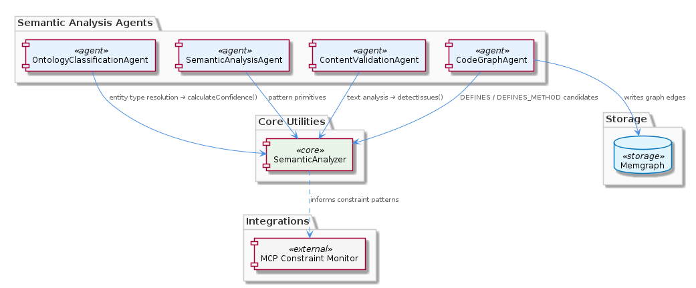
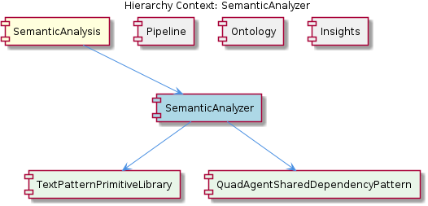

# SemanticAnalyzer

**Type:** SubComponent

src/agents/semantic-analyzer.ts is referenced by four distinct agents (OntologyClassificationAgent, CodeGraphAgent, ContentValidationAgent, SemanticAnalysisAgent), making it the single authoritative source for text pattern primitives across the semantic analysis subsystem

# SemanticAnalyzer — Technical Insight Document

## What It Is

SemanticAnalyzer is implemented in `src/agents/semantic-analyzer.ts` and functions as the single authoritative source for text pattern primitives across the semantic analysis subsystem. Rather than being a full agent in its own right, it is a SubComponent — a utility module that supplies pattern-matching building blocks to four distinct agents: `OntologyClassificationAgent`, `CodeGraphAgent`, `ContentValidationAgent`, and `SemanticAnalysisAgent`. It sits within the broader SemanticAnalysis parent component, which itself participates in the agent pipeline architecture defined by `BaseAgent<TInput, TOutput>` in `src/agents/base-agent.ts`.

The module's purpose is deliberately narrow: it exposes reusable tokenization and matching primitives — embodied conceptually by its child TextPatternPrimitiveLibrary — that downstream agents incorporate into their own `process()` and lifecycle methods. By housing pattern logic in one location, SemanticAnalyzer enforces consistent semantic interpretation across multiple pipeline stages that would otherwise be tempted to re-implement similar logic locally.

## Architecture and Design

The architectural decision driving SemanticAnalyzer is centralization of cross-cutting concerns. Where the sibling Pipeline, Ontology, and Insights components each rely on the `BaseAgent` abstract contract (which mandates the five lifecycle methods `process`, `calculateConfidence`, `detectIssues`, `generateRouting`, and `applyCorrections`), SemanticAnalyzer is intentionally *not* an agent. It is a shared dependency — a fact captured explicitly by its child QuadAgentSharedDependencyPattern, which names the four-way fan-out from this single module to consuming agents.

This design follows the DRY principle in a strict form: pattern primitives are defined once and consumed many times. The alternative would have each agent's `process()` method carry its own tokenization rules, which would inevitably drift apart over time and yield inconsistent confidence scores and issue detection results across the pipeline. By centralizing pattern logic, the design ensures that, for example, `OntologyClassificationAgent.calculateConfidence()` and `ContentValidationAgent.detectIssues()` operate on identical semantic groundwork even though they serve different purposes.

The trade-off is coupling: because four agents import from `src/agents/semantic-analyzer.ts`, any breaking API change in the module propagates simultaneously to all four execution paths. This is the explicit warning embedded in the QuadAgentSharedDependencyPattern child — the module sits at the intersection of four independent agent flows, and its API stability is therefore disproportionately important relative to its file size.

## Implementation Details

SemanticAnalyzer's implementation surface is the TextPatternPrimitiveLibrary it contains — a collection of pattern-matching utilities used in distinct ways by each consumer. In `OntologyClassificationAgent`, these primitives feed the entity type resolution step, with matched patterns flowing into `calculateConfidence()` scoring; this is how the agent decides how strongly to assert an ontology class on a given input before passing its `AgentResponse` envelope downstream to `PersistenceAgent`.

`ContentValidationAgent` invokes SemanticAnalyzer's text analysis to populate its `detectIssues()` findings, scanning content for semantic anomalies before persistence occurs. This positioning is significant: validation runs *before* the data lands in storage, so any false negatives in SemanticAnalyzer's pattern coverage become false negatives in the validation layer as well. `CodeGraphAgent` uses the same primitives differently — it instantiates SemanticAnalyzer to identify candidate `DEFINES` and `DEFINES_METHOD` relationships within source tokens before writing edges to Memgraph, meaning the module's output directly influences the topology of the persisted code graph.

`SemanticAnalysisAgent` is the fourth consumer, and presumably the most direct: as the agent most thematically aligned with the SemanticAnalysis parent component, it likely uses the broadest surface of the primitive library. Because the module exposes primitives rather than complete analyses, each agent composes the building blocks differently while still benefiting from shared tokenization and matching rules.

## Integration Points

SemanticAnalyzer's integration footprint is defined by its four importers and one documentation reference. The four agents — `OntologyClassificationAgent`, `CodeGraphAgent`, `ContentValidationAgent`, and `SemanticAnalysisAgent` — all consume the module through direct import from `src/agents/semantic-analyzer.ts`. Each of these agents, in turn, implements the `BaseAgent<TInput, TOutput>` contract from the parent SemanticAnalysis layer, meaning SemanticAnalyzer's output is invariably wrapped into a structured `AgentResponse<TOutput>` envelope before propagation through `AgentExecutionContext.upstreamContexts`.

Beyond the agent pipeline, the module's conceptual reach extends to the constraint monitoring subsystem. The `integrations/mcp-constraint-monitor/docs/semantic-constraint-detection.md` documentation references pattern-matching concepts that align with SemanticAnalyzer's primitives, suggesting the same tokenization and matching logic informs constraint detection. Whether this is a direct code import or merely a shared conceptual model is not stated in the observations, but the parallel is intentional.

Within the sibling landscape, SemanticAnalyzer interacts indirectly with Pipeline (whose coordinator orchestrates the agents that consume it), Ontology (whose `OntologyClassificationAgent` is one of the four direct consumers), and Insights (whose agents could potentially adopt these primitives for their own `generateRouting()` decisions).

## Usage Guidelines

When working with SemanticAnalyzer, developers should treat it as a stable, shared library rather than as agent-specific logic. Adding pattern-matching code inside an individual agent's `process()` method is an anti-pattern when that logic could plausibly be shared — the design intent, as expressed by the TextPatternPrimitiveLibrary child component, is that patterns live in one canonical place. If a new agent needs text analysis capability that overlaps with existing usage, the correct approach is to extend SemanticAnalyzer's API rather than fork the logic locally.

Because of the QuadAgentSharedDependencyPattern, any API modification to `src/agents/semantic-analyzer.ts` must be evaluated against all four consumer agents simultaneously. Changes that appear local to one agent's perspective can silently alter the behavior of the other three. When refactoring, it is essential to verify that `OntologyClassificationAgent.calculateConfidence()`, `ContentValidationAgent.detectIssues()`, and `CodeGraphAgent`'s edge-candidate identification all continue to produce equivalent results before and after the change.

From a maintainability standpoint, the centralized design is a net positive: a single bug fix or pattern improvement automatically benefits every consumer, and unit tests against SemanticAnalyzer directly cover behaviors that would otherwise require integration tests across all four agents. From a scalability standpoint, the module's stateless utility design means it imposes no coordination overhead — each agent invokes it independently within its own `process()` lifecycle, and the module itself does not introduce shared mutable state that would constrain parallel agent execution. The principal scaling concern is API surface growth: as more agents adopt SemanticAnalyzer, discipline is required to keep the primitive library focused on truly shared concerns rather than absorbing agent-specific logic that merely happens to involve text.

## Hierarchy Context

### Parent
- [SemanticAnalysis](./SemanticAnalysis.md) -- [LLM] The `BaseAgent<TInput, TOutput>` abstract class in `src/agents/base-agent.ts` establishes a rigorous contract that all pipeline agents must fulfill, enforcing consistency across what would otherwise be a heterogeneous collection of specialized processors. The five abstract lifecycle methods—`process`, `calculateConfidence`, `detectIssues`, `generateRouting`, and `applyCorrections`—are composed by the public `execute()` method into a single typed `AgentResponse<TOutput>` envelope. This design means that regardless of which agent runs (e.g., `GitHistoryAgent`, `VibeHistoryAgent`, `OntologyClassificationAgent`), the caller always receives a structurally identical response with confidence scores, detected issues, routing hints, and correction records. For a new developer, this is significant: you cannot partially implement an agent and have the pipeline silently degrade—the abstract methods enforce a minimum surface area of structured metadata that the orchestration layer depends on for routing decisions and downstream context propagation via `AgentExecutionContext.upstreamContexts`. This pattern also means unit testing any agent is straightforward, since every observable output is contained within the well-typed response envelope rather than scattered across side-effects or callbacks.

### Children
- [TextPatternPrimitiveLibrary](./TextPatternPrimitiveLibrary.md) -- `src/agents/semantic-analyzer.ts` is described in parent context as 'the single authoritative source for text pattern primitives,' indicating it deliberately centralizes pattern definitions rather than allowing each consumer to maintain its own variants—a deliberate DRY architectural decision.
- [QuadAgentSharedDependencyPattern](./QuadAgentSharedDependencyPattern.md) -- OntologyClassificationAgent, CodeGraphAgent, ContentValidationAgent, and SemanticAnalysisAgent all import from `src/agents/semantic-analyzer.ts` per the parent component description, meaning this file sits at the intersection of four separate agent execution paths and any breaking API change propagates to all four simultaneously.

### Siblings
- [Pipeline](./Pipeline.md) -- The coordinator agent composes five abstract lifecycle methods (process, calculateConfidence, detectIssues, generateRouting, applyCorrections) from BaseAgent into a single AgentResponse envelope, ensuring every pipeline stage emits structured metadata
- [Ontology](./Ontology.md) -- OntologyClassificationAgent implements all five BaseAgent abstract methods, emitting an ontologyClass field in its AgentResponse output that PersistenceAgent consumes to avoid re-classification
- [Insights](./Insights.md) -- Insight agents implement BaseAgent<TInput, TOutput> with generateRouting() hints that direct high-confidence patterns to the knowledge report authoring stage and low-confidence ones back for re-analysis

---

*Generated from 6 observations*
