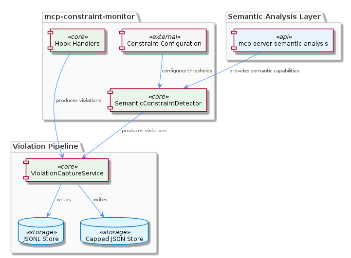
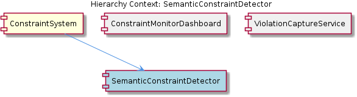

# SemanticConstraintDetector

**Type:** SubComponent

SemanticConstraintDetector is documented across two dedicated files—integrations/mcp-constraint-monitor/docs/semantic-constraint-detection.md and docs/semantic-detection-design.md—indicating the detection strategy is complex enough to warrant both a user-facing guide and an internal design document

# SemanticConstraintDetector — Technical Reference

## What It Is

SemanticConstraintDetector is a SubComponent of ConstraintSystem, housed within the `mcp-constraint-monitor` integration rather than `mcp-server-semantic-analysis`. Its documentation spans two dedicated files: `integrations/mcp-constraint-monitor/docs/semantic-constraint-detection.md` (user-facing guide) and `docs/semantic-detection-design.md` (internal design rationale). The existence of both a public guide and a design document signals that this component carries enough conceptual complexity to require separate treatment for operators configuring it and engineers maintaining it. Additional configuration guidance appears in `integrations/mcp-constraint-monitor/docs/constraint-configuration.md`, confirming that detection behavior is driven by externalized parameters rather than hardcoded logic.

Its placement in `mcp-constraint-monitor` is a deliberate architectural statement: this component *consumes* semantic analysis capabilities provided elsewhere; it does not produce them. Constraint evaluation logic therefore travels with the monitoring integration, keeping domain concerns co-located and avoiding a dependency inversion where the monitoring layer would need to reach into `mcp-server-semantic-analysis` internals.

## Architecture and Design

The central architectural decision documented in `semantic-detection-design.md` is the explicit separation of meaning-based analysis from pure pattern-matching hook handlers. Within ConstraintSystem, this establishes two distinct detection layers: hook handlers that fire on structural or syntactic patterns, and SemanticConstraintDetector operating at a higher abstraction level, reasoning about the *meaning* of content rather than its surface form. This separation prevents semantic evaluation logic from bleeding into lower-level hook plumbing, and makes it possible to evolve each layer independently.

The externalization of configuration — thresholds, constraint definitions, or detection sensitivity — means SemanticConstraintDetector's behavior can be tuned without code changes. This is consistent with `constraint-configuration.md` describing configurable behavior, and it implies a clean boundary between the detection engine (stable code) and its policy parameters (operator-supplied data). The tradeoff is that configuration drift becomes a risk: misconfigured thresholds can silently alter detection behavior in ways that are harder to catch than a code change.

## Implementation Details

No code symbols were resolved for this component, so implementation mechanics must be inferred from documentation and structural observations. SemanticConstraintDetector's role as a *producer* in the violation pipeline means its primary output is a structured violation object compatible with what ViolationCaptureService expects. Given that ViolationCaptureService (in `scripts/violation-capture-service.js`) writes violations to both `.mcp-sync/session-violations.jsonl` and `.mcp-sync/violation-history.json`, SemanticConstraintDetector must serialize violations in whatever schema those stores require — the same contract honored by the hook handlers that are its sibling producers.

The dual-documentation approach (`semantic-constraint-detection.md` for users, `semantic-detection-design.md` for engineers) suggests a non-trivial internal model. Semantic detection typically involves scoring, classification, or rule-matching against interpreted content rather than raw text, and the presence of configurable thresholds reinforces that detection outcomes exist on a spectrum rather than being binary. The design document likely captures the reasoning behind where threshold boundaries sit and how false-positive/false-negative tradeoffs were resolved.

## Integration Points

SemanticConstraintDetector connects to the rest of ConstraintSystem at two boundaries. Upstream, it consumes semantic analysis capabilities from `mcp-server-semantic-analysis` — though it is not *part* of that package, it depends on what that package exposes, making that interface a key stability dependency. Any breaking change in the semantic analysis API would directly affect this component. Downstream, it feeds violations into ViolationCaptureService's dual-store pipeline, identical in contract to the hook handler producers. This means ConstraintMonitorDashboard, which reads `.mcp-sync/violation-history.json`, will surface SemanticConstraintDetector violations alongside hook-handler violations with no distinction in rendering — they are peers in the history store.

The configuration surface described in `constraint-configuration.md` represents a third integration point: the operator or deployment environment that supplies detection parameters. This makes SemanticConstraintDetector sensitive to its runtime configuration in a way that pure hook handlers may not be, and it implies that deployment pipelines or setup documentation should treat constraint configuration as a first-class concern rather than an afterthought.

## Usage Guidelines

Because detection thresholds are externalized, developers modifying or deploying SemanticConstraintDetector should treat `constraint-configuration.md` as authoritative for what parameters exist and what their valid ranges are. Hardcoding thresholds in application code would undermine the configurability that was deliberately designed in, and would create a maintenance burden when policy needs to change.

When violations produced by SemanticConstraintDetector appear in the ViolationCaptureService stores, they share the 1000-entry cap on `.mcp-sync/violation-history.json`. Under high semantic violation rates, this cap will evict older entries through full-array rewrites — a write hotspot that ConstraintSystem's parent documentation explicitly flags. If semantic detection is expected to be high-frequency (e.g., firing on every LLM response), the cap behavior should be accounted for in operational planning, and consumers relying on historical completeness should prefer the unbounded `.mcp-sync/session-violations.jsonl` JSONL log instead of the history JSON.

Since SemanticConstraintDetector is architecturally a *consumer* of semantic analysis rather than a provider, engineers should resist the temptation to push constraint logic into `mcp-server-semantic-analysis` for reuse. The design intent captured in `semantic-detection-design.md` places constraint evaluation firmly in the monitoring integration layer. Crossing that boundary would erode the separation that makes each layer independently evolvable. New constraint types should be defined through the configuration mechanism and evaluated within this component, not by extending the upstream semantic analysis package.

## Hierarchy Context

### Parent
- [ConstraintSystem](./ConstraintSystem.md) -- [LLM] The ConstraintSystem employs a dual-store persistence strategy in ViolationCaptureService (scripts/violation-capture-service.js) that separates concerns between live streaming and historical querying. Violations are written to two distinct files: a JSONL append-log at .mcp-sync/session-violations.jsonl where each line is a JSON-serialized violation event suitable for tail-following and real-time consumption, and a capped JSON array at .mcp-sync/violation-history.json that never exceeds 1000 entries and is intended for dashboard reads. This design means producers (the hook handlers) never block on dashboard consumers, and the dashboard never needs to parse an unbounded stream. The tradeoff is that the history file requires a full rewrite on each append once the cap is active, since the oldest entry must be evicted and the array re-serialized, which can become a write hotspot under high violation rates.

### Siblings
- [ConstraintMonitorDashboard](./ConstraintMonitorDashboard.md) -- ConstraintMonitorDashboard consumes .mcp-sync/violation-history.json (a capped 1000-entry JSON array) rather than the raw JSONL append-log, isolating the UI from unbounded stream parsing as described in the ViolationCaptureService dual-store design
- [ViolationCaptureService](./ViolationCaptureService.md) -- scripts/violation-capture-service.js implements a dual-store write strategy: each violation is appended as a single JSON line to .mcp-sync/session-violations.jsonl and also inserted into .mcp-sync/violation-history.json

---

*Generated from 5 observations*
