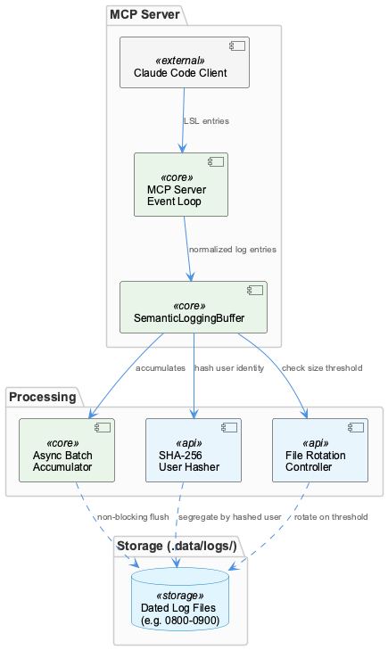
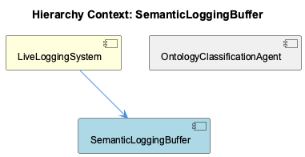

# SemanticLoggingBuffer

**Type:** SubComponent

SemanticLoggingBuffer resides in integrations/mcp-server-semantic-analysis/src/logging.ts and serves as the primary write path for normalized LSL log entries produced during Claude Code sessions.

# SemanticLoggingBuffer — Technical Reference

## What It Is

`SemanticLoggingBuffer` is implemented in `integrations/mcp-server-semantic-analysis/src/logging.ts` and serves as the primary write path for normalized LSL log entries produced during Claude Code sessions. Within the LiveLoggingSystem, it occupies the final stage of the capture pipeline: after raw agent transcripts have been normalized into LSL format, the buffer is responsible for accumulating those entries in memory and persisting them to disk in a controlled, non-blocking manner.

Its core responsibility is deceptively narrow — accept a log entry, hold it briefly, write it out — but the design choices surrounding that responsibility reflect a careful awareness of the operational context: an MCP server that must remain responsive to Claude Code clients regardless of what the logging subsystem is doing.

## Architecture and Design

The dominant architectural decision in `SemanticLoggingBuffer` is the **async batching pattern**: entries are accumulated in memory rather than written immediately, and flush operations are performed non-blocking so that slow disk I/O or transient write failures cannot propagate latency back into the MCP server's request handling loop. This is a deliberate trade-off — durability is sacrificed at the margin (a process crash before a flush loses buffered entries) in exchange for guaranteed low-latency behavior for Claude Code clients. For a logging subsystem feeding a semantic analysis pipeline rather than a transactional system, this trade-off is well-justified.

The buffer's relationship to the broader LiveLoggingSystem is one of strict separation of concerns. LiveLoggingSystem owns session windowing, user identity management, and format normalization; `SemanticLoggingBuffer` owns only the mechanics of getting already-normalized entries onto disk. This means the buffer is not responsible for interpreting what it writes — that enrichment role belongs downstream to `OntologyClassificationAgent`, which consumes persisted LSL entries after the buffer has already done its work. The buffer thus sits at a clean boundary: upstream is normalization logic, downstream is file storage, and post-storage enrichment is entirely decoupled.

File routing follows a convention established by the parent LiveLoggingSystem: logs land in `.data/logs/` under dated filenames aligned with LSL session windowing identifiers (e.g., `0800-0900` time windows). This is not an ad hoc choice — by using the same windowing convention as the rest of the LSL system, the buffer ensures that downstream consumers, including `OntologyClassificationAgent`, can locate entries using the same temporal keys they already understand. Time-based partitioning is essentially free once the filename convention is consistent.

## Implementation Details

**Async batching** is the mechanical heart of the buffer. Entries are held in an in-memory accumulation structure and flushed in batches via non-blocking write operations. The flush is designed so that logging failures are isolated — a failed write does not throw into the MCP server's main event loop, preserving server stability even under adverse I/O conditions.

**File rotation** is enforced by a configurable size threshold. When the current log file for a given time window exceeds this limit, the buffer creates a new file rather than appending indefinitely. This prevents unbounded file growth, which matters both for disk management and for downstream consumers like `OntologyClassificationAgent` that must load and parse these files. Keeping individual files bounded in size makes incremental consumption more predictable.

**Multi-user isolation** is achieved through SHA-256 hashing of user identity. The hashed identity is embedded in log entries or influences file routing, ensuring that sessions from different users are segregated without storing any PII in the log files themselves. This design follows the same user-hashing convention established at the LiveLoggingSystem level, maintaining consistency across the entire LSL infrastructure.

## Integration Points

`SemanticLoggingBuffer` integrates with its parent, LiveLoggingSystem, as the terminal write stage in the capture pipeline. LiveLoggingSystem is responsible for session windowing logic, user hash generation, and producing normalized LSL entries; the buffer consumes those outputs and handles persistence. The interface between them is essentially a push model: the parent pushes normalized entries into the buffer, and the buffer manages the rest.

The buffer's output — files in `.data/logs/` — is the primary input for `OntologyClassificationAgent`, which lives in `integrations/mcp-server-semantic-analysis/src/agents/ontology-classification-agent.ts`. Crucially, `OntologyClassificationAgent` operates as a post-capture enrichment step: it reads already-persisted LSL files rather than intercepting entries in flight. This means the buffer's file format, naming conventions, and rotation behavior are effectively part of its contract with the classification agent. Any change to how the buffer names or structures files is a breaking change for downstream consumers.

## Usage Guidelines

**Do not assume durability for buffered-but-unflushed entries.** The async batching design means entries in memory are not yet persisted. If the MCP server process is terminated before a flush completes, those entries are lost. This is an accepted trade-off, but callers should not treat a successful `write` call to the buffer as a persistence guarantee.

**Respect the windowing and naming conventions.** The dated, windowed filename format (aligned with LSL session identifiers like `0800-0900`) is not cosmetic — it is a shared contract between this buffer and every downstream consumer. Developers modifying file routing logic should verify that `OntologyClassificationAgent` and any other file consumers are updated in lockstep.

**File rotation thresholds should be tuned to downstream consumption patterns.** Since `OntologyClassificationAgent` reads entire files for enrichment, setting rotation thresholds too high creates large files that are expensive to process incrementally. Thresholds should be chosen with both disk management and consumer performance in mind.

**User hashing is not optional.** The SHA-256 user identity scheme is the mechanism by which multi-user sessions are isolated without PII exposure. Any path that writes log entries must carry the hashed user identity through to the buffer; bypassing this would either mix user sessions in shared files or require storing raw user identifiers, both of which violate the design's privacy and correctness guarantees.

**Logging failures are silent by design.** Because the flush mechanism is non-blocking and failure-tolerant, there is no automatic alerting when writes fail. Operators running the MCP server should establish external monitoring on `.data/logs/` to detect stalled rotation or missing time-window files that might indicate persistent I/O failures.

## Hierarchy Context

### Parent
- [LiveLoggingSystem](./LiveLoggingSystem.md) -- The LiveLoggingSystem (LSL) is a session logging infrastructure that captures, classifies, and persists AI agent conversations—primarily from Claude Code—into a unified format. It handles session windowing (time-window identifiers like '0800-0900'), multi-user support via SHA-256 user hashing, file routing with rotation thresholds, and transcript capture from agent-native formats. The system bridges raw agent transcripts to a normalized LSL format used downstream by semantic analysis and knowledge management pipelines.

### Siblings
- [OntologyClassificationAgent](./OntologyClassificationAgent.md) -- OntologyClassificationAgent lives in integrations/mcp-server-semantic-analysis/src/agents/ontology-classification-agent.ts and operates as a post-capture enrichment step, consuming already-persisted LSL entries rather than intercepting them during capture.

---

*Generated from 6 observations*
