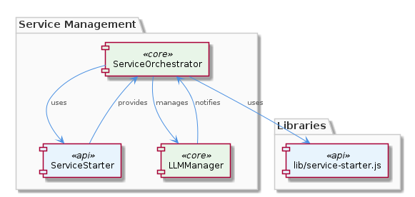
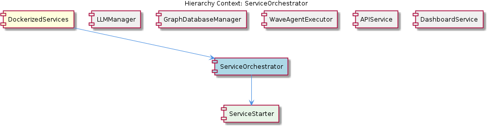

# ServiceOrchestrator

**Type:** SubComponent

ServiceOrchestrator uses the ServiceStarter class in lib/service-starter.js to provide robust service startup with retry, timeout, and graceful degradation.

## What It Is  

The **ServiceOrchestrator** lives inside the **DockerizedServices** component and is implemented in the code‑base alongside the `lib/service-starter.js` module. Its primary responsibility is to coordinate the lifecycle of downstream services – starting them, monitoring their health, handling failures, and shutting them down cleanly. The orchestrator delegates the low‑level startup mechanics to the **ServiceStarter** class, which lives in `lib/service-starter.js`. By doing so, ServiceOrchestrator provides a higher‑level, reusable façade that other sub‑components (e.g., **LLMManager**, **APIService**, **DashboardService**) can call when they need a dependable service to be up and running. The component therefore acts as a guardrail that ensures a responsive user experience even when individual services experience transient issues.

## Architecture and Design  

ServiceOrchestrator follows a **modular orchestration** pattern: it isolates the concerns of *when* a service should run from *how* a service is started. This separation is evident in the parent‑child relationship – **DockerizedServices** contains ServiceOrchestrator, and ServiceOrchestrator, in turn, contains **ServiceStarter**. The orchestrator does not embed the retry, timeout, or graceful‑degradation logic itself; instead, it composes those capabilities by invoking ServiceStarter’s API. This composition approach keeps the orchestration layer thin and focused on decision‑making while the starter layer handles the gritty operational details.

The parent component **DockerizedServices** employs dependency injection (as described in the LLMService implementation) to wire together its sub‑components. Although the observations do not explicitly call out DI for ServiceOrchestrator, its placement under DockerizedServices strongly suggests that it is instantiated and supplied with its dependencies (e.g., a reference to ServiceStarter) via the same injection mechanism. This promotes loose coupling between ServiceOrchestrator and sibling managers such as **LLMManager**, **GraphDatabaseManager**, **WaveAgentExecutor**, **APIService**, and **DashboardService**, allowing each to request service startup without needing to know the exact startup sequence or error‑handling strategy.

## Implementation Details  

At the core of ServiceOrchestrator’s behavior is the **ServiceStarter** class located in `lib/service-starter.js`. ServiceStarter encapsulates three critical mechanisms:

1. **Retry Logic** – When a service fails to start, ServiceStarter automatically re‑attempts the startup a configurable number of times, backing off between attempts. This aligns with Observation 3, which notes that ServiceOrchestrator “may implement retry logic to handle service startup failures.”

2. **Timeout Protection** – Each startup attempt is bounded by a timeout. If the service does not become ready within the allotted window, the attempt is aborted and a retry is scheduled. This satisfies Observation 4 about “managing timeout protection to prevent service startup from taking too long.”

3. **Graceful Degradation** – Should all retries be exhausted, ServiceStarter can fall back to a degraded mode (e.g., a mock implementation or a read‑only variant) so that the overall system remains responsive. Observation 1 explicitly mentions “graceful degradation” as part of the robust startup process.

ServiceOrchestrator itself likely exposes a small public API such as `startService(name, options)` and `stopService(name)`. The `startService` call forwards the request to ServiceStarter, optionally passing along context from sibling components (e.g., LLMManager may request the LLM service to be started with specific model parameters). The `stopService` method would invoke ServiceStarter’s shutdown routine, ensuring any allocated resources are released and cleanup tasks are performed, as hinted by Observation 7.

Because ServiceOrchestrator sits within DockerizedServices, its lifecycle is tied to the container orchestration layer. When DockerizedServices boots, it can invoke ServiceOrchestrator to bring up all required services in a deterministic order, respecting dependencies among them.

## Integration Points  

ServiceOrchestrator is a hub for several integration pathways:

* **LLMManager** – The LLMManager likely calls ServiceOrchestrator to guarantee that the LLM service (implemented in `lib/llm/llm-service.ts`) is alive before issuing inference requests. This creates a runtime contract: LLMManager assumes the orchestrator will handle retries and timeouts on its behalf.

* **GraphDatabaseManager**, **WaveAgentExecutor**, **APIService**, **DashboardService** – Each of these sibling sub‑components may depend on external services (e.g., a graph database, an agent executor, API back‑ends, or a dashboard UI). They can request ServiceOrchestrator to start those services, relying on the same robustness guarantees.

* **DockerizedServices** – As the parent, DockerizedServices injects ServiceOrchestrator (and consequently ServiceStarter) into the application’s dependency graph. This injection enables any component that requires service lifecycle control to receive a ready‑to‑use orchestrator instance without manual construction.

* **ServiceStarter** – The child relationship is direct; ServiceOrchestrator forwards lifecycle commands to ServiceStarter, which performs the actual process management (spawning containers, monitoring health checks, etc.). Because ServiceStarter encapsulates retry and timeout policies, ServiceOrchestrator does not duplicate that logic.

No explicit API signatures are provided in the observations, but the described responsibilities imply that ServiceOrchestrator exposes at least start/stop methods and possibly status callbacks that siblings can subscribe to.

## Usage Guidelines  

1. **Prefer the Orchestrator Over Direct Starts** – Developers should never invoke ServiceStarter directly. Instead, always request service lifecycle actions through ServiceOrchestrator so that retry, timeout, and degradation policies are consistently applied.

2. **Leverage Dependency Injection** – When adding a new sub‑component that needs a service, inject ServiceOrchestrator (via DockerizedServices’ DI container) rather than creating a new instance. This maintains the single source of truth for service state.

3. **Handle Asynchronous Results** – Startup and shutdown are asynchronous because of retries and timeouts. Callers should await the promise returned by `startService`/`stopService` and handle possible rejection (e.g., when all retries fail and degradation is not possible).

4. **Provide Meaningful Options** – When invoking `startService`, supply options that reflect the service’s criticality (e.g., number of retries, timeout length). The orchestrator will forward these to ServiceStarter, allowing fine‑grained control per service.

5. **Monitor Health Events** – If ServiceOrchestrator emits health or status events (a reasonable design given its orchestration role), subscribe to them to trigger fallback logic in higher‑level components like LLMManager.

## Architectural Patterns Identified  

* **Modular Orchestration** – Separation of orchestration logic (ServiceOrchestrator) from concrete startup mechanics (ServiceStarter).  
* **Composition over Inheritance** – ServiceOrchestrator composes ServiceStarter rather than extending it.  
* **Dependency Injection** – Inherited from the parent DockerizedServices component, enabling loose coupling.  

## Design Decisions and Trade‑offs  

* **Centralized Retry/Timeout Logic** – By consolidating these concerns in ServiceStarter, the system avoids duplicated error‑handling code, improving maintainability. The trade‑off is that all services share the same retry policy unless explicitly overridden, which may not be optimal for services with vastly different startup characteristics.  
* **Graceful Degradation Path** – Providing a fallback mode ensures continuity of user experience but adds complexity to service contracts; downstream components must be able to operate in degraded mode.  
* **Thin Orchestrator Layer** – Keeping ServiceOrchestrator lightweight makes it easy to test and reason about, yet it relies heavily on the correctness of ServiceStarter. Any bugs in ServiceStarter propagate upward.  

## System Structure Insights  

The hierarchy places ServiceOrchestrator as an intermediary between DockerizedServices (parent) and concrete service management (child ServiceStarter). Sibling components (LLMManager, APIService, etc.) all share the same orchestrator, promoting a unified lifecycle model across the system. This structure encourages a single point of control for service health, simplifying both monitoring and debugging.

## Scalability Considerations  

Because ServiceStarter handles retries and timeouts per service, scaling the number of managed services does not inherently increase orchestration complexity; each service is treated as an independent unit. However, the orchestrator must be capable of tracking the state of many concurrent services, so internal data structures (e.g., maps of service identifiers to promises) should be designed for O(1) lookup. If the number of services grows dramatically, consider sharding the orchestrator or introducing a lightweight registry to avoid a single bottleneck.

## Maintainability Assessment  

The clear separation between ServiceOrchestrator and ServiceStarter improves maintainability: changes to retry policies, timeout thresholds, or degradation strategies can be made in `lib/service-starter.js` without touching orchestration logic. The use of dependency injection further isolates components, making unit testing straightforward—mocks of ServiceStarter can be injected into ServiceOrchestrator tests. The primary maintenance risk lies in the implicit contracts (e.g., what constitutes “graceful degradation”) which must be documented and kept in sync across all consumers (LLMManager, APIService, etc.). Regular integration tests that spin up the full DockerizedServices stack will help catch regressions in orchestrated startup sequences.

## Hierarchy Context

### Parent
- [DockerizedServices](./DockerizedServices.md) -- [LLM] The DockerizedServices component utilizes dependency injection to manage complex workflows and handle multiple requests efficiently. This is evident in the lib/llm/llm-service.ts file, where the LLMService class is used for high-level LLM operations, including mode routing, caching, and provider fallback. The use of dependency injection allows for loose coupling between components, making it easier to test and maintain the codebase. Furthermore, the ServiceStarter class in lib/service-starter.js provides robust service startup with retry, timeout, and graceful degradation, ensuring that the component can recover from failures and provide a responsive user experience.

### Children
- [ServiceStarter](./ServiceStarter.md) -- The ServiceOrchestrator sub-component utilizes the ServiceStarter class to handle service startup, implying a modular design for service management.

### Siblings
- [LLMManager](./LLMManager.md) -- LLMManager utilizes the LLMService class in lib/llm/llm-service.ts for high-level LLM operations.
- [GraphDatabaseManager](./GraphDatabaseManager.md) -- GraphDatabaseManager likely uses Graphology and LevelDB to provide persistence and data storage capabilities.
- [WaveAgentExecutor](./WaveAgentExecutor.md) -- WaveAgentExecutor likely uses a specific constructor and execution pattern to execute wave-based agents.
- [APIService](./APIService.md) -- APIService likely interacts with the constraint monitoring API server to provide easy startup and management.
- [DashboardService](./DashboardService.md) -- DashboardService likely interacts with the constraint monitoring dashboard to provide easy startup and management.

---

*Generated from 7 observations*
