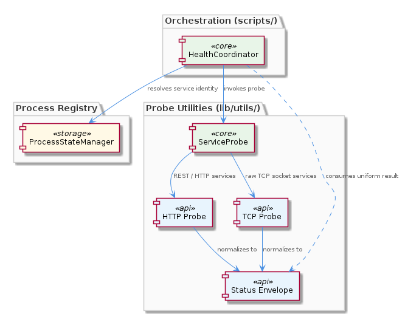
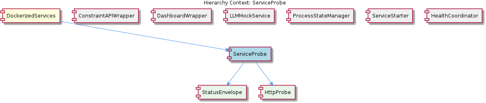

# ServiceProbe

**Type:** SubComponent

The normalization contract between ServiceProbe and health-coordinator.js means adding a new probe type (e.g., gRPC) requires only implementing the same envelope shape, not changing the coordinator logic

# ServiceProbe — Technical Insight Document

## What It Is

ServiceProbe is a utility subcomponent implemented at `lib/utils/service-probe.js`. It provides a unified probing capability that allows the broader system to determine the operational status of services using multiple network protocols. The module is consumed by `scripts/health-coordinator.js`, which establishes a clean utility-to-orchestrator dependency direction: the probe knows nothing about coordination, and the coordinator depends on the probe's stable interface rather than the reverse.

Structurally, ServiceProbe sits inside the DockerizedServices parent component and itself contains two child entities — StatusEnvelope (the contract type) and HttpProbe (one of the protocol-specific probe implementations). Although the observations describe HTTP and TCP probe strategies, both live alongside one another in `service-probe.js`, making the file act as a multi-protocol probe registry rather than a single-purpose utility.

## Architecture and Design

The defining architectural pattern in ServiceProbe is the **Strategy pattern unified by a normalized return contract**. The module exposes both HTTP and TCP probe strategies so that `scripts/health-coordinator.js` can check services regardless of whether they speak a REST API or a raw socket protocol. Critically, all probe functions return a normalized **StatusEnvelope**, which means the coordinator can process probe results through a uniform interface without branching on probe type. This is the key design decision that gives ServiceProbe its extensibility: the protocol details are encapsulated inside each probe, but the output shape is invariant.

This contract-driven design directly mirrors the decoupling philosophy of the parent DockerizedServices component. Just as the ProcessStateManager (PSM) singleton decouples service identity from OS-level process identity across `scripts/api-service.js` and `scripts/dashboard-service.js`, ServiceProbe decouples *probe implementation* from *health interpretation*. Because `health-coordinator.js` <USER_ID_REDACTED> PSM state via the ProcessStateManager registry rather than holding PIDs directly, ServiceProbe results are correlated to service identities, not OS process IDs — restarts that swap PIDs do not invalidate probe-to-service mappings.

The trade-off implicit in this design is that every new probe strategy must conform to the StatusEnvelope shape. The benefit, however, is substantial: adding a new probe type (e.g., gRPC) requires only implementing the same envelope, not changing the coordinator. This keeps the coordinator's branching surface area minimal and pushes protocol-specific complexity into well-scoped probe functions.

## Implementation Details

ServiceProbe is implemented as a single module at `lib/utils/service-probe.js` that exports multiple probe strategies. Based on the observations, the file currently holds at least an HTTP probe (the HttpProbe child entity) and TCP probe logic. Both probes share the same return contract — the StatusEnvelope — which acts as the formal boundary between probe execution and probe interpretation.

The **HttpProbe** is one of the protocol-specific implementations colocated in `service-probe.js`. Its presence alongside TCP probe logic establishes the file as a multi-protocol probe registry. This colocation is a deliberate design choice: rather than splitting each protocol into its own file, keeping them in a single module makes the registry of available strategies discoverable in one place and makes it trivial to introduce a new strategy by adding another exported function.

The **StatusEnvelope** is the contract boundary between `lib/utils/service-probe.js` (producer) and `scripts/health-coordinator.js` (consumer). It decouples probe implementation details from orchestration logic — the coordinator never inspects HTTP status codes or TCP connect errors directly; it inspects only the normalized envelope. This is what enables the coordinator to remain protocol-agnostic.

## Integration Points

The primary integration point is `scripts/health-coordinator.js`, which imports ServiceProbe's probe functions and consumes their StatusEnvelope outputs. The dependency direction is strict and one-way: ServiceProbe is a leaf utility under `lib/utils/`, and the coordinator under `scripts/` depends on it. ServiceProbe has no knowledge of the coordinator, the PSM registry, or the lifecycle of the services it probes.

A second, indirect integration exists with the **ProcessStateManager**. While ServiceProbe does not call PSM directly, the coordinator that consumes ServiceProbe results uses PSM to map probe outcomes back to service identities. This means ServiceProbe is functionally adjacent to PSM in the runtime data flow even though there is no source-level coupling — probes report status, the coordinator joins that status against the PSM registry. This separation contrasts with sibling components like **ConstraintAPIWrapper** (`scripts/api-service.js`) and **DashboardWrapper** (`scripts/dashboard-service.js`), which interact with PSM directly via `registerService()` and `unregisterService()` calls. ServiceProbe sits at a different layer entirely: it is purely observational and stateless.

Other sibling components — **ServiceStarter** (`lib/service-starter.js`), **LLMMockService**, and **HealthCoordinator** itself — operate in adjacent but distinct concerns. ServiceStarter owns retry policy; the wrappers own signal lifecycle; ServiceProbe owns reachability checks; HealthCoordinator orchestrates them. This clean separation of responsibilities means ServiceProbe can evolve without touching restart logic, signal handling, or registry semantics.

## Usage Guidelines

When extending ServiceProbe, the cardinal rule is to **preserve the StatusEnvelope contract**. Any new probe — whether gRPC, WebSocket, or otherwise — must return the same envelope shape that HTTP and TCP probes return. This is what allows `scripts/health-coordinator.js` to remain unchanged when probe types are added. Modifying the envelope shape is a breaking change that propagates to every consumer; adding a new probe function that conforms to it is purely additive and safe.

Developers should resist the temptation to leak protocol-specific details (HTTP status codes, TCP error strings, gRPC status enums) through the envelope. The whole point of normalization is that the coordinator should never branch on probe type. If you find yourself wanting to expose protocol-specific fields, the right pattern is to translate them into the envelope's normalized status semantics inside the probe function itself.

Because ServiceProbe is stateless and lives under `lib/utils/`, it should remain free of side effects beyond the network I/O required to perform the probe. It must not import from `scripts/`, must not touch the PSM registry, and must not log to shared resources in a way that would couple it to runtime infrastructure. Keep new probes colocated in `service-probe.js` to maintain the file's role as a discoverable multi-protocol probe registry — splitting probes across files would erode this clarity.

Finally, when adding a new containerized service to the DockerizedServices parent — which, per the parent's conventions, requires creating a new wrapper script that replicates the `api-service.js`/`dashboard-service.js` boilerplate — consider whether the new service's protocol is already covered by an existing probe. If it is, no ServiceProbe changes are needed; if it is not, add a new probe function that returns a StatusEnvelope and the coordinator will pick it up without modification.

---

### Summary of Key Insights

1. **Architectural patterns identified**: Strategy pattern (multiple probe implementations), normalized return contract (StatusEnvelope), utility-to-orchestrator dependency direction, multi-protocol registry colocation.
2. **Design decisions and trade-offs**: Uniform envelope shape trades per-probe expressiveness for coordinator simplicity; colocation of protocols in one file trades file modularity for registry discoverability; statelessness trades caching opportunities for predictability.
3. **System structure insights**: ServiceProbe is a leaf utility under `lib/utils/`, consumed only by `scripts/health-coordinator.js`, and indirectly correlated with ProcessStateManager via the coordinator's identity-resolution step.
4. **Scalability considerations**: New probe types scale additively — adding gRPC or other protocols requires only a new function honoring the StatusEnvelope, with zero coordinator changes. The single-file registry may eventually warrant splitting if probe count grows substantially, but this is not yet a concern.
5. **Maintainability assessment**: High. The strict contract boundary, one-way dependency, and statelessness make ServiceProbe easy to test in isolation and easy to extend. The primary maintenance risk is contract erosion — if probe-specific fields begin leaking into StatusEnvelope, the coordinator will accumulate branching logic and the design's value will degrade.

## Hierarchy Context

### Parent
- [DockerizedServices](./DockerizedServices.md) -- [LLM] The ProcessStateManager (PSM) singleton implements a deliberate decoupling between service identity and process identity across both `scripts/api-service.js` and `scripts/dashboard-service.js`. Each script follows an identical structural pattern: spawn a child process via Node's `child_process` module, register the resulting process handle with the PSM via `psm.registerService()`, wire up `SIGTERM`/`SIGINT` forwarding so that signals delivered to the wrapper propagate to the child, and call `psm.unregisterService()` in the exit handler. This indirection means that the rest of the system (including `scripts/health-coordinator.js`) can query the PSM registry without holding direct references to OS-level process IDs. The practical consequence for developers is that a service restart — where a new child process replaces the old one — does not require the health coordinator or any consumer of PSM state to be aware of the PID change; only the wrapper scripts update the registry. This pattern also cleanly isolates the restart/retry logic in `lib/service-starter.js` from signal-handling responsibilities, since the wrapper owns the process lifecycle signals while the starter owns the retry policy. A new developer should note that adding a new containerized service almost certainly means creating a new wrapper script that replicates this boilerplate rather than centralizing it, which is a potential maintenance concern as the number of services grows.

### Children
- [StatusEnvelope](./StatusEnvelope.md) -- StatusEnvelope acts as the contract boundary between lib/utils/service-probe.js (producer) and scripts/health-coordinator.js (consumer), decoupling probe implementation details from orchestration logic.
- [HttpProbe](./HttpProbe.md) -- HttpProbe resides in lib/utils/service-probe.js alongside any TCP probe logic, establishing service-probe.js as a multi-protocol probe registry rather than a single-purpose module.

### Siblings
- [ConstraintAPIWrapper](./ConstraintAPIWrapper.md) -- scripts/api-service.js uses Node's child_process module to spawn the constraint monitor Express API, decoupling the OS-level PID from the service identity tracked by PSM
- [DashboardWrapper](./DashboardWrapper.md) -- scripts/dashboard-service.js mirrors the structural pattern of api-service.js exactly: spawn via child_process, registerService, wire signals, unregisterService on exit
- [LLMMockService](./LLMMockService.md) -- llm-mock-service.ts persists LLM mode state to workflow-progress.json rather than keeping it in memory, making mode selection survive process restarts within the Docker environment
- [ProcessStateManager](./ProcessStateManager.md) -- PSM is a singleton, meaning all wrapper scripts (api-service.js, dashboard-service.js) and health-coordinator.js share a single registry instance without passing references explicitly
- [ServiceStarter](./ServiceStarter.md) -- lib/service-starter.js is explicitly isolated from SIGTERM/SIGINT handling — signal propagation is owned by the wrapper scripts (api-service.js, dashboard-service.js), not by the starter
- [HealthCoordinator](./HealthCoordinator.md) -- health-coordinator.js consumes PSM state by name rather than PID, so service restarts are transparent — it never needs to be notified of PID changes in api-service.js or dashboard-service.js

---

*Generated from 5 observations*
