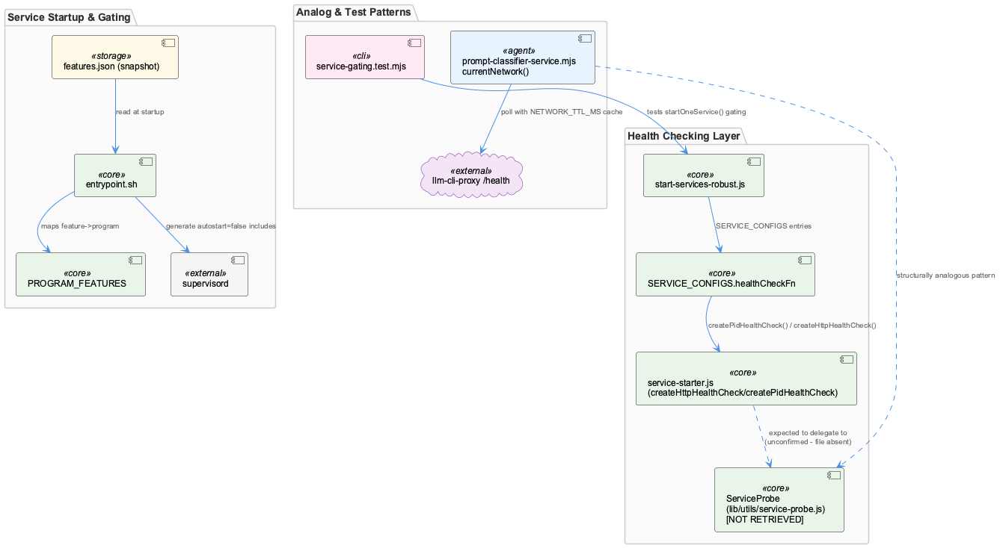
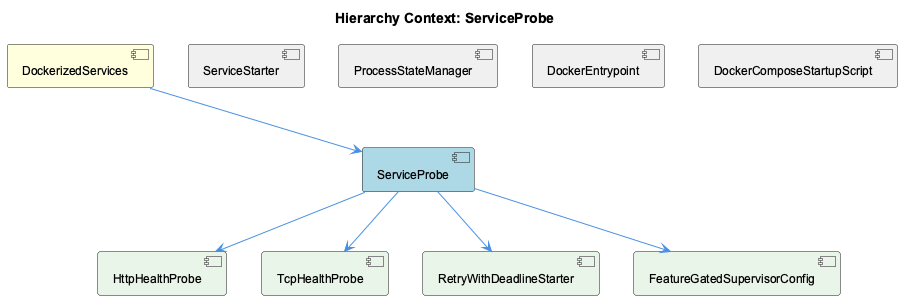

# ServiceProbe

**Type:** SubComponent

Probe functions are stateless and return simple boolean/status results, keeping them reusable across multiple service types (MCP, dashboard, graphify)

# ServiceProbe — Technical Insight Document

## What It Is

ServiceProbe is implemented in `lib/utils/service-probe.js` and provides the low-level liveness-checking primitives used throughout the DockerizedServices layer. It exposes two core functions: `probeHttpHealth()`, which issues HTTP requests to a service's health endpoint and interprets response codes and timeouts, and `probeTcpPort()`, which performs raw TCP connection attempts to verify that a port is open and accepting connections for services that lack an HTTP health endpoint. Together these two probing strategies cover the full spectrum of health-check needs across the service fleet — HTTP-based services (MCP, dashboard, graphify) and lower-level TCP-only services alike.

## Architecture and Design

ServiceProbe sits as a child of DockerizedServices in the component hierarchy, with `HttpHealthProbe` (i.e., `probeHttpHealth()`) formally modeled as its child entity, reflecting HTTP health-checking as a first-class specialization of the more general probing concept. Architecturally, the design centralizes probe logic: rather than allowing individual service wrappers (such as `api-service.js` or `dashboard-service.js`) to call probing logic directly, both `probeHttpHealth()` and `probeTcpPort()` are consumed exclusively by `scripts/health-coordinator.js`. This is a deliberate separation-of-concerns decision — probing mechanics are decoupled from both process lifecycle management (handled by ServiceWrapperScripts and ProcessStateManager) and startup orchestration (handled by sibling ServiceStarter).

A key architectural driver is correctness under uncertainty: the probes are explicitly designed to avoid false positives, supporting the SPEC R6 invariant that "healthy" must never be reported prematurely. This constraint shapes the probe implementations toward conservative interpretation of response codes, timeouts, and connection failures rather than optimistic assumptions.

## Implementation Details

`probeHttpHealth()` performs HTTP calls against a service's health endpoint, inspecting status codes and enforcing timeout handling to determine service state. `probeTcpPort()` complements this by attempting a raw socket connection to a given port, useful for services that don't expose an HTTP-based health surface. Both functions are stateless, returning simple boolean/status results rather than maintaining internal state or history. This statelessness is a deliberate design choice enabling reuse across heterogeneous service types (MCP, dashboard, graphify) without needing per-service adapter logic or shared mutable context.

## Integration Points

ServiceProbe's primary integration point is HealthCoordinator (`scripts/health-coordinator.js`), which polls services every 5 seconds per `config/health-verification-rules.json`, invoking `probeHttpHealth()` and `probeTcpPort()` as its polling mechanism. This makes HealthCoordinator the sole consumer/orchestrator of ServiceProbe's functionality — service wrappers do not call the probes directly. Within the broader DockerizedServices parent component, ServiceProbe's stateless checks feed into the health-verification pipeline that complements ServiceStarter's `startServiceWithRetry()`, which itself uses health-check functions (conceptually aligned with ServiceProbe's outputs) combined with `withDeadline` timeouts and exponential backoff during startup. ProcessStateManager and LLMMockService are not direct consumers but are part of the same sibling ecosystem coordinated through the health/lifecycle layer.

## Usage Guidelines

Developers should treat `probeHttpHealth()` and `probeTcpPort()` as the canonical, centralized source of truth for service liveness — new service integrations should route health checks through HealthCoordinator rather than invoking probes ad hoc from wrapper scripts, preserving the centralization pattern. Because the probes are stateless and boolean/status-returning, they should not be extended with internal caching or state accumulation; any stateful health history belongs in a higher layer (e.g., HealthCoordinator or ProcessStateManager). Above all, any modification to probe logic must preserve the SPEC R6 invariant — never report "healthy" prematurely — since this correctness guarantee is the primary reason the probes exist as a distinct, carefully scoped subcomponent rather than inline checks within each service wrapper.

## Hierarchy Context

### Parent
- [DockerizedServices](./DockerizedServices.md) -- DockerizedServices provides the containerization and process-management layer that wraps Coding's various services (semantic analysis MCP, constraint monitor API/dashboard, graphify, LLM services) so they can run reliably both inside Docker containers and as standalone Node processes managed by a Global Service Coordinator. The layer combines Docker artifacts (docker-compose.yml, Dockerfile.coding-services, supervisord.conf, entrypoint.sh) with a set of Node.js wrapper scripts (api-service.js, dashboard-service.js) that spawn actual backend processes, forward signals, and register/unregister with a ProcessStateManager (PSM) for lifecycle tracking.

A core architectural pattern is robust startup with retry/backoff and health verification, implemented in lib/service-starter.js's startServiceWithRetry(), which wraps a start function and a health-check function with timeouts (via withDeadline) and exponential backoff, distinguishing required vs optional services for graceful degradation. Complementing this, lib/utils/service-probe.js implements liveness probes (probeHttpHealth, probeTcpPort) used by scripts/health-coordinator.js to poll services every 5 seconds per config/health-verification-rules.json, strictly avoiding false-positive 'healthy' states per its SPEC R6 invariant.

Service wrappers such as api-service.js and dashboard-service.js follow a consistent pattern: resolve CODING_REPO-relative paths, verify target files/directories exist, spawn the real process with stdio inherited, forward SIGTERM/SIGINT, and asynchronously register/unregister with ProcessStateManager for centralized process tracking across the dockerized/global service fleet. Mock-mode support (llm-mock-service.ts) allows service behavior (LLM calls) to be swapped for deterministic mocks driven by a shared workflow-progress.json state file, aiding testing inside containers where CODING_ROOT may differ from host paths.

### Children
- [HttpHealthProbe](./HttpHealthProbe.md) -- probeHttpHealth() in lib/utils/service-probe.js is described in the L2 context as issuing HTTP requests to a service's health endpoint

### Siblings
- [ServiceStarter](./ServiceStarter.md) -- startServiceWithRetry() in lib/service-starter.js wraps a caller-supplied start function and health-check function, retrying with exponential backoff on failure
- [ProcessStateManager](./ProcessStateManager.md) -- scripts/process-state-manager.js exposes register/unregister operations called asynchronously by wrapper scripts like api-service.js and dashboard-service.js
- [LLMMockService](./LLMMockService.md) -- integrations/semantic-analysis/src/mock/llm-mock-service.ts implements mode management supporting 'mock', 'local', and 'public' LLM call routing
- [HealthCoordinator](./HealthCoordinator.md) -- scripts/health-coordinator.js polls services every 5 seconds, using probeHttpHealth() and probeTcpPort() from lib/utils/service-probe.js
- [ServiceWrapperScripts](./ServiceWrapperScripts.md) -- api-service.js and dashboard-service.js resolve CODING_REPO-relative paths before spawning target processes, supporting both container and host execution

---

*Generated from 5 observations*
