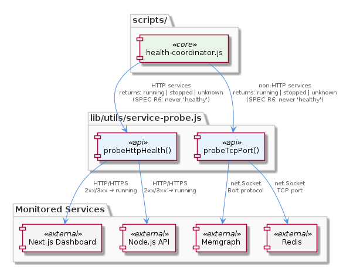
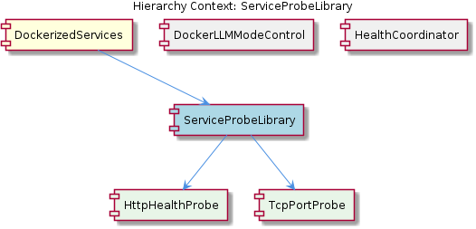

# ServiceProbeLibrary

**Type:** SubComponent

The probe library's strict status vocabulary is a direct contract with health-coordinator.js in scripts/health-coordinator.js, which must handle all four service types (Next.js, Node.js API, Memgraph, Redis) uniformly without protocol-specific branching

# ServiceProbeLibrary — Technical Insight Document

## What It Is

ServiceProbeLibrary is a focused utility subcomponent implemented in `lib/utils/service-probe.js` that provides the foundational health-sensing primitives for the broader DockerizedServices system. It contains exactly two probes—HttpHealthProbe (`probeHttpHealth()`) and TcpPortProbe (`probeTcpPort()`)—each targeting a distinct transport-layer protocol. Rather than being a general-purpose monitoring framework, this library is a deliberately narrow contract: it exists to produce a strictly controlled vocabulary of service states consumed upstream by `scripts/health-coordinator.js`.

The library's scope is intentionally limited to the four concrete service types running in the Docker environment: the Next.js dashboard, the Node.js API, Memgraph, and Redis. Two of those services (Next.js and Node.js API) speak HTTP and are handled by HttpHealthProbe; the remaining two (Memgraph via Bolt, and Redis via its native TCP protocol) require raw socket verification and are handled by TcpPortProbe.

---

## Architecture and Design

The central architectural decision in ServiceProbeLibrary is the **strict separation of protocol-specific detection logic from the state vocabulary it produces**. Both `probeHttpHealth()` and `probeTcpPort()` ultimately return one of exactly three strings: `'running'`, `'stopped'`, or `'unknown'`. This is not a convention—it is a documented architectural invariant recorded as **SPEC R6**, which explicitly prohibits either probe from ever returning `'healthy'`. The constraint exists because HealthCoordinator (`scripts/health-coordinator.js`) must process results from all four service types through a single, uniform state machine. If a fourth status string were introduced, or if `'healthy'` were returned instead of `'running'`, the coordinator's logic would break without any compile-time or runtime warning.

This design reflects a clear trade-off: protocol diversity is absorbed inside the library so that protocol-agnostic uniformity can be exposed outside it. The sibling component HealthCoordinator polls `service-probe.js` results on a 5-second interval and relies entirely on this uniformity to avoid branching on service type. DockerLLMModeControl, another sibling, takes a different approach to environment abstraction (using `CODING_ROOT` for path resolution), but ServiceProbeLibrary achieves its abstraction through vocabulary enforcement rather than environment variables.

The two child components—HttpHealthProbe and TcpPortProbe—are not interchangeable; they represent a deliberate protocol fork at the point of observation, not at the point of reporting. This means the architecture cleanly separates *how you detect* a service's state from *what you call* that state.

---

## Implementation Details

**HttpHealthProbe** (`probeHttpHealth()`) issues HTTP or HTTPS requests to the target service and inspects the response status code. Any 2xx or 3xx code is mapped to `'running'`, which means redirects are treated as valid healthy states for web services—a practical decision given that Next.js dashboards and Node.js APIs may legitimately redirect on root paths. Failure to receive a response, or receiving a 4xx/5xx, maps to `'stopped'` or `'unknown'` depending on the failure mode.

**TcpPortProbe** (`probeTcpPort()`) takes a fundamentally different approach: it opens a raw `net.Socket` connection to the target host and port. A successful connection establishment indicates the port is reachable and the service is accepting connections, which is sufficient to declare `'running'`. This approach is specifically required for Memgraph's Bolt protocol, where issuing an HTTP request would be semantically wrong and would always fail regardless of service health. Redis similarly speaks a custom protocol over TCP, making `probeTcpPort()` the correct probe choice for both.

The distinction between the two probes is not merely technical—it is an enforced architectural rule. New service onboarding explicitly requires selecting `probeTcpPort()` for any non-HTTP service, documented as a hard constraint to prevent state machine breakage in HealthCoordinator. There is no "auto-detect" mechanism; the probe selection is a deliberate, documented choice at integration time.

---

## Integration Points

ServiceProbeLibrary's primary consumer is HealthCoordinator (`scripts/health-coordinator.js`), which calls both probes on a 5-second polling cycle and must handle all four service types—Next.js dashboard, Node.js API, Memgraph, and Redis—without any protocol-specific branching in its own logic. This upstream dependency is what gives SPEC R6 its teeth: the coordinator is architecturally incapable of handling a status string it doesn't know about, so the probe library bears full responsibility for vocabulary discipline.

ServiceProbeLibrary lives within DockerizedServices, which defines the broader dual-probe health checking architecture. The parent component's design choices flow directly into this library: the requirement to handle both HTTP and non-HTTP services in a Dockerized environment is what necessitates the two-probe split in the first place. There are no outbound dependencies from ServiceProbeLibrary to DockerLLMModeControl or other siblings—it is a leaf-level utility in the dependency graph, consumed but not consuming.

---

## Usage Guidelines

**Probe selection is mandatory and non-negotiable.** Any service added to the DockerizedServices ecosystem must use `probeHttpHealth()` if it speaks HTTP/HTTPS, and `probeTcpPort()` for everything else. This is not a style preference—misapplying the probes will either produce false negatives (TCP probe against an HTTP service that isn't listening on raw sockets) or protocol errors (HTTP probe against Memgraph's Bolt port).

**Never introduce a fourth status string.** SPEC R6 is the hardest constraint in this library. The valid return values are `'running'`, `'stopped'`, and `'unknown'`—no additions, no aliases, no `'healthy'`. Any modification to the vocabulary must be coordinated with a corresponding update to HealthCoordinator's state machine, which is a significantly larger change than it might appear.

**Redirect tolerance is intentional in HttpHealthProbe.** The decision to treat 3xx responses as `'running'` reflects the reality of web service behavior. Developers should not "fix" this by narrowing the accepted range to 2xx only, as this would cause false `'stopped'` reports for legitimately functioning services that redirect on their root paths.

**The 5-second polling interval is owned by HealthCoordinator, not this library.** ServiceProbeLibrary is stateless and has no internal timer. Each probe call is an independent, synchronous-to-the-caller check. Rate limiting, retry logic, and polling cadence are the coordinator's responsibility, keeping this library focused and testable in isolation.

## Hierarchy Context

### Parent
- [DockerizedServices](./DockerizedServices.md) -- [LLM] The DockerizedServices component uses a dual-probe health checking architecture implemented in lib/utils/service-probe.js that strictly separates HTTP-based and TCP-based service verification. probeHttpHealth() issues HTTP/HTTPS requests and maps 2xx/3xx response codes to the 'running' state, while probeTcpPort() opens a raw net.Socket connection to verify port reachability for non-HTTP protocols like Memgraph's Bolt protocol. A critical architectural invariant (documented as SPEC R6) enforces that neither probe ever returns the string 'healthy'—only 'running', 'stopped', or 'unknown' are valid return values. This distinction matters because health-coordinator.js in scripts/health-coordinator.js consumes these probes on a 5-second polling interval and must be able to uniformly handle all service types (Next.js dashboard, Node.js API, Memgraph, Redis) without special-casing the protocol. New developers adding services must use probeTcpPort() for any non-HTTP service and must not introduce a fourth status string, or the health-coordinator's state machine will behave incorrectly.

### Children
- [HttpHealthProbe](./HttpHealthProbe.md) -- probeHttpHealth() treats any 2xx or 3xx HTTP/HTTPS response code as a 'running' result, covering redirects as valid healthy states for web services
- [TcpPortProbe](./TcpPortProbe.md) -- probeTcpPort() targets services that do not speak HTTP, most notably Memgraph's Bolt port, where an HTTP probe would be inappropriate

### Siblings
- [DockerLLMModeControl](./DockerLLMModeControl.md) -- llm-mock-service.ts uses CODING_ROOT environment variable for path resolution, enabling the service to locate mock fixtures regardless of Docker volume mount points
- [HealthCoordinator](./HealthCoordinator.md) -- health-coordinator.js polls service-probe.js results every 5 seconds, providing a consistent liveness heartbeat for Next.js dashboard, Node.js API, Memgraph, and Redis

---

*Generated from 5 observations*
