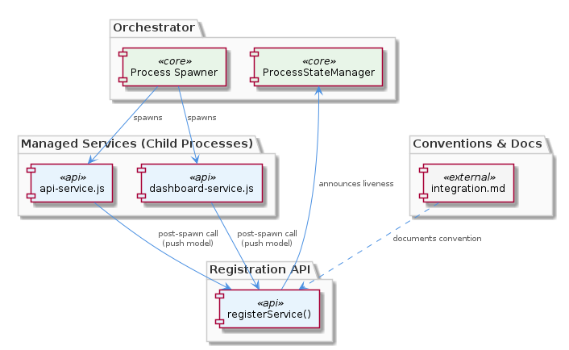
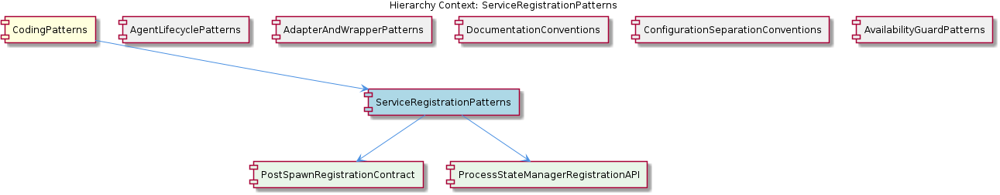

# ServiceRegistrationPatterns

**Type:** SubComponent

The pattern decouples spawn mechanics from liveness semantics: a process is not considered managed until it self-registers, allowing ProcessStateManager to distinguish spawned-but-not-ready from fully live services.

# ServiceRegistrationPatterns

## What It Is

ServiceRegistrationPatterns is a project-wide convention governing how spawned service processes announce themselves to the central process management layer. The pattern is implemented across the service entry-point scripts — most notably `scripts/api-service.js` and `scripts/dashboard-service.js` — both of which invoke `ProcessStateManager.registerService()` immediately after process spawn. The convention is formally documented in `integrations/mcp-server-semantic-analysis/docs/architecture/integration.md`, which describes the integration patterns between managed processes.

As a SubComponent under the broader CodingPatterns parent, ServiceRegistrationPatterns codifies the contract that a process is not considered "managed" until it self-registers. This makes registration the canonical signal that a service is live and trackable, distinguishing it from sibling patterns like AgentLifecyclePatterns (which governs LLM agent construction phases) or AvailabilityGuardPatterns (which gates optional client loading). Where AgentLifecyclePatterns enforces a lazy initialization sequence inside agents, ServiceRegistrationPatterns enforces a post-spawn handshake between independent processes and a central registry.

## Architecture and Design

The architecture follows a **push-based self-registration model** rather than an orchestrator-driven polling model. `ProcessStateManager.registerService()` is designed to be called from within the child process context, meaning each spawned service is responsible for announcing its own readiness. This inverts the typical readiness-check flow: instead of the parent orchestrator periodically checking whether a child is alive, the child reaches back into the shared `ProcessStateManager` API to declare itself live.

This design deliberately **decouples spawn mechanics from liveness semantics**. The act of spawning a process (via Node.js child_process or equivalent) only establishes that the OS has created the process; it says nothing about whether the service has loaded its dependencies, opened its sockets, or is ready to accept work. By making registration the authoritative liveness signal, the system can distinguish three states: not spawned, spawned-but-not-ready, and fully live and registered. This three-state model is exposed uniformly through the same API call, which is precisely what the child components PostSpawnRegistrationContract and ProcessStateManagerRegistrationAPI codify.

The pattern is structured around two child concerns. PostSpawnRegistrationContract defines the *temporal* requirement — the registration call must occur after spawn but before any service logic begins — while ProcessStateManagerRegistrationAPI defines the *interface* requirement — that `ProcessStateManager.registerService()` is the single, canonical entry point. Together, these children form a complete contract: a clear *when* and a clear *how*.

## Implementation Details

The mechanics are straightforward but disciplined. In `scripts/api-service.js`, the service performs its standard process bootstrap (loading configuration, preparing handlers) and then, immediately after the spawn handshake completes, calls `ProcessStateManager.registerService()`. No service logic — no request handling, no background work, no external connections used for real traffic — runs before that registration completes. `scripts/dashboard-service.js` follows the identical sequence, demonstrating that this is not a one-off implementation choice but a project-wide convention applied uniformly across service entry points.

`ProcessStateManager.registerService()` itself serves as the uniform hook point for the entire managed-process subsystem. Because every service funnels through this single API to announce its existence, the registration site becomes the natural location to attach future cross-cutting concerns: liveness checks, automatic restart logic, health monitoring, metrics reporting, or graceful shutdown coordination. The pattern explicitly anticipates this extensibility — having all services announce themselves through the same API means new capabilities can be added in one place rather than retrofitted into each service script.

The push-model implementation has a subtle but important property: because the child process initiates the call, the registration carries with it the implicit guarantee that the child's runtime environment is functional enough to execute code and reach the `ProcessStateManager` API. A polling orchestrator could only verify that a process exists in the OS; the self-registration approach verifies that the process has reached a known good state internally.

## Integration Points

The most direct integration is with `ProcessStateManager`, the central registry that owns the `registerService()` API. Every service script under `scripts/` that participates in managed-process lifecycle is expected to depend on this manager and invoke its registration method. This forms a hub-and-spoke topology where `ProcessStateManager` is the hub and each service script (`api-service.js`, `dashboard-service.js`, and any future siblings) is a spoke.

The pattern also integrates with the broader documentation surface. `integrations/mcp-server-semantic-analysis/docs/architecture/integration.md` formally documents the convention, placing it alongside other architectural agreements in the project's architecture documentation set. This parallels how the parent CodingPatterns describes the LLM agent lifecycle contract in `integrations/mcp-server-semantic-analysis/docs/architecture/agents.md` — both are explicit, written conventions rather than tribal knowledge.

In comparison to sibling patterns, ServiceRegistrationPatterns plays a complementary role. AgentLifecyclePatterns governs in-process object lifecycle (constructor → `ensureLLMInitialized()` → `execute()`), while ServiceRegistrationPatterns governs cross-process lifecycle (spawn → `registerService()` → service work). ConfigurationSeparationConventions, AdapterAndWrapperPatterns, and DocumentationConventions sit alongside as orthogonal concerns — together they constitute the project's coding-pattern vocabulary under the CodingPatterns parent.

## Usage Guidelines

When adding a new managed service to the project, the developer must follow the established sequence demonstrated by `scripts/api-service.js` and `scripts/dashboard-service.js`. After the process spawns and completes its minimal bootstrap, but before any business logic or external traffic handling begins, the service must call `ProcessStateManager.registerService()`. Skipping this call means the service will spawn at the OS level but never appear in the managed-process registry — to the rest of the system, it effectively does not exist.

Developers must also resist the temptation to invert the model. The pattern is explicitly a push model: do not add polling logic to the orchestrator side to detect new services, and do not attempt to register a service from the parent process on the child's behalf. Registration must originate from within the child process context, because that is what gives the registration its semantic weight as proof of internal readiness.

Because `ProcessStateManager.registerService()` is the uniform hook point for future cross-cutting concerns, developers extending the process management subsystem should add new capabilities (health checks, restart policies, metrics) at this registration boundary rather than scattering logic across individual service scripts. This preserves the invariant that the registration API is the single point of contact between services and the management layer. The PostSpawnRegistrationContract and ProcessStateManagerRegistrationAPI children of this pattern are the authoritative sub-conventions to consult when modifying either the timing or the interface of registration.

---

**Architectural patterns identified:** Push-based self-registration; hub-and-spoke topology with `ProcessStateManager` as hub; uniform hook point / single-entry-point API; decoupling of spawn mechanics from liveness semantics.

**Design decisions and trade-offs:** Choosing push over poll trades orchestrator simplicity for stronger liveness guarantees — the registry knows not just that a process exists but that it has reached a functional internal state. Requiring registration before any service work trades a small amount of startup latency for clean lifecycle semantics.

**System structure insights:** All managed services funnel through one API, making the registration site a natural extension point. The pattern is enforced by convention (documented in `integration.md`) rather than by framework, which keeps services lightweight but depends on developer discipline.

**Scalability considerations:** The hub-and-spoke design centralizes registration through `ProcessStateManager`, which means the manager's API becomes a coordination point as the service count grows. Because registration is a single call per service lifetime (not a recurring heartbeat in the current design), the load scales linearly with service spawns rather than with service activity.

**Maintainability assessment:** High. The pattern is uniform across `scripts/api-service.js` and `scripts/dashboard-service.js`, documented in `integration.md`, and structured into two clear sub-contracts (PostSpawnRegistrationContract, ProcessStateManagerRegistrationAPI). New services can be added by following the established template, and future cross-cutting concerns have a single natural insertion point at the `registerService()` call site.

## Hierarchy Context

### Parent
- [CodingPatterns](./CodingPatterns.md) -- [LLM] The project enforces a strict three-phase lazy initialization contract for all LLM-backed agents, documented in integrations/mcp-server-semantic-analysis/docs/architecture/agents.md. The contract mandates the sequence: constructor(repoPath, team) → ensureLLMInitialized() → execute(input). In the constructor phase, the agent captures only its configuration context (repository path and team assignment) without touching LLM infrastructure. The second phase, ensureLLMInitialized(), is an idempotent guard method that performs the actual LLM client instantiation and is designed to be safe to call multiple times — only the first call allocates resources. The third phase, execute(input), is the sole public entry point for agent work and implicitly relies on ensureLLMInitialized() having been called (either explicitly by a harness or at the top of execute() itself). This pattern is a deliberate trade-off: it keeps agent construction cheap for cases where agents are instantiated in bulk but only a subset are actually invoked, preventing unnecessary LLM connection overhead. A new contributor adding an agent must not acquire LLM connections in the constructor — doing so would break the lifecycle contract and cause resource exhaustion in orchestrator scenarios that pre-instantiate agents.

### Children
- [PostSpawnRegistrationContract](./PostSpawnRegistrationContract.md) -- scripts/api-service.js enforces a post-spawn, pre-work call to ProcessStateManager.registerService(), meaning no service logic runs before the registration handshake is complete.
- [ProcessStateManagerRegistrationAPI](./ProcessStateManagerRegistrationAPI.md) -- ProcessStateManager.registerService() is the single entry point through which spawned services announce their readiness, as established by the L2 description's phrasing 'canonical signal that a service is live and trackable'.

### Siblings
- [AgentLifecyclePatterns](./AgentLifecyclePatterns.md) -- BaseAgent subclasses documented in integrations/mcp-server-semantic-analysis/docs/architecture/agents.md all follow a constructor(repoPath, team) signature that captures only configuration context, explicitly forbidding any LLM client instantiation at this stage.
- [AdapterAndWrapperPatterns](./AdapterAndWrapperPatterns.md) -- GraphDatabaseAdapter wraps the Graphology graph library combined with LevelDB persistence, exposing a domain-oriented API rather than the raw Graphology or LevelDB interfaces directly.
- [DocumentationConventions](./DocumentationConventions.md) -- All architecture diagrams are stored as .puml files under docs/puml/ directories, as evidenced by the documentation listing showing integrations/mcp-server-semantic-analysis/docs/architecture/ containing multiple .md files that reference PlantUML sources.
- [ConfigurationSeparationConventions](./ConfigurationSeparationConventions.md) -- config/agent-profiles.json holds runtime behavioral configuration for agents (model selection, parameters, capabilities), deliberately separated from topology concerns.
- [AvailabilityGuardPatterns](./AvailabilityGuardPatterns.md) -- isServerAvailable() is called before dynamic imports of VkbApiClient, ensuring the optional external API client is never loaded if its backing server cannot be reached.

---

*Generated from 6 observations*
