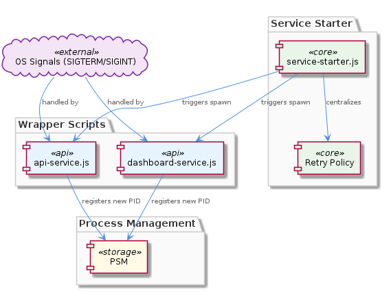

# ServiceStarter

**Type:** SubComponent

lib/service-starter.js is explicitly isolated from SIGTERM/SIGINT handling — signal propagation is owned by the wrapper scripts (api-service.js, dashboard-service.js), not by the starter

# ServiceStarter — Technical Insight Document

## What It Is

ServiceStarter is a SubComponent implemented in `lib/service-starter.js` that serves as the centralized orchestration layer for launching and restarting containerized services within the DockerizedServices parent system. Rather than directly hosting or spawning processes itself, ServiceStarter operates as a coordinator that delegates actual process creation to wrapper scripts (`scripts/api-service.js` and `scripts/dashboard-service.js`), while owning the retry and restart logic that governs when those wrappers should be re-invoked.

Architecturally, ServiceStarter is composed of two tightly coupled internal child components: `ServiceLaunchInvoker` and `RetryPolicy`. Both reside within `lib/service-starter.js` and collaborate in a restart loop where RetryPolicy gates whether another launch attempt is permitted, and ServiceLaunchInvoker performs the delegated spawn through the appropriate wrapper script. This structural split keeps the orchestration concern (when to retry) cleanly separated from the invocation concern (how to launch).

A defining characteristic of ServiceStarter is what it explicitly does *not* do: it is isolated from `SIGTERM`/`SIGINT` handling. Signal propagation is owned entirely by the wrapper scripts, leaving the starter free to focus on retry semantics without entangling itself in process lifecycle signaling.

## Architecture and Design

The architectural pattern at play is a **delegated orchestration** model with clear separation of concerns. ServiceStarter sits above the wrapper scripts but below any higher-level consumer logic. When a restart cycle is triggered, the flow proceeds as follows: the starter triggers a spawn via `ServiceLaunchInvoker`, the wrapper script (such as `scripts/api-service.js` or `scripts/dashboard-service.js`) creates the child process via Node's `child_process` module and registers the new PID with the `ProcessStateManager` (PSM) singleton, and PSM then reflects the updated state to any consumer such as `scripts/health-coordinator.js`. This three-tier indirection — starter → wrapper → PSM — is a deliberate design decision inherited from the parent DockerizedServices pattern, which decouples service identity from OS-level process identity.

The decision to centralize retry policy in `lib/service-starter.js` rather than duplicating it across wrapper scripts is a classic application of the Don't Repeat Yourself principle applied to operational policy. Because `RetryPolicy` lives in one place, every service governed by ServiceStarter — currently the constraint monitor API spawned by `scripts/api-service.js` and the dashboard spawned by `scripts/dashboard-service.js` — automatically shares the same restart backoff, attempt-limit, and gating semantics. Adjustments such as introducing exponential backoff or capping maximum retries require editing only `lib/service-starter.js`, never the wrapper scripts.

The internal coupling between `ServiceLaunchInvoker` and `RetryPolicy` is intentional and tight: after each failed launch attempt, `RetryPolicy` is consulted before `ServiceLaunchInvoker` is invoked again. They form a cohesive restart loop within the starter, and neither is meaningful without the other. This contrasts sharply with the starter's loose coupling to the wrapper scripts, which it treats as opaque process hosts.

## Implementation Details

`ServiceLaunchInvoker` is responsible for triggering the wrapper scripts but does not itself perform `child_process.spawn` calls — that responsibility belongs to the wrappers. This means the invoker acts more like a router or dispatcher: given a target service, it knows which wrapper script to invoke, but it does not embed knowledge of the underlying child process mechanics, executable paths, or signal wiring. This keeps the starter agnostic to the specifics of any individual service's launch requirements.

`RetryPolicy` is the gating component that determines whether a failed launch warrants another attempt. Because it is consulted *after* each failed launch attempt and *before* the next `ServiceLaunchInvoker` invocation, it functions as a guard at the top of the restart loop. The policy encapsulates whatever logic governs restart attempts — attempt counts, backoff intervals, or threshold conditions — and exposes that as a single decision point.

A critical implementation boundary is the explicit exclusion of signal handling from `lib/service-starter.js`. The wrapper scripts (`scripts/api-service.js`, `scripts/dashboard-service.js`) each install `SIGTERM`/`SIGINT` handlers that forward signals to their respective child processes and call `psm.unregisterService()` on exit. By keeping signal handling out of the starter, the codebase avoids the common pitfall of two layers competing to interpret the same signals, which can lead to double-unregistration, race conditions, or zombie processes.

## Integration Points

ServiceStarter integrates with the system through three primary surfaces. First, it consumes the wrapper scripts `scripts/api-service.js` (which spawns the constraint monitor Express API, also tracked as ConstraintAPIWrapper) and `scripts/dashboard-service.js` (DashboardWrapper, which mirrors the api-service structural pattern exactly). The starter never imports `child_process` directly; instead, it invokes these wrappers, which themselves perform the spawn and PSM registration.

Second, ServiceStarter integrates indirectly with the `ProcessStateManager` (PSM) singleton. The starter does not call `psm.registerService()` or `psm.unregisterService()` itself — those calls live in the wrappers. However, the starter's restart cycle depends on PSM behavior in the sense that a restart cycle produces a new PID, and PSM is the registry that consumers like `scripts/health-coordinator.js` query to discover that change. This indirect coupling is what allows `HealthCoordinator` and other PSM consumers to remain unaware of PID transitions during restarts.

Third, ServiceStarter sits as a sibling-level peer to other components such as `ServiceProbe` (at `lib/utils/service-probe.js`), `LLMMockService`, `ProcessStateManager`, and `HealthCoordinator`. While these siblings each play distinct roles in the DockerizedServices ecosystem, ServiceStarter's role is uniquely focused on the launch/relaunch concern. It does not perform health checks (that is ServiceProbe and HealthCoordinator's domain), it does not maintain process state (PSM's domain), and it does not persist mode state (LLMMockService's domain).

## Usage Guidelines

Developers adding a new containerized service to the DockerizedServices system should create a new wrapper script that mirrors the structural pattern established by `scripts/api-service.js` and `scripts/dashboard-service.js`: spawn the child process via `child_process`, register with PSM, wire up `SIGTERM`/`SIGINT` forwarding, and unregister on exit. ServiceStarter can then be extended to recognize and dispatch to the new wrapper, but the wrapper itself must remain responsible for the OS-level concerns. This replication of wrapper boilerplate is a known maintenance concern that grows with service count, but it is the established convention.

When modifying retry behavior — for example, introducing exponential backoff, tuning maximum retry counts, or adding circuit-breaker logic — the change should be made exclusively in `lib/service-starter.js`, specifically within the `RetryPolicy` component. Do not duplicate retry logic into the wrapper scripts; doing so undermines the centralization that makes the current design maintainable. Conversely, never move signal handling into `lib/service-starter.js`, as this would violate the deliberate isolation between retry orchestration and process-lifecycle signaling.

When reasoning about a service restart, remember the chain: ServiceStarter triggers `ServiceLaunchInvoker` → wrapper script spawns and calls `psm.registerService()` → PSM reflects the new PID → consumers like `scripts/health-coordinator.js` observe the updated registry. Consumers of PSM never need to be notified of PID changes directly because the indirection through PSM handles that transparently. If you find yourself needing to thread PID information through ServiceStarter to a consumer, that is a strong signal that the design is being bypassed and the work should likely flow through PSM instead.

### Architectural Summary

- **Architectural patterns identified:** Delegated orchestration; separation of policy (RetryPolicy) from mechanism (ServiceLaunchInvoker and wrapper scripts); indirection via PSM to decouple service identity from PID.
- **Design decisions and trade-offs:** Centralizing retry policy in one file improves consistency at the cost of making the starter a single point of change; isolating signal handling in wrappers keeps the starter clean but requires each new service to replicate wrapper boilerplate.
- **System structure insights:** ServiceStarter is purely an orchestration layer — it neither spawns processes nor handles signals nor maintains state, making it a thin but pivotal coordinator.
- **Scalability considerations:** Adding services scales linearly with new wrapper scripts; the starter itself does not need to grow proportionally, but the wrapper-script duplication is a friction point at higher service counts.
- **Maintainability assessment:** High maintainability for retry logic (single file to edit); moderate maintainability concern for wrapper proliferation as services multiply, since the established pattern favors replication over abstraction.

## Hierarchy Context

### Parent
- [DockerizedServices](./DockerizedServices.md) -- [LLM] The ProcessStateManager (PSM) singleton implements a deliberate decoupling between service identity and process identity across both `scripts/api-service.js` and `scripts/dashboard-service.js`. Each script follows an identical structural pattern: spawn a child process via Node's `child_process` module, register the resulting process handle with the PSM via `psm.registerService()`, wire up `SIGTERM`/`SIGINT` forwarding so that signals delivered to the wrapper propagate to the child, and call `psm.unregisterService()` in the exit handler. This indirection means that the rest of the system (including `scripts/health-coordinator.js`) can query the PSM registry without holding direct references to OS-level process IDs. The practical consequence for developers is that a service restart — where a new child process replaces the old one — does not require the health coordinator or any consumer of PSM state to be aware of the PID change; only the wrapper scripts update the registry. This pattern also cleanly isolates the restart/retry logic in `lib/service-starter.js` from signal-handling responsibilities, since the wrapper owns the process lifecycle signals while the starter owns the retry policy. A new developer should note that adding a new containerized service almost certainly means creating a new wrapper script that replicates this boilerplate rather than centralizing it, which is a potential maintenance concern as the number of services grows.

### Children
- [ServiceLaunchInvoker](./ServiceLaunchInvoker.md) -- ServiceLaunchInvoker resides in lib/service-starter.js and delegates actual process creation to the wrapper scripts api-service.js and dashboard-service.js, keeping the starter itself as an orchestration layer rather than a direct process host.
- [RetryPolicy](./RetryPolicy.md) -- RetryPolicy lives in lib/service-starter.js and is the gating logic consulted after each failed launch attempt before ServiceLaunchInvoker is invoked again, making the two tightly coupled within the restart loop.

### Siblings
- [ServiceProbe](./ServiceProbe.md) -- ServiceProbe lives at lib/utils/service-probe.js and is consumed by scripts/health-coordinator.js, establishing a clear utility-to-orchestrator dependency direction
- [ConstraintAPIWrapper](./ConstraintAPIWrapper.md) -- scripts/api-service.js uses Node's child_process module to spawn the constraint monitor Express API, decoupling the OS-level PID from the service identity tracked by PSM
- [DashboardWrapper](./DashboardWrapper.md) -- scripts/dashboard-service.js mirrors the structural pattern of api-service.js exactly: spawn via child_process, registerService, wire signals, unregisterService on exit
- [LLMMockService](./LLMMockService.md) -- llm-mock-service.ts persists LLM mode state to workflow-progress.json rather than keeping it in memory, making mode selection survive process restarts within the Docker environment
- [ProcessStateManager](./ProcessStateManager.md) -- PSM is a singleton, meaning all wrapper scripts (api-service.js, dashboard-service.js) and health-coordinator.js share a single registry instance without passing references explicitly
- [HealthCoordinator](./HealthCoordinator.md) -- health-coordinator.js consumes PSM state by name rather than PID, so service restarts are transparent — it never needs to be notified of PID changes in api-service.js or dashboard-service.js

---

*Generated from 4 observations*
