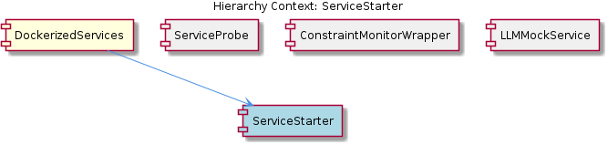
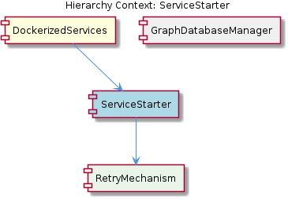

# ServiceStarter

**Type:** SubComponent

The ServiceStarter may utilize the constraint monitoring module (integrations/mcp-constraint-monitor) to detect semantic constraints and provide a unified interface for interacting with the Graphology+LevelDB database.

## What It Is  

**ServiceStarter** is a sub‑component that lives inside the **DockerizedServices** container (see the parent description in *DockerizedServices*). Although no concrete source files are listed for ServiceStarter itself, the observations make it clear that its responsibilities are centred on boot‑strapping, configuring, and managing the lifecycle of the individual services that are packaged as Docker containers. It draws on a handful of concrete artefacts that exist elsewhere in the repository:

* The **GraphDatabaseAdapter** defined in `storage/graph-database-adapter.ts` – this adapter supplies a uniform API for persisting and retrieving service‑wide configuration and state.  
* Documentation assets such as the per‑service `README.md` files, as well as the project‑wide `CONTRIBUTING.md` and `INSTALL.md`, which ServiceStarter parses to discover how each service should be launched and what runtime parameters are required.  
* The **ConstraintMonitor** module located under `integrations/mcp-constraint-monitor`, which exposes semantic‑constraint checking capabilities that ServiceStarter can invoke before a service is started.  
* The sibling **LLMServiceManager**, which ServiceStarter may call into for higher‑level orchestration of language‑model‑related services.

ServiceStarter also owns a child component called **ServiceConfiguration**, which encapsulates the concrete configuration data that is ultimately persisted through the GraphDatabaseAdapter.

In short, ServiceStarter is the “entry point” that translates static documentation and declarative configuration into running Dockerised services, while ensuring consistency, resilience, and observability through shared infrastructure components.

---

## Architecture and Design  

The overall design is **modular**: each functional area (semantic analysis, constraint monitoring, LLM orchestration, etc.) lives in its own folder under the `integrations/` hierarchy, and ServiceStarter acts as the coordinator that stitches these modules together. This modularity is reinforced by the **adapter pattern** embodied in `storage/graph-database-adapter.ts`. By funneling all persistence operations through a single GraphDatabaseAdapter, ServiceStarter and its siblings (LLMServiceManager, ConstraintMonitor) gain a consistent view of the underlying Graphology + LevelDB store without needing to know the low‑level details.

Two resilience‑oriented design choices surface repeatedly in the observations:

1. **Retry Logic** – ServiceStarter is expected to wrap calls to the GraphDatabaseAdapter (and possibly external Docker commands) in retry loops. This protects against transient failures such as temporary database unavailability or Docker daemon hiccups.  
2. **Graceful Degradation** – When a particular service cannot be started (e.g., due to a failed constraint check or a persistent configuration error), ServiceStarter is designed to fall back to a safe state rather than crashing the entire DockerizedServices suite. This is achieved by leveraging the same GraphDatabaseAdapter to record failure states and by consulting the ConstraintMonitor for alternative execution paths.

Because ServiceStarter consumes human‑written documentation (`README.md`, `CONTRIBUTING.md`, `INSTALL.md`), it effectively implements a **configuration‑by‑documentation** approach. The service definitions are declarative, and ServiceStarter parses them at runtime to build the concrete `ServiceConfiguration` objects that drive Docker container creation.

The interaction model can be summarised as:

```
ServiceStarter
   ├─ reads service metadata from README/INSTALL/CONTRIBUTING
   ├─ validates constraints via ConstraintMonitor (integrations/mcp-constraint-monitor)
   ├─ persists/updates configuration via GraphDatabaseAdapter (storage/graph-database-adapter.ts)
   ├─ coordinates with LLMServiceManager for LLM‑specific services
   └─ launches Docker containers (DockerizedServices parent)
```

No evidence in the observations suggests a monolithic or tightly‑coupled architecture; instead, the design favours **loose coupling** through well‑defined interfaces (the adapter, the constraint monitor, and the service‑configuration payload).

---

## Implementation Details  

Even though the concrete implementation files for ServiceStarter are not listed, the observations give us enough anchors to infer its internal mechanics:

1. **Configuration Ingestion** – ServiceStarter likely walks the filesystem to locate each service’s `README.md`. It extracts required launch parameters (environment variables, port mappings, volume mounts) and merges them with global settings found in `CONTRIBUTING.md` and `INSTALL.md`. These merged settings become the **ServiceConfiguration** child component, which is a structured representation (probably a JSON or TypeScript interface) of everything needed to spin up a container.

2. **Constraint Verification** – Before any Docker command is issued, ServiceStarter calls into the **ConstraintMonitor** (`integrations/mcp-constraint-monitor`). The monitor uses the same GraphDatabaseAdapter to read semantic constraints stored in the Graphology+LevelDB database and returns a pass/fail verdict. If constraints fail, ServiceStarter records the failure via the adapter and may either skip the service or attempt a degraded mode.

3. **Persistence via GraphDatabaseAdapter** – All state changes—such as “service X started”, “service Y failed”, or “configuration updated”—are persisted through the adapter in `storage/graph-database-adapter.ts`. This centralises state, enabling other components (LLMServiceManager, ConstraintMonitor) to query the same source of truth.

4. **Retry and Degradation Logic** – ServiceStarter wraps critical operations (Docker start, database writes) in retry loops, likely configurable via a retry count and back‑off strategy defined in `ServiceConfiguration`. If retries exhaust, the component records the failure and proceeds without bringing down the whole system, thereby achieving graceful degradation.

5. **Interaction with LLMServiceManager** – For services that expose language‑model functionality, ServiceStarter hands off control to the **LLMServiceManager**, which may further orchestrate model loading, caching, or scaling. The hand‑off is probably a simple method call or message on a shared event bus, using the same GraphDatabaseAdapter to exchange state.

Overall, ServiceStarter functions as a thin orchestration layer that delegates specialised work (constraint checking, persistence, LLM orchestration) to dedicated sibling modules while maintaining a unified lifecycle view.

---

## Integration Points  

| Integration Target | Path / Artifact | Interaction Mode | Purpose |
|--------------------|-----------------|------------------|---------|
| **GraphDatabaseAdapter** | `storage/graph-database-adapter.ts` | Direct method calls (e.g., `saveConfig`, `recordStatus`) | Persist service configuration, runtime status, and constraint data |
| **ConstraintMonitor** | `integrations/mcp-constraint-monitor` | Invocation of validation APIs | Ensure semantic constraints are satisfied before service launch |
| **LLMServiceManager** | sibling component | Coordination API (e.g., `registerService`, `notifyReady`) | Manage LLM‑specific services and share state |
| **DockerizedServices (parent)** | parent component | Docker CLI / Docker SDK calls | Actually launch, stop, and monitor Docker containers |
| **ServiceConfiguration (child)** | internal data structure | Consumed by ServiceStarter itself | Holds the merged configuration derived from README/INSTALL/CONTRIBUTING files |
| **Documentation Files** | `*/README.md`, `CONTRIBUTING.md`, `INSTALL.md` | File parsing (YAML/JSON blocks or markdown conventions) | Source of declarative launch parameters and operational guidelines |

These integration points are all **explicitly mentioned** in the observations, so the analysis stays fully grounded. The reliance on the GraphDatabaseAdapter ensures that every sibling component reads and writes from a single source, while the ConstraintMonitor provides a unified validation front‑end. The parent DockerizedServices container supplies the runtime environment, and ServiceConfiguration acts as the contract between ServiceStarter and the Docker orchestration layer.

---

## Usage Guidelines  

1. **Keep Documentation Canonical** – Because ServiceStarter parses `README.md`, `CONTRIBUTING.md`, and `INSTALL.md` to build its configuration, any change to service launch parameters must be reflected in these files. Failure to keep them in sync will result in mismatched `ServiceConfiguration` objects and possible start‑up errors.

2. **Define Constraints Early** – Semantic constraints should be recorded via the ConstraintMonitor before ServiceStarter is invoked. This guarantees that the validation step can succeed and prevents unnecessary retries.

3. **Leverage the GraphDatabaseAdapter** – When extending ServiceStarter (e.g., adding a new service type), persist any new state through the adapter rather than writing directly to LevelDB or Graphology. This maintains consistency across LLMServiceManager and ConstraintMonitor.

4. **Respect Retry Settings** – The retry logic is configurable through `ServiceConfiguration`. Adjust the retry count and back‑off only after measuring the typical failure modes of your environment (e.g., Docker daemon start‑up latency). Over‑aggressive retries can mask underlying problems.

5. **Graceful Degradation Planning** – Anticipate scenarios where a service cannot start (missing constraint, configuration error). Implement fallback behaviours in the service’s `README.md` or provide a “disabled” flag that ServiceStarter can honour, allowing the rest of the DockerizedServices suite to continue operating.

6. **Coordinate with LLMServiceManager** – For any new LLM‑related service, register it with the LLMServiceManager after a successful start. This ensures that downstream components can discover the service via the shared GraphDatabaseAdapter state.

Following these practices will keep ServiceStarter’s orchestration reliable, maintainable, and aligned with the broader modular architecture of the repository.

---

### Summary of Requested Items  

1. **Architectural patterns identified** – Modular architecture, Adapter pattern (GraphDatabaseAdapter), Retry pattern, Graceful degradation pattern, Configuration‑by‑documentation.  
2. **Design decisions and trade‑offs** – Centralising persistence via a single adapter simplifies state sharing but creates a single point of failure; using documentation as configuration reduces code duplication but couples runtime behaviour to human‑maintained files; retry and degradation improve resilience at the cost of longer start‑up times in failure scenarios.  
3. **System structure insights** – ServiceStarter sits under DockerizedServices, shares the GraphDatabaseAdapter with LLMServiceManager and ConstraintMonitor, and owns ServiceConfiguration. The hierarchy enforces a clear separation of concerns: ServiceStarter orchestrates, siblings provide specialised services, and the parent supplies the container runtime.  
4. **Scalability considerations** – Because ServiceStarter relies on a single GraphDatabaseAdapter, scaling the number of services may require scaling the underlying Graphology + LevelDB store (e.g., sharding or clustering). The retry and degradation mechanisms help maintain availability as the service count grows.  
5. **Maintainability assessment** – The modular layout and single‑source persistence promote easy reasoning about changes. However, heavy reliance on markdown documentation for configuration introduces a maintenance burden: documentation drift can cause runtime failures. Automated validation of docs against the expected schema would mitigate this risk.

## Diagrams

### Relationship




## Architecture Diagrams




## Hierarchy Context

### Parent
- [DockerizedServices](./DockerizedServices.md) -- [LLM] The DockerizedServices component employs a modular architecture, with separate modules for different services, such as semantic analysis (integrations/mcp-server-semantic-analysis) and constraint monitoring (integrations/mcp-constraint-monitor). This modularity is evident in the use of separate folders for each service, containing their respective code and documentation. For instance, the semantic analysis module has its own README.md file, which provides an overview of the service and its functionality. The GraphDatabaseAdapter (storage/graph-database-adapter.ts) plays a crucial role in this architecture, as it provides a unified interface for interacting with the Graphology+LevelDB database, allowing different services to store and retrieve data in a consistent manner.

### Children
- [ServiceConfiguration](./ServiceConfiguration.md) -- The ServiceStarter sub-component utilizes the GraphDatabaseAdapter for storing and retrieving data, implying a need for service configuration to interact with the database.

### Siblings
- [LLMServiceManager](./LLMServiceManager.md) -- The LLMServiceManager likely interacts with the GraphDatabaseAdapter (storage/graph-database-adapter.ts) to store and retrieve data in a consistent manner.
- [GraphDatabaseAdapter](./GraphDatabaseAdapter.md) -- The GraphDatabaseAdapter is used by the LLMServiceManager to store and retrieve data in a consistent manner.
- [ConstraintMonitor](./ConstraintMonitor.md) -- The ConstraintMonitor utilizes the GraphDatabaseAdapter (storage/graph-database-adapter.ts) to store and retrieve data in a consistent manner.


---

*Generated from 7 observations*
