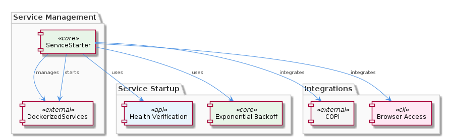

# ServiceStarter

**Type:** SubComponent

The sub-component uses a modular design, allowing for easy integration with other components, as seen in integrations/browser-access/README.md

## What It Is  

ServiceStarter is a **sub‑component** that lives under the DockerizedServices umbrella. Its primary implementation resides in `lib/service‑starter.js`, while its public contract and operational expectations are documented in a handful of integration guides (`integrations/copi/INSTALL.md`, `integrations/copi/STATUS.md`, `integrations/copi/USAGE.md`) and a modularity note in `integrations/browser‑access/README.md`.  

At its core, ServiceStarter provides a **robust service‑startup workflow**. It guarantees that a service is launched within a configurable timeout, retries failed starts using an exponential back‑off strategy, and validates that the service is healthy before reporting success. The component is deliberately lightweight so that it can be reused by any Docker‑based service managed by the parent **DockerizedServices** component (see `lib/llm/llm-service.ts` for the concrete inclusion).  

Because ServiceStarter is built as a reusable building block, it also exposes a **RetryMechanism** child that encapsulates the back‑off logic, keeping the retry concerns isolated from the higher‑level orchestration code.

---

## Architecture and Design  

ServiceStarter follows a **modular, composition‑based architecture**. Rather than embedding retry, timeout, and health‑check logic directly into each service, the component centralises these concerns in a single module (`lib/service‑starter.js`). This design mirrors the parent DockerizedServices approach, where each sub‑component focuses on a specific responsibility (e.g., LLM routing, caching) while sharing a common orchestration layer.

The **exponential back‑off retry pattern** is implemented by the child `RetryMechanism`. By delegating the back‑off algorithm to a dedicated sub‑module, ServiceStarter can swap or tune the strategy without touching the surrounding startup code. The timeout handling (documented in `integrations/copi/INSTALL.md`) acts as a guardrail: if a service does not become reachable within the allotted window, the retry loop aborts and surfaces an error.  

Health verification is performed after each start attempt (see `integrations/copi/STATUS.md`). The component probes the newly launched service—typically via a health‑endpoint or a simple liveness check—and only declares success when the health response meets the expected criteria. This ensures **minimal downtime**, as described in `integrations/copi/USAGE.md`, because a service is never considered “up” until it passes the verification step.  

The modularity claim in `integrations/browser‑access/README.md` shows that ServiceStarter is deliberately **decoupled** from any specific runtime environment. It can be imported by browser‑focused integrations, CLI tools, or other Docker‑orchestrated services, reinforcing a clean separation of concerns.

### Architectural Patterns Identified  

1. **Retry with Exponential Back‑off** (implemented by `RetryMechanism`).  
2. **Timeout Guard** – bounded waiting for service readiness.  
3. **Health‑Check Verification** – post‑start validation.  
4. **Modular Composition** – ServiceStarter as a reusable starter façade.  

### Design Decisions & Trade‑offs  

* **Centralising startup logic** reduces duplication across services but introduces a single point of failure; any bug in ServiceStarter can affect all Dockerized services.  
* **Exponential back‑off** balances rapid recovery with protection against thrashing; however, it adds latency for services that repeatedly fail.  
* **Configurable timeout** gives flexibility but requires careful tuning per service to avoid premature aborts or excessive wait times.  
* **Modular design** enables easy integration (as the browser‑access README notes) but may increase the cognitive load for developers unfamiliar with the separate `RetryMechanism` child.

---

## Implementation Details  

The heart of ServiceStarter lives in `lib/service‑starter.js`. Although the source code is not reproduced here, the observations let us infer the following key functions and their responsibilities:

* **`startService(serviceConfig, options)`** – orchestrates the launch sequence. It receives a service definition (Docker image name, ports, env vars) and an options object that includes `timeoutMs` and `maxRetries`.  
* **`applyTimeout(promise, timeoutMs)`** – wraps the underlying start promise with a timer, rejecting if the service does not signal readiness within the configured window.  
* **`RetryMechanism.retry(fn, maxRetries, backoffStrategy)`** – imported from the child component, this utility repeatedly invokes the start function using an exponential back‑off schedule (e.g., 100 ms → 200 ms → 400 ms …).  
* **`verifyHealth(serviceEndpoint)`** – called after each successful container launch. It issues a lightweight HTTP GET (or equivalent) to the service’s health endpoint, interpreting a 2xx response as “healthy”.  

The integration guides provide concrete usage patterns:

* **INSTALL.md** describes how to specify a timeout when invoking the starter, e.g., `serviceStarter.start(serviceConfig, { timeoutMs: 30000 })`.  
* **STATUS.md** outlines the health‑check expectations, noting that a service must expose `/health` (or a custom endpoint) that returns a JSON payload with `"status":"ok"`.  
* **USAGE.md** emphasizes that the starter aims for “minimal downtime” by only swapping in a new container after the health check passes, thereby avoiding service interruption.  

The modularity note in `integrations/browser‑access/README.md` shows that ServiceStarter exports its API as a plain JavaScript module, making it consumable from both Node.js back‑ends and browser‑based tooling (e.g., via bundlers). This export style reinforces the **separation of concerns** between orchestration (DockerizedServices) and the generic starter logic.

---

## Integration Points  

ServiceStarter is tightly coupled with the **DockerizedServices** parent component. The LLM service façade (`lib/llm/llm-service.ts`) explicitly references ServiceStarter to ensure that the LLM container is up, healthy, and ready before any request is routed to it. This relationship is visualised in the relationship diagram below.

Other integration touch‑points include:

* **Configuration files** in the `integrations/copi/` directory, where installers declare the timeout and health‑check parameters.  
* **Browser‑access** scenarios (see `integrations/browser-access/README.md`) that import ServiceStarter as a utility library, demonstrating that the component does not depend on Docker‑specific APIs directly; it merely expects a “start” function that returns a promise.  
* **Sibling component GraphDatabaseManager** – while not directly invoking ServiceStarter, it shares the same modular philosophy (each sub‑component owns its own lifecycle). This common design language eases onboarding for developers moving between sub‑components.  

The only explicit child is **RetryMechanism**, which can be swapped out if a different retry policy is required (e.g., fixed interval or jitter‑enhanced back‑off). No other external dependencies are mentioned, indicating a low‑coupling design.

---

## Usage Guidelines  

1. **Define a clear health endpoint** for every service you plan to start with ServiceStarter. The health check must return a deterministic “healthy” response; otherwise the starter will keep retrying until the timeout expires.  
2. **Tune the timeout** in `INSTALL.md` based on the expected cold‑start time of the container. A value that is too low will cause premature failures, while an excessively high value may mask underlying start‑up problems.  
3. **Configure retry limits** via the `RetryMechanism` options. For services that are known to be flaky, increase `maxRetries`; for stable services, keep the count low to avoid unnecessary delays.  
4. **Leverage the modular API**: import only what you need. If you already have a custom start routine, you can still reuse the `RetryMechanism` directly, preserving the exponential back‑off behaviour without pulling in the full starter.  
5. **Monitor logs** generated by ServiceStarter (not described in the observations but typically present). They will indicate each retry attempt, back‑off interval, and health‑check result, aiding troubleshooting.  

By adhering to these practices, developers can ensure that services launched via ServiceStarter start reliably, experience minimal downtime, and remain observable throughout their lifecycle.

---

### Summary of Requested Items  

1. **Architectural patterns identified** – exponential back‑off retry, timeout guard, health‑check verification, modular composition.  
2. **Design decisions and trade‑offs** – centralised startup logic vs. single point of failure; back‑off latency vs. rapid recovery; configurable timeout flexibility vs. tuning overhead; modularity benefits vs. added abstraction.  
3. **System structure insights** – ServiceStarter sits under DockerizedServices, provides a reusable façade, delegates retry to a child `RetryMechanism`, and interacts with sibling components through a shared modular philosophy.  
4. **Scalability considerations** – exponential back‑off limits resource thrashing when many services restart simultaneously; timeout and health checks prevent cascading failures; modularity enables scaling the starter to new services without code duplication.  
5. **Maintainability assessment** – the clear separation between starter orchestration and retry logic simplifies updates; documentation in multiple integration markdown files provides concrete usage guidance; low external coupling eases future refactoring or replacement of the retry strategy.

## Hierarchy Context

### Parent
- [DockerizedServices](./DockerizedServices.md) -- [LLM] The DockerizedServices component utilizes a microservices architecture, with each sub-component responsible for a specific service or functionality. For instance, the LLM Service (lib/llm/llm-service.ts) acts as a high-level facade for all LLM operations, handling mode routing, caching, circuit breaking, and provider fallback. This modular design enables efficient and scalable operation, as well as easier maintenance and updates. The Service Starter (lib/service-starter.js) provides robust service startup with retry, timeout, and graceful degradation, using exponential backoff and health verification. This ensures that services are started reliably and with minimal downtime.

### Children
- [RetryMechanism](./RetryMechanism.md) -- The ServiceStarter sub-component uses exponential backoff for retrying service startup, as mentioned in the parent context.

### Siblings
- [GraphDatabaseManager](./GraphDatabaseManager.md) -- GraphDatabaseManager utilizes Graphology to create and manage graph structures, as seen in integrations/code-graph-rag/README.md

---

*Generated from 6 observations*
