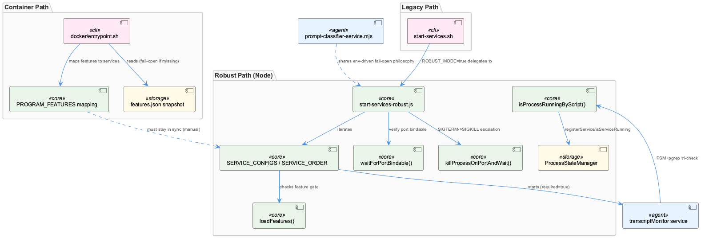
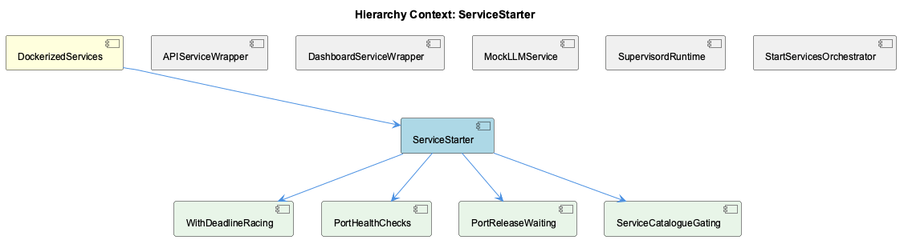

# ServiceStarter

**Type:** SubComponent

[Architecture Notes] lib/service-starter.js is a reusable orchestration layer that is not directly invoked by scripts/api-service.js or scripts/dashboard-service.js in the files shown — those two wrappers implement their own inline spawn/register/unregister logic rather than calling startServiceWithRetry(), suggesting inconsistent adoption of the shared retry abstraction across the codebase; ProcessStateManager acts as a decoupling layer between individual service wrappers and a Global Service Coordinator, avoiding bespoke IPC per service at the cost of every wrapper needing to dynamically import and correctly call register/unregister at the right lifecycle points; Configuration for cross-service wiring (dashboard-service.js's NEXT_PUBLIC_API_BASE_URL) is hardcoded rather than derived from the same env var api-service.js uses for its own port, creating a synchronization-by-convention risk rather than a single source of truth; docker/entrypoint.sh's feature-gating logic duplicates a mapping (PROGRAM_FEATURES) that must stay in sync with supervisord.conf's [program:...] sections and docs/architecture/features.md, enforced only by an external test (tests/features/container-gating.test.mjs) rather than a single generated source; Two independent 'wait for readiness, then continue anyway' implementations exist at different layers: entrypoint.sh (bash, container datastore readiness) and lib/service-starter.js (Node, application service readiness) — no shared abstraction between the shell and JS layers

# ServiceStarter — Technical Insight Document

## What It Is

ServiceStarter is the reusable orchestration layer implemented in `lib/service-starter.js`, providing resilient process-startup primitives for the DockerizedServices ecosystem. Its core exports are three child components covered here: `StartServiceWithRetry` (the retry-with-backoff orchestrator at `lib/service-starter.js:139-236`), `WithDeadline` (the timeout/race guard at `lib/service-starter.js:100-118`), and `PortListeningChecks` (two composable readiness helpers, `isPortListening()` and `isTcpPortListening()`). Together these form a toolkit for turning an arbitrary async `startFn()`/`healthCheckFn()` pair into a supervised, retried, deadline-bounded service startup — the kind of scaffolding needed anywhere a Node process must spawn and verify another process (an API server, dashboard, or backing datastore wrapper) without hanging or leaking resources.

## Architecture and Design

The central architectural insight is `withDeadline()`'s handling of `Promise.race()`. A naive race between a work promise and a `setTimeout`-based rejection leaves the losing timer armed on the event loop; `withDeadline()` closes this gap with a `try/finally` that unconditionally calls `clearTimeout()`. This single primitive underlies everything else: `startServiceWithRetry()` calls it twice per attempt — once around `startFn()` with the caller-supplied `timeout`, once around `healthCheckFn()` hardcoded to 10000ms — so across `maxRetries` exponential-backoff attempts, the leak-avoidance compounds in importance rather than being a cosmetic detail.

`startServiceWithRetry()` itself follows a three-phase attempt cycle: start (deadline-guarded `startFn()`), settle (a fixed 2000ms sleep to let a freshly spawned process bind its port), and verify (deadline-guarded `healthCheckFn()`). Only a failed verify phase triggers active cleanup — SIGTERM followed by SIGKILL escalation after another 1000ms if `isProcessRunning()` still reports the process alive. Notably, a `startFn()` that throws leaves no `serviceInfo.pid` to clean up, implying the retry loop assumes `startFn()` either returns a valid `{pid, port}` or throws before any real process spawns — there is no defensive cleanup for a throw that happens *after* spawning.

The `required`/`optional` classification (via `options.required`, default `true`) is a clean example of pushing a graceful-degradation decision into the options object rather than branching function signatures: exhausted retries either throw (blocking) or return `{status: 'degraded', ...}`, letting `startServicesParallel()` uniformly `Promise.allSettled()` a heterogeneous list of services and bucket outcomes by inspecting `status`.

## Implementation Details

`WithDeadline` is the atomic building block — race a work promise against a timeout rejection, guarantee timer cleanup regardless of winner. `StartServiceWithRetry` layers exponential backoff (`retryDelay * 2^(attempt-1)`) atop this, encoding the start/settle/verify cycle and the required-vs-optional exit semantics at `lib/service-starter.js:216-234`. `PortListeningChecks` supplies `isPortListening()` (HTTP GET to `/health`, 2xx = healthy) and `isTcpPortListening()` (raw `net.Socket` connect, resolving on the `connect` event) — but critically, neither is invoked inside `startServiceWithRetry()` itself. The retry loop only knows about an arbitrary `healthCheckFn(serviceInfo)` parameter, so these two helpers are building blocks a caller composes into its own health check rather than logic wired into the retry machinery. This decouples "how do I know this service is up" (HTTP endpoint vs. bare TCP handshake vs. something else) from "how many times do I retry and how do I back off," letting the same scaffolding serve services with heterogeneous health semantics — an HTTP health check for something like VKB Server versus a TCP handshake for Qdrant/Redis-style dependencies.

## Integration Points

Despite being the designated shared abstraction under DockerizedServices, ServiceStarter is notably *not* directly invoked by the sibling `ServiceWrapperScripts` — `scripts/api-service.js` and `scripts/dashboard-service.js` implement their own inline spawn/register/unregister logic instead of calling `startServiceWithRetry()`. Both scripts share an identical template: resolve `CODING_REPO`, verify existence via `fs.existsSync()`, spawn with `stdio: 'inherit'`, and register/unregister the child PID with `ProcessStateManager` via repeated dynamic `import()` calls — duplicated boilerplate suggesting copy-paste origin rather than a common wrapper factory, and confirming inconsistent adoption of ServiceStarter's retry abstraction across the codebase.

At the sibling/parent level, ServiceStarter's health-check consumers must respect the SPEC R6 invariant enforced by `ServiceProbe` (parent context): probe functions never assert "healthy" directly, only "stopped" or "unknown," deferring the actual healthy determination to a higher-level coordinator combining probe results with `ProcessStateManager` registration state. `DockerEntrypoint`'s `wait_for_service()` independently implements the same "don't block startup on a slow dependency" philosophy in bash — TCP-probing Qdrant/Redis via `/dev/tcp` redirection and unconditionally returning success on exhaustion — but this is a parallel, unshared implementation rather than reuse of the JS retry/backoff logic, meaning two independent readiness-polling systems coexist in the same deployment (see also sibling `StartServicesRobust`).

Configuration wiring is loosely coupled by convention rather than a shared source of truth: `dashboard-service.js` hardcodes `NEXT_PUBLIC_API_BASE_URL: 'http://localhost:3031'` rather than deriving it from `CONSTRAINT_API_PORT`, the same env var `api-service.js` reads for its own port — a latent drift risk if the port is ever overridden.

## Usage Guidelines

Developers extending ServiceStarter should preserve the `finally`-clearTimeout pattern in any new deadline/timeout wrapper — this is the load-bearing detail preventing hung test runners and CLIs. When adding new services, prefer composing `isPortListening()`/`isTcpPortListening()` into a custom `healthCheckFn` rather than duplicating polling logic, and use the `required` option rather than inventing new control-flow branches for optional services, keeping `startServicesParallel()` uniform. Given that `startFn()` failures after spawning aren't defensively cleaned up, callers should ensure `startFn()` either fully succeeds (returning `{pid, port}`) or throws before any process launches. Finally, given the demonstrated divergence between ServiceStarter and the hand-rolled `ServiceWrapperScripts`, any refactor effort should prioritize migrating `api-service.js`/`dashboard-service.js` onto `startServiceWithRetry()` to eliminate duplicated PID-registration boilerplate and close the configuration-drift gap around `CONSTRAINT_API_PORT`.

## Hierarchy Context

### Parent
- [DockerizedServices](./DockerizedServices.md) -- [LLM] The health-check subsystem enforces a strict invariant (documented as SPEC R6) that probing functions in service-probe.js—probeHttpHealth() and probeTcpPort()—must never report a 'healthy' status directly. Instead, these functions only distinguish between 'stopped' (connection refused, timeout, or non-2xx HTTP response) and 'unknown' (configuration errors, malformed URLs, or unresolvable hosts). This is a deliberate architectural choice: liveness probes are pessimistic by design, and the actual determination of 'healthy' is deferred to a higher-level coordinator that combines probe results with other signals (e.g., process registration state from ProcessStateManager). New developers extending probe logic must preserve this three-state contract rather than optimistically returning 'healthy' from a probe function, since downstream consumers (the health-coordinator) rely on the absence of false positives here.

### Children
- [StartServiceWithRetry](./StartServiceWithRetry.md) -- [CGR] startServiceWithRetry (function) in service-starter.js
- [WithDeadline](./WithDeadline.md) -- [CGR] withDeadline (function) in service-starter.js
- [PortListeningChecks](./PortListeningChecks.md) -- [LLM] lib/service-starter.js implements two distinct port-listening checks — isPortListening() (HTTP-based, does a GET to /health and treats 2xx as healthy) and isTcpPortListening() (raw net.Socket connect, resolves true on the 'connect' event alone) — but neither is actually called anywhere inside startServiceWithRetry() itself. The retry loop takes an arbitrary healthCheckFn(serviceInfo) as a parameter instead, meaning these two exported helpers are building blocks a caller may compose into its own healthCheckFn rather than logic wired into the retry machinery directly. This is a meaningful design choice: it decouples 'how do I know this service is up' (HTTP health endpoint vs raw TCP port vs something else entirely, e.g. a PID check) from 'how many times do I retry and how do I back off', letting the same retry/timeout/kill scaffolding serve services with heterogeneous health semantics — a JSON HTTP health check for something like VKB Server versus a bare TCP handshake for Qdrant or Redis-style dependencies.

### Siblings
- [ServiceProbe](./ServiceProbe.md) -- [LLM] service-starter.js's startServiceWithRetry() (lib/service-starter.js) implements a three-layer resilience wrapper around arbitrary async start/health-check function pairs: an outer retry loop (default maxRetries=3) with exponential backoff (retryDelay * 2^(attempt-1)), an inner withDeadline() timeout guard applied separately to both the start call and the health check call (30000ms and 10000ms respectively by default), and post-failure cleanup that SIGTERMs then SIGKILLs an unhealthy child process before the next attempt. The withDeadline() helper is deliberately written with a try/finally that calls clearTimeout(timer) regardless of whether the race was won by the work or the timer — the accompanying comment explains this exists specifically to avoid leaving a dangling setTimeout handle that would hold the Node.js event loop open in short-lived callers like test runners or one-shot CLIs, even though in the long-lived service-starter context itself the leak would be invisible.
- [ProcessStateManager](./ProcessStateManager.md) -- [CGR] ProcessStateManager (class) in process-state-manager.js
- [LLMMockService](./LLMMockService.md) -- [LLM] The docker/entrypoint.sh script implements a feature-gating override mechanism that reads a host-written snapshot (/coding/.coding/runtime/features.json) and translates it into supervisord include files at /etc/supervisor/features.d/disabled.conf. This is architecturally significant because the container cannot run the feature resolver itself — ~/.coding/features.yaml lives on the host and is never mounted — so the container is forced into a consumer role, trusting a flattened JSON artifact rather than re-deriving policy. The `enabled` check inside the embedded `node -e` snippet explicitly treats any value other than `false` (including an unknown/missing key) as enabled, which is a deliberate fail-open default: an older host snapshot that predates a new feature must never accidentally disable it. This mirrors the LLM mock/local/public mode design in llm-mock-service.ts, where cross-boundary state (host vs container) is persisted in a shared file artifact rather than derived independently on each side, avoiding drift between host and containerized views of the same configuration.
- [DockerEntrypoint](./DockerEntrypoint.md) -- [LLM] entrypoint.sh implements a two-phase startup gate before ever invoking supervisord: a `wait_for_service()` loop that TCP-probes Qdrant and Redis via `/dev/tcp/$host/$port` bash pseudo-device redirection, followed by unconditional `return 0` regardless of success — the comment 'Don't fail - let supervisord handle it' makes explicit that this is a best-effort readiness delay, not a hard dependency gate. This mirrors the three-state pessimism described in the parent SPEC R6 invariant (service-probe.js never asserts 'healthy'), except here entrypoint.sh doesn't even distinguish stopped/unknown — it just logs a warning and proceeds, pushing all real health determination downstream to supervisord's own restart policy and, ultimately, the health-coordinator.
- [StartServicesRobust](./StartServicesRobust.md) -- [LLM] lib/service-starter.js implements withDeadline() as a wrapper around Promise.race() specifically to solve a Node.js event-loop hygiene problem: when the wrapped work promise resolves before the timeout, the setTimeout timer created for the race is not automatically cancelled by Promise.race() itself. withDeadline() addresses this in a try/finally block that unconditionally calls clearTimeout(timer) regardless of whether the race was won by the work or the timeout. This is not a cosmetic detail — an uncleared timer keeps Node's event loop alive for the full duration of `ms`, which in startServiceWithRetry() is used twice per attempt (once with the caller-supplied `timeout` for startFn(), once hardcoded to 10000ms for healthCheckFn()), meaning a naive implementation would leave up to two dangling timers per retry attempt across `maxRetries` attempts, compounding into significant delayed-exit behavior for any process (test runner, CLI) that invokes this module and expects clean shutdown.
- [ServiceWrapperScripts](./ServiceWrapperScripts.md) -- api-service.js spawns `node src/dashboard-server.js` inside integrations/constraint-monitor with stdio:'inherit', propagating PORT and DASHBOARD_PORT env vars into the child

---

*Generated from 10 observations*
