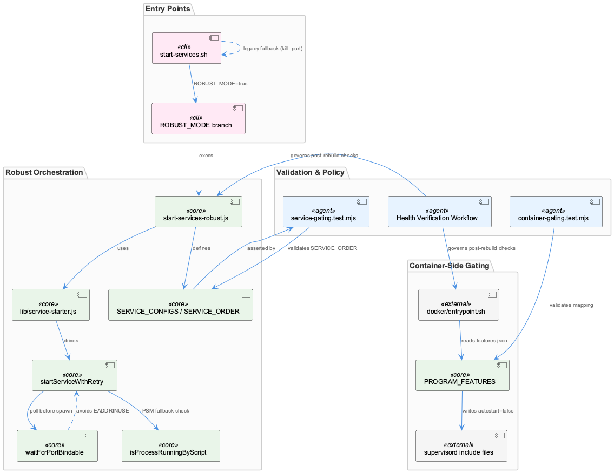
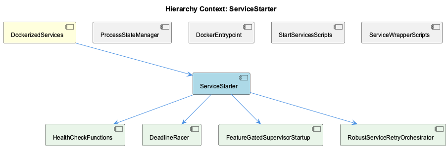

# ServiceStarter

**Type:** SubComponent

# ServiceStarter — Technical Insight Document

## What It Is

ServiceStarter is the orchestration layer for bringing up the coding-services stack, concretely implemented in `scripts/start-services-robust.js` and reachable via the dual-mode dispatcher `start-services.sh`. It is not a single class but a cluster of module-level functions and data structures — `SERVICE_CONFIGS`, `SERVICE_ORDER`, `startServiceWithRetry`, `waitForPortBindable`, `killProcessOnPortAndWait`, and `isProcessRunningByScript` — that together decide which services start, in what order, with what retry/health-check behavior, and how failures are classified. It sits beneath the parent DockerizedServices component, which governs the broader container lifecycle (rebuild via docker-compose, health verification before trusting downstream pipelines like wave-analysis), and it shares the runtime environment with siblings ProcessStateManager, DockerEntrypoint, StartServicesScripts, and ServiceWrapperScripts.

## Architecture and Design

The dominant pattern is retry-with-backoff startup, embodied by `startServiceWithRetry`, which every service-specific `startFn` in `SERVICE_CONFIGS` is driven through. Layered on top of this generic primitive are orchestration-specific helpers that compensate for known failure modes: `waitForPortBindable` distinguishes a kernel-held socket left by a crashed process from a normal "not yet listening" state, explicitly avoiding burning a `maxRetries` slot on a spawn attempt doomed to `EADDRINUSE`; `killProcessOnPortAndWait` performs SIGTERM-then-SIGKILL escalation with polling; and `isProcessRunningByScript` provides an OS-level `pgrep` fallback so orphaned processes unknown to ProcessStateManager (PSM) don't get double-started.

A second major pattern is feature-flag gating, applied redundantly at two layers. On the host side, `SERVICE_CONFIGS` entries carry a `feature` id validated against `lib/features/catalogue.cjs`; on the container side, `docker/entrypoint.sh` reads the same feature catalogue via `PROGRAM_FEATURES` and writes supervisord `autostart=false` includes under `/etc/supervisor/features.d/`. This is the concrete mechanism behind the child component FeatureGatedSupervisorStartup — a deliberately independent, parallel gating path rather than a shared library, meaning the host orchestrator and the container supervisor must be kept in sync by convention and by the cross-cutting test `tests/features/container-gating.test.mjs`.

A third pattern, required-vs-optional classification with graceful degradation, governs startup ordering: `transcriptMonitor` and `liveLoggingCoordinator` are REQUIRED and must start first, since later services register against them via PSM, as enforced structurally in `tests/features/service-gating.test.mjs`.

## Implementation Details

`scripts/start-services-robust.js` is the concrete realization of the child component RobustServiceRetryOrchestrator. It imports generic primitives — `startServiceWithRetry`, `createHttpHealthCheck`, `createPidHealthCheck`, `isPortListening`, `isTcpPortListening`, `isProcessRunning`, `sleep` — from `lib/service-starter.js`, rather than embedding retry logic directly, keeping orchestration policy separate from low-level mechanics. Each entry in `SERVICE_CONFIGS` (the child ServiceWrapperScripts detail) declares `feature`, `startFn`, `healthCheckFn`, `required`, and `maxRetries`/`timeout`. The `transcriptMonitor.startFn` is the clearest example of the "thin wrapper" idiom: it checks `psm.isServiceRunning('transcript-monitor', 'global')` and the `isProcessRunningByScript` pgrep fallback before spawning `enhanced-transcript-monitor.js` detached, redirecting stdio to `.data/etm.log`, injecting `OBS_API_URL`, and calling `child.unref()` so the wrapper can exit without keeping the child alive as a dependent.

Outcome semantics are deliberately three-valued rather than binary: `startOneService` results distinguish 'disabled' (feature off, never attempted — not a failure), 'degraded' (wanted but unavailable), and 'blocked' (a required service's failure preventing downstream startup). This prevents a pared-down install from being misreported as broken, and is directly asserted by `tests/features/service-gating.test.mjs`, which also enforces that `SERVICE_ORDER` and `SERVICE_CONFIGS` keys match exactly and that every feature id resolves against the catalogue.

The child component HealthCheckFunctions is only partially visible from this vantage point: the concrete implementations of `createHttpHealthCheck`, `createPidHealthCheck`, `isPortListening`, etc., live in `lib/service-starter.js`, outside the supplied files. Only the call site is visible — `transcriptMonitor.healthCheckFn` short-circuits to `true` when `result.skipRegistration` is set, otherwise delegates to `createPidHealthCheck()(result)`. Similarly, no literal "DeadlineRacer" abstraction exists in the codebase; the closest analogues are `waitForPortBindable` and `killProcessOnPortAndWait`, which race deadlines against kernel/process state without a shared named class.

## Integration Points

ServiceStarter is invoked through `start-services.sh`, which is a dual-mode dispatcher: by default (`ROBUST_MODE=true`) it execs `node scripts/start-services-robust.js` and exits immediately, deferring all real orchestration; when `ROBUST_MODE=false`, it falls back to roughly 200+ lines of legacy bash logic (sibling StartServicesScripts) — port-killing, docker-compose invocation, manual `docker run` fallback for constraint-monitor — retained explicitly for backward compatibility rather than deleted.

Downstream, ServiceStarter depends on ProcessStateManager (sibling) for in-process service registration, falling back to OS-level `pgrep` detection when PSM state is stale or missing. It coexists with, but does not share code with, DockerEntrypoint's `wait_for_service()`, a fail-open TCP readiness gate for Qdrant/Redis that warns but does not block on exhaustion, leaving ultimate liveness to whatever happens once supervisord starts each process. The feature-gating logic in `docker/entrypoint.sh` (child FeatureGatedSupervisorStartup) is a structurally parallel but independently maintained mechanism to the host-side `SERVICE_CONFIGS.feature` gating, joined only by the shared feature catalogue and cross-validating tests.

## Usage Guidelines

Operators must treat `SERVICE_ORDER` as authoritative for startup sequencing — `transcriptMonitor`/`liveLoggingCoordinator` must remain first, since other services register against them via PSM. Any new service added to `SERVICE_CONFIGS` must declare a valid `feature` id from `lib/features/catalogue.cjs`, and both `SERVICE_ORDER` and `SERVICE_CONFIGS` keys must stay exactly in sync, or `tests/features/service-gating.test.mjs` will fail. Per the parent DockerizedServices' Health Verification Workflow, after any docker-compose rebuild, all supervised processes and health endpoints must be explicitly confirmed live before trusting downstream pipelines such as wave-analysis — this applies equally to the container-side entrypoint.sh/supervisord path and the host-side ServiceStarter. Because ROBUST_MODE toggles between two materially different orchestration paths, when debugging startup issues, confirm which mode is active before assuming which logic path (Node retry orchestrator vs. legacy bash) is actually running; and because feature gating exists redundantly in two places (`SERVICE_CONFIGS.feature` and `PROGRAM_FEATURES` in entrypoint.sh), any change to the feature catalogue must be mirrored in both locations to avoid divergence between host and container behavior.

## Code Evidence

Key code artifacts grounding this entity's analysis:

- tests/features/service-gating.test.mjs asserts structural invariants over SERVICE_CONFIGS and SERVICE_ORDER exported from scripts/start-services-robust.js — every service must declare a valid feature id from lib/features/catalogue.cjs, SERVICE_ORDER and SERVICE_CONFIGS keys must match exactly, and the <AWS_SECRET_REDACTED> pair must start first since later services register against it via ProcessStateManager.
- The gating tests distinguish 'disabled' (feature off, never started, not a failure) from 'degraded' (wanted but unavailable) and from 'blocked' (a required service's failure preventing downstream startup) as three semantically separate outcome buckets in the results object returned by startOneService, preventing a pared-down install from being misreported as broken.

## Work Record

What working sessions recorded about this entity — decisions taken, problems hit, and why things are the way they are:

- Coding-Services Docker Container — Health Verification Workflow establishes that after docker-compose rebuild, all supervised processes/health endpoints must be confirmed live before relying on downstream pipelines like wave-analysis
- The Coding-Services Docker Container — Health Verification Workflow record establishes that after any code/data change, docker-compose rebuild must be followed by explicit confirmation that all supervised processes and health endpoints are live before trusting downstream pipelines like wave-analysis — this session-level policy governs how the container-side ServiceStarter equivalent (entrypoint.sh + supervisord) should be validated post-deploy.
- The same Health Verification Workflow record establishes a 'Docker Container Restart Verification Baseline' requiring operators to check for orphaned/stale service state before re-invoking docker-compose, directly relevant to why start-services.sh's legacy path explicitly kills lingering processes on known ports before starting services.

## Hierarchy Context

### Parent
- [DockerizedServices](./DockerizedServices.md) -- [SESSION] Coding-Services Docker Container — Health Verification Workflow establishes that rebuild is performed via docker-compose and all supervised processes/health endpoints must be confirmed live before relying on downstream pipelines like wave-analysis

### Children
- [HealthCheckFunctions](./HealthCheckFunctions.md) -- [LLM] The supplied files do not contain a component, module, or function literally named or grouped as "HealthCheckFunctions." The actual health-check implementations referenced by scripts/start-services-robust.js — `createHttpHealthCheck`, `createPidHealthCheck`, `isPortListening`, `isTcpPortListening`, `isProcessRunning` — are imported from `../lib/service-starter.js` (line ~19-26 of start-services-robust.js), but that file's source is not among the provided code files. What is visible is only a single call SITE: the `transcriptMonitor` service config's `healthCheckFn: async (result) => { if (result.skipRegistration) return true; return createPidHealthCheck()(result); }`, which cannot ground a full analysis of how PID-based health checking itself is implemented.
- [DeadlineRacer](./DeadlineRacer.md) -- [LLM] No file, function, class, or identifier named 'DeadlineRacer' (or any obvious synonym) appears anywhere in the supplied code: docker/entrypoint.sh, scripts/prompt-classifier-service.mjs, scripts/start-services-robust.js, start-services.sh, and tests/features/service-gating.test.mjs. The closest thematic matches are timeout/race-avoidance helpers — waitForPortBindable() and killProcessOnPortAndWait() in scripts/start-services-robust.js — which race a deadline against a kernel-held socket, but neither is named or structured as a 'DeadlineRacer' abstraction (e.g. no shared class wrapping Promise.race against a timer, no exported symbol by that name).
- [FeatureGatedSupervisorStartup](./FeatureGatedSupervisorStartup.md) -- [LLM] `docker/entrypoint.sh` is the concrete implementation of FeatureGatedSupervisorStartup: after databases are confirmed reachable via `wait_for_service()`, it reads a flat `FEATURES_SNAPSHOT` JSON (`/coding/.coding/runtime/features.json`), iterates the `PROGRAM_FEATURES` mapping (a space-separated `program:feature` string parsed with `${pair%%:*}`/`${pair##*:}`), and for every feature reading `false` emits `[program:%s]\nautostart=false` into `$FEATURES_DIR/disabled.conf` under `/etc/supervisor/features.d/`, which supervisord includes. This is the container-side half of the feature system; the host-side equivalent, `scripts/start-services-robust.js`, uses a completely different mechanism (PSM registration + `startServiceWithRetry`) rather than a supervisord autostart flag.
- [RobustServiceRetryOrchestrator](./RobustServiceRetryOrchestrator.md) -- [LLM+CGR] scripts/start-services-robust.js is the concrete 'RobustServiceRetryOrchestrator' referenced by the parent's [LLM] observation: it imports startServiceWithRetry, createHttpHealthCheck, createPidHealthCheck, isPortListening, isTcpPortListening, isProcessRunning and sleep from lib/service-starter.js, then wraps that generic retry primitive with orchestration-specific helpers — isProcessRunningByScript (OS-level pgrep fallback for orphaned processes PSM doesn't know about), killProcessOnPortAndWait (SIGTERM-then-SIGKILL escalation with polling), and waitForPortBindable (a throwaway net.createServer().listen() probe). The class-like name in the parent record describes this cluster of cooperating functions rather than a literal class in the file — the orchestration is implemented as a set of module-level async functions plus SERVICE_CONFIGS/SERVICE_ORDER data structures, not an OOP class.

### Siblings
- [ProcessStateManager](./ProcessStateManager.md) -- [CGR] ProcessStateManager (class) in process-state-manager.js
- [DockerEntrypoint](./DockerEntrypoint.md) -- [LLM] docker/entrypoint.sh's `wait_for_service()` (lines ~13-31) is a deliberately fail-open readiness gate: it polls a TCP connection via bash's `/dev/tcp/$host/$port` pseudo-device wrapped in `timeout 2`, retries up to `max_attempts` (default 30) with a 2s sleep, but on exhaustion prints a WARNING and still `return 0` — the comment explicitly states 'Don't fail — let supervisord handle it'. This means the entrypoint never blocks container startup on Qdrant or Redis being slow; it only front-loads a wait so the first supervisord-managed process is less likely to race a cold dependency, while ultimate liveness is left to whatever the individual service's own retry logic does once supervisord starts it.
- [StartServicesScripts](./StartServicesScripts.md) -- [LLM] start-services.sh is a dual-mode dispatcher: with ROBUST_MODE (default true, overridable via env var) it simply execs `node scripts/start-services-robust.js` and exits immediately, deferring all real orchestration to that Node script; the remainder of the bash file (roughly 200+ lines of legacy port-killing, docker-compose invocation for Qdrant/Redis, and manual `docker run` fallbacks for constraint-monitor) only executes when ROBUST_MODE=false. This is a live-but-deprecated code path — it still constructs CONSTRAINT_MONITOR_STATUS/CONSTRAINT_MONITOR_WARNING strings and calls `check_docker`, `check_port`, `kill_port` — kept explicitly for backward compatibility rather than deleted.
- [ServiceWrapperScripts](./ServiceWrapperScripts.md) -- [LLM] scripts/start-services-robust.js defines SERVICE_CONFIGS as a map of per-service descriptors (transcriptMonitor, liveLoggingCoordinator, and others truncated below them) each carrying a `feature` id, `startFn`, `healthCheckFn`, `required`, and `maxRetries`/`timeout`. The `transcriptMonitor.startFn` is the clearest instance of the 'thin wrapper' pattern described for the parent DockerizedServices entity: before spawning anything it checks PSM (`psm.isServiceRunning('transcript-monitor', 'global')`) and an OS-level `pgrep` fallback (`isProcessRunningByScript`) to avoid double-starting an orphaned process, then spawns `enhanced-transcript-monitor.js` detached with stdio redirected to `.data/etm.log`, injects `OBS_API_URL` into the child's env, and calls `child.unref()` so the wrapper process itself can exit without keeping the child alive as a dependent.

---

*Generated from 12 observations*
