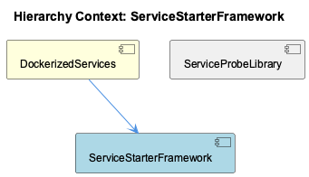
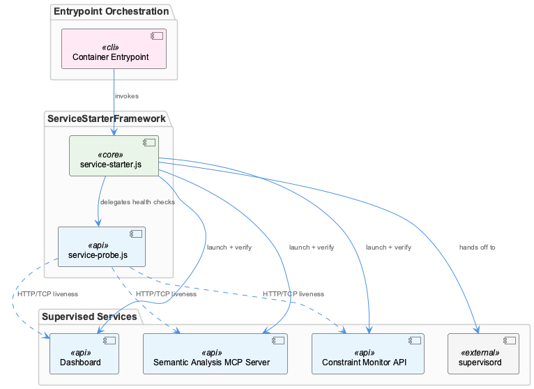

# ServiceStarterFramework

**Type:** SubComponent

The retry pattern in lib/service-starter.js is used uniformly across all containerized services (semantic analysis MCP server, constraint monitor API, dashboard), establishing a consistent startup contract

# ServiceStarterFramework — Technical Reference

## What It Is

ServiceStarterFramework is a pre-supervision startup orchestration layer implemented in `lib/service-starter.js`. It occupies a narrow but critical window in the container lifecycle: after the entrypoint script begins execution and before supervisord assumes steady-state process management. Its sole responsibility is to bring each containerized service to a verified-ready state in sequence, handling transient failures gracefully rather than allowing a single startup hiccup to abort the entire container initialization.

Within the broader DockerizedServices architecture — where the semantic analysis MCP server, constraint monitor API, and dashboard all co-exist under supervisord inside a single container — the framework acts as the reliability bridge that ensures supervisord inherits a known-good baseline rather than a partially-started process set.

## Architecture and Design

The central design pattern in `lib/service-starter.js` is **retry-with-backoff combined with health-gated progression**. Rather than launching all services and hoping they start, the framework launches a service, probes it for liveness, and only advances to the next service once the current one is confirmed responsive. If a launch attempt fails or the health probe does not satisfy within the allowed window, the retry-with-backoff logic re-attempts the launch rather than immediately propagating failure. This establishes a deterministic startup contract: each service either reaches a healthy state or exhausts retries before the sequence continues.

A notable design decision is the **uniformity of this contract across all services**. The same retry-and-verify pattern applies to the semantic analysis MCP server, the constraint monitor API, and the dashboard without service-specific startup logic embedded in the framework itself. This keeps `lib/service-starter.js` generic and means adding a new supervised service does not require modifying the startup sequencer — only registering the new service with an appropriate probe configuration.

The trade-off implicit in this design is **sequential startup latency**. Because health verification must pass before the next service launches, total startup time is the sum of each service's individual startup duration rather than their maximum. For a co-located, single-container architecture this is an acceptable cost: the alternative — parallel launches with no health gating — risks supervisord inheriting services in indeterminate states.

## Implementation Details

The retry-with-backoff mechanism in `lib/service-starter.js` handles transient failures that are common during container cold starts: port binding races, dependent filesystem paths not yet available, or brief interpreter startup latency. Backoff between retries prevents tight retry loops from flooding logs or overwhelming a partially-initialized process.

Health verification after each launch attempt delegates probe execution to the sibling component ServiceProbeLibrary (`lib/utils/service-probe.js`). ServiceProbeLibrary exposes at least two probe strategies — HTTP (checking an endpoint for a success response) and TCP (checking port reachability) — and `lib/service-starter.js` invokes the appropriate strategy per service. This separation is clean: the starter framework owns the retry orchestration and sequencing logic, while ServiceProbeLibrary owns the mechanics of determining whether a network endpoint is alive. Neither component needs to understand the other's internals beyond this interface boundary.

The combination means a "successful start" is not merely "process did not crash" but "process is accepting connections of the expected type" — a meaningfully stronger guarantee to hand off to supervisord.

## Integration Points

ServiceStarterFramework sits at the intersection of two distinct lifecycle phases. Upstream, it is invoked by the container entrypoint script as part of the startup orchestration sequence. Downstream, its successful completion is the precondition for supervisord (configured via `docker/supervisord.conf`) assuming control. If the framework exhausts retries on any service, the entrypoint sequence fails before supervisord is reached, making startup failure visible at container launch rather than silently degraded under supervision.

Its runtime dependency on ServiceProbeLibrary is functional: without `lib/utils/service-probe.js` providing HTTP and TCP liveness checks, the health-gated progression cannot operate. The three services it manages — semantic analysis MCP server, constraint monitor API, dashboard — are defined within the DockerizedServices container built from `docker/Dockerfile.coding-services`, and the framework's probe configurations must match the actual ports and endpoints those services expose at runtime.

## Usage Guidelines

**Probe type selection matters.** Because ServiceProbeLibrary supports both HTTP and TCP probes, the probe configured for each service should match what that service actually exposes at startup. An HTTP probe against a service that opens its TCP port before its HTTP handler is ready will produce spurious failures; a TCP probe against a service with a meaningful health endpoint loses diagnostic value. Developers adding new services should consciously choose the probe strategy that reflects the service's true readiness signal.

**Retry budgets should be tuned to the host environment.** The retry-with-backoff parameters in `lib/service-starter.js` represent assumptions about how long services take to start. On slower hosts or under memory pressure, services may take longer to become responsive. If the retry budget is too tight, the framework will exhaust retries on a service that would have started successfully given more time, failing the container launch unnecessarily.

**The sequential startup contract is intentional.** Developers should not attempt to parallelize service launches to reduce startup time without also rethinking the health-gating logic. The sequential model's value is its predictability — each service starts against a stable environment rather than racing with siblings for shared resources during the cold-start window.

**Failure here is container-fatal, by design.** Because the framework runs before supervisord, a retry exhaustion means the container fails to start cleanly. This is preferable to a container that appears running but has supervisord managing a broken process set. Operators should treat container startup failures as signals to inspect framework logs for which service failed health checks and why.

## Hierarchy Context

### Parent
- [DockerizedServices](./DockerizedServices.md) -- [LLM] The multi-service container architecture uses supervisord (docker/supervisord.conf) to manage multiple long-running processes within a single Docker container defined in docker/Dockerfile.coding-services. This is an intentional design choice that trades container isolation purity for operational simplicity — rather than running separate containers for the semantic analysis MCP server, constraint monitor API, and dashboard service, all are co-located under supervisord's process supervision. The entrypoint script handles startup orchestration sequencing before handing off to supervisord. A new developer should be aware that this means a crash in one supervised service does not terminate the container, supervisord will attempt restarts, but it also means a single container failure takes down all co-located services simultaneously. The bind mount pattern `CODING_ROOT=/coding` connects the host repository filesystem into the container, making the container dependent on the host directory layout at runtime rather than baking code into the image.

### Siblings
- [ServiceProbeLibrary](./ServiceProbeLibrary.md) -- lib/utils/service-probe.js exposes at least two probe strategies — HTTP (checking an endpoint for a success response) and TCP (checking port reachability) — allowing different services to declare the appropriate probe type

---

*Generated from 5 observations*
