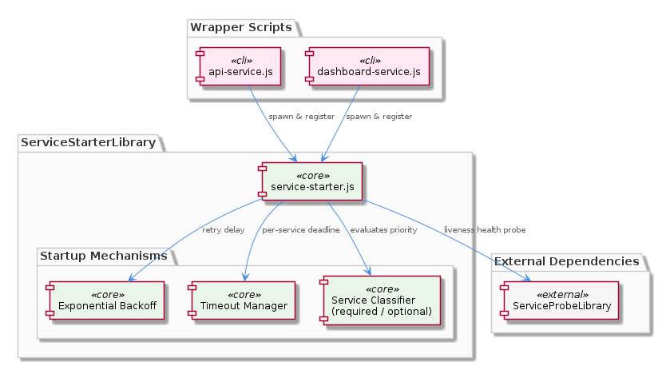
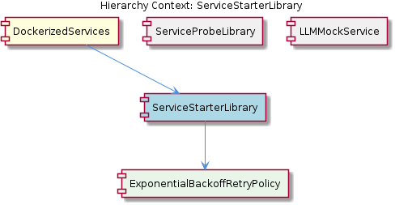

# ServiceStarterLibrary

**Type:** SubComponent

Health verification is built into the startup loop in lib/service-starter.js, meaning the library does not consider a service started until a probe confirms reachability — integrating with the ServiceProbeLibrary's liveness model

# ServiceStarterLibrary — Deep Insight Document

## What It Is

The ServiceStarterLibrary is a shared startup orchestration utility implemented in `lib/service-starter.js`. It exists as a SubComponent within the broader DockerizedServices layer and is responsible for managing the lifecycle of bringing dependent services online in a controlled, resilient manner. Rather than each service wrapper independently implementing logic for retries, timeouts, and health verification, this library centralizes those concerns into a single reusable module.

The library's primary value proposition is encoding three intertwined concerns — retry timing, deadline enforcement, and health verification — into a unified startup loop. Wrapper scripts such as `api-service.js` and `dashboard-service.js` consume this library to ensure their child processes are not merely spawned, but verifiably ready before being treated as live participants in the container topology. This positions ServiceStarterLibrary as a foundational reliability primitive used throughout the DockerizedServices ecosystem.

## Architecture and Design

The architectural centerpiece is the consolidation of retry logic into a single library, exposed via `lib/service-starter.js`. This consolidation is realized through the child component `ExponentialBackoffRetryPolicy`, which owns the backoff timing logic as a shared library concern rather than allowing sleep intervals to be scattered across individual call sites. Every service started through the library inherits the same retry curve automatically, eliminating drift between wrapper implementations and ensuring uniform behavior under degraded conditions.

A key design decision is the explicit distinction between `required` and `optional` service classifications. Callers can declare that a startup failure in an optional service should not abort the overall container initialization sequence, enabling graceful degradation patterns. For example, a non-critical telemetry or auxiliary service can fail to start without taking down the entire container, while a database connection failure can still be treated as fatal. This binary classification is a simple but powerful policy lever that pushes orchestration decisions up to the caller while keeping the mechanics in the library.

The startup loop itself integrates health verification directly — the library does not consider a service "started" until a probe confirms reachability. This tight coupling with the probing model means there is no window in which a process is considered up purely because its handle exists. Instead, readiness is defined by behavioral confirmation, not by process existence. Timeout configuration is treated as a first-class parameter that is independent of retry count, giving callers two orthogonal axes to tune: how long they are willing to wait per attempt versus how many attempts they will make in total.

## Implementation Details

Within `lib/service-starter.js`, the exponential backoff strategy prevents thundering-herd restart scenarios — when a dependent service such as a database is slow to become available, retry attempts back off progressively rather than hammering the dependency at a fixed interval. This is particularly important during cold-start scenarios where multiple services in a container may all be racing to connect to the same upstream dependency. The `ExponentialBackoffRetryPolicy` child component encapsulates this curve, ensuring that the timing characteristics are testable and tunable in one location.

The health verification step inside the startup loop integrates with the sibling `ServiceProbeLibrary`'s liveness model. `ServiceProbeLibrary` (implemented in `lib/utils/service-probe.js`) provides both HTTP and TCP probe variants under a unified interface, which means the startup loop can confirm reachability across different service protocols without needing to embed protocol-specific logic. The startup loop calls into this probe interface as part of each retry iteration; a service is only declared started when a probe succeeds within the configured timeout.

Timeout configuration is a first-class parameter at the per-service level. This allows callers to enforce a deadline that is independent of the retry count — for instance, a service might be configured to retry many times with quick attempts under a tight per-attempt timeout, or fewer times with generous per-attempt timeouts. This separation reflects an awareness that retry frequency and deadline tolerance address different failure modes: high retry counts handle transient flakiness, while long timeouts handle slow but eventually-successful initialization.

## Integration Points

ServiceStarterLibrary sits beneath the wrapper scripts in the DockerizedServices layer and integrates directly with `ServiceProbeLibrary` for its health verification step. The parent DockerizedServices layer uses a deliberate "spawn-then-register" sequencing pattern in wrapper scripts like `scripts/api-service.js` and `scripts/dashboard-service.js` — the child process is spawned first, and only after a successful spawn does the wrapper register the resulting PID with the ProcessStateManager. ServiceStarterLibrary fits naturally into this pattern because it handles the "verify the spawned service is actually ready" phase that precedes confident registration.

The child component `ExponentialBackoffRetryPolicy` is an internal collaborator that the library uses to compute wait intervals between retry attempts. Externally, the library depends on `ServiceProbeLibrary` for the actual reachability checks — without this sibling, the startup loop would have no signal for declaring success. The sibling `LLMMockService` is a peer subcomponent at the same level but operates on a different concern (workflow progress resolution via the `CODING_ROOT` environment variable) and is not a direct collaborator.

By centralizing retry logic, the library ensures that wrapper scripts (`api-service.js`, `dashboard-service.js`) avoid duplicating backoff state machines. Wrapper scripts can stay focused on their core sequencing responsibility — spawn the child, then register the PID — while delegating the harder concerns of timing, retries, and readiness probing to ServiceStarterLibrary. This keeps the wrappers thin and the reliability logic uniform.

## Usage Guidelines

When consuming ServiceStarterLibrary, callers should explicitly classify each service as `required` or `optional` based on whether its absence should be considered fatal to the container. Treating this as a deliberate decision rather than a default avoids the common pitfall of either silently ignoring critical failures or over-aborting on non-essential ones. The classification belongs at the call site because only the caller knows the operational semantics of the service in question.

Timeout values and retry counts should be configured independently and intentionally. Because timeout is per-service and orthogonal to retry count, developers should think of timeout as "how long am I willing to wait for one attempt to complete" and retry count as "how many such attempts am I willing to make." Setting both based on the actual expected initialization profile of the dependent service — rather than copying values from another service — will yield more predictable startup behavior under both healthy and degraded conditions.

Do not bypass ServiceStarterLibrary by implementing ad-hoc retry loops directly in wrapper scripts. The whole point of centralizing retry logic in `lib/service-starter.js` is to ensure every service inherits the same backoff curve and health-verification semantics. Adding a parallel retry mechanism in a wrapper would create drift and reintroduce the thundering-herd risk that the exponential backoff is specifically designed to prevent. When the library's behavior needs adjustment, modify `ExponentialBackoffRetryPolicy` or the library's parameters rather than working around it.

Finally, since health verification is built into the startup loop and integrates with `ServiceProbeLibrary`, ensure that any service started through this library exposes a probe endpoint (HTTP or TCP) that the probe library can target. A service that lacks a probeable readiness signal cannot meaningfully be started through ServiceStarterLibrary, because the library will never receive the confirmation it requires to consider the service operational.

---

### Summary of Key Insights

**1. Architectural patterns identified:** Centralized retry orchestration with delegated health verification; library-as-policy pattern via `ExponentialBackoffRetryPolicy`; classification-based policy injection (required vs. optional); probe-integrated startup loop.

**2. Design decisions and trade-offs:** Exponential backoff was chosen over fixed-interval retries to prevent thundering-herd scenarios, accepting longer worst-case startup time in exchange for reduced dependency pressure. Timeout was made orthogonal to retry count, increasing configuration surface area but providing more precise control. Health verification was made mandatory inside the loop, trading flexibility for correctness.

**3. System structure insights:** The library acts as a horizontal reliability primitive across the DockerizedServices layer, with `ExponentialBackoffRetryPolicy` as an internal child and `ServiceProbeLibrary` as a sibling collaborator. Wrapper scripts remain thin sequencers because the hard reliability logic is encapsulated in `lib/service-starter.js`.

**4. Scalability considerations:** Exponential backoff is the primary scaling mechanism — as more services start concurrently and contend for a shared dependency, the backoff curve naturally spreads retry pressure over time. The per-service timeout configuration scales by allowing each service to tune its own deadline rather than being constrained by a global value.

**5. Maintainability assessment:** Strong. Centralizing retry logic in one file eliminates duplication across wrapper scripts and creates a single point of modification for backoff behavior. The orthogonal configuration parameters (classification, timeout, retry count) provide clear, independent levers. Integration with `ServiceProbeLibrary` through a unified probe interface keeps the library agnostic to specific protocols, reducing the cost of supporting new service types.

## Hierarchy Context

### Parent
- [DockerizedServices](./DockerizedServices.md) -- [LLM] The DockerizedServices layer uses a deliberate 'spawn-then-register' sequencing pattern in its wrapper scripts that has important reliability implications. In `scripts/api-service.js`, the child process is spawned first and only after a successful spawn does the wrapper register the resulting PID with the ProcessStateManager (PSM) under the key `'constraint-api-child'`. This means PSM never holds a stale or null PID reference — any entry in PSM is guaranteed to correspond to a live, OS-allocated process handle. This contrasts with an 'optimistic registration' approach where you'd register first and hope the spawn succeeds. The practical benefit is that any consumer of PSM (such as `scripts/health-coordinator.js` or an external orchestration script) can safely assume that a registered PID is signal-addressable. Similarly, `scripts/dashboard-service.js` follows the same pattern for the Next.js dashboard child. The PSM therefore functions as a live process registry rather than an intent registry, a distinction that matters when implementing SIGTERM forwarding or graceful drain logic during container shutdown sequences.

### Children
- [ExponentialBackoffRetryPolicy](./ExponentialBackoffRetryPolicy.md) -- lib/service-starter.js owns the backoff timing logic as a shared library concern rather than embedding sleep intervals at individual call sites, so every service started through the library inherits the same retry curve automatically

### Siblings
- [ServiceProbeLibrary](./ServiceProbeLibrary.md) -- lib/utils/service-probe.js implements both HTTP and TCP probe variants under a unified interface, allowing health-coordinator to invoke either protocol without branching logic at the call site
- [LLMMockService](./LLMMockService.md) -- llm-mock-service.ts resolves the workflow-progress.json path using the CODING_ROOT environment variable, making it portable across Docker volume mount configurations without hardcoded paths

---

*Generated from 5 observations*
