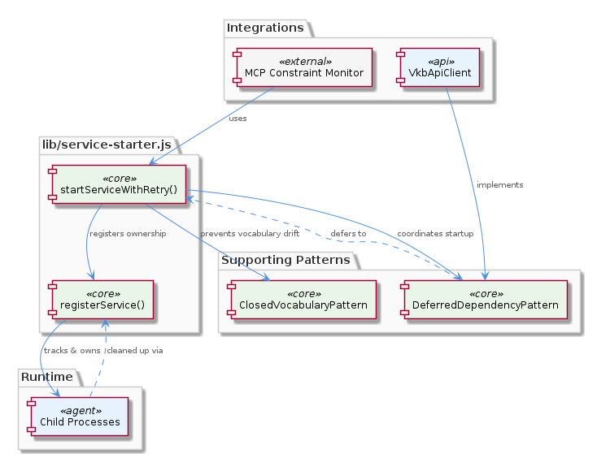
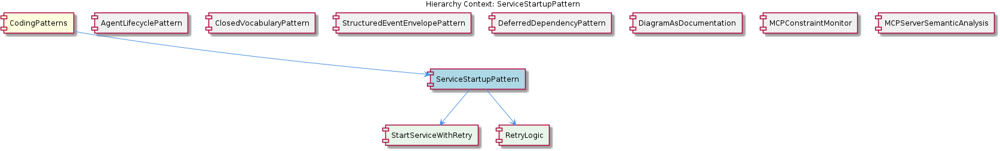

# ServiceStartupPattern

**Type:** SubComponent

The ServiceStartupPattern is designed to work with the DeferredDependencyPattern, as seen in lib/ukb-unified/core/VkbApiClient.js

# ServiceStartupPattern — Technical Insight Document

## What It Is

The `ServiceStartupPattern` is a SubComponent codified primarily in `lib/service-starter.js`, which serves as the canonical module for spinning up services in this codebase. It is one of several formal coding patterns grouped under the parent `CodingPatterns` collection, and it exists to standardize how child processes and dependent services are launched, retried on failure, and tracked for ownership. Rather than allowing each consumer to implement ad-hoc startup-and-retry logic, the pattern consolidates this behavior into two exported abstractions: `startServiceWithRetry()` and `registerService()`.

The pattern decomposes into two child sub-elements: `StartServiceWithRetry`, which represents the wrapping function itself and enforces a consistent retry contract at the module boundary, and `RetryLogic`, which captures the fact that retry semantics are treated as a first-class responsibility of this module rather than a cross-cutting concern delegated to callers or to a higher orchestration layer. Working examples and adoption guidance for the pattern are documented in `integrations/mcp-constraint-monitor/README.md`.

## Architecture and Design

Architecturally, `ServiceStartupPattern` adopts a "wrap-and-track" design: the startup invocation is wrapped with retry semantics (`startServiceWithRetry()`), and once a service is up, its lifetime is bound to the parent through `registerService()`, which tracks ownership of the spawned child processes. This split of responsibilities — one function for *attempting* to start, another for *recording* what was started — keeps the retry concern separable from the process-ownership concern while ensuring both are addressed when the pair is used together.

The pattern sits alongside its siblings under `CodingPatterns` and is explicitly designed to compose with two of them. First, it works hand-in-hand with `DeferredDependencyPattern`, as evidenced by `lib/ukb-unified/core/VkbApiClient.js`, where a service that may not yet be available at module-load time is loaded dynamically and started under the retry wrapper — the retry loop effectively absorbs the temporary unavailability that deferred-dependency loading is built to accommodate. Second, when `startServiceWithRetry()` is used in conjunction with the `ClosedVocabularyPattern`, it helps prevent vocabulary drift by ensuring services responsible for vocabulary enforcement are reliably available before downstream consumers depend on them.

Within the broader sibling landscape — `AgentLifecyclePattern`, `StructuredEventEnvelopePattern`, `DiagramAsDocumentation`, `MCPConstraintMonitor`, and `MCPServerSemanticAnalysis` — `ServiceStartupPattern` occupies the infrastructure tier: where `AgentLifecyclePattern` defines `init()`/`start()`/`stop()`/`pause()`/`resume()` semantics inside `base-agent.ts` for a single agent's state machine, `ServiceStartupPattern` handles the lower-level question of how external services and child processes are reliably brought online and tracked. The two are complementary rather than overlapping.

## Implementation Details

The core of the implementation is the `startServiceWithRetry()` function in `lib/service-starter.js`. Its singular responsibility is to wrap arbitrary service startup logic with retry behavior, meaning callers do not need to implement their own back-off, attempt-counting, or failure-classification logic. By centralizing this in one function, the codebase guarantees that retry contracts are consistent everywhere a service is launched — a property the child sub-element `RetryLogic` encapsulates conceptually.

The second pillar is `registerService()`, also in `lib/service-starter.js`. This function tracks ownership of child processes produced during startup. Ownership tracking is the mechanism that ensures spawned child processes are properly cleaned up: by knowing which parent registered which child, the system can guarantee orderly teardown and avoid orphaned processes when the owning context exits. This makes the pattern not only about *starting* services but about closing the loop on their *lifecycle as owned subordinates*.

The child element `StartServiceWithRetry` represents the single exported abstraction that consumers are expected to call — bare startup invocations bypass the contract and should not be used. The companion `RetryLogic` element makes explicit that retry behavior is intentionally a first-class responsibility of `lib/service-starter.js`, not delegated to callers or hidden in a generic utility module elsewhere.

## Integration Points

The clearest integration point is with `DeferredDependencyPattern`. In `lib/ukb-unified/core/VkbApiClient.js`, the `VkbApiClient` module is loaded dynamically via `dynamic-import`, and `ServiceStartupPattern` is the natural counterpart that handles the eventual startup of the deferred resource. The combination allows the system to defer both the loading and the activation of dependencies, with retries absorbing transient timing issues that deferred resolution can introduce.

A second integration is with `ClosedVocabularyPattern`. The migration scripts referenced under `integrations/mcp-constraint-monitor/docs/constraint-configuration.md` enforce fixed canonical type sets, and `startServiceWithRetry()` is used in conjunction with this pattern to prevent vocabulary drift — ensuring that the services responsible for vocabulary enforcement come online reliably so that no consumer ends up operating against an unconstrained or partially-initialized vocabulary surface.

The pattern is documented and exemplified in `integrations/mcp-constraint-monitor/README.md`, which acts as the reference site for new adopters. Through `registerService()`, the pattern also implicitly integrates with whatever process-supervision context owns the lifecycle of the Node.js parent — child cleanup depends on the ownership records that `registerService()` maintains.

## Usage Guidelines

Developers should always call `startServiceWithRetry()` from `lib/service-starter.js` instead of invoking bare startup logic directly. This is the contract that the `StartServiceWithRetry` child element formalizes: the module boundary is the only sanctioned entry point, and bypassing it forfeits the consistent retry semantics that the codebase depends on. Likewise, every spawned child process should be passed through `registerService()` so that ownership is recorded and cleanup can be performed deterministically.

When introducing a new service that has dependencies which may not be available at module-load time, combine `ServiceStartupPattern` with `DeferredDependencyPattern` following the `lib/ukb-unified/core/VkbApiClient.js` template. The retry wrapper is specifically designed to tolerate the kinds of transient unavailability that deferred loading introduces. Similarly, any service that participates in a closed vocabulary regime should be started via `startServiceWithRetry()` so that downstream `ClosedVocabularyPattern` enforcement is not undermined by a service that failed to come up on the first attempt.

For new code, consult `integrations/mcp-constraint-monitor/README.md` for canonical usage examples before introducing local startup logic. As with the singleton guard idiom that the parent `CodingPatterns` collection codifies elsewhere, the value of `ServiceStartupPattern` comes from uniform adoption — every consumer that goes through the centralized abstractions reinforces the guarantees (reliable startup, owned cleanup, consistent retry behavior) that the pattern was designed to provide, and every consumer that bypasses them weakens those guarantees system-wide.

---

### Summary of Analytical Findings

1. **Architectural patterns identified**: A wrap-and-track infrastructure pattern combining a retry wrapper (`startServiceWithRetry()`) with an ownership registry (`registerService()`), both centralized in a single module (`lib/service-starter.js`).
2. **Design decisions and trade-offs**: Retry logic is deliberately a first-class module responsibility rather than a caller concern, trading caller flexibility for system-wide consistency. Ownership tracking is coupled to startup, ensuring no spawned process escapes lifecycle management — at the cost of requiring callers to use the paired API correctly.
3. **System structure insights**: The pattern sits at the infrastructure tier of `CodingPatterns`, complementing `AgentLifecyclePattern` (single-agent state) and explicitly composing with `DeferredDependencyPattern` and `ClosedVocabularyPattern`.
4. **Scalability considerations**: Centralized retry logic scales adoption across many consumers without re-implementation; ownership tracking prevents orphaned-process accumulation as the number of services grows.
5. **Maintainability assessment**: Strong — the pattern's two responsibilities are localized in `lib/service-starter.js`, documented in `integrations/mcp-constraint-monitor/README.md`, and decomposed into clearly-named child elements (`StartServiceWithRetry`, `RetryLogic`) that make the contract discoverable to new developers.

## Hierarchy Context

### Parent
- [CodingPatterns](./CodingPatterns.md) -- [LLM] The project-wide singleton guard pattern is formally codified in `docs/puml/psm-singleton-pattern.puml` and manifests consistently wherever stateful managers are instantiated. The pattern follows a strict guard-and-return idiom: a module-level variable holds the single instance (initialized to null or undefined), and every access point checks that variable before constructing a new object. If an instance already exists, the existing reference is returned immediately without re-running any constructor or initialization logic. This prevents race conditions in async service environments where multiple subsystems might attempt to spin up the same stateful manager concurrently — a real concern in Node.js applications that use event-driven concurrency without explicit locking primitives. For new developers, the implication is that any class described as a 'manager' or 'session' object in this codebase should be assumed to follow this pattern: do not call `new` directly on these classes from arbitrary call sites; instead, always go through the designated factory or accessor function that enforces the singleton contract. The PlantUML diagram in `docs/puml/psm-singleton-pattern.puml` is authoritative and should be consulted before introducing any new singleton-style manager to ensure the guard logic is structurally consistent with the rest of the project.

### Children
- [StartServiceWithRetry](./StartServiceWithRetry.md) -- The function startServiceWithRetry() lives in lib/service-starter.js and is the single exported abstraction that consumers call instead of invoking bare startup logic directly, enforcing a consistent retry contract at the module boundary.
- [RetryLogic](./RetryLogic.md) -- As described by the parent context, startServiceWithRetry() in lib/service-starter.js explicitly 'wraps the service startup with retry logic', meaning retry behavior is a first-class responsibility of this module rather than a cross-cutting concern handled at a higher layer.

### Siblings
- [AgentLifecyclePattern](./AgentLifecyclePattern.md) -- The BaseAgent class in base-agent.ts defines the lifecycle methods init(), start(), stop(), pause(), and resume()
- [ClosedVocabularyPattern](./ClosedVocabularyPattern.md) -- The migration scripts in integrations/mcp-constraint-monitor/docs/constraint-configuration.md enforce fixed canonical type sets
- [StructuredEventEnvelopePattern](./StructuredEventEnvelopePattern.md) -- The CLAUDE-CODE-HOOK-FORMAT.md document specifies the structured event envelope format
- [DeferredDependencyPattern](./DeferredDependencyPattern.md) -- The VkbApiClient module in lib/ukb-unified/core/VkbApiClient.js is loaded dynamically using dynamic-import
- [DiagramAsDocumentation](./DiagramAsDocumentation.md) -- The PlantUML diagrams in docs/puml/ capture architectural decisions and provide visual specification
- [MCPConstraintMonitor](./MCPConstraintMonitor.md) -- The MCPConstraintMonitor module in integrations/mcp-constraint-monitor/README.md monitors and enforces constraints
- [MCPServerSemanticAnalysis](./MCPServerSemanticAnalysis.md) -- The MCPServerSemanticAnalysis module in integrations/mcp-server-semantic-analysis/README.md performs semantic analysis

---

*Generated from 6 observations*
