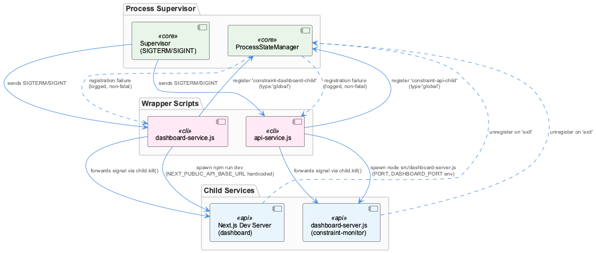
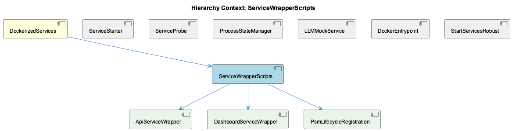

# ServiceWrapperScripts

**Type:** SubComponent

Both wrappers register with ProcessStateManager using distinct names ('constraint-api-child' vs 'constraint-dashboard-child') and type:'global', then unregister the same name in the child's 'exit' handler

# ServiceWrapperScripts: Technical Insight Document

## What It Is

ServiceWrapperScripts is the subcomponent within DockerizedServices responsible for spawning, supervising, and cleanly shutting down two specific child processes: the constraint-monitor API and its companion dashboard. It is implemented as two nearly parallel scripts — `scripts/api-service.js` and `scripts/dashboard-service.js` — that live alongside the broader Docker/process-management stack. `api-service.js` spawns `node src/dashboard-server.js` inside `integrations/constraint-monitor` with `stdio:'inherit'`, propagating the `PORT` and `DASHBOARD_PORT` environment variables to the child. `dashboard-service.js` spawns `npm run dev` for the Next.js dashboard in `integrations/constraint-monitor/dashboard`, hardcoding `NEXT_PUBLIC_API_BASE_URL` to `http://localhost:3031`. Both scripts resolve `CODING_REPO` via `process.env.CODING_REPO || join(__dirname, '..')` and guard against missing artifacts with `fs.existsSync` before spawning.

## Architecture and Design

The defining architectural pattern here is **duplicated lifecycle scaffolding rather than shared abstraction**. As detailed under child components ApiServiceWrapper and DashboardServiceWrapper, both scripts implement identical structural scaffolding — CODING_REPO resolution, existence guards, spawn invocation, and signal wiring — with only the target artifact, port, and spawn command differing. Notably, no shared `service-wrapper.js` factory exists, even though `lib/service-starter.js` already provides shared retry/health-check orchestration elsewhere in the codebase. This is a clear design trade-off: simplicity and independence of each wrapper versus DRY-ness and consistency of fixes.

The wrappers act as a **signal-relay layer** between the process supervisor and the actual service process: SIGTERM/SIGINT received by the wrapper are forwarded to the spawned child via `child.kill()`, and the child's own `exit` event drives cleanup and the wrapper's own `process.exit()`. This mirrors the best-effort, non-blocking philosophy seen in sibling DockerEntrypoint's `wait_for_service()`, which also declines to hard-fail on unready dependencies.

A second pattern is the **PsmLifecycleRegistration** scheme, where each wrapper registers itself with ProcessStateManager under a distinct name (`constraint-api-child` vs `constraint-dashboard-child`, both `type:'global'`) and unregisters that same name inside the child's `exit` handler.

## Implementation Details

Registration and unregistration are **temporally asymmetric**: registration occurs in a fire-and-forget async IIFE executed after `console.log(\`Started (PID: ${child.pid})\`)`, whereas unregistration is awaited synchronously inside `child.on('exit', async (code) => {...})` before `process.exit(code || 0)`. Because the registration IIFE is never awaited by the rest of the program, there is a narrow but structurally guaranteed race: a child crashing quickly enough could trigger `unregisterService` (and then `process.exit`) before the registration IIFE's `await psm.initialize()` chain completes — meaning a service can be unregistered that was never actually registered. This is not a one-off bug but a shared structural property of both wrapper scripts.

Failure handling around PSM is deliberately lenient: registration failures are caught and logged but explicitly do not abort startup, with code comments to the effect of "Continue anyway - not critical." This establishes PSM registration as a best-effort observability hook rather than a hard dependency of service startup.

## Integration Points

ServiceWrapperScripts sits inside DockerizedServices alongside siblings ServiceStarter, ServiceProbe, ProcessStateManager, LLMMockService, DockerEntrypoint, and StartServicesRobust. Its primary integration point is ProcessStateManager, which both child wrappers (ApiServiceWrapper, DashboardServiceWrapper) use for global-type process registration — a dependency it treats as soft/optional rather than blocking. Unlike ServiceStarter's `withDeadline()`-guarded retry orchestration (used for arbitrary start/health-check pairs with exponential backoff) or ServiceProbe's pessimistic three-state health contract (SPEC R6, never returning "healthy" directly), ServiceWrapperScripts does not perform health checking or retries itself — it is purely a spawn/signal/PSM-lifecycle layer, complementary to but distinct from those siblings' concerns. This division of responsibility means real health determination is deferred elsewhere, consistent with the fail-open, best-effort posture seen throughout DockerEntrypoint and LLMMockService.

## Usage Guidelines

Developers modifying lifecycle behavior (e.g., adding graceful-shutdown timeouts or fixing the PSM registration race) must currently apply the change **twice**, once in each of `api-service.js` and `dashboard-service.js`, since no shared base exists. Any fix to the registration race condition should consider awaiting the registration IIFE (or guarding the exit handler against unregistering an unregistered service) in both files simultaneously, since the race is structural rather than local to one script. When extending this pattern to new services, maintain the established conventions: resolve `CODING_REPO` uniformly, guard with `fs.existsSync` before spawning, forward termination signals to the child, and treat PSM registration/unregistration as best-effort rather than a blocking dependency — consistent with the broader DockerizedServices philosophy of deferring hard health/liveness guarantees to higher-level coordinators.

## Hierarchy Context

### Parent
- [DockerizedServices](./DockerizedServices.md) -- [LLM] The health-check subsystem enforces a strict invariant (documented as SPEC R6) that probing functions in service-probe.js—probeHttpHealth() and probeTcpPort()—must never report a 'healthy' status directly. Instead, these functions only distinguish between 'stopped' (connection refused, timeout, or non-2xx HTTP response) and 'unknown' (configuration errors, malformed URLs, or unresolvable hosts). This is a deliberate architectural choice: liveness probes are pessimistic by design, and the actual determination of 'healthy' is deferred to a higher-level coordinator that combines probe results with other signals (e.g., process registration state from ProcessStateManager). New developers extending probe logic must preserve this three-state contract rather than optimistically returning 'healthy' from a probe function, since downstream consumers (the health-coordinator) rely on the absence of false positives here.

### Children
- [ApiServiceWrapper](./ApiServiceWrapper.md) -- [LLM] scripts/api-service.js and scripts/dashboard-service.js implement identical lifecycle scaffolding with only the target artifact, port, and spawn command differing. Both resolve CODING_REPO via `process.env.CODING_REPO || join(__dirname, '..')` (api-service.js:14, dashboard-service.js:14), both guard with `fs.existsSync` before spawning (api-service.js:24-27, dashboard-service.js:24-27), and both wire identical SIGTERM/SIGINT/exit/error handlers. This duplication means any lifecycle fix (e.g., adding a graceful-shutdown timeout, or fixing a PSM registration race) must be applied twice by hand — there is no shared base module like a `service-wrapper.js` factory, even though `lib/service-starter.js` already exists as a shared utility in the same codebase for a different concern (retry/health-check orchestration, not spawn/PSM/signal wiring).
- [DashboardServiceWrapper](./DashboardServiceWrapper.md) -- [LLM] [object Object]
- [PsmLifecycleRegistration](./PsmLifecycleRegistration.md) -- [LLM] scripts/api-service.js and scripts/dashboard-service.js implement PSM registration/unregistration as two structurally symmetric but temporally asymmetric operations: registration happens in a fire-and-forget async IIFE at the bottom of the file that runs after console.log(`Started (PID: ${child.pid})`), while unregistration happens synchronously-awaited inside the child.on('exit', async (code) => {...}) handler before process.exit(code || 0) is called. Because the IIFE is not awaited by anything, there is a real (if narrow) race window where a child process could crash and fire 'exit' — running unregisterService and then process.exit — before the registration IIFE's await psm.initialize() chain has completed, meaning unregisterService is called for a service that was never actually registered. Both files share this exact ordering, so the race is a structural property of the wrapper pattern, not a one-off bug in either script.

### Siblings
- [ServiceStarter](./ServiceStarter.md) -- [LLM] The core resilience primitive in lib/service-starter.js is withDeadline(), which wraps Promise.race() around a work promise and a timeout-rejecting promise, then clears the timer in a finally block regardless of which promise wins. This is not the naive Promise.race() pattern seen in many codebases — the naive version leaves the losing setTimeout timer armed on the event loop even after the work promise resolves, which is a classic cause of hung Node.js processes (a test runner or one-shot CLI that never exits cleanly, or a long-lived service that leaks a timer handle per retry attempt). startServiceWithRetry() calls withDeadline() twice per attempt (once wrapping startFn() with the attempt's `timeout` option, once wrapping healthCheckFn() with a hardcoded 10000ms), so the leak-avoidance matters doubly under the exponential-backoff retry loop where dozens of timers could otherwise accumulate across maxRetries attempts.
- [ServiceProbe](./ServiceProbe.md) -- [LLM] service-starter.js's startServiceWithRetry() (lib/service-starter.js) implements a three-layer resilience wrapper around arbitrary async start/health-check function pairs: an outer retry loop (default maxRetries=3) with exponential backoff (retryDelay * 2^(attempt-1)), an inner withDeadline() timeout guard applied separately to both the start call and the health check call (30000ms and 10000ms respectively by default), and post-failure cleanup that SIGTERMs then SIGKILLs an unhealthy child process before the next attempt. The withDeadline() helper is deliberately written with a try/finally that calls clearTimeout(timer) regardless of whether the race was won by the work or the timer — the accompanying comment explains this exists specifically to avoid leaving a dangling setTimeout handle that would hold the Node.js event loop open in short-lived callers like test runners or one-shot CLIs, even though in the long-lived service-starter context itself the leak would be invisible.
- [ProcessStateManager](./ProcessStateManager.md) -- [CGR] ProcessStateManager (class) in process-state-manager.js
- [LLMMockService](./LLMMockService.md) -- [LLM] The docker/entrypoint.sh script implements a feature-gating override mechanism that reads a host-written snapshot (/coding/.coding/runtime/features.json) and translates it into supervisord include files at /etc/supervisor/features.d/disabled.conf. This is architecturally significant because the container cannot run the feature resolver itself — ~/.coding/features.yaml lives on the host and is never mounted — so the container is forced into a consumer role, trusting a flattened JSON artifact rather than re-deriving policy. The `enabled` check inside the embedded `node -e` snippet explicitly treats any value other than `false` (including an unknown/missing key) as enabled, which is a deliberate fail-open default: an older host snapshot that predates a new feature must never accidentally disable it. This mirrors the LLM mock/local/public mode design in llm-mock-service.ts, where cross-boundary state (host vs container) is persisted in a shared file artifact rather than derived independently on each side, avoiding drift between host and containerized views of the same configuration.
- [DockerEntrypoint](./DockerEntrypoint.md) -- [LLM] entrypoint.sh implements a two-phase startup gate before ever invoking supervisord: a `wait_for_service()` loop that TCP-probes Qdrant and Redis via `/dev/tcp/$host/$port` bash pseudo-device redirection, followed by unconditional `return 0` regardless of success — the comment 'Don't fail - let supervisord handle it' makes explicit that this is a best-effort readiness delay, not a hard dependency gate. This mirrors the three-state pessimism described in the parent SPEC R6 invariant (service-probe.js never asserts 'healthy'), except here entrypoint.sh doesn't even distinguish stopped/unknown — it just logs a warning and proceeds, pushing all real health determination downstream to supervisord's own restart policy and, ultimately, the health-coordinator.
- [StartServicesRobust](./StartServicesRobust.md) -- [LLM] lib/service-starter.js implements withDeadline() as a wrapper around Promise.race() specifically to solve a Node.js event-loop hygiene problem: when the wrapped work promise resolves before the timeout, the setTimeout timer created for the race is not automatically cancelled by Promise.race() itself. withDeadline() addresses this in a try/finally block that unconditionally calls clearTimeout(timer) regardless of whether the race was won by the work or the timeout. This is not a cosmetic detail — an uncleared timer keeps Node's event loop alive for the full duration of `ms`, which in startServiceWithRetry() is used twice per attempt (once with the caller-supplied `timeout` for startFn(), once hardcoded to 10000ms for healthCheckFn()), meaning a naive implementation would leave up to two dangling timers per retry attempt across `maxRetries` attempts, compounding into significant delayed-exit behavior for any process (test runner, CLI) that invokes this module and expects clean shutdown.

---

*Generated from 5 observations*
