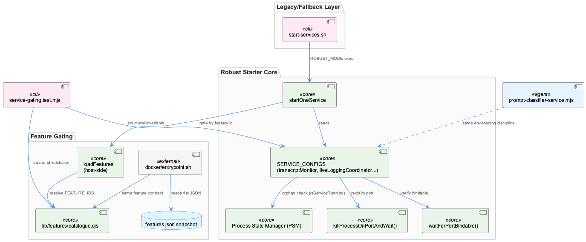
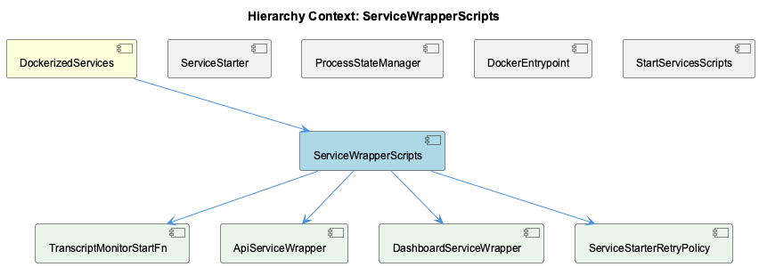

# ServiceWrapperScripts

**Type:** SubComponent

## What It Is

ServiceWrapperScripts is the collection of process-orchestration wrapper code centered on `scripts/start-services-robust.js`, with `docker/entrypoint.sh` and `start-services.sh` forming the container-boot and legacy-fallback halves of the same responsibility, and `scripts/prompt-classifier-service.mjs` illustrating an adjacent pattern (environment loading for minimal-environment launch contexts). As the primary subcomponent under DockerizedServices, it exists to start, gate, retry, and health-check the set of long-running services (transcript monitor, live logging coordinator, constraint monitor, dashboard processes, etc.) that the parent's health-verification workflow ultimately depends on.

## Architecture and Design

The core structure is a declarative table, `SERVICE_CONFIGS`, mapping each service to a `feature` id, `startFn`, `healthCheckFn`, `required` flag, and retry/timeout parameters, paired with a `SERVICE_ORDER` sequence enforced (only by test, not by the type system — see Architecture Notes) to keep `transcriptMonitor`/`liveLoggingCoordinator` first since later services register against them. This is the "thin wrapper" pattern the parent DockerizedServices describes: wrappers don't implement their own retry logic — `startServiceWithRetry`, imported from `lib/service-starter.js` and represented in the hierarchy as child ServiceStarterRetryPolicy, supplies backoff and attempt counting, while `SERVICE_CONFIGS` supplies only per-service parameters.

Feature gating is implemented twice, independently, at two different points using two different mechanisms: host-side at CLI-start time (`start-services-robust.js` resolving features live) and container-side at boot (`docker/entrypoint.sh` reading a flat, read-only-mounted `/coding/.coding/runtime/features.json` snapshot and emitting `autostart=false` overrides via `node -e`, since jq isn't available in the image). Both enforce the same catalogue semantically but fail differently: entrypoint.sh is explicitly fail-open on missing/malformed control data (unknown feature or missing snapshot ⇒ "enabled") while operational errors elsewhere are treated more strictly — an intentional asymmetry the observations call out directly.

## Implementation Details

The clearest instance of the wrapper pattern is `SERVICE_CONFIGS.transcriptMonitor.startFn` (detailed further in child TranscriptMonitorStartFn), which performs a three-layer orphan check — global PSM lookup, per-project PSM lookup, then an OS-level `pgrep -lf` fallback via `isProcessRunningByScript` — before ever spawning `enhanced-transcript-monitor.js`. Any of the three early-return paths yields `{ pid, service, skipRegistration: true }`, so found-existing and started-fresh are indistinguishable to the retry/health-check machinery. When a spawn is actually needed, the child is detached, stdio is redirected to `.data/etm.log`, `OBS_API_URL` is injected into its env, and `child.unref()` is called so the wrapper itself can exit without pinning the child.

Two dedicated async helpers exist purely to defeat kernel-level races: `killProcessOnPortAndWait()` (SIGTERM via `lsof -ti:<port>` PIDs, poll, escalate to SIGKILL past half the wait budget) and `waitForPortBindable()`, which probes actual socket bindability with a throwaway `net.createServer().listen()` rather than an HTTP check, because a crashed process can leave the kernel holding a socket that answers nothing over HTTP yet still blocks a new bind — spawning into that window would otherwise silently burn a `maxRetries` slot.

`docker/entrypoint.sh`'s `PROGRAM_FEATURES` loop (e.g. `semantic-analysis:knowledge`, `constraint-monitor:constraints`) writes disabled-service overrides to `/etc/supervisor/features.d/disabled.conf`; its sibling readiness gate `wait_for_service()` is deliberately fail-open too — polling `/dev/tcp` up to 30 times then returning success regardless, explicitly deferring to supervisord and each service's own retry logic rather than blocking container startup.

## Integration Points

ServiceWrapperScripts sits between DockerizedServices (parent, whose health-verification workflow gates trust in downstream pipelines like wave-analysis) and its children TranscriptMonitorStartFn, ApiServiceWrapper, DashboardServiceWrapper, and ServiceStarterRetryPolicy — though observations note ApiServiceWrapper and DashboardServiceWrapper have no concrete implementation in the retrieved files, only thematically adjacent material (the generic SERVICE_CONFIGS shape, and dashboard entries in entrypoint.sh's PROGRAM_FEATURES). It depends on ProcessStateManager (PSM) for orphan/PID reconciliation, `lib/service-starter.js` for retry policy, and `lib/features/catalogue.cjs` (`FEATURE_IDS`) for the feature contract validated by `tests/features/service-gating.test.mjs`. Sibling DockerEntrypoint implements the container-boot half of feature gating and its own independent readiness wait; sibling StartServicesScripts (`start-services.sh`) is a thin ROBUST_MODE-gated `exec` into `start-services-robust.js`, falling back to ~200 lines of legacy bash (its own `check_port`/`kill_port`, manual Qdrant/Redis `docker run`, fixed-port constraint-monitor startup) only when `ROBUST_MODE=false`.

## Usage Guidelines

Any new service added to `SERVICE_CONFIGS` must also appear in `SERVICE_ORDER` and declare a `feature` present in `FEATURE_IDS`, since `tests/features/service-gating.test.mjs` enforces exact coverage between the two structures and would fail otherwise — this consistency is not type-checked. Disabled-by-feature services must resolve to `results.disabled`, never `results.degraded`, preserving the semantic distinction between "deliberately absent" and "wanted but broken." Prefer extending the Node robust starter over the legacy bash path; `ROBUST_MODE=false` should be treated as a deprecated escape hatch, not a parallel implementation to maintain. Operationally, per the parent's Health Verification and Restart Verification Baseline, always check for orphaned/stale service state before re-invoking docker-compose, and always confirm supervised processes and health endpoints post-rebuild rather than assuming success — this mirrors, at the operational layer, exactly what `isProcessRunningByScript` and `killProcessOnPortAndWait` do at the code layer.

## Code Evidence

Key code artifacts grounding this entity's analysis:

- tests/features/service-gating.test.mjs asserts structural invariants over the exported `SERVICE_CONFIGS`/`SERVICE_ORDER`/`startOneService` from start-services-robust.js: every service must declare a `feature` that exists in `FEATURE_IDS` (from `lib/features/catalogue.cjs`), `SERVICE_ORDER` and `SERVICE_CONFIGS` must cover each other exactly, and `transcriptMonitor`/`liveLoggingCoordinator` must remain the first two entries in start order since later services register against them. The test suite also encodes a semantic distinction the code enforces: a feature-disabled service must land in `results.disabled`, never `results.degraded`, because 'degraded' specifically means 'wanted but unavailable' and conflating the two would make a deliberately pared-down install look broken.

## Work Record

What working sessions recorded about this entity — decisions taken, problems hit, and why things are the way they are:

- The Coding-Services Docker Container — Health Verification Workflow record establishes that after any code or data change, the operational procedure is to rebuild via docker-compose and then explicitly confirm every supervised process and its health endpoint is live before trusting downstream pipelines such as wave-analysis — health confirmation is a hard gate, not an assumption, which is consistent with the three-tier probe/starter/coordinator layering the parent context describes.
- The same record establishes a 'Docker Container Restart Verification Baseline': operators must check existing container/service state before invoking docker-compose again, specifically to avoid restarting on top of orphaned or stale service state left behind by a prior incomplete shutdown — this is the operational counterpart to the code-level orphan detection in start-services-robust.js (`isProcessRunningByScript`, PSM re-registration of orphans) and the port-release polling in `killProcessOnPortAndWait`.

## Hierarchy Context

### Parent
- [DockerizedServices](./DockerizedServices.md) -- [SESSION] Coding-Services Docker Container — Health Verification Workflow establishes that rebuild is performed via docker-compose and all supervised processes/health endpoints must be confirmed live before relying on downstream pipelines like wave-analysis

### Children
- [TranscriptMonitorStartFn](./TranscriptMonitorStartFn.md) -- [LLM+CGR] The `transcriptMonitor.startFn` in scripts/start-services-robust.js implements a three-layer orphan check before ever calling `spawn`: first `psm.isServiceRunning('transcript-monitor', 'global')`, then a per-project PSM check keyed on `TARGET_PROJECT_PATH`, and only if both return false does it fall through to `isProcessRunningByScript('enhanced-transcript-monitor.js')`, an OS-level `pgrep -lf` fallback. Each of the three early-return paths produces a `{ pid, service: 'transcript-monitor', skipRegistration: true }` result rather than a fresh spawn, so `startOneService`'s retry/health-check machinery treats 'found an existing instance' identically to 'started successfully' — the orphan-detection logic and the happy-path spawn share one return contract.
- [ApiServiceWrapper](./ApiServiceWrapper.md) -- [LLM] None of the supplied files define, export, or even name a class, module, or function called "ApiServiceWrapper." The closest thematic material is the per-service descriptor pattern in scripts/start-services-robust.js (the SERVICE_CONFIGS map with <AWS_SECRET_REDACTED> entries), which the parent DockerizedServices context already describes as a 'thin wrapper' pattern — but that is a generic object-literal shape (feature/startFn/healthCheckFn/required/maxRetries/timeout), not a wrapper class over an API client, and nothing here shows it wrapping an HTTP/API surface specifically.
- [DashboardServiceWrapper](./DashboardServiceWrapper.md) -- [LLM] None of the supplied files define a class, module, or function named `DashboardServiceWrapper`. The closest dashboard-related material is in docker/entrypoint.sh, where `health-dashboard` and `health-dashboard-frontend` appear only as entries in the `PROGRAM_FEATURES` string (mapped to the `health` feature id) that the script uses to decide whether to write an `autostart=false` override into `/etc/supervisor/features.d/disabled.conf`. This is container-side feature gating of an already-defined supervisord program, not a wrapper component that starts, health-checks, or retries the dashboard process itself.
- [ServiceStarterRetryPolicy](./ServiceStarterRetryPolicy.md) -- [LLM] start-services-robust.js does not itself define the retry-with-timeout mechanism; it imports `startServiceWithRetry` from `../lib/service-starter.js` and composes it with per-service `startFn`/`healthCheckFn`/`maxRetries`/`timeout` fields declared in `SERVICE_CONFIGS`. This means the actual retry policy logic (backoff schedule, attempt counting) lives outside the files retrieved here, while this file supplies only the per-service parameters the policy consumes.

### Siblings
- [ServiceStarter](./ServiceStarter.md) -- [SESSION] Coding-Services Docker Container — Health Verification Workflow establishes that after docker-compose rebuild, all supervised processes/health endpoints must be confirmed live before relying on downstream pipelines like wave-analysis
- [ProcessStateManager](./ProcessStateManager.md) -- [CGR] ProcessStateManager (class) in process-state-manager.js
- [DockerEntrypoint](./DockerEntrypoint.md) -- [LLM] docker/entrypoint.sh's `wait_for_service()` (lines ~13-31) is a deliberately fail-open readiness gate: it polls a TCP connection via bash's `/dev/tcp/$host/$port` pseudo-device wrapped in `timeout 2`, retries up to `max_attempts` (default 30) with a 2s sleep, but on exhaustion prints a WARNING and still `return 0` — the comment explicitly states 'Don't fail — let supervisord handle it'. This means the entrypoint never blocks container startup on Qdrant or Redis being slow; it only front-loads a wait so the first supervisord-managed process is less likely to race a cold dependency, while ultimate liveness is left to whatever the individual service's own retry logic does once supervisord starts it.
- [StartServicesScripts](./StartServicesScripts.md) -- [LLM] start-services.sh is a dual-mode dispatcher: with ROBUST_MODE (default true, overridable via env var) it simply execs `node scripts/start-services-robust.js` and exits immediately, deferring all real orchestration to that Node script; the remainder of the bash file (roughly 200+ lines of legacy port-killing, docker-compose invocation for Qdrant/Redis, and manual `docker run` fallbacks for constraint-monitor) only executes when ROBUST_MODE=false. This is a live-but-deprecated code path — it still constructs CONSTRAINT_MONITOR_STATUS/CONSTRAINT_MONITOR_WARNING strings and calls `check_docker`, `check_port`, `kill_port` — kept explicitly for backward compatibility rather than deleted.

---

*Generated from 11 observations*
