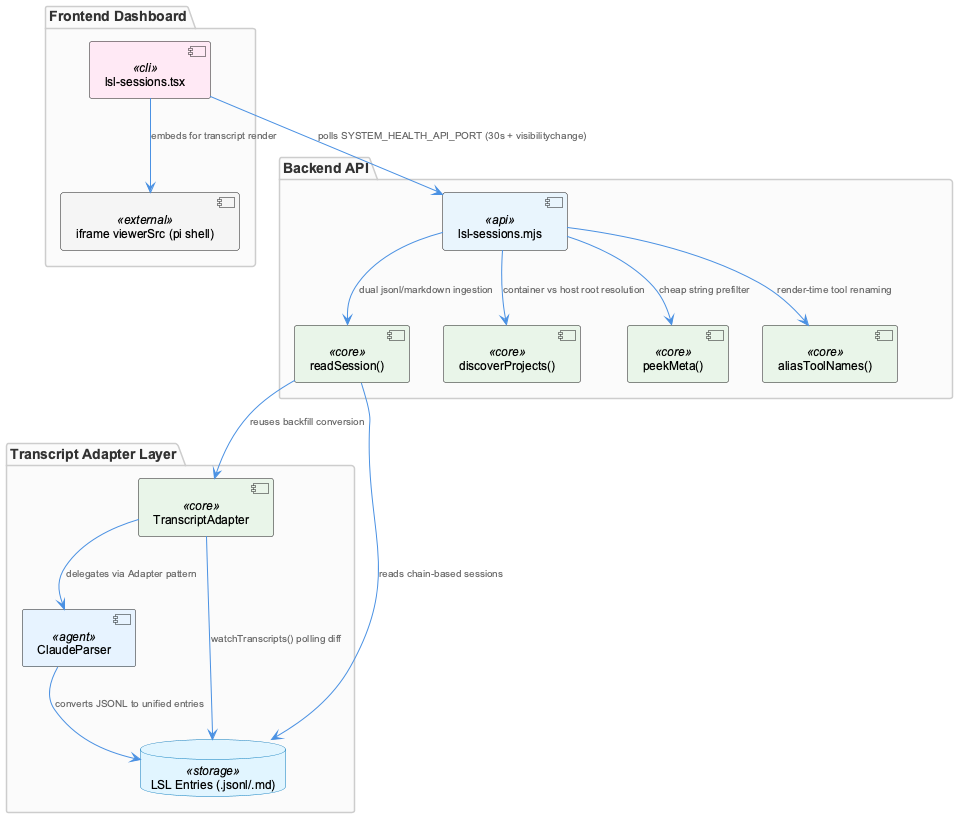
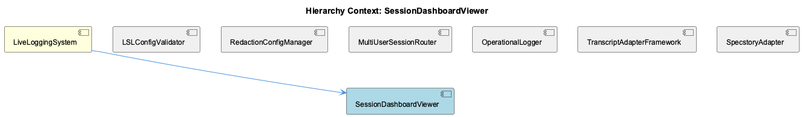

# SessionDashboardViewer

**Type:** SubComponent

[Architecture Notes] Session identity in the dashboard is chain-based, not file-based — `chainId()`/`parseChainId()` group rotation parts into one logical unit to avoid exposing headerless mid-token fragments to the viewer; Dual transcript format support (`.jsonl` pi-native and `.md` legacy) is handled via format detection (`format: 'pi' | 'markdown' | 'mixed'`) rather than a unified on-disk schema, reflecting a corpus mid-migration; Tool name aliasing (`RENDER_TOOL_ALIASES` in `lsl-sessions.mjs`) is applied strictly at render time, leaving stored entries with the agent's original tool names — a deliberate separation between display and persisted data; Cross-cutting inconsistency: `ClaudeParser.parseFile()`'s raw-username `userHash` assignment does not match the SHA-256-hash-then-truncate convention documented for LSL's `validateUserEnvironment()`, suggesting the transcript-adapter layer and the config-validation layer evolved independently without a shared hashing utility; Frontend/backend split is clean but network-coupled: `lsl-sessions.tsx` polls `SYSTEM_HEALTH_API_PORT` (default 3033) via both a 30s interval and a `visibilitychange` listener, meaning dashboard freshness depends entirely on that HTTP API being reachable rather than any push mechanism

# SessionDashboardViewer — Technical Insight Document

## What It Is

SessionDashboardViewer is the presentation layer of the LiveLoggingSystem, implemented primarily in `integrations/system-health-dashboard/lsl-sessions.mjs` (backend/data layer) and `integrations/system-health-dashboard/src/pages/lsl-sessions.tsx` (frontend). It provides a browser-based view into LSL session transcripts, supporting both native pi JSONL format and legacy Markdown transcripts. Rather than reimplementing transcript rendering, the viewer delegates actual message rendering to `pi`'s own export shell via iframe embedding, focusing its own responsibilities on discovery, parsing, normalization, and metadata extraction of session data.

## Architecture and Design

The component sits downstream of the TranscriptAdapterFramework, whose `TranscriptAdapter` base class (in `lib/agent-api/transcript-api.js`) enforces a Template Method pattern — abstract methods are guarded via `new.target` checks and throw stubs if unimplemented. Agent-specific adapters like `ClaudeParser` act as Adapters, converting native JSONL formats into unified LSL entries through `LSLConverter`. SessionDashboardViewer consumes this normalized shape but must still handle format heterogeneity at the storage layer: `readSession()` in `lsl-sessions.mjs` performs dual `.jsonl`/`.md` ingestion, tagging output with a `format: 'pi' | 'markdown' | 'mixed'` discriminator rather than requiring a unified on-disk schema. This is a deliberate acknowledgment that the underlying corpus is mid-migration, trading schema purity for backward compatibility.

Session identity itself is chain-based rather than file-based: `chainId()`/`parseChainId()` group session-rotation parts into a single logical unit, preventing the viewer from exposing headerless mid-token fragments that would otherwise confuse end users. A notable verification pattern emerges in `readSession()`: the same backfill conversion functions used to populate historical data are reused for live rendering, meaning the dashboard doubles as a continuous correctness check on the conversion pipeline itself.

The frontend/backend boundary is intentionally clean but network-coupled — `lsl-sessions.tsx` polls a health API (`SYSTEM_HEALTH_API_PORT`, default 3033) on a 30-second interval plus a `visibilitychange` listener, meaning dashboard freshness is entirely dependent on that HTTP endpoint's availability rather than any push/streaming mechanism.

## Implementation Details

Key functions in `lsl-sessions.mjs` include `discoverProjects()`, which uses environment-aware path resolution to distinguish container vs. host sibling-project roots (with env-var override support) — a necessary abstraction given deployment variability. `peekMeta()` implements a cheap-scan-before-parse optimization: a string pre-filter bounds JSON.parse cost to the size of the corpus by avoiding full parsing of files that clearly lack agent/promptSet markers. `aliasToolNames()` applies `RENDER_TOOL_ALIASES` strictly at render time — stored entries retain the agent's original tool names, keeping the persisted data and display layer cleanly separated.

On the frontend, `viewerSrc` in `lsl-sessions.tsx` forces a theme-based re-fetch by keying the iframe on `viewerSrc` itself, ensuring the embedded `pi` shell re-renders when theme or session context changes, without requiring the dashboard to manage rendering state internally.

The underlying `TranscriptAdapter` framework's `watchTranscripts()` implements an Observer/watcher pattern via a polling loop that diffs entry counts and dispatches to a registered callback set — this is the mechanism by which new transcript activity ultimately becomes visible to consumers like the dashboard.

## Integration Points

SessionDashboardViewer is a child of LiveLoggingSystem and sits alongside siblings LSLConfigValidator, RedactionConfigManager, MultiUserSessionRouter, OperationalLogger, TranscriptAdapterFramework, and SpecstoryAdapter. Its most direct dependency is TranscriptAdapterFramework, particularly the `ClaudeParser` adapter (`lib/agent-api/transcripts/claude-parser.js`), which supplies transcript data via `getTranscriptDirectory()` (replicating Claude Code's directory-naming convention via regex) and `parseFile()`.

A significant cross-cutting concern surfaces here: `ClaudeParser.parseFile()` sets `userHash` to the raw, unhashed `process.env.USER` value, directly contradicting the SHA-256-hash-then-truncate convention documented for LSL's `validateUserEnvironment()` in the parent LiveLoggingSystem. Since RedactionConfigManager's stated purpose is guarding exactly this kind of session transcript metadata, this inconsistency suggests the transcript-adapter layer and config-validation layer evolved independently without a shared hashing utility — any surfacing of this metadata through SessionDashboardViewer risks a plaintext-username leak that bypasses the classification/redaction policy enforced elsewhere by LSLConfigValidator's fail-closed schema checks.

## Usage Guidelines

Developers extending SessionDashboardViewer should treat `format` detection (`pi`/`markdown`/`mixed`) as a first-class signal rather than an edge case, since the corpus will contain both formats indefinitely rather than converging quickly. Tool name display customization belongs exclusively in `RENDER_TOOL_ALIASES`/`aliasToolNames()` — never mutate stored tool names to achieve display changes, preserving the separation between persisted and rendered data. Because dashboard freshness depends entirely on the health API being reachable (no push mechanism exists), any deployment must ensure `SYSTEM_HEALTH_API_PORT` availability is monitored independently. Finally, before exposing `userHash` or similar identity fields in the UI, verify they've passed through proper hashing — the current `ClaudeParser` gap means downstream consumers cannot assume metadata is pre-redacted, and should audit this before shipping any transcript metadata display features.

## Hierarchy Context

### Parent
- [LiveLoggingSystem](./LiveLoggingSystem.md) -- [LLM] The LiveLoggingSystem's configuration validation is centralized in scripts/validate-lsl-config.js through the LSLConfigValidator class, which acts as a schema enforcement gatekeeper for two distinct config artifacts: .specstory/config/lsl-config.json (structural/behavioral settings) and .specstory/config/redaction-config.yaml (privacy/classification rules). This separation reflects a deliberate architectural decision to decouple 'how the logger behaves' from 'what the logger is allowed to record', allowing redaction policy to be iterated on independently from file-management or session-windowing logic. The initializeSchemas() method enumerates five required top-level sections (version, multiUser, fileManager, operationalLogger, classification), meaning any config missing even one of these fails validation outright—this is a strict fail-closed design rather than a permissive fail-open one, which is notable for a system handling potentially sensitive session transcripts.

### Siblings
- [LSLConfigValidator](./LSLConfigValidator.md) -- [CGR] LSLConfigValidator (class) in validate-lsl-config.js
- [RedactionConfigManager](./RedactionConfigManager.md) -- [LLM] lib/agent-api/transcripts/claude-parser.js:parseFile() sets session metadata `userHash: process.env.USER || 'unknown'` — this is the RAW, unhashed OS username, not a SHA-256 truncated hash. This directly contradicts the pseudonymization pattern described for LSL's `validateUserEnvironment()` (hash+truncate to 6 chars) referenced in the parent LiveLoggingSystem context. If ClaudeParser's output metadata is persisted or surfaced without passing back through a redaction/hashing step, this is a plaintext-username leak in exactly the kind of session transcript metadata the classification schema is meant to guard, and is worth verifying against whatever RedactionConfigManager rules apply downstream of this adapter.
- [MultiUserSessionRouter](./MultiUserSessionRouter.md) -- [LLM] [object Object]
- [OperationalLogger](./OperationalLogger.md) -- [CGR] OperationalLogger (class) in OperationalLogger.js
- [TranscriptAdapterFramework](./TranscriptAdapterFramework.md) -- [LLM] [object Object]
- [SpecstoryAdapter](./SpecstoryAdapter.md) -- [CGR] SpecstoryAdapter (class) in specstory-adapter.js

---

*Generated from 10 observations*
