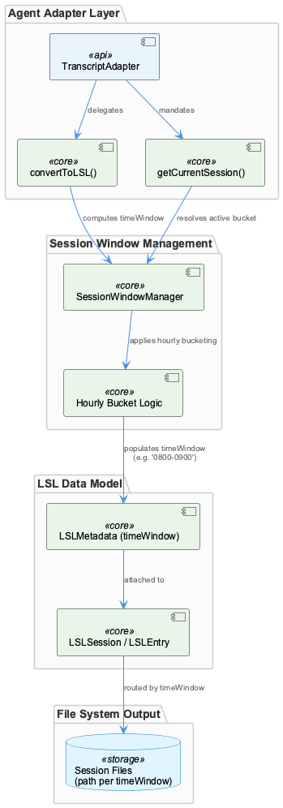
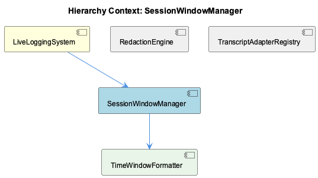

# SessionWindowManager

**Type:** SubComponent

The LSLMetadata type defined in the transcript pipeline includes a `timeWindow` field (formatted as e.g. '0800-0900'), and the TranscriptAdapter contract in `lib/agent-api/transcript-api.js` assigns responsibility for populating this field to the adapter layer, meaning window computation happens at ingestion time

## What It Is

SessionWindowManager is a SubComponent of LiveLoggingSystem responsible for determining which hourly time bucket a given session belongs to and producing the `timeWindow` field that drives downstream file routing. It is not directly implemented as a standalone file based on available observations — rather, its behavior is protocol-level logic that lives inside each agent adapter's `convertToLSL()` and `getCurrentSession()` implementations, as defined by the `TranscriptAdapter` abstract class in `lib/agent-api/transcript-api.js`. Its child component, TimeWindowFormatter, handles the concrete formatting of window values into strings like `'0800-0900'`.

The component's scope is narrow but load-bearing: it produces a single metadata field (`timeWindow`) whose value directly determines the filesystem path where session files are written. There is no further transformation between SessionWindowManager's output and the file routing decision.

---

## Architecture and Design

The most consequential architectural decision visible in the observations is that **window computation is assigned to the adapter layer at ingestion time**, not to a shared downstream utility. This is codified in the `TranscriptAdapter` contract in `lib/agent-api/transcript-api.js`, which requires each adapter subclass to implement `convertToLSL()` — the transformation step where raw agent-native records are mapped to `LSLSession`/`LSLEntry` objects, including their `timeWindow` metadata. The implication is that SessionWindowManager's bucketing logic is replicated, not centralized: the `docs/architecture/adding-new-agent.md` guide explicitly notes that any new agent implementation must re-implement this hourly-bucketing logic, characterizing it as protocol-level behavior rather than a shared utility.

This design trades reuse for strict interface boundaries. By embedding window computation inside the adapter rather than in a shared service, the architecture keeps the adapter self-contained and avoids a shared-state dependency. The trade-off is that correctness of bucketing must be verified independently for every new adapter implementation, and any change to the windowing format (currently `'HHMM-HHMM'`) must be coordinated across all adapters.

The relationship between SessionWindowManager and its sibling components — RedactionEngine and TranscriptAdapterRegistry — is one of sequential pipeline stages rather than peer collaboration. TranscriptAdapterRegistry manages which adapters are available; SessionWindowManager (embedded in those adapters) determines the time bucket; RedactionEngine operates on the resulting content. SessionWindowManager's output does not feed into RedactionEngine's logic, which is driven by pattern configuration in `.specstory/config/redaction-config.yaml`.

---

## Implementation Details

The concrete formatting of the `timeWindow` string is delegated to TimeWindowFormatter, which produces values in the `'HHMM-HHMM'` format (e.g., `'0800-0900'`). This format is embedded in the `LSLMetadata` type and treated as the canonical representation throughout the pipeline. Because file routing is described as directly driven by this field with no further transformation, the format is effectively a filesystem naming convention — changing it would require renaming existing stored files or implementing a migration layer.

The `getCurrentSession()` method mandated by `TranscriptAdapter` in `lib/agent-api/transcript-api.js` is the live-ingestion entry point for SessionWindowManager's logic. When a live agent session is active, `getCurrentSession()` must identify the correct open hourly bucket and return a session object whose `timeWindow` reflects that bucket. This means SessionWindowManager must evaluate the current wall-clock time and round (or truncate) it to the nearest hour boundary — a computation that TimeWindowFormatter presumably encapsulates.

The `convertToLSL()` method handles the historical/batch path: raw agent-native records carry their own timestamps, and the adapter must derive `timeWindow` from those timestamps during transformation. Both paths — live via `getCurrentSession()` and batch via `convertToLSL()` — must produce consistent `timeWindow` values for the same logical hour, since downstream routing treats them identically.

---

## Integration Points

SessionWindowManager's primary integration surface is the `LSLMetadata.timeWindow` field it populates, which is then consumed by the file routing layer to determine the write path. This makes SessionWindowManager an implicit dependency of every component that reads or writes session files — a silent contract that is easy to overlook when adding new agents.

Within LiveLoggingSystem, SessionWindowManager sits between the adapter layer (TranscriptAdapterRegistry dispatches to the correct adapter, which embeds the windowing logic) and whatever file I/O component consumes the populated `LSLSession` objects. The parent component LiveLoggingSystem owns the overall ingestion pipeline, and SessionWindowManager's output is a prerequisite for that pipeline to route correctly.

The child component TimeWindowFormatter encapsulates the string formatting concern, which means changes to the window format string (e.g., adding date prefix, changing separator) should be localized to TimeWindowFormatter without requiring changes to the bucketing logic itself — provided adapters consistently delegate formatting rather than inline the string construction.

---

## Usage Guidelines

When implementing a new agent adapter — as described in `docs/architecture/adding-new-agent.md` — developers must implement the hourly-bucketing logic themselves rather than calling a shared utility. This is the most common source of potential inconsistency: two adapters could produce different `timeWindow` values for the same timestamp if they implement the boundary rounding differently. The convention to follow is the `'HHMM-HHMM'` format produced by TimeWindowFormatter, and new adapters should use TimeWindowFormatter directly rather than reimplementing the string construction.

Because the `timeWindow` field directly determines filesystem paths, it must be treated as immutable once written. Sessions should not have their `timeWindow` recalculated after initial assignment in `convertToLSL()` or `getCurrentSession()`, as doing so would create a mismatch between the field value and the file's actual location. Any scenario where a session spans an hour boundary (e.g., a conversation started at 08:58 and still active at 09:02) requires a deliberate policy decision — the current architecture does not expose how this edge case is handled, and new adapter authors should clarify this before implementation.

The protocol-level nature of SessionWindowManager's behavior — explicitly noted in the architecture guide — means it should be thought of as a **contract to implement**, not a **service to call**. Developers should resist the temptation to centralize this logic into a shared utility without also updating the `TranscriptAdapter` interface contract and all existing adapter implementations, since the contract and the implementation are currently co-located by design.

## Hierarchy Context

### Parent
- [LiveLoggingSystem](./LiveLoggingSystem.md) -- [LLM] The TranscriptAdapter abstract class in `lib/agent-api/transcript-api.js` enforces a strict interface contract that all agent-specific adapters must satisfy. Subclasses must implement five methods: `getAgentType()` (returns a string identifier like 'claude' or 'copilot'), `getTranscriptDirectory()` (returns the filesystem path where native transcripts are stored), `readTranscripts()` (reads raw agent-native files), `convertToLSL()` (transforms them into the unified LSLSession/LSLEntry format), and `getCurrentSession()` (returns the active session for live ingestion). This adapter pattern means that adding a new agent source — say, a Cursor or Gemini CLI — requires only implementing this interface without touching any downstream pipeline code. The LSLMetadata type includes a `timeWindow` field (formatted as e.g. '0800-0900') that the adapter is responsible for populating, meaning the adapter layer also owns the hourly-bucketing logic that drives file routing downstream.

### Children
- [TimeWindowFormatter](./TimeWindowFormatter.md) -- Per the SubComponent context, the LSLMetadata type includes a timeWindow field formatted as e.g. '0800-0900', and the TranscriptAdapter contract in lib/agent-api/transcript-api.js assigns window computation to the adapter layer at ingestion time.

### Siblings
- [RedactionEngine](./RedactionEngine.md) -- RedactionEngine is configured via `.specstory/config/redaction-config.yaml`, which acts as the authoritative pattern registry for what constitutes sensitive data across all agent adapters
- [TranscriptAdapterRegistry](./TranscriptAdapterRegistry.md) -- The TranscriptAdapter abstract class in `lib/agent-api/transcript-api.js` enforces five mandatory methods — `getAgentType()`, `getTranscriptDirectory()`, `readTranscripts()`, `convertToLSL()`, `getCurrentSession()` — forming a strict interface contract all agent adapters must satisfy

---

*Generated from 5 observations*
