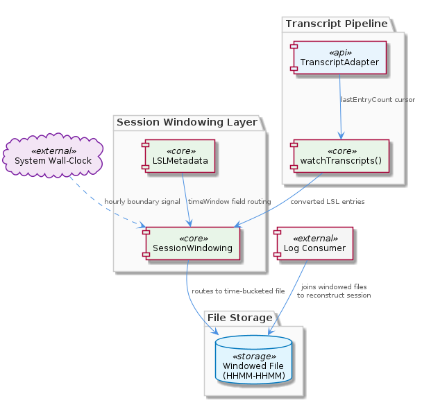
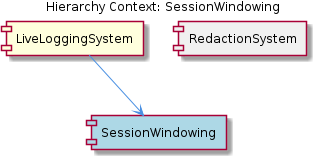

# SessionWindowing

**Type:** SubComponent

Because watchTranscripts() in TranscriptAdapter uses a lastEntryCount cursor, SessionWindowing must handle the case where new entries arrive near a window boundary and could be flushed to either the current or the next window file

## What It Is

SessionWindowing is a SubComponent of LiveLoggingSystem responsible for routing converted LSL (Live Session Log) entries into time-bucketed output files. It operates as a layer above the `TranscriptAdapter` pipeline defined in `lib/agent-api/transcript-api.js`, receiving entries that have already been processed through an adapter's `convertToLSL()` method and directing them to the correct file based on wall-clock hour boundaries. The partitioning scheme is encoded in `LSLMetadata.timeWindow`, a field formatted as `'HHMM-HHMM'` (e.g., `'1400-1500'`), which means a session's log data is physically spread across one or more hourly interval files on disk.

## Architecture and Design

The central design decision in SessionWindowing is **wall-clock-based file partitioning**. Rather than treating a session as a single atomic file, the system slices log output into one-hour buckets keyed by the `LSLMetadata.timeWindow` field. This is a deliberate trade-off: hourly partitioning makes individual files smaller and more manageable, and allows incremental writes without holding a single file handle open for the entire session lifetime. The cost is that **sessions are never self-contained in a single file** — any consumer of the log data must join multiple windowed files to reconstruct a complete session, which pushes complexity downstream to readers rather than writers.

The architecture reflects a clear separation of concerns within LiveLoggingSystem: the `TranscriptAdapter` abstraction handles agent-specific translation (reading Claude Code or Copilot CLI transcripts and normalizing them into LSL entries), while SessionWindowing handles the orthogonal concern of *where* those normalized entries land on disk. This means neither layer needs to know about the other's internals — adapters produce a stream of LSL entries, and SessionWindowing consumes that stream and manages file routing.

Compared to the sibling RedactionSystem — which operates on configuration categories in `.specstory/config/redaction-config.yaml` to mask sensitive fields before or during write — SessionWindowing is purely structural: it does not inspect the content of entries, only their timestamps. The two systems are complementary layers within LiveLoggingSystem, each addressing a distinct concern (data sanitization vs. data placement).

## Implementation Details

The `HHMM-HHMM` format of `LSLMetadata.timeWindow` is the core data contract. Each LSL entry carries this field, which SessionWindowing uses as the partition key to select or create the target file. Because the format encodes only hours and minutes (not dates), **midnight-spanning sessions produce files in two distinct hour buckets with no automatic merge mechanism**. A session running from `2330` to `0030` will generate a `2300-0000` file and a `0000-0100` file, and there is no built-in facility to stitch these together — the consumer bears that responsibility.

The interaction with `watchTranscripts()` in `TranscriptAdapter` introduces a subtle boundary condition. The watch mechanism uses a `lastEntryCount` integer cursor and polls on a `setInterval` (default 1000ms), firing callbacks with only the delta entries since the last poll. If new entries arrive close to an hour boundary — within the same poll cycle that straddles `HH:00:00` — SessionWindowing must correctly assign each entry to its respective window based on the entry's own timestamp rather than the poll time. Because the cursor advances on count rather than on time, there is no guarantee that all entries in a given delta batch belong to the same time window; SessionWindowing must therefore inspect each entry individually.

The O(n) cost of the polling mechanism (noted in the parent LiveLoggingSystem analysis) compounds with windowing: as a session grows long and total entry count increases, each poll cycle re-scans more entries to compute the delta, while SessionWindowing simultaneously manages file handles across potentially multiple active window files. For very long sessions this creates a compounding overhead.

## Integration Points

SessionWindowing sits directly downstream of the `TranscriptAdapter` pipeline in `lib/agent-api/transcript-api.js`. Its input is the stream of converted LSL entries produced by a concrete adapter's `convertToLSL()` implementation; its output is the set of `HHMM-HHMM`-named files on disk. Any component that needs to read complete session data must therefore treat SessionWindowing's output as a *set* of files rather than a single artifact, using `LSLMetadata.timeWindow` values to enumerate and sequence them.

The RedactionSystem sibling intersects with SessionWindowing at the write path: redaction must occur before or at the point of file write, meaning the two systems need a defined ordering contract within LiveLoggingSystem's pipeline. The observations do not specify whether redaction is applied before SessionWindowing routes entries or after, but the architectural cleanest arrangement would be redaction upstream of windowing, so that window files never contain unredacted content.

## Usage Guidelines

Developers consuming windowed log files must never assume a single file represents a complete session. The correct approach is to enumerate all files whose `LSLMetadata.timeWindow` values fall within the session's known time range and merge them in chronological order. For sessions that cross midnight, the date component of the filename or directory path (if present) must be used to disambiguate same-format `timeWindow` values from different calendar days.

When implementing new `TranscriptAdapter` subclasses (as LiveLoggingSystem supports via its pluggable adapter contract), the adapter's `getCurrentSession()` and `convertToLSL()` methods must produce entries with accurate, entry-level timestamps rather than batch-level timestamps. Coarse timestamps assigned at poll time rather than at entry creation time will cause SessionWindowing to misplace entries near hour boundaries, corrupting the integrity of individual window files.

The `lastEntryCount` cursor mechanism means that SessionWindowing should be treated as **append-only per window file**: entries are never retroactively reassigned to a different window after the poll cycle that wrote them. Any retry or deduplication logic must account for the fact that the same entry could theoretically be written to an incorrect window file if the system clock is adjusted between a transcript being created and the next poll cycle firing.

For long-running sessions, operators should be aware that the combination of O(n) polling and multi-file window management creates a performance profile that degrades over session lifetime. If session lengths regularly exceed a few hours, introducing a file-handle cache keyed by `timeWindow` value — rather than opening and closing the target file on each write — would reduce I/O overhead significantly.

## Hierarchy Context

### Parent
- [LiveLoggingSystem](./LiveLoggingSystem.md) -- [LLM] The `TranscriptAdapter` abstract base class in `lib/agent-api/transcript-api.js` defines a pluggable adapter contract that decouples the LSL pipeline from specific agent implementations. The five abstract methods — `getAgentType()`, `getTranscriptDirectory()`, `readTranscripts()`, `convertToLSL()`, and `getCurrentSession()` — establish a clear interface that concrete adapters (e.g., for Claude Code and Copilot CLI) must implement. This pattern means the core LSL infrastructure never directly references agent-specific transcript formats or filesystem layouts. A new developer adding support for a third agent (say, Cursor or Aider) would subclass `TranscriptAdapter` and implement only these five methods without touching the converter, file manager, or validation layers. The `watchTranscripts()` method is notably NOT abstract — it is a concrete polling implementation shared by all adapters, using `setInterval` with a default 1000ms interval and a `lastEntryCount` integer cursor that advances only when new entries are detected, then fires registered callbacks with only the delta entries. This means the watch mechanism is O(n) in total entry count per poll cycle, which could become a performance concern for very long sessions.

### Siblings
- [RedactionSystem](./RedactionSystem.md) -- The redaction configuration lives at .specstory/config/redaction-config.yaml and uses category-based grouping, meaning operators can enable or disable entire classes of sensitive data (e.g., 'api_keys', 'pii') without editing individual patterns

---

*Generated from 4 observations*
