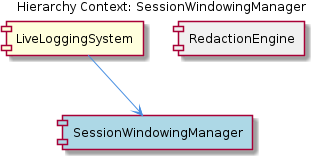

# SessionWindowingManager

**Type:** SubComponent

The `SessionWindowingManager` component within `LiveLoggingSystem` implements boundary detection logic that closes and rotates the active file slot when a session's `timeWindow` value crosses an hourly threshold.

# SessionWindowingManager — Technical Insight Document

## What It Is

`SessionWindowingManager` is a sub-component of the `LiveLoggingSystem` responsible for time-bucketed partitioning of incoming session log data. While direct source files were not enumerated in the observations, the component operates within the broader LSL (Live Session Logging) infrastructure that lives under `lib/agent-api/` (alongside `TranscriptAdapter` in `lib/agent-api/transcript-api.js` and `LSLConverter` in `lib/agent-api/transcripts/lsl-converter.js`). Its specific responsibility is assigning incoming sessions to discrete **hourly file slots** based on the `LSLMetadata.timeWindow` field, and rotating the active slot when a session's `timeWindow` value crosses an hourly threshold.

In concrete terms, the manager implements the "session windowing with time-based identifiers" capability described in the parent `LiveLoggingSystem` documentation (e.g., windows like `'0800-0900'`). Each captured agent session — whether originating from Claude Code or another agent supported by a `TranscriptAdapter` subclass — carries a `timeWindow` value in its `LSLMetadata`, and the `SessionWindowingManager` uses that value as the routing key for log partitioning.

## Architecture and Design

The architectural approach is a **time-window dispatcher** pattern: a single component reads a metadata-bound time identifier from each session and maps it deterministically to a file slot. This keeps partitioning logic centralized rather than scattering it across the transcript-conversion paths handled by `LSLConverter`. The design cleanly separates *when* a session belongs to a file (windowing) from *how* a session is serialized (conversion), which is a natural extension of the adapter pattern that governs the parent `LiveLoggingSystem`.

Boundary detection is a key design element. Rather than relying on external schedulers, `SessionWindowingManager` performs **inline threshold checks**: when an incoming session's `timeWindow` indicates that the hourly boundary has been crossed, the manager closes the currently active file slot and rotates to a new one. This event-on-arrival approach avoids timer-driven flush bugs and ties rotation directly to actual logging activity — slots without sessions never need to be force-closed.

The component sits as a peer to `RedactionEngine` under `LiveLoggingSystem`. The two siblings serve complementary, non-overlapping concerns: `SessionWindowingManager` decides *where* (which time-bucketed file) log content goes, while `RedactionEngine` decides *what* content is safe to write. Together they form the routing and sanitization pipeline that sits between the raw transcript adapters and the on-disk LSL output.

## Implementation Details

The mechanics of the component revolve around a single critical input: the `LSLMetadata.timeWindow` field. This field carries a time identifier (consistent with the `'0800-0900'` convention noted in the parent system's documentation), and the manager treats it as the **slot key** for routing. When a new session arrives, the manager:

1. Reads `timeWindow` from the session's `LSLMetadata`.
2. Compares it against the currently active slot's window identifier.
3. If they match, the session is appended to the active slot.
4. If the value indicates a crossed hourly threshold, the manager closes the current slot and opens (or rotates to) the slot corresponding to the new `timeWindow`.

This boundary-detection logic is the component's defining behavior. Because the rotation is triggered by the incoming data itself, the manager does not need its own clock or scheduler — it derives all timing decisions from `LSLMetadata.timeWindow`. The implementation thus depends on the upstream populator of that metadata field (presumably the `TranscriptAdapter` subclasses, which are required to implement `getCurrentSession()` and `convertToLSL()`).

While the observations do not enumerate specific class symbols for `SessionWindowingManager` itself, the component must coordinate with the parent system's file I/O constraints — particularly the configured rotation thresholds and file size bounds (1MB–100MB) defined in `.specstory/config/lsl-config.json` and validated by `scripts/validate-lsl-config.js`. The hourly time windowing is therefore one of two complementary rotation triggers (time-based and size-based) that govern when a file slot is closed.

## Integration Points

The clearest integration is with `LSLMetadata`, the metadata structure produced upstream during transcript ingestion. The `timeWindow` field is the singular contract between session producers and `SessionWindowingManager`. Any `TranscriptAdapter` implementation (extending the abstract base in `lib/agent-api/transcript-api.js`) that feeds the `LiveLoggingSystem` must ensure this field is populated correctly; otherwise, windowing decisions will be incorrect or undefined.

Downstream, `SessionWindowingManager` integrates with the file output layer of `LiveLoggingSystem`. It coordinates with the buffered I/O subsystem (the parent system documents a 100ms flush interval and 50-entry max buffer in `integrations/mcp-server-semantic-analysis/src/logging.ts`) — slot rotations must respect in-flight buffered writes to avoid splitting a session across boundaries incorrectly. It also operates in concert with size-based rotation thresholds defined in the system's schema-constrained configuration.

Laterally, the component is independent of its sibling `RedactionEngine`: the two do not share state, but their outputs flow into the same file slots. A typical write path is: adapter produces session → `RedactionEngine` sanitizes content → `SessionWindowingManager` selects the appropriate hourly slot → `LSLConverter` serializes the session into LSL markdown or JSONL → buffered I/O persists it.

## Usage Guidelines

When extending or working with `SessionWindowingManager`, developers should treat `LSLMetadata.timeWindow` as a **strict contract**. Adapter implementations must compute this value consistently (matching the parent system's `'0800-0900'`-style format) and must not mutate it after a session enters the windowing path. Inconsistent or post-hoc changes to `timeWindow` will break the boundary-detection logic, since the manager's rotation decision is based on the value at session-arrival time.

Avoid introducing parallel rotation logic elsewhere in `LiveLoggingSystem`. The manager is the single authoritative point for hourly slot decisions; size-based rotation (governed by the configured file size bounds in `.specstory/config/lsl-config.json`) is a separate, complementary trigger and should remain so. Mixing time- and size-based rotation across multiple components would make file-slot lifecycle reasoning intractable.

Because boundary detection happens inline on session arrival, very low-activity periods will result in slots remaining "open" until the next session crosses the next hourly threshold. This is intentional and avoids producing empty files, but consumers reading the LSL output should not assume a slot file exists for every hour — only for hours during which at least one session was logged. When testing or validating behavior, exercise both within-window appends and cross-boundary rotations, and validate configuration through `scripts/validate-lsl-config.js` to ensure rotation thresholds and file size bounds are consistent with the windowing strategy.

---

## Summary of Architectural Insights

1. **Architectural patterns identified**: Time-window dispatcher pattern; metadata-driven routing; event-on-arrival boundary detection; clean separation of windowing concerns from serialization (`LSLConverter`) and sanitization (`RedactionEngine`).

2. **Design decisions and trade-offs**: Inline threshold checks (no scheduler) trade strict periodic rotation for simplicity and accuracy under variable activity; reliance on `LSLMetadata.timeWindow` centralizes routing logic but creates a strict upstream contract for adapter implementations.

3. **System structure insights**: `SessionWindowingManager` is a peer to `RedactionEngine` under `LiveLoggingSystem`, sitting between transcript ingestion (via `TranscriptAdapter` subclasses) and persisted LSL output, with file-slot lifecycle as its core responsibility.

4. **Scalability considerations**: Hourly bucketing naturally bounds individual file growth; combined with the system's configured 1MB–100MB size bounds and 100ms buffered I/O flush, the design scales by partitioning rather than by increasing per-file throughput. Multi-user scenarios (handled at the parent level via SHA-256 user hashing) compose cleanly with windowing since each user's stream can be windowed independently.

5. **Maintainability assessment**: The component's responsibility is narrow and well-defined, which is favorable for maintenance. The main risk is the implicit contract on `LSLMetadata.timeWindow` — any change to how that field is computed must be coordinated across all `TranscriptAdapter` implementations. Schema validation via `scripts/validate-lsl-config.js` partially mitigates configuration drift, but the `timeWindow` format itself is not directly schema-checked at the windowing boundary.

## Hierarchy Context

### Parent
- [LiveLoggingSystem](./LiveLoggingSystem.md) -- The LiveLoggingSystem is the infrastructure responsible for capturing, converting, and routing Claude Code (and other agent) conversation sessions into a unified LSL (Live Session Logging) format. It handles session windowing with time-based identifiers (e.g., '0800-0900'), multi-user support via SHA-256 user hashing, file routing with size/rotation thresholds, and transcript format conversion between agent-native formats (JSONL conversation files) and LSL markdown or JSON-Lines output. The system is configured primarily through `.specstory/config/lsl-config.json` and a companion `redaction-config.yaml`, with validation tooling in `scripts/validate-lsl-config.js`.

The architecture follows an adapter pattern: `TranscriptAdapter` (lib/agent-api/transcript-api.js) is an abstract base class that agent-specific implementations must extend, requiring `getAgentType()`, `getTranscriptDirectory()`, `readTranscripts()`, `convertToLSL()`, and `getCurrentSession()`. The `LSLConverter` class (lib/agent-api/transcripts/lsl-converter.js) handles the actual format translation — converting sessions to markdown, JSONL, or parsing JSONL back — with configurable content truncation, secret redaction, and tool result inclusion. The system also integrates a 5-layer ontology classification pipeline (referenced in `lsl-5-layer-classification.puml`) for categorizing captured log entries.

Key operational concerns include async buffered file I/O (100ms flush interval, 50-entry max buffer in `integrations/mcp-server-semantic-analysis/src/logging.ts`), schema-constrained configuration validation (file size bounds of 1MB–100MB, rotation thresholds, batch sizes), and a watch/poll mechanism in `TranscriptAdapter.watchTranscripts()` that polls `getCurrentSession()` on a configurable interval to emit new entries to registered callbacks.

### Siblings
- [RedactionEngine](./RedactionEngine.md) -- RedactionEngine is a sub-component of LiveLoggingSystem

---

*Generated from 3 observations*
