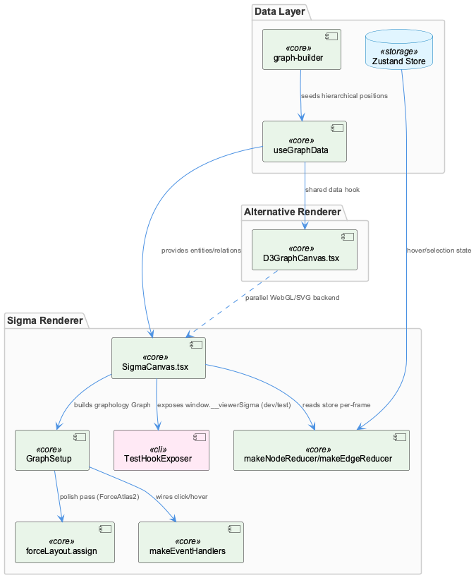
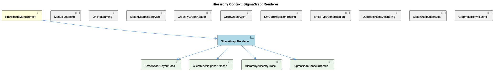

# SigmaGraphRenderer

**Type:** SubComponent

## What It Is

SigmaGraphRenderer is best identified with `integrations/unified-viewer/src/graph/SigmaCanvas.tsx`, the WebGL graph-rendering component built around `<SigmaContainer>` and a nested `GraphSetup` component. No file in the supplied set literally bears the name "SigmaGraphRenderer," so this document treats SigmaCanvas.tsx as its concrete implementation. It constructs a graphology `Graph` from `useGraphData()` output, applies `graphology-layout-force` (`forceLayout.assign`) as a polish pass on top of graph-builder's hierarchical seed positions, and wires interaction through `makeEventHandlers()`. It lives within KnowledgeManagement alongside sibling subcomponents like GraphDatabaseService and GraphifyGraphReader, but functions specifically as the viewer's rendering surface rather than a data or persistence layer.

## Architecture and Design

The component embodies a **reducer pattern for visual state**: `makeNodeReducer`/`makeEdgeReducer` read the Zustand store per-frame to compute draw attributes without re-running layout, which is what makes hover/selection responsive without cost. This is enforced structurally — the main graph-build `useEffect` deliberately excludes `hoveredNode` from its dependency list, splitting layout/data concerns (rebuilt on entities/relations/theme change) from purely visual reducer concerns (rebuilt on hover/selection). Effect dependency arrays thus function as a deliberate architectural contract boundary, not an incidental React detail.

SigmaGraphRenderer also participates in a **dual-renderer architecture**: it coexists with sibling-level `D3GraphCanvas.tsx`, an SVG-based force-directed renderer ported from memory-visualizer's `GraphVisualization.tsx` using `d3.forceSimulation`. Both share `useGraphData`, `useGraphVisibility`, and color-fallback logic, but implement independent selection/ancestry logic — SigmaCanvas delegates to its reducer model and to child HierarchyAncestryTrace-adjacent logic, while D3GraphCanvas implements its own `computeAncestryPath`/`deriveAncestryFromStorePath`. This is a conscious trade-off: shared data plumbing, divergent rendering backends.

A documented design decision of note: ForceAtlas2 was tried and explicitly rejected ("FA2 collapsed the connected component into a tight ball at the centroid no matter how we tuned it"), leading to adoption of `graphology-layout-force` instead — the child entity ForceAtlas2LayoutPass is therefore a misnomer relative to actual behavior, since ForceAtlas2 is abandoned rather than used.

## Implementation Details

`GraphSetup` is the operative sub-component: it builds the graphology graph, seeds positions hierarchically via graph-builder, and applies a low-intensity `forceLayout.assign` polish pass — a tightly coupled two-stage layout pipeline. Node rendering uses per-shape dispatch: `nodeProgramClasses: SHAPE_NODE_PROGRAMS` and `defaultNodeType: 'circle'` (Plan 55-05, UI-SPEC §14) let each node's reducer-assigned `type` field select the correct sigma draw program — this dispatch table lives in child SigmaNodeShapeDispatch, whose actual `SHAPE_NODE_PROGRAMS` contents reside in `./reducers`, outside the supplied files.

Double-click expansion is wired via `doubleClickNode: ({ node }) => { void handlers.handleDoubleClickNode(node) }`, fed by `getLoadedRelations: () => relations` — the mechanism behind child ClientSideNeighborExpand. An inline comment clarifies this is now "the single path" for neighbor expansion across all backends, a holdover from when OKM lacked a neighbors endpoint; actual filtering/mutation logic is delegated to `makeEventHandlers` in `./events`, not present in the supplied files.

The `@react-sigma/core` hook set (`useLoadGraph`, `useRegisterEvents`, `useSetSettings`, `useCamera`) composes the rendering pipeline. A fragility is documented explicitly: adding `zoomToSizeRatioFunction` silently broke the settings prop's type-check and crashed the canvas, prompting a rollback — evidence that the sigma settings object is brittle under additive changes. For testing, `TestHookExposer` exposes the sigma instance as `window.__viewerSigma`, gated on `import.<COMPANY_NAME_REDACTED>.env.MODE`, enabling Playwright inspection; `ZoomControls` is also part of this module.

## Integration Points

SigmaGraphRenderer depends on `useGraphData()` for entity/relation input, shared with sibling D3GraphCanvas, and on graph-builder for seeded hierarchical positions. Its children — ForceAtlas2LayoutPass (actually graphology-layout-force), ClientSideNeighborExpand, HierarchyAncestryTrace, and SigmaNodeShapeDispatch — represent internal subsystems whose deeper logic (`./events`, `./reducers`, `./ancestry`) is largely delegated to modules outside the supplied file set, meaning SigmaCanvas.tsx is primarily an orchestration/wiring layer.

Upstream, the Wave Insight Persistence record establishes that Wave 4 produced 73 insight documents but zero `entityType: 'Insight'` graph nodes — meaning any graph SigmaGraphRenderer draws (via `useGraphData` feeding `buildGraph`) simply never contains those insights as nodes. This is explicitly a data-availability gap upstream of rendering, not a defect in SigmaCanvas's drawing logic. Similarly, `findEntityByName`'s name-only resolution (fixed by threading `entityType` through `queryIncomingRelations`/`storeRelationship`) could cause mis-wired edges to visually connect unrelated concepts if rendered by Sigma — again, a graph-writing concern rather than a rendering one.

## Usage Guidelines

Preserve the effect-dependency-list contract: never add `hoveredNode` (or other purely-visual state) to the main graph-build effect's dependencies, or layout will needlessly re-run on every hover. Treat the `@react-sigma` settings object as fragile — any additive property change should be verified against the type-check/runtime crash risk demonstrated by the `zoomToSizeRatioFunction` incident. When extending shape rendering, modify `./reducers`' `SHAPE_NODE_PROGRAMS` rather than bypassing the `nodeProgramClasses`/`defaultNodeType` dispatch. For neighbor expansion, rely on the existing client-side `doubleClickNode`/`getLoadedRelations` path rather than assuming a server-side neighbors endpoint exists — none is mounted. Finally, if graph content appears incomplete or edges look wrong, first check upstream entity/relation persistence (per the Wave Insight Persistence and `findEntityByName` findings) before assuming a SigmaCanvas rendering bug.

## Work Record

What working sessions recorded about this entity — decisions taken, problems hit, and why things are the way they are:

- The same Wave Insight Persistence record documents that findEntityByName resolved entities by name only, causing a new Detail node to inherit 24 incoming edges from an unrelated same-named SubComponent; if such mis-wired edges reached a Sigma-based renderer they would visually connect two unrelated concepts, though the fix (threading entityType through <AWS_SECRET_REDACTED>, with a 'Coding' anchor fallback) lives in graph-writing code, not in SigmaCanvas.

## Hierarchy Context

### Parent
- [KnowledgeManagement](./KnowledgeManagement.md) -- [SESSION] Wave Insight Persistence work record establishes that Wave 4 was writing 73 insight documents but zero corresponding Insight graph nodes, meaning the viewer's History sidebar (which filters strictly to entityType 'Insight') could never surface a Batch badge for that run's conclusions.

### Children
- [ForceAtlas2LayoutPass](./ForceAtlas2LayoutPass.md) -- [LLM] No component, file, class, or function named 'ForceAtlas2LayoutPass' appears anywhere in the supplied code. The closest match is the layout-polish logic inside SigmaCanvas.tsx's GraphSetup component, which explicitly does NOT use sigma's ForceAtlas2 algorithm. A code comment (SigmaCanvas.tsx, 'eighth iteration') states that ForceAtlas2 was tried and rejected: 'FA2 collapsed the connected component into a tight ball at the centroid no matter how we tuned it,' after which the implementation switched to `graphology-layout-force` (`forceLayout.assign(graph, {...})`) as 'the closest in-ecosystem port' of VKB's d3.forceSimulation behavior. This is the opposite of a ForceAtlas2 pass — it's a documented abandonment of ForceAtlas2 in favor of a different force library.
- [ClientSideNeighborExpand](./ClientSideNeighborExpand.md) -- [LLM] The strongest textual anchor for 'ClientSideNeighborExpand' in the supplied files is the `doubleClickNode` handler wired inside SigmaCanvas.tsx's `GraphSetup` effect: `doubleClickNode: ({ node }) => { void handlers.handleDoubleClickNode(node) }`, fed by `getLoadedRelations: () => relations`. The inline comment directly above this call states the intent explicitly: 'The double-click expand's only source, for every backend. It used to be the okb branch's workaround for OKM having no neighbors endpoint, while coding was believed to fetch one; no backend mounts that route, so this is now the single path.' That sentence is describing exactly the concept a component named ClientSideNeighborExpand would implement — expanding a node's neighbors from data already resident in the browser rather than issuing a server call — but the expansion logic itself (the code that filters `relations` for edges touching the clicked node and mutates the graphology `Graph`) is not present in SigmaCanvas.tsx; it is delegated to `makeEventHandlers` from `./events`, a module not included in the supplied files.
- [HierarchyAncestryTrace](./HierarchyAncestryTrace.md) -- [LLM] No file or function literally named 'HierarchyAncestryTrace' appears anywhere in the supplied code, and the <code_graph> block supplied for this analysis is empty (no nodes/edges). The nearest concrete artifact is `deriveAncestryFromStorePath` in integrations/unified-viewer/src/graph/D3GraphCanvas.tsx, which is itself a thin reconciliation wrapper around `computeAncestryPath` — a function imported from './ancestry' (integrations/unified-viewer/src/graph/ancestry.ts) whose actual body is not part of the supplied file set. This means the true ancestry-computation logic (the BFS itself) is invisible here; only its consumer is visible.
- [SigmaNodeShapeDispatch](./SigmaNodeShapeDispatch.md) -- [LLM] The only concrete evidence of a node-shape dispatch mechanism is the settings block passed to <SigmaContainer> in integrations/unified-viewer/src/graph/SigmaCanvas.tsx: `nodeProgramClasses: SHAPE_NODE_PROGRAMS` and `defaultNodeType: 'circle'`, annotated as 'Plan 55-05 (UI-SPEC §14): per-shape node-program dispatch. Each node's reducer output carries `type: <shape>`... sigma dispatches each draw to the right program.' This is the wiring point where sigma's per-node `type` field is used to select a draw program, but the actual `SHAPE_NODE_PROGRAMS` table and any per-shape branching logic are defined in `./reducers` (imported alongside `makeEdgeReducer`, `makeNodeReducer`, `setReducedMotion`), a module whose contents are not present in the supplied files.

### Siblings
- [ManualLearning](./ManualLearning.md) -- [SESSION] Wave Insight Persistence work record establishes that Wave 4 wrote 73 insight documents but zero corresponding Insight graph nodes, showing manually/human-curated conclusions can exist as documents without ever being anchored into the graph as entities.
- [OnlineLearning](./OnlineLearning.md) -- [SESSION] Wave Insight Persistence work record establishes that the History sidebar filters strictly to entityType 'Insight', so a Batch badge for a run's conclusions can only appear if the online pipeline actually writes Insight-typed graph nodes, not just insight documents.
- [GraphDatabaseService](./GraphDatabaseService.md) -- [SESSION] Wave Insight Persistence work record establishes that the persistence layer can silently accept writes to one representation (insight documents) while never receiving corresponding writes to another (Insight graph nodes), leaving the two out of sync with no error raised.
- [GraphifyGraphReader](./GraphifyGraphReader.md) -- [LLM] None of the supplied Code Files implement or reference a component named GraphifyGraphReader, nor do they import from or call into `integrations/semantic-analysis/src/agents/graphify-graph.ts`. The five files retrieved — `ukb-workflow-modal.tsx`, `assert-graph-density.ts`, `D3GraphCanvas.tsx`, `SigmaCanvas.tsx`, and `attribution.test.ts` — belong to `system-health-dashboard` and `unified-viewer`, two consumer-facing viewer packages that read graph data over HTTP from `obs-api` (port 12436), not the `semantic-analysis` agent layer where a 'GraphifyGraphReader' would plausibly live alongside `GraphifyGraph` and `CodeGraphAgent`.
- [CodeGraphAgent](./CodeGraphAgent.md) -- [LLM] The parent entity's own description characterizes CodeGraphAgent (integrations/semantic-analysis/src/agents/code-graph-agent.ts) as a compatibility shim: it preserves its full historical public interface — CodeEntity, CodeRelationship types, and the checkMemgraphConnection method — from an era when it queried a live Memgraph/Cypher backend, while internally delegating entirely to GraphifyGraph's static file-based reads. This is a Facade/Adapter pattern applied to a backend migration: callers written against the old contract, including guard clauses like `if (!connectionCheck.connected)`, continue to work unmodified even though the underlying 'connection' concept is now meaningless — a deliberate decoupling of consumer code changes from the storage-layer migration, at the cost of a permanently misleading method name in the API surface.
- [KmCoreMigrationTooling](./KmCoreMigrationTooling.md) -- [LLM] Every code file supplied for this analysis — integrations/system-health-dashboard/src/components/ukb-workflow-modal.tsx, integrations/unified-viewer/scripts/assert-graph-density.ts, integrations/unified-viewer/src/graph/D3GraphCanvas.tsx, integrations/unified-viewer/src/graph/SigmaCanvas.tsx, and integrations/unified-viewer/src/graph/attribution.test.ts — belongs to the dashboard/unified-viewer rendering layer (workflow progress UI, force-directed graph canvases, a node-count budget check, and an attribution-category test). None of them touch km-core's own migration surface: there is no reference in any of these files to LevelDB persistence, entity-type consolidation tables, or a Memgraph-to-file-store transition path.
- [EntityTypeConsolidation](./EntityTypeConsolidation.md) -- [LLM] None of the supplied files (ukb-workflow-modal.tsx, assert-graph-density.ts, D3GraphCanvas.tsx, SigmaCanvas.tsx, attribution.test.ts) implement entity-type consolidation logic. They concern workflow history pagination, graph density budgeting, and D3/Sigma rendering of already-typed entities — none touch a mapping table or type-folding migration.
- [DuplicateNameAnchoring](./DuplicateNameAnchoring.md) -- [SESSION] The Wave Insight Persistence work record documents that the anchor pass originally resolved entities by name only via `findEntityByName`, and because of that a newly created Detail-type node silently inherited 24 incoming edges belonging to an unrelated same-named SubComponent created weeks earlier. The record states the fix required threading entityType through both `queryIncomingRelations` and `storeRelationship` so entity lookups disambiguate by (name, type) pairs rather than name alone, with a fixed fallback `projectAnchorName = 'Coding'` introduced so nodes with no other resolvable parent attach to a known anchor instead of becoming orphans.
- [GraphAttributionAudit](./GraphAttributionAudit.md) -- [LLM+CGR] `categoriseUnattributed` (imported by `integrations/unified-viewer/scripts/assert-graph-density.ts` and exercised in `integrations/unified-viewer/src/graph/attribution.test.ts`) splits unrooted graph nodes into four mutually exclusive categories — `recordedParent`, `wrongClass`, `danglingRef`, `unclaimed` — instead of one generic 'unattributed' bucket. The test `'a recorded name that resolves to TWO rooted entities is NOT a suggestion'` shows why: when a `parentEntityName` string matches two same-named rooted entities (the comment notes 40 of 98 live roll-up parents share their child's name), the function refuses to guess and falls back to `unclaimed` rather than emitting a `suggestedParentId` that would be a coin flip presented as an answer.
- [GraphVisibilityFiltering](./GraphVisibilityFiltering.md) -- [LLM] The actual implementation of the visibility predicate — `@/graph/visibility-predicate.ts` (exporting `isEntityVisible` and the `VisibilityFilters` type) and `@/graph/useGraphVisibility.ts` (the hook wrapping it) — is not present in the supplied files. What is present are two CONSUMERS: `integrations/unified-viewer/scripts/assert-graph-density.ts`, which imports `isEntityVisible`/`VisibilityFilters` directly to replay the canvas's filtering offline, and `integrations/unified-viewer/src/graph/D3GraphCanvas.tsx`, which calls a `useGraphVisibility()` hook. Both treat the predicate as an opaque contract rather than defining it, so any statement about the internal branching logic of the filter would be inference, not observation.

---

*Generated from 9 observations*
