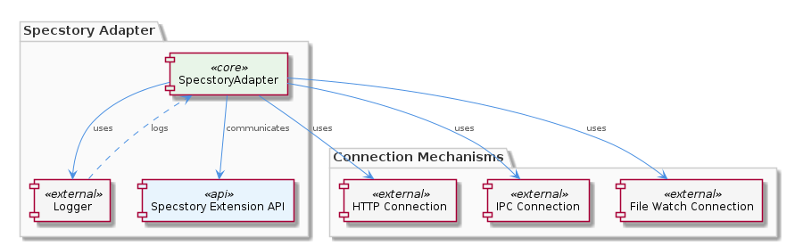
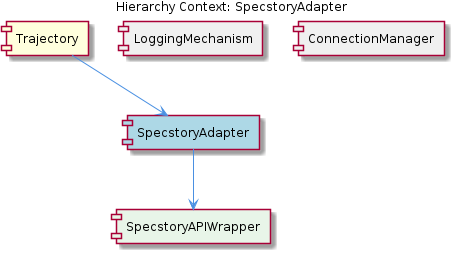

# SpecstoryAdapter

**Type:** SubComponent

The SpecstoryAdapter follows the execute(input, context) pattern for lazy initialization and execution, which is implemented in the lib/integrations/specstory-adapter.js file.

## What It Is  

The **SpecstoryAdapter** is a sub‑component located in `lib/integrations/specstory-adapter.js`.  It implements the canonical `execute(input, context)` entry point, which enables *lazy initialization* – the adapter’s heavy setup (such as opening network sockets or file watchers) is deferred until the first call to `execute`.  Within this file the adapter orchestrates communication with the **Specstory** extension API using three distinct transport mechanisms: **HTTP**, **IPC**, and **file‑watch**.  Logging of all activity, including conversation entries generated by its parent component **Trajectory**, is performed through the `createLogger` helper imported from `../logging/Logger.js`.  The adapter also contains a nested **SpecstoryAPIWrapper**, which abstracts the low‑level API calls made over the selected transport.



---

## Architecture and Design  

The design of the SpecstoryAdapter revolves around two explicit patterns that emerge directly from the source observations:

1. **Lazy‑Initialization (Execute‑Pattern)** – By exposing a single `execute(input, context)` function, the adapter postpones expensive setup (e.g., establishing HTTP listeners or spawning IPC channels) until it is actually needed.  This pattern reduces start‑up latency for the overall system, a decision that aligns with the parent **Trajectory** component’s need for quick initialization before logging begins.

2. **Adapter / Strategy Hybrid** – The adapter abstracts the underlying **Specstory** extension API behind the `SpecstoryAPIWrapper`.  It then selects one of three *strategies* (HTTP, IPC, file‑watch) at runtime.  The `connectViaHTTP` method, for instance, can be configured with multiple ports, allowing the component to adapt to varied deployment environments without code changes.  Although the observations do not label this as a formal “Strategy” pattern, the presence of interchangeable connection methods (HTTP, IPC, file‑watch) fulfills the same intent.

Interaction among sibling components is evident: the **LoggingMechanism** sibling supplies the `createLogger` function, while the **ConnectionManager** sibling contributes the `connectViaHTTP` implementation used by the adapter.  This shared‑utility approach promotes reuse and keeps the adapter focused on orchestration rather than low‑level transport details.



---

## Implementation Details  

The core of the adapter lives in `lib/integrations/specstory-adapter.js`.  At the top of the file the logger is instantiated:

```js
import { createLogger } from '../logging/Logger.js';
const logger = createLogger('SpecstoryAdapter');
```

The `execute(input, context)` function acts as the public façade.  On its first invocation it performs *lazy* setup:

* **Connection selection** – Based on configuration (or environment detection) it calls one of the three connection helpers:
  * `connectViaHTTP(options)` – Accepts an array of ports, enabling the adapter to bind to any available HTTP endpoint.  The observation that “connectViaHTTP supports multiple connection ports for HTTP requests” confirms this flexibility.
  * `connectViaIPC(pipeName)` – Establishes an inter‑process communication channel for tighter coupling with the Specstory extension when both run on the same host.
  * `watchFile(path)` – Monitors a designated file for changes, allowing a file‑based handshake protocol.

* **SpecstoryAPIWrapper** – Once a transport is ready, the adapter creates an instance of `SpecstoryAPIWrapper`, which encapsulates the raw request/response handling.  This wrapper isolates the rest of the system from transport‑specific quirks, presenting a uniform method set (e.g., `sendMessage`, `fetchConversation`).

* **Logging** – Throughout the lifecycle, the logger records key events: connection attempts, successful handshakes, and each conversation entry forwarded from **Trajectory**.  The observation that “the SpecstoryAdapter may use the logging mechanism to log conversation entries” is realized by calls such as `logger.info('Conversation logged', payload)`.

Because the adapter is a *sub‑component*, it does not expose its internal classes directly; instead, it returns a promise or result from `execute` that the parent **Trajectory** consumes.  This encapsulation keeps the public contract simple while allowing internal evolution.

---

## Integration Points  

* **Parent – Trajectory** – The **Trajectory** component invokes `SpecstoryAdapter.execute` to log conversation entries.  This tight coupling is intentional: Trajectory supplies the conversational payload, while the adapter handles delivery to the external Specstory API.

* **Sibling – LoggingMechanism** – By importing `createLogger` from `../logging/Logger.js`, the adapter aligns its logging format and destination with the rest of the system, ensuring consistent observability.

* **Sibling – ConnectionManager** – The `connectViaHTTP` method is shared across siblings, allowing the adapter to reuse connection‑management logic (such as port selection and retry policies) without duplicating code.

* **Child – SpecstoryAPIWrapper** – The wrapper abstracts the external API contract.  Any change to the Specstory extension (e.g., new endpoints or authentication flows) can be accommodated inside the wrapper without affecting the adapter’s public `execute` signature.

* **External – Specstory Extension API** – Communication occurs over the three supported transports.  The adapter’s ability to fall back from HTTP to IPC or file‑watch provides resilience in heterogeneous deployment scenarios (e.g., sandboxed environments where only file‑watch is permitted).

All dependencies are resolved via relative imports, keeping the module graph shallow and straightforward to navigate.

---

## Usage Guidelines  

1. **Prefer the `execute` entry point** – Directly invoking any internal helper (e.g., `connectViaHTTP`) bypasses the lazy‑initialization guard and may lead to duplicated connections.  Always call `SpecstoryAdapter.execute(input, context)` from the parent component.

2. **Configure transport early** – If a specific transport is required (e.g., IPC for intra‑process communication), provide the necessary configuration in the `context` object before the first `execute` call.  The adapter will honor the supplied options and avoid unnecessary fallback attempts.

3. **Leverage the shared logger** – Use the same logger name (`SpecstoryAdapter`) when adding custom log statements within the adapter’s codebase.  This ensures that all logs appear under a unified namespace, simplifying troubleshooting.

4. **Handle promise rejections** – `execute` returns a promise that resolves when the conversation entry has been successfully transmitted.  Consumers should `await` this promise or attach `.catch` handlers to manage network failures, especially when using the HTTP transport with multiple ports.

5. **Do not modify the child wrapper directly** – Any changes to the Specstory API should be made inside `SpecstoryAPIWrapper`.  Keeping the wrapper isolated preserves the adapter’s stable contract and reduces the risk of breaking the parent **Trajectory** component.

---

### Summary of Key Insights  

| Aspect | Insight |
|--------|---------|
| **Architectural patterns identified** | Lazy‑initialization (execute‑pattern), Adapter/Strategy hybrid (multiple transport strategies) |
| **Design decisions and trade‑offs** | Lazy init reduces start‑up cost but adds a one‑time setup latency; supporting three transports increases flexibility but adds code complexity and testing surface |
| **System structure insights** | SpecstoryAdapter sits under **Trajectory**, shares utilities with **LoggingMechanism** and **ConnectionManager**, and delegates API specifics to **SpecstoryAPIWrapper** |
| **Scalability considerations** | HTTP transport can scale horizontally via multiple ports; IPC and file‑watch are limited to single‑host scenarios, so choose transport based on scaling needs |
| **Maintainability assessment** | Clear separation of concerns (logging, connection, API wrapper) aids maintainability; however, the multiplicity of transport paths requires disciplined testing and documentation to avoid regression |


## Hierarchy Context

### Parent
- [Trajectory](./Trajectory.md) -- [LLM] The Trajectory component utilizes the SpecstoryAdapter for logging conversation entries, which is implemented in the lib/integrations/specstory-adapter.js file. This adapter follows the execute(input, context) pattern for lazy initialization and execution, allowing for efficient component initialization. The SpecstoryAdapter also employs connection methods via HTTP, IPC, and file watch, providing flexibility in communication with the Specstory extension API. For instance, the connectViaHTTP method supports multiple connection ports for HTTP requests, as seen in the lib/integrations/specstory-adapter.js file. Furthermore, the SpecstoryAdapter utilizes a logging mechanism through the createLogger function from ../logging/Logger.js, enabling modular and flexible logging capabilities.

### Children
- [SpecstoryAPIWrapper](./SpecstoryAPIWrapper.md) -- The SpecstoryAdapter follows the execute(input, context) pattern for lazy initialization and execution, which is implemented in the lib/integrations/specstory-adapter.js file.

### Siblings
- [LoggingMechanism](./LoggingMechanism.md) -- The createLogger function from ../logging/Logger.js enables modular and flexible logging capabilities.
- [ConnectionManager](./ConnectionManager.md) -- The connectViaHTTP method in the SpecstoryAdapter supports multiple connection ports for HTTP requests.


---

*Generated from 7 observations*
