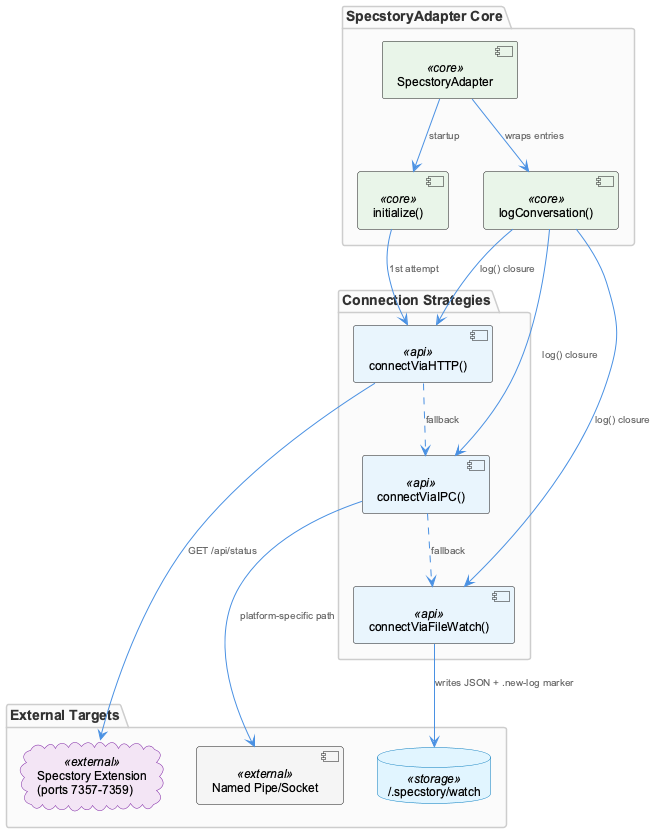
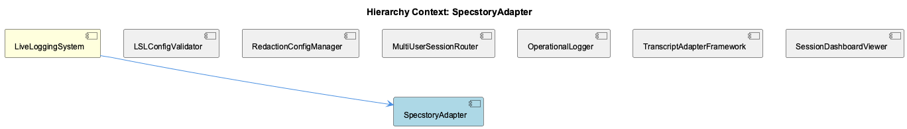

# SpecstoryAdapter

**Type:** SubComponent

connectViaHTTP() probes fixed candidate ports [7357, 7358, 7359] with a GET /api/status request, verifying response.extensionId or response.name matches 'specstory' before establishing a log() closure

# SpecstoryAdapter: Technical Insight Document

## What It Is

SpecstoryAdapter is a class implemented in `specstory-adapter.js` that serves as the integration bridge between the LiveLoggingSystem and the SpecStory VS Code extension. As a direct child of LiveLoggingSystem, it inherits responsibility for translating live conversation events into a format consumable by SpecStory, while insulating the rest of the logging pipeline from the volatility of extension connectivity. Unlike its sibling TranscriptAdapterAPI — which enforces a strict abstract-base-class contract (`getAgentType`, `readTranscripts`, `convertToLSL`, `getCurrentSession`) — SpecstoryAdapter is a connection-oriented adapter, concerned primarily with *how* to reach the extension rather than *how* to parse transcript formats.

## Architecture and Design

The defining architectural pattern here is a **fallback chain** (essentially a Chain-of-Responsibility applied to connection establishment), explicitly modeled as its own child component, SpecstoryInitializeFallbackChain. The `initialize()` method encodes this as a single expression: `this.extensionApi = await connectViaHTTP() || await connectViaIPC() || await connectViaFileWatch()`, relying on JavaScript's OR short-circuit evaluation to attempt each transport in order of preference (fastest/most capable to most durable/least capable) and stop at the first success.

This design reflects a clear trade-off: HTTP is preferred for its bidirectional richness and immediacy, IPC is a fallback for environments where HTTP probing fails (e.g., port conflicts or firewalling), and file-watching is the most degraded but always-available option, since it only requires filesystem access. Each transport is encapsulated as its own connect method, keeping the initialize() logic declarative and free of protocol-specific detail — a separation of concerns that also allows HTTPPortScanConnection (the HTTP-specific child) to evolve independently.

## Implementation Details

**connectViaHTTP()** (implemented via HTTPPortScanConnection) performs a fixed-port scan across `[7357, 7358, 7359]`, issuing a `GET /api/status` request per candidate via `this.httpRequest()`. A response is only accepted as valid if `response.extensionId` or `response.name` matches `'specstory'`, guarding against false positives from unrelated services occupying those ports. On success, it establishes a `log()` closure bound to the confirmed HTTP endpoint.

**connectViaIPC()** is platform-aware: it selects `\\.\pipe\specstory-vscode` on `win32` versus `/tmp/specstory-vscode.sock` elsewhere, with a hard 1-second connection timeout to avoid blocking the fallback chain indefinitely on a dead socket.

**connectViaFileWatch()** is the last-resort mechanism, requiring no live process on the other end. It writes timestamped JSON entries into `~/.specstory/watch` and touches a `.new-log` marker file, which the extension presumably polls or watches to detect new entries — a classic filesystem-as-message-queue pattern.

**logConversation()** is the unified write path once a connection method is established. It wraps each entry in a `specstoryEntry` envelope, tagging `metadata.tool` as `'coding-tools'` and `metadata.session` with a `Date.now()`-based `sessionId` generated once at construction time, ensuring all entries from a single adapter instance share a consistent session identity regardless of which transport ultimately delivers them.

## Integration Points

SpecstoryAdapter is contained within LiveLoggingSystem, whose parent module `logging.ts` is the authoritative source for session windowing and transcript capture semantics — meaning any change to session lifecycle definitions upstream can affect how `sessionId` and entry timing are interpreted downstream by SpecstoryAdapter. Structurally, it exposes two internal children as first-class entities: HTTPPortScanConnection (the port-scanning HTTP transport) and SpecstoryInitializeFallbackChain (the ordered fallback logic itself), both of which are documented and reasoned about independently despite living inside the same class. Its siblings — LslSessionDashboard, TranscriptAdapterAPI, BackendLoggerCore, and ProgressFireTrigger — operate at the same hierarchy level but address orthogonal concerns (session chain rotation, transcript format abstraction, config caching, and progress-fire timing triggers respectively), none of which SpecstoryAdapter directly depends on based on current observations.

## Usage Guidelines

Developers extending or debugging SpecstoryAdapter should preserve the fallback ordering invariant in `initialize()` — the HTTP → IPC → FileWatch sequence is a deliberate degradation path, not an arbitrary order, and reordering it changes latency/reliability trade-offs system-wide. When adding new transports, follow the existing pattern of a dedicated `connectVia*()` method returning a truthy connection handle on success and falsy on failure, so it composes cleanly with the OR-chain in SpecstoryInitializeFallbackChain. The port list `[7357, 7358, 7359]` in HTTPPortScanConnection is fixed and should be treated as a contract with the SpecStory extension; changing it requires coordinated updates on the extension side. Finally, because `sessionId` is generated once at construction via `Date.now()`, adapter instances should not be long-lived across logically distinct sessions — a new SpecstoryAdapter should be constructed per session boundary to keep `metadata.session` semantically meaningful.

## Code Evidence

Key code artifacts grounding this entity's analysis:

**Structural:**
- SpecstoryAdapter (class) in specstory-adapter.js

## Hierarchy Context

### Parent
- [LiveLoggingSystem](./LiveLoggingSystem.md) -- [LLM] The LiveLoggingSystem centers around logging.ts, which owns the core responsibilities of session windowing, file routing, and transcript capture. This module acts as the single ingestion point for live Claude Code conversation data, meaning any change to session lifecycle semantics (e.g., how a 'session window' is defined or when it rolls over to a new file) has cascading effects on downstream consumers like the classification agent and config validation tooling. New developers should treat logging.ts as the authoritative source of truth for how raw conversation events are structured before they are persisted to disk.

### Children
- [HTTPPortScanConnection](./HTTPPortScanConnection.md) -- connectViaHTTP() iterates over ports = [7357, 7358, 7359] issuing GET /api/status to each via this.httpRequest()
- [SpecstoryInitializeFallbackChain](./SpecstoryInitializeFallbackChain.md) -- initialize() sets this.extensionApi = await connectViaHTTP() || await connectViaIPC() || await connectViaFileWatch(), relying on JS OR short-circuit for fallback ordering

### Siblings
- [LslSessionDashboard](./LslSessionDashboard.md) -- lsl-sessions.mjs defines a chain as an hourly tranche including rotation parts, not a single file, because legacy '-N_' markdown parts are headerless fragments split mid-token and pi-format parts are linked via parentSession
- [TranscriptAdapterAPI](./TranscriptAdapterAPI.md) -- TranscriptAdapter is an abstract base class in transcript-api.js that throws on direct instantiation via `new.target === TranscriptAdapter` check, forcing agent-specific subclasses to implement getAgentType, readTranscripts, convertToLSL, getCurrentSession
- [BackendLoggerCore](./BackendLoggerCore.md) -- Logger.js loads config/logging-config.json once via loadConfig(), caching it in module-level sharedConfig and exposing reloadConfig() to force a refresh
- [ProgressFireTrigger](./ProgressFireTrigger.md) -- progressFireDecision() fires on EITHER of two independent triggers: a token-delta trigger (cumulative output tokens grown by >= thresholdTokens since last mark) or a wall-clock trigger (elapsed ms >= elapsedThresholdMs)

---

*Generated from 6 observations*
