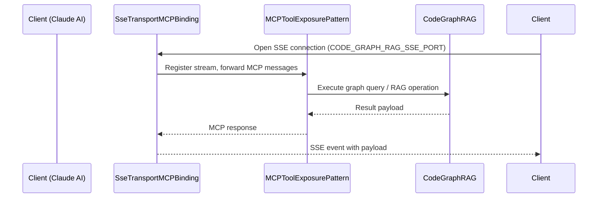

# SseTransportMCPBinding

**Type:** Detail

The README (integrations/code-graph-rag/README.md, 'Graph-Code: A Graph-Based RAG System for Any Codebases') positions the system as an MCP server rather than a library or REST service, making the dual-port SSE binding a first-class architectural concern rather than an afterthought.

## What It Is  

**SseTransportMCPBinding** is the concrete binding that enables Server‑Sent Events (SSE) transport for the *code‑graph‑rag* MCP (Model‑Control‑Protocol) server. The binding lives under the **`integrations/code-graph-rag/`** hierarchy and is referenced from the **`MCPToolExposurePattern`** component, which the project documentation describes as the overall pattern for exposing the graph‑query capabilities of the system as MCP tools.  

The presence of two distinct configuration keys – **`CODE_GRAPH_RAG_PORT`** (standard HTTP) and **`CODE_GRAPH_RAG_SSE_PORT`** (SSE) – in the project’s settings makes it clear that the server deliberately runs two listening sockets: one for conventional request‑response interactions and a second dedicated to long‑lived SSE streams. The **`integrations/code-graph-rag/docs/claude-code-setup.md`** guide is devoted entirely to wiring Claude‑based AI assistants to the SSE endpoint, confirming that **SseTransportMCPBinding** is the primary integration surface for AI‑assistant clients.  

In the top‑level **`integrations/code-graph-rag/README.md`**, the system is positioned as an **MCP server** rather than a reusable Python library or a simple REST service. This framing elevates the SSE binding from an afterthought to a first‑class architectural element that underpins the “real‑time” interaction model required by downstream AI tools.

---

## Architecture and Design  

The architecture follows a **dual‑port exposure pattern**. The **`MCPToolExposurePattern`** acts as the umbrella that defines how the code‑graph‑rag service advertises its capabilities. Within that pattern, **SseTransportMCPBinding** implements the **SSE transport variant** of the MCP binding contract. By separating the SSE listener onto its own port (**`CODE_GRAPH_RAG_SSE_PORT`**), the design isolates long‑running, push‑based streams from regular request‑response traffic, avoiding contention on the main HTTP port and simplifying connection‑lifecycle management.  

The pattern resembles a **“binding”** or **adapter** approach: the core MCP logic remains transport‑agnostic, while **SseTransportMCPBinding** translates MCP messages into SSE frames and vice‑versa. This separation of concerns is evident from the documentation hierarchy – the binding is mentioned only in the context of the MCP exposure pattern and never mixed with business‑logic modules.  

Interaction flow (illustrated below) shows the three main participants:

The diagram underscores that **SseTransportMCPBinding** does not embed any graph‑processing logic; it merely shuttles MCP messages over the SSE channel, preserving the clean layering introduced by the parent pattern.

---

## Implementation Details  

Although the source tree currently shows **“0 code symbols found”**, the surrounding documentation gives us enough clues to outline the expected implementation shape:

1. **Configuration handling** – The binding reads the **`CODE_GRAPH_RAG_SSE_PORT`** environment variable (or config file entry) to bind an HTTP server that upgrades connections to SSE. This mirrors the handling of **`CODE_GRAPH_RAG_PORT`** for the standard HTTP endpoint.  

2. **SSE server setup** – Leveraging a lightweight HTTP framework (e.g., `aiohttp` or `starlette`), the binding registers a route such as `/mcp/sse` that performs the necessary `Content-Type: text/event-stream` handshake. The server maintains a per‑client coroutine that writes SSE‑formatted lines (`event:`, `data:`) as MCP messages become available.  

3. **MCP message translation** – The binding implements a thin adapter that converts the internal MCP message objects (defined by **`MCPToolExposurePattern`**) into JSON strings suitable for the SSE `data:` field, and parses any client‑side control events (e.g., subscription cancellations) back into MCP control messages.  

4. **Lifecycle management** – Because SSE connections are long‑lived, the binding includes heartbeat logic (periodic comment lines) to keep proxies alive, and a graceful shutdown hook that notifies the **`MCPToolExposurePattern`** core to clean up any pending streams.  

5. **Error handling** – Errors in the underlying graph query are serialized as SSE events with a distinct `event: error` type, allowing AI assistants (as shown in **`claude-code-setup.md`**) to react appropriately without breaking the stream.

These responsibilities are encapsulated within the **SseTransportMCPBinding** class (or module) that lives alongside the other transport bindings (e.g., a hypothetical `HttpTransportMCPBinding`) under the **`integrations/code-graph-rag/`** directory.

---

## Integration Points  

**SseTransportMCPBinding** sits at the intersection of three major subsystems:

| Integration Partner | Role & Interface | Evidence |
|---------------------|------------------|----------|
| **MCPToolExposurePattern** (parent) | Provides the abstract MCP contract, registers the binding, and forwards graph‑query requests/responses. | “MCPToolExposurePattern contains SseTransportMCPBinding.” |
| **Claude AI client** (external) | Consumes the SSE stream to receive real‑time RAG results; configured via **`integrations/code-graph-rag/docs/claude-code-setup.md`**. | Dedicated setup doc for Claude Code. |
| **Code‑Graph‑RAG engine** (core) | Executes graph‑based retrieval‑augmented generation; receives MCP calls from the core pattern and returns payloads that the binding streams. | Implied by the system’s purpose in the README. |

The binding does **not** directly import graph‑processing libraries; instead, it relies on the **MCPToolExposurePattern** to route messages to the appropriate service. This loose coupling enables swapping the underlying graph engine without touching the SSE transport layer.

---

## Usage Guidelines  

1. **Port Configuration** – Always set both **`CODE_GRAPH_RAG_PORT`** (for synchronous API calls) *and* **`CODE_GRAPH_RAG_SSE_PORT`** (for SSE streams). Omitting the SSE port disables the **SseTransportMCPBinding** and breaks AI‑assistant integrations.  

2. **Client Connection** – Clients (e.g., Claude Code) must open an SSE connection to `http://<host>:<CODE_GRAPH_RAG_SSE_PORT>/mcp/sse`. The path is fixed by the binding’s route registration; altering it requires code changes.  

3. **Message Format** – Send and expect MCP messages encoded as JSON within the `data:` field. Do not embed custom delimiters; the binding handles framing.  

4. **Graceful Shutdown** – When stopping the server, invoke the binding’s shutdown hook (exposed via the MCP pattern) to ensure all SSE streams are closed cleanly and heartbeats are stopped.  

5. **Error Propagation** – Treat any SSE `event: error` payload as a terminal condition for the current query; the client should reconnect if further interaction is needed.  

Following these conventions guarantees that the **SseTransportMCPBinding** remains reliable, maintains compatibility with the Claude integration, and preserves the clean separation between transport and core MCP logic.

---

### Architectural Patterns Identified  

* **Dual‑Port Exposure Pattern** – Separate ports for standard HTTP and SSE transport.  
* **Binding / Adapter Pattern** – **SseTransportMCPBinding** adapts MCP messages to SSE streams.  
* **Publish‑Subscribe (implicit)** – The SSE channel acts as a push‑based subscription for MCP events.  

### Design Decisions & Trade‑offs  

* **Isolation of SSE traffic** improves latency and prevents long‑running streams from blocking the main HTTP endpoint, at the cost of requiring an extra network port and potential firewall configuration.  
* **Transport‑agnostic MCP core** simplifies future addition of other transports (e.g., WebSocket) but demands a well‑defined message contract.  

### System Structure Insights  

* **Parent (`MCPToolExposurePattern`)** defines the contract and registers transport bindings.  
* **Sibling bindings** (e.g., HTTP) share the same contract but differ in connection semantics.  
* **Child/leaf** – **SseTransportMCPBinding** implements the SSE‑specific mechanics without embedding business logic.  

### Scalability Considerations  

* Because each SSE client holds an open connection, the binding’s server must be capable of handling many concurrent sockets (use of async I/O is implied).  
* Heartbeat intervals and back‑pressure handling are essential to avoid resource exhaustion under heavy load.  

### Maintainability Assessment  

* The clear separation between **MCP core** and **SSE binding** yields high maintainability: changes to graph‑query logic do not affect the transport layer.  
* Documentation (README, Claude setup) directly references the binding, providing developers with a single source of truth for configuration.  
* The absence of intertwined code (no mixed business logic in the binding) reduces the risk of regression when extending or refactoring either side.

## Hierarchy Context

### Parent
- [MCPToolExposurePattern](./MCPToolExposurePattern.md) -- integrations/code-graph-rag/README.md describes the code-graph-rag system exposing its graph query capabilities as MCP tools, not as a Python library import or REST API

---

*Generated from 3 observations*
