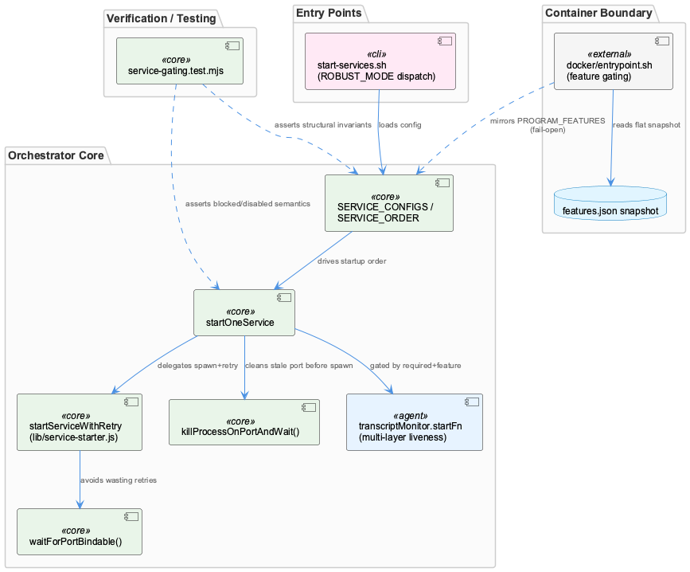
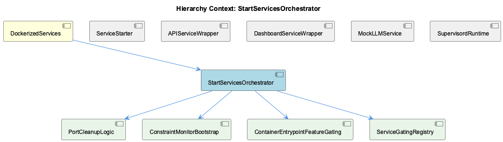

# StartServicesOrchestrator

**Type:** SubComponent

## What It Is

StartServicesOrchestrator is concretely implemented in `scripts/start-services-robust.js`, invoked via `start-services.sh` when `ROBUST_MODE=true` (the default). It replaces what was previously a set of hand-written bash start blocks with a Node orchestrator that centralizes service ordering, retry policy, feature gating, and health checking into a single declarative configuration object. It is a child of `DockerizedServices` and is structurally a sibling of `ServiceStarter` (the shared entity name for the same script when described from the primitives angle — `lib/service-starter.js`'s `startServiceWithRetry`, `createHttpHealthCheck`, and `createPidHealthCheck`), as well as `APIServiceWrapper`, `DashboardServiceWrapper`, `MockLLMService`, and `SupervisordRuntime`.

## Architecture and Design

The core architectural pattern is **config-table-as-source-of-truth**: `SERVICE_CONFIGS` and `SERVICE_ORDER`, exported from `scripts/start-services-robust.js`, are consumed directly by both runtime and `tests/features/service-gating.test.mjs`. The test enforces structurally that every service declares a `feature` field and that `SERVICE_ORDER`/`SERVICE_CONFIGS` "cover each other exactly," preventing the class of bug where "ten hand-written start blocks were ten chances to forget a gate." This registry role is what the `ServiceGatingRegistry` child component formalizes.

A second pattern is **graduated escalation** for process/port cleanup, implemented in `killProcessOnPortAndWait()` (child: `PortCleanupLogic`) — SIGTERM issued unconditionally, polling via `lsof -ti:<port>` every `pollIntervalMs`, SIGKILL only once half of `maxWaitMs` elapses. Paired with this is `waitForPortBindable()`, a deliberately distinct probe from HTTP-based `isPortListening`, using a throwaway `net.createServer().listen()` to avoid burning retry budget on transient kernel socket states.

A third pattern is **asymmetric fail-open/fail-closed boundaries**: the orchestrator itself is fail-closed with retry budgets, while `docker/entrypoint.sh` (child: `ContainerEntrypointFeatureGating`) is deliberately fail-open — unknown or missing feature snapshots default to enabled, because a silently-empty container is harder to diagnose than an over-running one.

Finally, **required-vs-feature-enabled decoupling** means "required" only matters when a feature is actually on; a disabled feature reports as `disabled`, never `degraded`, preserving the distinction between "off on purpose" and "broken."

## Implementation Details

Each `SERVICE_CONFIGS` entry is a `{name, feature, psmPath, required, maxRetries, timeout, startFn, healthCheckFn}` tuple. The `transcriptMonitor` entry layers three liveness checks before spawning: a global ProcessStateManager check, a per-project PSM check, and an OS-level `isProcessRunningByScript('enhanced-transcript-monitor.js')` via `pgrep -lf` to catch orphans PSM doesn't know about — re-registering rather than duplicating them. This is load-bearing since a prior per-project LSL coordinator was retired (Phase 33 plan 07) and `bin/coding` now spawns the monitor directly per session.

Port cleanup and bindability checks (`killProcessOnPortAndWait`, `waitForPortBindable`) are internal helpers guarding `startServiceWithRetry`'s retry budget. `docker/entrypoint.sh` implements its own bash-based gate, iterating `PROGRAM_FEATURES` pairs (e.g. `constraint-monitor:constraints`) against a flat `/coding/.coding/runtime/features.json` snapshot, using `node -e` per-pair since `jq` isn't installed, writing `autostart=false` into `/etc/supervisor/features.d/disabled.conf`.

## Integration Points

The orchestrator sits under `DockerizedServices`, which layers manual verification discipline (baseline snapshot before `docker-compose up -d`, post-restart health confirmation against SPEC R6's running/stopped/unknown contract) on top — notably *not* encoded in any script, implying prior silent drift. It shares `lib/service-starter.js` primitives with `ServiceStarter`. Host (`SERVICE_CONFIGS`) and container (`entrypoint.sh`) each independently resolve feature state rather than the container calling back to the host resolver — related to `SupervisordRuntime`'s open investigation into runtime feature snapshot drift toward overly restrictive states.

## Usage Guidelines

New services must be added to both `SERVICE_CONFIGS` and `SERVICE_ORDER` or CI fails. Required-service semantics only apply when the feature flag is on. Disabled features must surface as `disabled`, never `degraded`. Prefer `waitForPortBindable`/`killProcessOnPortAndWait` over ad hoc kill-then-continue logic. Treat `start-services.sh`'s legacy bash path as dead code under normal `ROBUST_MODE=true` operation, and always verify health post-restart rather than trusting supervisord "started" status alone.

## Code Evidence

Key code artifacts grounding this entity's analysis:

- scripts/start-services-robust.js is the concrete orchestrator: it exports `SERVICE_CONFIGS`, `SERVICE_ORDER`, and `startOneService`, and tests/features/service-gating.test.mjs consumes these exports directly to assert structural invariants — every service in `SERVICE_CONFIGS` must declare a `feature` field, and `SERVICE_ORDER` and `SERVICE_CONFIGS` 'cover each other exactly' (same key sets, sorted). The test comment explains why this is enforced structurally rather than by convention: 'ten hand-written start blocks were ten chances to forget a gate' — the orchestrator's per-service config table is treated as the single source of truth that both the runtime and the test suite read from, so a new service added to one but not the other fails CI rather than silently starting ungated in production.
- The orchestrator distinguishes REQUIRED from OPTIONAL services structurally: `tests/features/service-gating.test.mjs` asserts `SERVICE_CONFIGS.transcriptMonitor.required === true` and that a required-service failure sets `out.blocked === true`, blocking downstream services, while a disabled FEATURE on a required service (`featureSet({ lsl: false })`) does NOT block startup (`out.blocked === false`) — i.e. 'required-ness applies only when the feature is on'. The same test file also asserts a disabled feature is reported in `results.disabled`, never in `results.degraded`, because 'Degraded means we wanted this and could not have it' — conflating an intentionally-off service with a failed one would make a pared-down install look broken in the same status report a healthy install uses.
- The `transcriptMonitor` entry in `SERVICE_CONFIGS` (scripts/start-services-robust.js) layers three independent liveness checks before spawning: `psm.isServiceRunning('transcript-monitor', 'global')`, then a per-project PSM check via `psm.isServiceRunning('enhanced-transcript-monitor', 'per-project', {...})`, then an OS-level `isProcessRunningByScript('enhanced-transcript-monitor.js')` via `pgrep -lf`. The third check exists specifically to catch orphaned processes the ProcessStateManager doesn't know about, and on a match it re-registers the orphan with PSM (`psm.registerService(...)`) rather than spawning a duplicate — the comment 'CRITICAL' flags this as load-bearing since a stale per-project LSL coordinator was retired ('Phase 33 plan 07') and `bin/coding` now spawns the monitor directly per session, removing the layer that previously deduplicated centrally.

## Work Record

What working sessions recorded about this entity — decisions taken, problems hit, and why things are the way they are:

- Docker Container Restart Verification Baseline establishes capturing supervisor process list and container state as a baseline before docker-compose up -d, to compare against post-restart state and catch regressions like stale naming or misconfigured mounts.
- The 'Docker Container Restart Verification Baseline' work record establishes that before running `docker-compose up -d`, the current supervisor process list and container state must be captured as a baseline snapshot to compare against post-restart state, explicitly to catch regressions like stale container naming or misconfigured volume mounts. The record notes this discipline is NOT encoded in any script referenced in the initial analysis — it is a manual/procedural safeguard layered on top of the docker-compose workflow, which the record says implies the container/supervisor configuration has previously drifted silently across restarts.
- The 'Coding-Services Docker Container — Health Verification Workflow' record defines the standard rebuild procedure after code/data changes: rebuild via docker-compose, then explicitly confirm all supervised processes and health endpoints are live before trusting downstream pipelines like wave-analysis. The record ties this verification step to the running/stopped/unknown health-check contract (SPEC R6) so that 'live' status is determined by a defined three-state probe rather than an ad hoc check, and states the emphasis on verification-before-reliance exists because supervisord-managed services in this container have previously appeared to restart successfully while actually being in a degraded or non-functional state.

## Hierarchy Context

### Parent
- [DockerizedServices](./DockerizedServices.md) -- [SESSION] Docker Container Restart Verification Baseline establishes that before running docker-compose up -d, the current supervisor process list and container state should be captured as a baseline to compare against post-restart state and catch regressions like stale naming or misconfigured mounts

### Children
- [PortCleanupLogic](./PortCleanupLogic.md) -- [LLM+CGR] `killProcessOnPortAndWait()` in scripts/start-services-robust.js is the concrete PortCleanupLogic: it takes a `port` and options (`maxWaitMs=5000`, `pollIntervalMs=200`, `label`), first calling an inline `checkPortInUse()` closure (built on `lsof -ti:${port}`) to short-circuit if the port is already free. If occupied, it re-runs `lsof -ti:${port}` to collect PIDs, then loops `process.kill(pid, 'SIGTERM')` over each one. This mirrors the parent's [LLM] observation describing the same function's 'graduated-escalation design' — the code confirms it structurally: SIGTERM is unconditional and immediate, SIGKILL is conditional and delayed.
- [ConstraintMonitorBootstrap](./ConstraintMonitorBootstrap.md) -- [LLM] None of the supplied code files define, export, or reference a symbol, class, or function literally named 'ConstraintMonitorBootstrap'. The closest material is docker/entrypoint.sh's PROGRAM_FEATURES gate (which maps 'constraint-monitor', 'constraint-dashboard', and 'constraint-dashboard-api' program names to the 'constraints' feature and writes autostart=false into /etc/supervisor/features.d/disabled.conf when that feature is off), and start-services.sh's legacy bash block that clones integrations/constraint-monitor, brings up its docker-compose stack (Qdrant + Redis), and starts its dashboard/API processes on ports 3030/3031. Neither of these is a 'bootstrap' abstraction in the sense of a dedicated initialization class/module — they are, respectively, a container-level feature toggle and a shell-scripted legacy startup sequence.
- [ContainerEntrypointFeatureGating](./ContainerEntrypointFeatureGating.md) -- [LLM] docker/entrypoint.sh implements the container-side feature gate as a self-contained bash block (the "Feature gating" section) rather than delegating to a Node script for the decision logic, even though it shells out to `node -e` per-pair for the actual on/off evaluation. The design reads `FEATURES_SNAPSHOT="/coding/.coding/runtime/features.json"` — a flat JSON file mounted read-only — and iterates a space-separated `PROGRAM_FEATURES` string of `program:feature` pairs (`semantic-analysis:knowledge`, `embedding-listener:knowledge`, `graphify:codegraph`, `constraint-monitor:constraints`, `constraint-dashboard:constraints`, `constraint-dashboard-api:constraints`, `health-dashboard:health`, `health-dashboard-frontend:health`), writing `autostart=false` stanzas into `/etc/supervisor/features.d/disabled.conf` for anything found off. This is a materially different mechanism from the host-side `loadFeatures()`/`SERVICE_CONFIGS` gating in scripts/start-services-robust.js — the container has no access to `~/.coding/features.yaml` and cannot run the resolver, so it consumes a pre-resolved snapshot rather than re-deriving the same decision.
- [ServiceGatingRegistry](./ServiceGatingRegistry.md) -- [LLM+CGR] There is no class or file literally named `ServiceGatingRegistry`; the registry function is implemented as a plain object, `SERVICE_CONFIGS`, in `scripts/start-services-robust.js`, where each key (e.g. `transcriptMonitor`, `liveLoggingCoordinator`) maps to a config entry declaring `name`, `feature`, `psmPath`, `required`, `maxRetries`, `timeout`, `startFn`, and `healthCheckFn`. `tests/features/service-gating.test.mjs` treats this object as the canonical registry under test, asserting structurally that every entry in `SERVICE_CONFIGS` declares a `feature` field and that `SERVICE_ORDER` and `SERVICE_CONFIGS` 'cover each other exactly' (`ordered = SERVICE_ORDER.map(o => o.key).sort()` must equal `configured = Object.keys(SERVICE_CONFIGS).sort()`). This is the concrete mechanism behind the parent entity's claim that 'ten hand-written start blocks were ten chances to forget a gate.'

### Siblings
- [ServiceStarter](./ServiceStarter.md) -- [LLM] scripts/start-services-robust.js is the actual ServiceStarter implementation — a Node orchestrator that wraps lib/service-starter.js's startServiceWithRetry/createHttpHealthCheck/createPidHealthCheck primitives into a declarative SERVICE_CONFIGS map, each entry a {name, feature, psmPath, required, maxRetries, timeout, startFn, healthCheckFn} tuple. start-services.sh is a thin bash shim that execs this script when ROBUST_MODE=true (the default) and only falls back to an inline legacy bash startup path (manual docker-compose/lsof/kill logic) when ROBUST_MODE=false, meaning the legacy code in start-services.sh below the exec is dead in normal operation but kept for backward compatibility.
- [APIServiceWrapper](./APIServiceWrapper.md) -- [LLM] The supplied code files do not contain scripts/api-service.js, which the parent-entity context describes as the actual implementation of the wrapper-process pattern (spawning integrations/constraint-monitor/src/dashboard-server.js as a child process and registering its PID with ProcessStateManager under type 'global', name 'constraint-api-child'). Everything in this analysis about APIServiceWrapper's specific spawn/registration logic is inherited from the parent's prior observation rather than verified against source shown here, so it should be treated as a summary of prior findings, not a fresh code read.
- [DashboardServiceWrapper](./DashboardServiceWrapper.md) -- [LLM] None of the supplied files define, import, or instantiate a `DashboardServiceWrapper` class or module. The parent entity's own [LLM] observation names the actual wrapper scripts — `scripts/api-service.js` (spawns `integrations/constraint-monitor/src/dashboard-server.js`) and `scripts/dashboard-service.js` (wraps `npm run dev` for the constraint-monitor dashboard) — but neither file's source was retrieved here; only `docker/entrypoint.sh`, `scripts/prompt-classifier-service.mjs`, `scripts/start-services-robust.js`, `start-services.sh`, and `tests/features/service-gating.test.mjs` were provided, none of which contain a class or script named DashboardServiceWrapper.
- [MockLLMService](./MockLLMService.md) -- [LLM] None of the retrieved code files (docker/entrypoint.sh, scripts/prompt-classifier-service.mjs, scripts/start-services-robust.js, start-services.sh, tests/features/service-gating.test.mjs) implement, import, or reference a MockLLMService. The parent entity's own observations name the actual implementation as integrations/semantic-analysis/src/mock/llm-mock-service.ts, which checks process.env.CODING_ROOT and overrides the repositoryPath argument to reconcile host-mounted paths against container-internal paths — but that file's contents were not supplied to this analysis, so nothing about its internal structure, its mock response strategy, or how it is wired into the semantic-analysis service can be verified here.
- [SupervisordRuntime](./SupervisordRuntime.md) -- [SESSION] Feature Snapshot Forensics — Runtime Config Drift Investigation documents an ongoing, unresolved effort to find what rewrites the runtime feature snapshot into an overly restrictive state (e.g. 'logging-only'), causing silent service outages.

---

*Generated from 12 observations*
