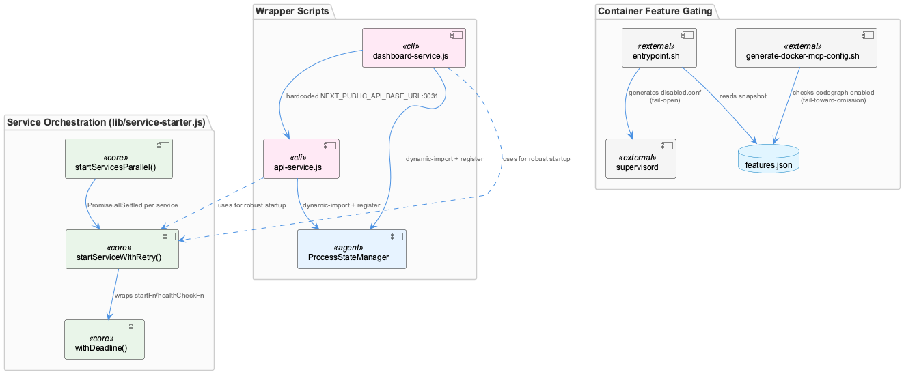
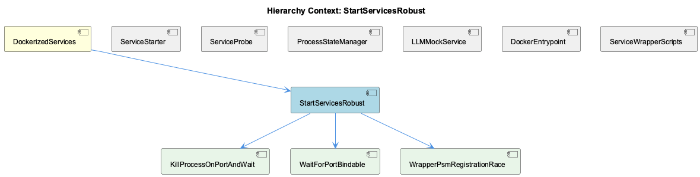

# StartServicesRobust

**Type:** SubComponent

[Architecture Notes] lib/service-starter.js is a generic orchestration utility with no direct dependency on the specific services it starts — health checks and start functions are injected as callbacks (startFn, healthCheckFn), making it reusable across VKB, graphify, and other services referenced in its own docstring example; Tight coupling between dashboard-service.js's hardcoded NEXT_PUBLIC_API_BASE_URL and api-service.js's independently configurable PORT — cross-service port wiring is not validated at startup; docker/entrypoint.sh and generate-docker-mcp-config.sh both implement feature-gating logic independently for different surfaces (supervisord vs MCP registration), duplicating the concept of reading feature state without a shared abstraction; Lazy/dynamic import of process-state-manager.js in both wrapper scripts decouples PSM registration failures from the child process's own success/failure path — PSM errors are caught and logged but do not block service startup; supervisord acts as the in-container process manager layer that entrypoint.sh's generated features.d/disabled.conf modifies via autostart flags, rather than entrypoint.sh directly starting/stopping processes itself

# StartServicesRobust — Technical Insight Document

## What It Is

StartServicesRobust is the resilient service-startup subsystem centered on `lib/service-starter.js` and `scripts/start-services-robust.js`, with supporting wrapper scripts in `scripts/api-service.js` and `scripts/dashboard-service.js`, plus container-level gating logic in `docker/entrypoint.sh` and `scripts/generate-docker-mcp-config.sh`. As a child of DockerizedServices, it is responsible for taking arbitrary start/health-check callback pairs and turning them into a robust boot sequence with retries, timeouts, forced cleanup, and graceful degradation. Its children — KillProcessOnPortAndWait, WaitForPortBindable, and WrapperPsmRegistrationRace — implement specific low-level mechanics (port discovery/cleanup, TCP-level readiness detection, and process-registration race handling) that the core orchestration logic in `service-starter.js` depends on.

## Architecture and Design

The design centers on a small number of composable resilience primitives rather than a monolithic startup script. `withDeadline()` in `lib/service-starter.js` wraps `Promise.race()` with a guaranteed `clearTimeout()` in a `finally` block, solving the classic Node.js event-loop hygiene problem where a losing timer stays armed after the race resolves. `startServiceWithRetry()` builds on this to encode a per-attempt state machine: deadline-wrapped `startFn()` → fixed 2-second settle → deadline-wrapped `healthCheckFn()` (hardcoded 10s) → on failure, an explicit SIGTERM → grace-sleep → SIGKILL sequence before the next retry. This kill-before-retry step, backed by `isProcessRunning()` polling, prevents port/resource contention from a hung-but-alive process across `maxRetries` attempts, complementing the child KillProcessOnPortAndWait, whose `killProcessOnPortAndWait()` uses `lsof -ti:<port>` to discover PIDs holding a port for a stronger-grained cleanup path.

A key structural decision is the required/optional distinction: required services throw on exhausted retries, while optional ones resolve to a `{status: 'degraded', ...}` object. `startServicesParallel()` therefore uses `Promise.allSettled()` rather than `Promise.all()`, so a single required-service throw doesn't abort aggregation of sibling optional results — a deliberate trade-off favoring partial-success visibility over fail-fast simplicity.

At the container boundary, `docker/entrypoint.sh` and `scripts/generate-docker-mcp-config.sh` both implement feature-gating independently rather than sharing an abstraction — a duplication accepted in favor of surface-specific logic (supervisord autostart vs MCP server registration). Notably these two scripts diverge in failure philosophy: entrypoint.sh fails open (unknown/missing snapshot → enabled) across three layers, while generate-docker-mcp-config.sh fails toward omission when a feature is explicitly disabled. This asymmetry — "explicitly off" vs "status unknown" — is intentional and should be preserved by future maintainers.

## Implementation Details

`withDeadline()` is the atomic primitive: `Promise.race()` between work and a timeout-rejection, with `clearTimeout(timer)` in `finally` regardless of winner. It's invoked twice per retry attempt in `startServiceWithRetry()` — once with the caller-supplied `timeout` for `startFn()`, once hardcoded to 10000ms for `healthCheckFn()` — meaning up to two dangling timers per attempt would otherwise accumulate across retries without this guarantee.

The child component WaitForPortBindable explicitly contrasts itself with `isPortListening`, which only detects HTTP responders — `waitForPortBindable()` instead confirms the OS-level ability to bind the port, a stricter and more accurate readiness signal used alongside the health-check callbacks.

The wrapper scripts `scripts/api-service.js` and `scripts/dashboard-service.js` are structurally near-identical: both resolve `CODING_REPO` via environment variable with a `fileURLToPath(import.<COMPANY_NAME_REDACTED>.url)` fallback, `spawn()` a child with `stdio:'inherit'`, lazily `dynamic-import('./process-state-manager.js')` only inside the post-spawn registration IIFE and exit handler, and forward SIGTERM/SIGINT to the child. This lazy import is deliberate but creates the race documented in WrapperPsmRegistrationRace: `psm.initialize()` is async, so a fast-failing child (e.g., port 3031 already bound) can trigger `child.on('exit')` — and an unregister call — before `registerService` for that same name has ever executed, leaving both calls effectively no-ops against inconsistent state.

`docker/entrypoint.sh`'s embedded `node -e` snapshot reader maps 9 hardcoded program:feature pairs (`PROGRAM_FEATURES`) and emits `autostart=false` stanzas into `/etc/supervisor/features.d/disabled.conf` — never editing `supervisord.conf` directly. Triple fail-open logic covers unknown keys, missing/unreadable snapshot files, and node-process errors (`|| echo true`).

## Integration Points

`lib/service-starter.js` is intentionally generic — it has no direct dependency on VKB, graphify, or any specific service, since `startFn`/`healthCheckFn` are injected callbacks, making it reusable across the sibling ServiceStarter/ServiceProbe components. It relies on ServiceProbe's pessimistic three-state contract (per SPEC R6 from parent DockerizedServices): probes report only 'stopped' or 'unknown', never 'healthy', deferring actual health determination to a higher-level coordinator — this same pessimism appears at the container level in DockerEntrypoint's `wait_for_service()`, which always returns 0 and defers to supervisord's restart policy.

The wrapper scripts integrate with ProcessStateManager (sibling component) for service registration/deregistration, but do so lazily and asynchronously, creating the WrapperPsmRegistrationRace failure mode. `dashboard-service.js` also cross-references `api-service.js`'s port via a hardcoded `NEXT_PUBLIC_API_BASE_URL: 'http://localhost:3031'` rather than deriving it from `CONSTRAINT_API_PORT`, an unvalidated coupling that silently breaks if the port is reconfigured independently. Finally, LLMMockService shares the same architectural philosophy as DockerEntrypoint's feature snapshot — cross-boundary (host/container) state persisted via a shared file artifact rather than independently derived — reflecting a system-wide convention against configuration drift.

## Usage Guidelines

Developers extending `service-starter.js` must preserve the `withDeadline()` finally-block cleanup — any new deadline-wrapped call must clear its timer unconditionally to avoid event-loop hangs in test runners or CLIs. Callers of `startServiceWithRetry()` must not treat "not success" uniformly: they need to branch between rejected promises (required services) and resolved degraded-status objects (optional services), as `startServicesParallel()` does via `Promise.allSettled()`.

When adding wrapper scripts modeled on `api-service.js`/`dashboard-service.js`, resist the urge to prematurely factor out the near-duplicate spawn/PSM/signal-forwarding logic — this duplication is a conscious choice for independent readability. However, any hardcoded cross-service URLs (like `NEXT_PUBLIC_API_BASE_URL`) should be reconsidered or at least validated at startup to avoid silent misconfiguration. When touching feature-gating logic, respect the asymmetry between entrypoint.sh's fail-open defaults and generate-docker-mcp-config.sh's fail-toward-omission behavior — these are not bugs to unify but intentional, surface-specific safety postures.

## Hierarchy Context

### Parent
- [DockerizedServices](./DockerizedServices.md) -- [LLM] The health-check subsystem enforces a strict invariant (documented as SPEC R6) that probing functions in service-probe.js—probeHttpHealth() and probeTcpPort()—must never report a 'healthy' status directly. Instead, these functions only distinguish between 'stopped' (connection refused, timeout, or non-2xx HTTP response) and 'unknown' (configuration errors, malformed URLs, or unresolvable hosts). This is a deliberate architectural choice: liveness probes are pessimistic by design, and the actual determination of 'healthy' is deferred to a higher-level coordinator that combines probe results with other signals (e.g., process registration state from ProcessStateManager). New developers extending probe logic must preserve this three-state contract rather than optimistically returning 'healthy' from a probe function, since downstream consumers (the health-coordinator) rely on the absence of false positives here.

### Children
- [KillProcessOnPortAndWait](./KillProcessOnPortAndWait.md) -- killProcessOnPortAndWait() in scripts/start-services-robust.js uses lsof -ti:<port> to discover PIDs holding a port before attempting cleanup
- [WaitForPortBindable](./WaitForPortBindable.md) -- waitForPortBindable() in scripts/start-services-robust.js explicitly contrasts itself with isPortListening, which only detects HTTP responders
- [WrapperPsmRegistrationRace](./WrapperPsmRegistrationRace.md) -- [LLM] In scripts/api-service.js, the sequence of operations after spawn() returns is: attach child.on('error'), attach child.on('exit', async ...), attach process.on('SIGTERM'/'SIGINT') handlers, log '[API Service] Started (PID: ...)', and only then kick off the async IIFE that does `new ProcessStateManager()` -> `psm.initialize()` -> `psm.registerService(...)`. Because `psm.initialize()` is itself async (almost certainly opening a LevelDB/file handle or similar), there is a real window between the child process existing (and thus eligible to crash or exit near-instantly) and the PSM registration IIFE resolving. If the wrapped process (integrations/constraint-monitor/src/dashboard-server.js) fails fast — e.g., port 3031 already bound — `child.on('exit')` can fire and attempt `psm.unregisterService('constraint-api-child', 'global')` before `registerService` for the same name has ever run, meaning the unregister is a no-op against a service that was never actually recorded, and the subsequent registerService call (if it still fires after exit) would register a PID that is already dead.

### Siblings
- [ServiceStarter](./ServiceStarter.md) -- [LLM] The core resilience primitive in lib/service-starter.js is withDeadline(), which wraps Promise.race() around a work promise and a timeout-rejecting promise, then clears the timer in a finally block regardless of which promise wins. This is not the naive Promise.race() pattern seen in many codebases — the naive version leaves the losing setTimeout timer armed on the event loop even after the work promise resolves, which is a classic cause of hung Node.js processes (a test runner or one-shot CLI that never exits cleanly, or a long-lived service that leaks a timer handle per retry attempt). startServiceWithRetry() calls withDeadline() twice per attempt (once wrapping startFn() with the attempt's `timeout` option, once wrapping healthCheckFn() with a hardcoded 10000ms), so the leak-avoidance matters doubly under the exponential-backoff retry loop where dozens of timers could otherwise accumulate across maxRetries attempts.
- [ServiceProbe](./ServiceProbe.md) -- [LLM] service-starter.js's startServiceWithRetry() (lib/service-starter.js) implements a three-layer resilience wrapper around arbitrary async start/health-check function pairs: an outer retry loop (default maxRetries=3) with exponential backoff (retryDelay * 2^(attempt-1)), an inner withDeadline() timeout guard applied separately to both the start call and the health check call (30000ms and 10000ms respectively by default), and post-failure cleanup that SIGTERMs then SIGKILLs an unhealthy child process before the next attempt. The withDeadline() helper is deliberately written with a try/finally that calls clearTimeout(timer) regardless of whether the race was won by the work or the timer — the accompanying comment explains this exists specifically to avoid leaving a dangling setTimeout handle that would hold the Node.js event loop open in short-lived callers like test runners or one-shot CLIs, even though in the long-lived service-starter context itself the leak would be invisible.
- [ProcessStateManager](./ProcessStateManager.md) -- [CGR] ProcessStateManager (class) in process-state-manager.js
- [LLMMockService](./LLMMockService.md) -- [LLM] The docker/entrypoint.sh script implements a feature-gating override mechanism that reads a host-written snapshot (/coding/.coding/runtime/features.json) and translates it into supervisord include files at /etc/supervisor/features.d/disabled.conf. This is architecturally significant because the container cannot run the feature resolver itself — ~/.coding/features.yaml lives on the host and is never mounted — so the container is forced into a consumer role, trusting a flattened JSON artifact rather than re-deriving policy. The `enabled` check inside the embedded `node -e` snippet explicitly treats any value other than `false` (including an unknown/missing key) as enabled, which is a deliberate fail-open default: an older host snapshot that predates a new feature must never accidentally disable it. This mirrors the LLM mock/local/public mode design in llm-mock-service.ts, where cross-boundary state (host vs container) is persisted in a shared file artifact rather than derived independently on each side, avoiding drift between host and containerized views of the same configuration.
- [DockerEntrypoint](./DockerEntrypoint.md) -- [LLM] entrypoint.sh implements a two-phase startup gate before ever invoking supervisord: a `wait_for_service()` loop that TCP-probes Qdrant and Redis via `/dev/tcp/$host/$port` bash pseudo-device redirection, followed by unconditional `return 0` regardless of success — the comment 'Don't fail - let supervisord handle it' makes explicit that this is a best-effort readiness delay, not a hard dependency gate. This mirrors the three-state pessimism described in the parent SPEC R6 invariant (service-probe.js never asserts 'healthy'), except here entrypoint.sh doesn't even distinguish stopped/unknown — it just logs a warning and proceeds, pushing all real health determination downstream to supervisord's own restart policy and, ultimately, the health-coordinator.
- [ServiceWrapperScripts](./ServiceWrapperScripts.md) -- api-service.js spawns `node src/dashboard-server.js` inside integrations/constraint-monitor with stdio:'inherit', propagating PORT and DASHBOARD_PORT env vars into the child

---

*Generated from 10 observations*
