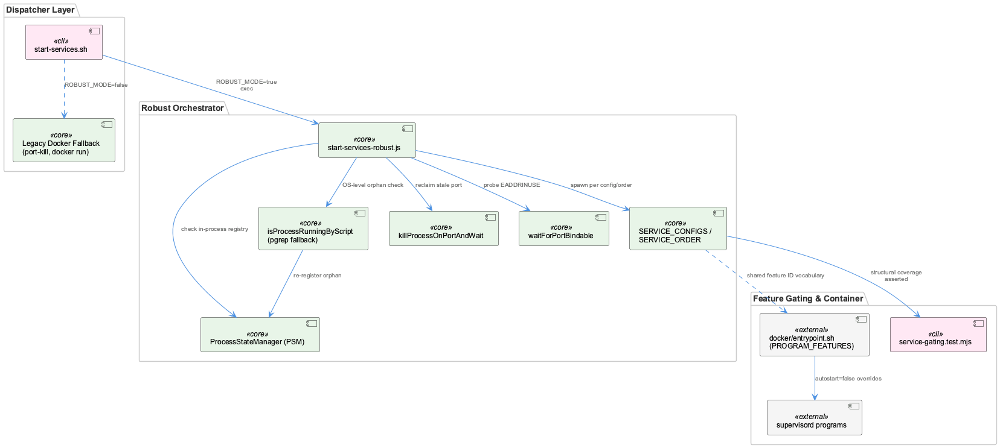
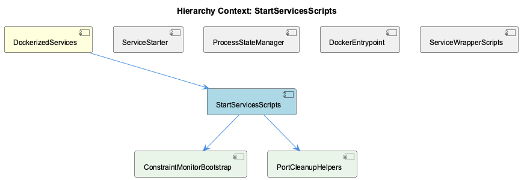

# StartServicesScripts

**Type:** SubComponent

## What It Is

StartServicesScripts is the host-side service-startup subsystem of DockerizedServices, anchored by two files: `start-services.sh` (a bash dispatcher) and `scripts/start-services-robust.js` (the real orchestration engine). The bash script's job is deliberately minimal: when `ROBUST_MODE` is true (the default), it execs `node scripts/start-services-robust.js` and exits, handing off all substantive logic. Only when `ROBUST_MODE=false` does the legacy ~200-line bash path run — manual port-killing, docker-compose invocation for Qdrant/Redis, and `docker run` fallbacks for constraint-monitor — a still-live but deprecated path kept explicitly for backward compatibility rather than removed.

## Architecture and Design

The dominant pattern is thin-dispatcher-defers-to-robust-implementation: `start-services.sh` is essentially a legacy shim over `start-services-robust.js`, mirroring the parent DockerizedServices principle that supervisord and launchers never call real entrypoints directly but go through wrapper scripts (as seen in ServiceWrapperScripts). This indirection centralizes lifecycle bookkeeping — PSM registration, signal forwarding — in one place instead of duplicating it per service.

A second key pattern is dual-layer liveness detection: before spawning any service, the code checks the in-process ProcessStateManager registry (`psm.isServiceRunning`) for both global and per-project scope, then falls back to an OS-level `pgrep -lf` check via `isProcessRunningByScript()` to catch orphans PSM doesn't know about — re-registering rather than duplicating. This same idiom appears identically for `transcriptMonitor` and `liveLoggingCoordinator`, and directly answers the parent-level 'Docker Container Restart Verification Baseline' requirement to avoid restarting atop stale state.

Feature-gating is implemented as parallel, independently-tested logic rather than a shared resolver: `docker/entrypoint.sh`'s `PROGRAM_FEATURES` mapping and `start-services-robust.js`'s `SERVICE_CONFIGS`/`FEATURE_IDS` both gate on a shared ID vocabulary but can't share a resolver because the container can't read the host's `~/.coding/features.yaml`. Notably the two layers diverge in failure philosophy: entrypoint.sh fails open (unknown feature ⇒ enabled), while the test suite fails loudly on structurally invalid configuration.

## Implementation Details

`SERVICE_CONFIGS` in `start-services-robust.js` maps each service to a descriptor with `feature`, `startFn`, `healthCheckFn`, `required`, and retry/timeout settings, enabling graceful degradation between REQUIRED and OPTIONAL services. `SERVICE_ORDER` encodes sequencing invariants — notably that `transcriptMonitor` and `liveLoggingCoordinator` must start first, since later services register against them.

Port-lifecycle handling is split into two targeted helpers, owned conceptually by child PortCleanupHelpers: `killProcessOnPortAndWait()` escalates SIGTERM→SIGKILL against `lsof -ti:<port>` results, polling until the port frees, and returns a boolean rather than throwing so callers can decide to proceed, retry, or degrade. `waitForPortBindable()` addresses a distinct race — a kernel can hold a socket in a post-crash state that isn't HTTP-responsive but still causes EADDRINUSE — by probing with a throwaway `net.createServer().listen()` instead of trusting HTTP/log signals, protecting `maxRetries` from being burned on spurious failures.

The `transcriptMonitor.startFn` exemplifies the full flow: PSM check, pgrep fallback, spawn `enhanced-transcript-monitor.js` detached with stdio to `.data/etm.log`, inject `OBS_API_URL`, and `child.unref()` so the wrapper can exit independently of the child.

Constraint-monitor startup logic is notably fragmented — split across the legacy bash branch, `PROGRAM_FEATURES` in entrypoint.sh, and `SERVICE_CONFIGS` entries — which is why child ConstraintMonitorBootstrap reads as a thematic label rather than a single retrievable implementation.

## Integration Points

StartServicesScripts sits beneath DockerizedServices and mirrors its container-side counterpart, DockerEntrypoint, whose `wait_for_service()` is deliberately fail-open (warns but returns 0 on timeout, deferring ultimate liveness to supervisord). It shares ProcessStateManager as the single source of truth for "is this service already running," consulted before every spawn. Tests in `tests/features/service-gating.test.mjs` enforce structural coverage against exported symbols `SERVICE_ORDER`/`SERVICE_CONFIGS`, asserting exact coverage between them and validating the live-logging-pair ordering invariant, while distinguishing `results.disabled` from `results.degraded` so intentionally-off features aren't misreported as failures.

## Usage Guidelines

Prefer ROBUST_MODE (the default); the legacy bash path in `start-services.sh` exists only for backward compatibility and should not receive new logic. When adding a service, update both `SERVICE_ORDER` and `SERVICE_CONFIGS` together — the test suite will fail loudly if they don't cover each other exactly, and any new feature ID must exist in `FEATURE_IDS` or `startOneService` rejects. Preserve the PSM+pgrep dual-check before spawning to avoid duplicate starts across restarts, per the parent's Health Verification Workflow, and confirm supervised processes/health endpoints after any docker-compose rebuild before trusting downstream pipelines like wave-analysis.

## Code Evidence

Key code artifacts grounding this entity's analysis:

- The feature-gating flow spans three layers that must be kept in sync: docker/entrypoint.sh reads a host-written snapshot (`/coding/.coding/runtime/features.json`) and translates it into supervisord `autostart=false` overrides via the `PROGRAM_FEATURES` mapping (e.g. `semantic-analysis:knowledge`, `constraint-monitor:constraints`, `health-dashboard:health`); tests/features/service-gating.test.mjs enforces the equivalent contract on the host-side launcher by asserting every entry in `SERVICE_CONFIGS` (from start-services-robust.js) names a real feature ID from `FEATURE_IDS` and that `SERVICE_ORDER` and `SERVICE_CONFIGS` cover each other exactly. Both layers independently fail open on unknown/missing data (entrypoint.sh treats an unrecognized feature key as enabled; the test suite fails loudly instead of silently skipping via `startOneService` rejecting on an unknown feature name).
- tests/features/service-gating.test.mjs codifies an ordering invariant directly against exported symbols `SERVICE_ORDER` and `SERVICE_CONFIGS` from scripts/start-services-robust.js: the test `'the live-logging pair still starts before everything else'` asserts `SERVICE_ORDER.slice(0,2)` equals `['transcriptMonitor', 'liveLoggingCoordinator']`, encoding that later services register against the transcript monitor and its coordinator. The suite also distinguishes 'disabled' from 'degraded' service outcomes (`results.disabled` vs `results.degraded`) so that a deliberately turned-off feature is never surfaced as if something failed to start.

## Work Record

What working sessions recorded about this entity — decisions taken, problems hit, and why things are the way they are:

- The 'Coding-Services Docker Container — Health Verification Workflow' record establishes that after any docker-compose rebuild, all supervised processes and their health endpoints must be explicitly confirmed live before trusting downstream pipelines like wave-analysis — this is treated as a hard gate, and the same record defines a 'Docker Container Restart Verification Baseline' requiring operators to check existing container/service state before invoking docker-compose again, specifically to avoid restarting atop orphaned or stale state left by an incomplete prior shutdown — directly mirrored in start-services-robust.js's PSM+OS-level double-check before spawning services.
- The parent record on DockerizedServices establishes that supervisord in the container never references implementation entrypoints directly — it always calls a thin wrapper script under scripts/ that resolves the real implementation via CODING_REPO-relative paths and registers with PSM — this architectural indirection is the container-side counterpart to start-services-robust.js's host-side PSM registration pattern, centralizing SIGTERM/SIGINT forwarding and lifecycle bookkeeping in one place rather than duplicating it per service.

## Hierarchy Context

### Parent
- [DockerizedServices](./DockerizedServices.md) -- [SESSION] Coding-Services Docker Container — Health Verification Workflow establishes that rebuild is performed via docker-compose and all supervised processes/health endpoints must be confirmed live before relying on downstream pipelines like wave-analysis

### Children
- [ConstraintMonitorBootstrap](./ConstraintMonitorBootstrap.md) -- [LLM] No file, function, or class literally named 'ConstraintMonitorBootstrap' appears anywhere in the supplied code. The closest material is scattered constraint-monitor startup logic split across three unrelated locations: the legacy branch of start-services.sh (bash), the PROGRAM_FEATURES mapping in docker/entrypoint.sh, and (by the parent's description, not shown here) SERVICE_CONFIGS entries in scripts/start-services-robust.js. This entity looks like a name assigned to a theme rather than to a single retrievable implementation.
- [PortCleanupHelpers](./PortCleanupHelpers.md) -- [LLM] scripts/start-services-robust.js:killProcessOnPortAndWait() is the robust-mode port-cleanup helper: it first checks `lsof -ti:<port>` to see if the port is occupied, then escalates from SIGTERM to SIGKILL (issuing SIGKILL only after half of `maxWaitMs` has elapsed with the port still occupied per its polling loop at `pollIntervalMs` intervals), and returns a boolean rather than throwing — callers get a definite free/not-free answer instead of an exception, letting the caller decide whether to proceed, retry, or degrade.

### Siblings
- [ServiceStarter](./ServiceStarter.md) -- [SESSION] Coding-Services Docker Container — Health Verification Workflow establishes that after docker-compose rebuild, all supervised processes/health endpoints must be confirmed live before relying on downstream pipelines like wave-analysis
- [ProcessStateManager](./ProcessStateManager.md) -- [CGR] ProcessStateManager (class) in process-state-manager.js
- [DockerEntrypoint](./DockerEntrypoint.md) -- [LLM] docker/entrypoint.sh's `wait_for_service()` (lines ~13-31) is a deliberately fail-open readiness gate: it polls a TCP connection via bash's `/dev/tcp/$host/$port` pseudo-device wrapped in `timeout 2`, retries up to `max_attempts` (default 30) with a 2s sleep, but on exhaustion prints a WARNING and still `return 0` — the comment explicitly states 'Don't fail — let supervisord handle it'. This means the entrypoint never blocks container startup on Qdrant or Redis being slow; it only front-loads a wait so the first supervisord-managed process is less likely to race a cold dependency, while ultimate liveness is left to whatever the individual service's own retry logic does once supervisord starts it.
- [ServiceWrapperScripts](./ServiceWrapperScripts.md) -- [LLM] scripts/start-services-robust.js defines SERVICE_CONFIGS as a map of per-service descriptors (transcriptMonitor, liveLoggingCoordinator, and others truncated below them) each carrying a `feature` id, `startFn`, `healthCheckFn`, `required`, and `maxRetries`/`timeout`. The `transcriptMonitor.startFn` is the clearest instance of the 'thin wrapper' pattern described for the parent DockerizedServices entity: before spawning anything it checks PSM (`psm.isServiceRunning('transcript-monitor', 'global')`) and an OS-level `pgrep` fallback (`isProcessRunningByScript`) to avoid double-starting an orphaned process, then spawns `enhanced-transcript-monitor.js` detached with stdio redirected to `.data/etm.log`, injects `OBS_API_URL` into the child's env, and calls `child.unref()` so the wrapper process itself can exit without keeping the child alive as a dependent.

---

*Generated from 11 observations*
