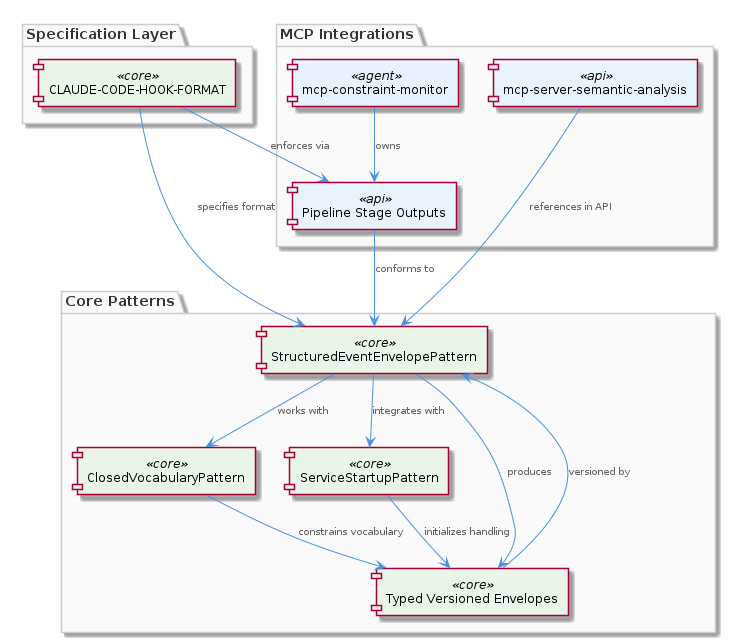
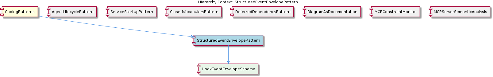

# StructuredEventEnvelopePattern

**Type:** SubComponent

The structured event envelopes are designed to work with the ClosedVocabularyPattern, as seen in integrations/mcp-constraint-monitor/docs/constraint-configuration.md

# StructuredEventEnvelopePattern

## What It Is

The `StructuredEventEnvelopePattern` is a SubComponent codified within the `CodingPatterns` parent grouping, with its canonical specification located in `integrations/mcp-constraint-monitor/docs/CLAUDE-CODE-HOOK-FORMAT.md`. This document — titled "Claude Code Hook Data Format" — defines the structured envelope format that pipeline stages and hook integrations must conform to when emitting or consuming events. Additional usage references appear in `integrations/mcp-server-semantic-analysis/docs/api/README.md`, which demonstrates how the envelope is applied across the codebase.

At its core, this pattern establishes a typed, versioned envelope contract for event data flowing through the system. Rather than allowing ad-hoc event payloads, every event is wrapped in a known structural shape that downstream consumers can deserialize, validate, and route deterministically. The envelope is the outer container; the payload it carries is interpreted according to its declared type and version.

The pattern contains a single child schema, `HookEventEnvelopeSchema`, which provides the concrete structural definition of the envelope. This child schema is the authoritative artifact that pipeline stages reference when serializing or validating hook event data destined for the constraint monitor.

## Architecture and Design

The architectural premise of `StructuredEventEnvelopePattern` is **envelope-based message design**: a stable outer wrapper carries metadata (type, version, and routing identifiers) around an inner payload whose interpretation is governed by that metadata. This is a common pattern for systems that need forward and backward compatibility across evolving event shapes — the envelope outlives any single payload version, and consumers can branch on the envelope's declared type without parsing the entire body.

Two design decisions emerge clearly from the observations. First, the envelopes are **typed**, meaning each event declares its kind explicitly rather than relying on structural inference. Second, they are **versioned**, allowing the format to evolve without breaking existing consumers. Together, these properties yield consistent and reliable event handling across the pipeline stages described in `integrations/mcp-constraint-monitor/docs/CLAUDE-CODE-HOOK-FORMAT.md`.

The pattern is deliberately co-designed with sibling patterns in the `CodingPatterns` group. It interlocks with `ClosedVocabularyPattern` — described in `integrations/mcp-constraint-monitor/docs/constraint-configuration.md` — so that the `type` field on the envelope is drawn from a fixed canonical set rather than free-form strings. This combination prevents type drift and ensures that constraint-monitoring logic can exhaustively switch on known event categories. The envelope also pairs with `ServiceStartupPattern` (rooted in `lib/service-starter.js`) to ensure that services are initialized in a state where they can correctly emit and consume the structured envelope format from their first message onward.

## Implementation Details

The concrete schema definition is encapsulated in the child entity `HookEventEnvelopeSchema`, specified in `integrations/mcp-constraint-monitor/docs/CLAUDE-CODE-HOOK-FORMAT.md`. This schema standardizes how hook event data is represented and transmitted to the constraint monitor, serving as the structural source of truth that all envelope-producing and envelope-consuming code must satisfy.

The implementation strategy is **specification-first**: rather than the envelope being inferred from scattered code, the format is documented authoritatively in the `CLAUDE-CODE-HOOK-FORMAT.md` file and then enforced at pipeline stage boundaries. The `integrations/mcp-constraint-monitor` integration treats this document as the contract that all hook event producers must satisfy, while `integrations/mcp-server-semantic-analysis` references it from its API documentation to demonstrate consumption patterns.

Because the pattern itself contains no source-level code symbols — it is a documented design contract rather than an implemented class — the "implementation" lives in the conformance of producing and consuming code to the schema. Pipeline stages serialize their outputs into the envelope shape, and the constraint monitor's ingestion layer validates incoming data against `HookEventEnvelopeSchema` before processing.

## Integration Points

The most direct integration point is the **constraint monitor pipeline**, where structured envelopes are the transport format for hook event data crossing the boundary between Claude Code hooks and the monitor's analysis stages. The format is normative for this integration: any new pipeline stage must read and write envelopes conforming to `HookEventEnvelopeSchema`.

A second integration is with `ClosedVocabularyPattern`. The envelope's discriminator fields (notably its `type`) are populated from the closed vocabulary defined alongside the constraint configuration in `integrations/mcp-constraint-monitor/docs/constraint-configuration.md`. This coupling means that adding a new event type is a two-step process: the vocabulary must be extended, and the envelope's documented enumeration in `CLAUDE-CODE-HOOK-FORMAT.md` must be updated in lockstep.

A third integration is with `ServiceStartupPattern`. Services that emit or consume hook events rely on the startup sequence (notably `startServiceWithRetry()` in `lib/service-starter.js`) to come online in a deterministic state. This ensures that envelope-handling subsystems are ready before any events are dispatched, avoiding partially-initialized consumers that might mishandle structured payloads.

The `integrations/mcp-server-semantic-analysis/docs/api/README.md` reference establishes a fourth integration: the semantic-analysis MCP server documents its API in terms of the same envelope structure, indicating that the pattern is reused across multiple MCP integrations rather than being scoped to a single subsystem.

## Usage Guidelines

When producing events, developers must wrap payloads in the envelope structure defined by `HookEventEnvelopeSchema` and documented in `integrations/mcp-constraint-monitor/docs/CLAUDE-CODE-HOOK-FORMAT.md`. Direct emission of raw payloads, even to local consumers, breaks the contract and undermines the consistency guarantees the pattern is designed to provide. Treat the `CLAUDE-CODE-HOOK-FORMAT.md` specification as the single source of truth and consult it before defining new event-emitting code paths.

When consuming events, validate incoming data against the envelope schema before dispatching to handler logic. Discriminate on the envelope's `type` field — which must be drawn from the `ClosedVocabularyPattern` vocabulary — rather than on structural properties of the inner payload. This keeps consumer code aligned with the closed-set semantics that the constraint monitor relies upon.

When evolving the format, prefer additive changes and version bumps over breaking modifications. The envelope is versioned precisely so that new payload variants can be introduced without invalidating existing consumers; exploit this by adding new versioned variants rather than mutating existing ones. Any change to the schema must be reflected in `CLAUDE-CODE-HOOK-FORMAT.md` first, and any new event type must be added to the `ClosedVocabularyPattern` vocabulary in the same change set.

When integrating a new service or pipeline stage, ensure it is started through `ServiceStartupPattern` mechanisms so that envelope-handling code is initialized correctly before events begin to flow. This avoids race conditions where a service might receive a structured envelope before its schema validators or handler dispatch tables are ready. Following these conventions ensures that the typed, versioned envelope contract delivers the consistent and reliable event handling it is designed to provide.

## Hierarchy Context

### Parent
- [CodingPatterns](./CodingPatterns.md) -- [LLM] The project-wide singleton guard pattern is formally codified in `docs/puml/psm-singleton-pattern.puml` and manifests consistently wherever stateful managers are instantiated. The pattern follows a strict guard-and-return idiom: a module-level variable holds the single instance (initialized to null or undefined), and every access point checks that variable before constructing a new object. If an instance already exists, the existing reference is returned immediately without re-running any constructor or initialization logic. This prevents race conditions in async service environments where multiple subsystems might attempt to spin up the same stateful manager concurrently — a real concern in Node.js applications that use event-driven concurrency without explicit locking primitives. For new developers, the implication is that any class described as a 'manager' or 'session' object in this codebase should be assumed to follow this pattern: do not call `new` directly on these classes from arbitrary call sites; instead, always go through the designated factory or accessor function that enforces the singleton contract. The PlantUML diagram in `docs/puml/psm-singleton-pattern.puml` is authoritative and should be consulted before introducing any new singleton-style manager to ensure the guard logic is structurally consistent with the rest of the project.

### Children
- [HookEventEnvelopeSchema](./HookEventEnvelopeSchema.md) -- Specified in integrations/mcp-constraint-monitor/docs/CLAUDE-CODE-HOOK-FORMAT.md (titled 'Claude Code Hook Data Format'), this schema defines the structured envelope that standardizes how hook event data is represented and transmitted to the constraint monitor.

### Siblings
- [AgentLifecyclePattern](./AgentLifecyclePattern.md) -- The BaseAgent class in base-agent.ts defines the lifecycle methods init(), start(), stop(), pause(), and resume()
- [ServiceStartupPattern](./ServiceStartupPattern.md) -- The startServiceWithRetry() function in lib/service-starter.js wraps the service startup with retry logic
- [ClosedVocabularyPattern](./ClosedVocabularyPattern.md) -- The migration scripts in integrations/mcp-constraint-monitor/docs/constraint-configuration.md enforce fixed canonical type sets
- [DeferredDependencyPattern](./DeferredDependencyPattern.md) -- The VkbApiClient module in lib/ukb-unified/core/VkbApiClient.js is loaded dynamically using dynamic-import
- [DiagramAsDocumentation](./DiagramAsDocumentation.md) -- The PlantUML diagrams in docs/puml/ capture architectural decisions and provide visual specification
- [MCPConstraintMonitor](./MCPConstraintMonitor.md) -- The MCPConstraintMonitor module in integrations/mcp-constraint-monitor/README.md monitors and enforces constraints
- [MCPServerSemanticAnalysis](./MCPServerSemanticAnalysis.md) -- The MCPServerSemanticAnalysis module in integrations/mcp-server-semantic-analysis/README.md performs semantic analysis

---

*Generated from 7 observations*
