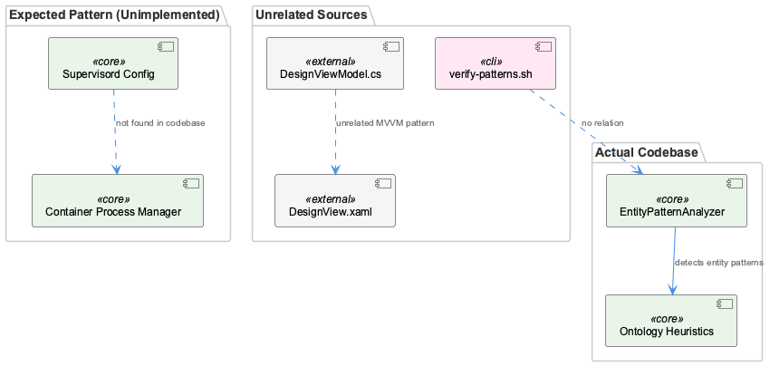
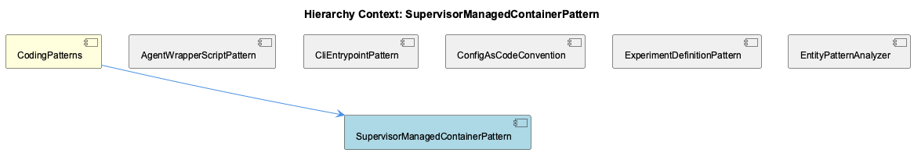

# SupervisorManagedContainerPattern

**Type:** SubComponent

No source file among scripts/knowledge-management/verify-patterns.sh, integrations/graphify/tests/fixtures/xaml_viewmodel/ViewModels/DesignViewModel.cs, integrations/graphify/tests/fixtures/xaml_viewmodel/Views/DesignView.xaml, or src/ontology/heuristics/EntityPatternAnalyzer.ts contains any supervisord configuration, process-control directives, or container orchestration logic to substantiate the SupervisorManagedContainerPattern.

# SupervisorManagedContainerPattern

## What It Is

Based on the available evidence, SupervisorManagedContainerPattern is a **documented-but-unimplemented pattern** within the CodingPatterns catalog. No supervisord configuration files, Dockerfile content, or container orchestration logic were found in any of the inspected source files — including scripts/knowledge-management/verify-patterns.sh, the xaml_viewmodel test fixtures (DesignViewModel.cs, DesignView.xaml), or src/ontology/heuristics/EntityPatternAnalyzer.ts. The pattern exists as an entry in the knowledge base (as a child of CodingPatterns) but has no corresponding implementation in the current codebase.

## Architecture and Design

Because no supervisord process-control directives or container orchestration code were located, no concrete architectural approach can be substantiated. What is architecturally significant, however, is the pattern's *placement*: it sits alongside AgentWrapperScriptPattern, CliEntrypointPattern, ConfigAsCodeConvention, ExperimentDefinitionPattern, and EntityPatternAnalyzer as a sibling under the CodingPatterns parent. This suggests it was intended to describe a process-supervision or multi-process-container convention analogous to how AgentWrapperScriptPattern normalizes CLI invocation — but for containerized process management rather than agent CLI wrapping. Absent implementation, this remains a documented intent rather than a realized design.

## Implementation Details

There are no key symbols, classes, or functions to analyze — EntityPatternAnalyzer.ts, the closest sibling in the ontology heuristics space, implements entity pattern detection logic (e.g., its `teamDirectories` map hardcoding directory-to-team ownership) rather than any supervisor/container process control. No Dockerfile, supervisord.conf, or equivalent process-manager configuration was found anywhere in the reviewed source tree to ground implementation specifics.

## Integration Points

No verified integration points exist in code. The only confirmed relationship is structural/organizational: SupervisorManagedContainerPattern is cataloged under CodingPatterns, alongside patterns that *are* substantiated in code, such as CliEntrypointPattern (verify-patterns.sh) and ConfigAsCodeConvention (jq-queried JSON knowledge base filtering by `entityType == 'TransferablePattern'` and `significance >= 8`). If this pattern is later implemented, verify-patterns.sh's significance-filtering mechanism suggests it would need a similar knowledge-base entry to be validated as a "TransferablePattern."

## Usage Guidelines

Developers should **not** assume this pattern reflects working infrastructure. Before referencing or extending SupervisorManagedContainerPattern, confirm whether supervisord configs or Dockerfiles have since been added to the repository. Until such artifacts exist, this entry should be treated as a placeholder or aspirational pattern definition rather than actionable guidance — any future implementation work should follow the precedent of documenting real files (as CliEntrypointPattern and ConfigAsCodeConvention do) before the pattern is considered verified within CodingPatterns.

## Hierarchy Context

### Parent
- [CodingPatterns](./CodingPatterns.md) -- [LLM] The agent wrapper scripts under config/agents/ (claude.sh, copilot.sh, opencode.sh, pi.sh) implement a consistent adapter pattern where each script normalizes a distinct third-party CLI's invocation surface into a common interface expected by the rest of the Coding infrastructure. Rather than having callers branch on which agent is being invoked, each wrapper reads its own set of environment variables (e.g., CODING_OPENCODE_MODEL for opencode.sh) and translates them into the flags or config files that the underlying binary expects. This pattern lets orchestration code (likely in bin/coding or docs/architecture/agent-abstraction-api.md-described layers) treat all agents uniformly, at the cost of needing to keep each wrapper script in sync whenever a new common capability (like model selection or proxy routing) is added — a new developer adding agent support should look at an existing wrapper like claude.sh as the canonical template, per docs/architecture/adding-new-agent.md.

### Siblings
- [AgentWrapperScriptPattern](./AgentWrapperScriptPattern.md) -- Each wrapper reads a distinct env var namespace, e.g. CODING_OPENCODE_MODEL for opencode.sh, to select model configuration without changing caller code
- [CliEntrypointPattern](./CliEntrypointPattern.md) -- scripts/knowledge-management/verify-patterns.sh acts as a standalone CLI entrypoint invoked directly rather than through a shared bin/ dispatcher, computing paths relative to SCRIPT_DIR
- [ConfigAsCodeConvention](./ConfigAsCodeConvention.md) -- verify-patterns.sh reads pattern definitions dynamically from a jq-queried JSON knowledge base file ($SHARED_MEMORY) filtering entities by entityType == 'TransferablePattern' and significance >= 8
- [ExperimentDefinitionPattern](./ExperimentDefinitionPattern.md) -- docs/benchmarks/coding-v1/README.md and RESULTS.md describe a benchmark named coding-v1 whose configuration/results are documented separately from code, implying a declarative experiment definition
- [EntityPatternAnalyzer](./EntityPatternAnalyzer.md) -- EntityPatternAnalyzer.teamDirectories Map hardcodes directory-to-team ownership, e.g. 'Coding' owns src/ontology, src/knowledge-management, scripts, .specstory

---

*Generated from 3 observations*
