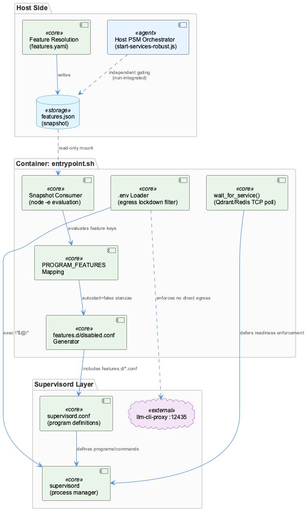
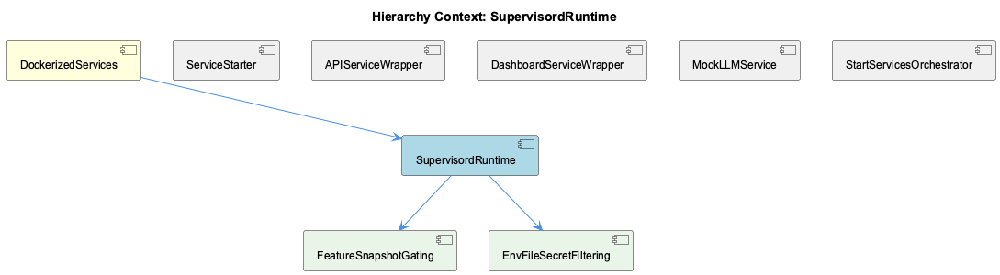

# SupervisordRuntime

**Type:** SubComponent

## What It Is

SupervisordRuntime is the container-side process orchestration layer implemented in `docker/entrypoint.sh`. It is the mechanism that bootstraps the supervisord process manager inside the Docker container, translating a host-computed feature policy into supervisord configuration fragments before finally exec-ing into supervisord itself (`exec "$@"`). It is a child component of DockerizedServices, which governs the broader container lifecycle, and it sits alongside — but is structurally independent from — the host-side, PSM-based orchestration system embodied by ServiceStarter (`scripts/start-services-robust.js`). SupervisordRuntime is exclusively the supervisord-managed half of process orchestration in this codebase; the two systems do not share code or fixes.

## Architecture and Design

The defining architectural pattern is config-override rather than config-generation: SupervisordRuntime never templates or rewrites `supervisord.conf`, which remains the single source of truth for program commands and logging. Instead, its child component FeatureSnapshotGating rebuilds `/etc/supervisor/features.d` from scratch on every start and writes minimal `autostart=false` stanzas for programs whose features are disabled, relying on supervisord's native config-include mechanism to apply them.

A second defining trait is a deliberate fail-open bias, applied at multiple layers: an unknown feature key defaults to enabled (protecting newer programs from stale host snapshots), and a missing or unreadable `features.json` leaves `features.d` empty, starting everything. The stated rationale — captured in observations — is that a silently-idle container is harder to diagnose than one running too much, which is the inverse bias from most gating systems, chosen specifically because supervisord is the last stage before service visibility. The same philosophy governs `wait_for_service()`, used for Qdrant/Redis TCP readiness: after polling attempts, it warns and returns 0 regardless of outcome, explicitly deferring enforcement to supervisord's own retry/backoff. This makes SupervisordRuntime, not entrypoint.sh's readiness checks, the true authority over degraded-start handling.

Third, SupervisordRuntime treats feature policy as a snapshot-consumer, not a resolver: `/coding/.coding/runtime/features.json` is written by the host and read as an opaque, flat, read-only file — resolution logic lives entirely on the host side, and this component only performs mechanical translation into config fragments (documented under Architecture Notes as the host/container split).

## Implementation Details

The feature-gating block (FeatureSnapshotGating) iterates the `PROGRAM_FEATURES` mapping — entries like `semantic-analysis:knowledge`, `constraint-monitor:constraints`, `graphify:codegraph`, `health-dashboard:health` — splitting each `program:feature` pair using bash parameter expansion (`${pair%%:*}` / `${pair##*:}`) rather than a structured parser. For each program, it invokes `node -e` against the JSON snapshot to evaluate the feature flag, explicitly avoiding jq ("jq is not installed in this image, node is"). Disabled programs get an `[program:%s]\nautostart=false\n` stanza appended to `/etc/supervisor/features.d/disabled.conf`.

The .env-loading block, implemented by child component EnvFileSecretFiltering, reads `/coding/.env` line by line via `IFS='=' read -r key value`, skips comments/blanks, trims keys with `xargs`, and applies a denylist `case` statement matching `*_API_KEY|*_TOKEN|*_MANAGEMENT_KEY` to skip secret-shaped variables before export — a pattern-based denylist rather than an allowlist.

`wait_for_service()` polls TCP readiness with `timeout 2 bash -c "echo >/dev/tcp/$host/$port"` up to a max attempt count, printing a WARNING and always returning 0, with an inline comment: "Don't fail - let supervisord handle it."

## Integration Points

SupervisordRuntime's primary upstream dependency is the host-written `features.json` snapshot — a boundary point where DockerizedServices' baseline-verification procedures (capturing pre/post-restart supervisor process lists) become necessary, since no automated health assertion exists inside entrypoint.sh or supervisord.conf itself. The unresolved "Feature Snapshot Forensics" investigation shows this integration point is fragile in practice: something intermittently rewrites the snapshot into a restrictive state (e.g., "logging-only"), causing silent outages in the Constraint Monitor service that fail-open defaults have not prevented.

Downstream, the `.env` filtering enforces the container's T2 egress lockdown, ensuring SDK clients can't bypass the host llm-cli-proxy at :12435 — a security boundary shared conceptually with the container's networking model rather than with any sibling component.

Structurally, SupervisordRuntime is parallel to but non-integrated with <AWS_SECRET_REDACTED>'s PSM-based gating (`SERVICE_CONFIGS`/`SERVICE_ORDER`, tested by `tests/features/service-gating.test.mjs`): both gate on features, but independently, meaning a fix to one gating mechanism does not propagate to the other.

## Usage Guidelines

Any change to `PROGRAM_FEATURES` or `features.d` generation must preserve the override-only contract — never redefine or add programs there, only flip `autostart`. Preserve fail-open defaults deliberately; do not "fix" them toward fail-closed without revisiting the stated rationale, since the current unresolved outages stem from bad snapshot *content*, not from fail-open behavior itself. Never weaken the `.env` denylist pattern (`*_API_KEY|*_TOKEN|*_MANAGEMENT_KEY`), as this is an explicit security control, not incidental filtering. Because there is no automated post-restart health check, operators must continue following the manual baseline/verify workflow from DockerizedServices before trusting downstream consumers like wave-analysis. Finally, when touching feature-gating logic, check both SupervisordRuntime's snapshot consumer and ServiceStarter's PSM-based `loadFeatures()`/`featureSet()` — they are independent systems that must be updated in parallel if feature semantics change.

## Work Record

What working sessions recorded about this entity — decisions taken, problems hit, and why things are the way they are:

- Feature Snapshot Forensics — Runtime Config Drift Investigation documents an ongoing, unresolved effort to find what rewrites the runtime feature snapshot into an overly restrictive state (e.g. 'logging-only'), causing silent service outages.
- Coding-Services Docker Container — Health Verification Workflow establishes docker-compose rebuild/verify as the standard procedure, requiring all supervised processes and health endpoints to be confirmed live before downstream pipelines like wave-analysis rely on them.
- The 'Feature Snapshot Forensics — Runtime Config Drift Investigation' work record documents an ongoing, unresolved investigation into who or what rewrites the runtime feature snapshot (the same features.json that entrypoint.sh consumes) into a restrictive state such as 'logging-only', which causes silent service outages in the Constraint Monitor service. No root cause has been confirmed across multiple investigation sessions, meaning the fail-open behavior coded into entrypoint.sh has apparently not been sufficient to prevent operator-visible outages when the snapshot itself is wrong rather than absent.
- The 'Docker Container Restart Verification Baseline' and 'Coding-Services Docker Container — Health Verification Workflow' records establish that docker-compose restarts of this container require capturing a pre-restart baseline of the supervisor process list and container state, and post-restart confirmation that all supervised processes and health endpoints are live before trusting downstream pipelines like wave-analysis. This procedural safeguard is layered entirely outside entrypoint.sh and supervisord.conf — it is not encoded in any script — which implies supervisord-managed services in this container have previously appeared to restart successfully while actually being degraded or non-functional, motivating a manual verification step rather than a code-level fix.

## Hierarchy Context

### Parent
- [DockerizedServices](./DockerizedServices.md) -- [SESSION] Docker Container Restart Verification Baseline establishes that before running docker-compose up -d, the current supervisor process list and container state should be captured as a baseline to compare against post-restart state and catch regressions like stale naming or misconfigured mounts

### Children
- [FeatureSnapshotGating](./FeatureSnapshotGating.md) -- [LLM] docker/entrypoint.sh's feature-gating block (the `FEATURES_SNAPSHOT="/coding/.coding/runtime/features.json"` section) is the only implementation of FeatureSnapshotGating among the retrieved files. It rebuilds `/etc/supervisor/features.d` from scratch on every container start (`rm -f "$FEATURES_DIR"/*.conf`), then iterates the space-separated `PROGRAM_FEATURES` mapping (`semantic-analysis:knowledge`, `graphify:codegraph`, `constraint-monitor:constraints`, `health-dashboard:health`, etc.), splitting each `program:feature` pair with bash parameter expansion (`${pair%%:*}` / `${pair##*:}`) rather than a structured format.
- [EnvFileSecretFiltering](./EnvFileSecretFiltering.md) -- [LLM] The .env-loading block in docker/entrypoint.sh (lines under 'Environment setup') implements EnvFileSecretFiltering directly: it reads /coding/.env line by line with `IFS='=' read -r key value`, skips comments/blank lines, trims the key with `xargs`, and then runs a `case` statement matching `*_API_KEY|*_TOKEN|*_MANAGEMENT_KEY` to `continue` before any `export` happens — a pattern-based denylist rather than an allowlist.

### Siblings
- [ServiceStarter](./ServiceStarter.md) -- [LLM] scripts/start-services-robust.js is the actual ServiceStarter implementation — a Node orchestrator that wraps lib/service-starter.js's startServiceWithRetry/createHttpHealthCheck/createPidHealthCheck primitives into a declarative SERVICE_CONFIGS map, each entry a {name, feature, psmPath, required, maxRetries, timeout, startFn, healthCheckFn} tuple. start-services.sh is a thin bash shim that execs this script when ROBUST_MODE=true (the default) and only falls back to an inline legacy bash startup path (manual docker-compose/lsof/kill logic) when ROBUST_MODE=false, meaning the legacy code in start-services.sh below the exec is dead in normal operation but kept for backward compatibility.
- [APIServiceWrapper](./APIServiceWrapper.md) -- [LLM] The supplied code files do not contain scripts/api-service.js, which the parent-entity context describes as the actual implementation of the wrapper-process pattern (spawning integrations/constraint-monitor/src/dashboard-server.js as a child process and registering its PID with ProcessStateManager under type 'global', name 'constraint-api-child'). Everything in this analysis about APIServiceWrapper's specific spawn/registration logic is inherited from the parent's prior observation rather than verified against source shown here, so it should be treated as a summary of prior findings, not a fresh code read.
- [DashboardServiceWrapper](./DashboardServiceWrapper.md) -- [LLM] None of the supplied files define, import, or instantiate a `DashboardServiceWrapper` class or module. The parent entity's own [LLM] observation names the actual wrapper scripts — `scripts/api-service.js` (spawns `integrations/constraint-monitor/src/dashboard-server.js`) and `scripts/dashboard-service.js` (wraps `npm run dev` for the constraint-monitor dashboard) — but neither file's source was retrieved here; only `docker/entrypoint.sh`, `scripts/prompt-classifier-service.mjs`, `scripts/start-services-robust.js`, `start-services.sh`, and `tests/features/service-gating.test.mjs` were provided, none of which contain a class or script named DashboardServiceWrapper.
- [MockLLMService](./MockLLMService.md) -- [LLM] None of the retrieved code files (docker/entrypoint.sh, scripts/prompt-classifier-service.mjs, scripts/start-services-robust.js, start-services.sh, tests/features/service-gating.test.mjs) implement, import, or reference a MockLLMService. The parent entity's own observations name the actual implementation as integrations/semantic-analysis/src/mock/llm-mock-service.ts, which checks process.env.CODING_ROOT and overrides the repositoryPath argument to reconcile host-mounted paths against container-internal paths — but that file's contents were not supplied to this analysis, so nothing about its internal structure, its mock response strategy, or how it is wired into the semantic-analysis service can be verified here.
- [StartServicesOrchestrator](./StartServicesOrchestrator.md) -- [SESSION] Docker Container Restart Verification Baseline establishes capturing supervisor process list and container state as a baseline before docker-compose up -d, to compare against post-restart state and catch regressions like stale naming or misconfigured mounts.

---

*Generated from 12 observations*
