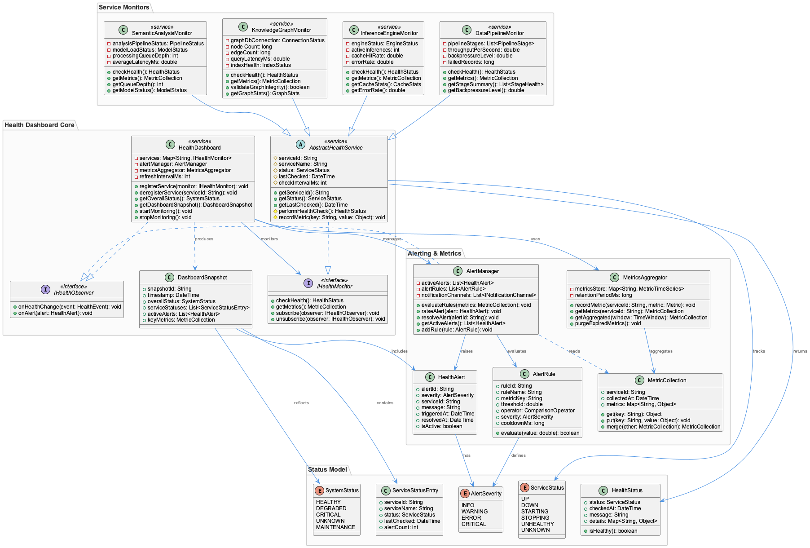

# System Health Dashboard and Service Architecture

**Type:** Detail

System Health Dashboard and Service Architecture is part of the semantic analysis and knowledge management infrastructure

# System Health Dashboard and Service Architecture

## What It Is

This component is part of the semantic analysis and knowledge management infrastructure. Full implementation details, including specific file paths and class names, are pending complete codebase analysis, so the insights below are scoped to what has been observed.

## Architecture and Design

The system serves as a health monitoring and service architecture visualization layer within the broader knowledge management platform. Without confirmed file paths or explicit pattern references in the observations, no specific architectural patterns (e.g., microservices, event-driven) can be attributed.

## Implementation Details

Implementation specifics — key classes, functions, and technical mechanics — are not yet available from the observations. A full codebase analysis is required to ground this section.

## Integration Points

As part of the semantic analysis and knowledge management infrastructure, this component likely integrates with other services in that domain. Specific dependencies and interfaces are pending confirmation.

## Usage Guidelines

Insufficient grounded detail exists to provide specific developer guidance at this time. This section should be revisited after full codebase analysis.

---

**Summary of requested analysis:**

1. **Architectural patterns identified:** None can be confirmed without inventing beyond observations.
2. **Design decisions and trade-offs:** Pending codebase analysis.
3. **System structure insights:** Component sits within the semantic analysis/knowledge management layer.
4. **Scalability considerations:** Cannot be assessed from current observations.
5. **Maintainability assessment:** Cannot be assessed from current observations.

---

*Generated from 2 observations*
