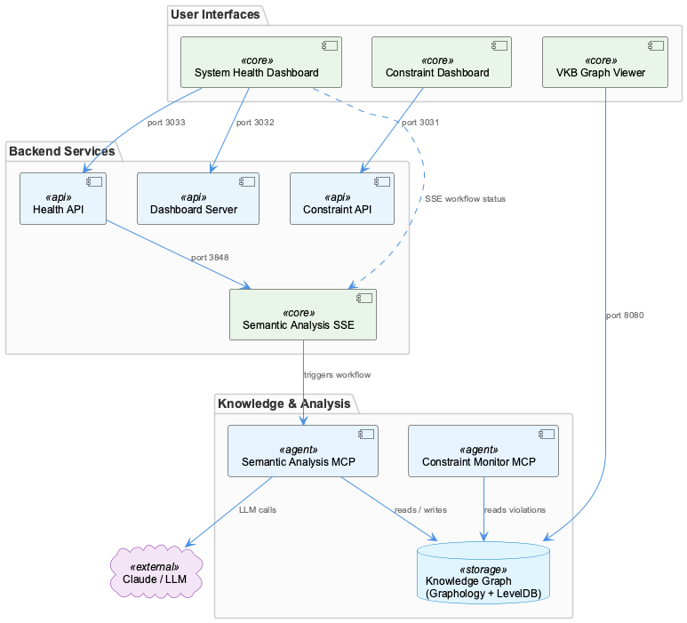
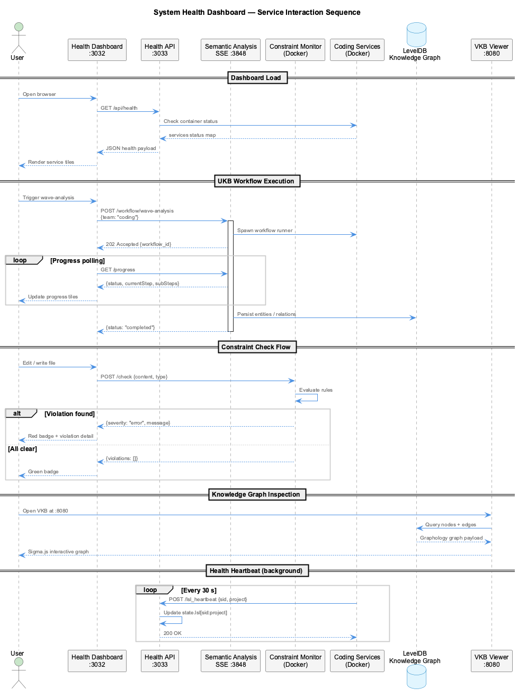
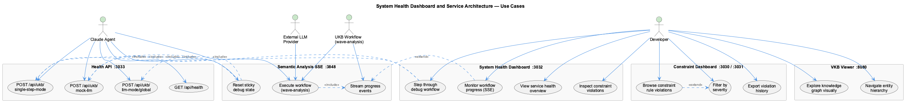

# System Health Dashboard and Service Architecture

**Type:** Container

System Health Dashboard and Service Architecture is part of the semantic analysis and knowledge management infrastructure

# System Health Dashboard and Service Architecture

## What It Is

The System Health Dashboard and Service Architecture is implemented under `integrations/system-health-dashboard/` and forms part of the semantic analysis and knowledge management infrastructure of the coding project. It comprises a Next.js-based frontend bundle (built into `dist/`), a backend HTTP API server (`server.js`), and a static asset server (`static-server.js`), all bind-mounted into the `coding-services` Docker container and supervised by `supervisord` (services `web-services:health-dashboard-frontend` and `web-services:health-dashboard`).

At runtime the dashboard surfaces health, freshness, and verification status for the surrounding service ecosystem. The canonical ports in this ecosystem are `localhost:3032` for the dashboard UI, `localhost:3033` for the health API, `localhost:3848` for the semantic-analysis SSE server (workflow execution), and `localhost:3030`/`3031` for the constraint dashboard frontend and API respectively. The dashboard reads aggregated state from `.health/verification-status*.json` files written by host-side verification scripts.

## Architecture and Design

The dashboard follows a split frontend/backend container layout: a static bundle served by `static-server.js` and a JSON API served by `server.js`, both running inside the same `coding-services` container under supervisord but exposed on distinct ports. This separation lets the UI rebuild independently of the API and lets the API restart without re-serving the bundle. The API is the integration point that aggregates health signals from disparate sources — verification status files, Docker container state, code-graph-rag (CGR) freshness checks, and the workflow progress file at `.data/workflow-progress.json`.

A notable design constraint is the host↔container path duality: the dashboard inside the container reads `/coding/.health/verification-status*.json`, while the host-side verification scripts write to the host-mounted equivalent. A historical bug was traced to a path mismatch here, and a separate bind-mount-freshness rule in Docker tooling has caused force-recreation loops when its file list referenced files that no longer existed (e.g., `scripts/consolidate-observations.js`). The architecture therefore treats bind-mount path agreement as a first-class invariant, not an incidental detail.

## Implementation Details

`server.js` exposes the health API on port 3033 and is the place where most concrete health endpoints live; it has been the subject of several bug fixes around status reporting and the CGR freshness handler (which switched from `nc` to a Node-native check after discovering `nc` was not available in the container). `static-server.js` serves the compiled UI bundle. The dist build is produced by `npm run build` inside `integrations/system-health-dashboard/`; no `docker-compose build` is required for this submodule because the relevant files are bind-mounted (see `docker-compose.yml:96-102`).

A subtle implementation hazard is Docker Desktop's VirtioFS cache: edits to bind-mounted `server.js`/`static-server.js` are NOT picked up live by the running process. The documented mitigation is to either restart the frontend supervisor unit (`supervisorctl restart web-services:health-dashboard-frontend`) for UI changes, or fully restart the container (`docker-compose restart coding-services`) for backend changes — because `supervisorctl restart web-services:health-dashboard` alone re-reads the cached, sometimes-truncated snapshot, producing the characteristic `SyntaxError: Invalid or unexpected token` symptom mid-line.

## Integration Points

The dashboard does not own any data; it integrates with: (a) the verification status files in `.health/`, written by host-side checks; (b) the semantic-analysis SSE server on port 3848 for workflow status (the dashboard reads `.data/workflow-progress.json` rather than calling the SSE server directly for progress display); (c) Docker socket / container introspection for service liveness; and (d) the code-graph-rag (CGR) service for freshness checks. The constraint dashboard on ports 3030/3031 is a sibling rather than a dependency.

These integrations are unidirectional reads — the dashboard never writes back to verification state, never starts/stops workflows, and never mutates container state. That read-only posture keeps it safe to restart aggressively when its bind-mounted source is updated.

## Usage Guidelines

When editing dashboard code, always rebuild the bundle (`npm run build`) before expecting UI changes; for backend edits, restart the whole container rather than the supervisor unit so VirtioFS gives up its stale cache. Verify a successful refresh by comparing `docker exec coding-services wc -lc /coding/integrations/system-health-dashboard/server.js` against the host file size — they must match.

Never wire the dashboard to port 3033 for workflow control: 3033 is health-only, and 3848 is the semantic-analysis SSE workflow endpoint. Keep verification path agreement between host writers and the container reader (`/coding/.health/...`) — a mismatch silently produces "unhealthy" without an obvious cause. When adding new bind-mount-freshness rules, ensure every file in the list actually exists on disk, or the container will enter a recreate loop every few minutes.

---

**Architectural patterns identified:** split frontend/backend service inside a single container with supervisord process management; file-based read-only health aggregation; bind-mount-driven hot-edit workflow.

**Design decisions and trade-offs:** Bind-mounts avoid Docker rebuild cycles at the cost of VirtioFS staleness — accepted because dashboard iteration speed matters more than runtime purity. Read-only integration with verification files keeps the dashboard simple and crash-safe but makes path agreement load-bearing.

**System structure insights:** The dashboard is a thin aggregator over independently-owned health signals (verification files, workflow progress JSON, Docker state, CGR), not a stateful service. Ports 3032/3033 form a pair; 3030/3031 are the sibling constraint dashboard; 3848 is the SSE workflow runner.

**Scalability considerations:** Single-container deployment with no horizontal scaling story; sufficient for the local-developer use case it is designed for. JSON-file polling rather than push-based updates means update latency scales with poll interval, not load.

**Maintainability assessment:** Generally good — small surface area, clear separation between UI bundle and API, and well-documented rebuild semantics in `CLAUDE.md`. The recurring failure modes (VirtioFS stale cache, host/container path mismatch, stale bind-mount-freshness rules) are now documented enough to be diagnosable, but they remain real footguns and warrant a smoke-check script that compares host vs container file sizes after any dashboard edit.

---

*Generated from 1 observations*
