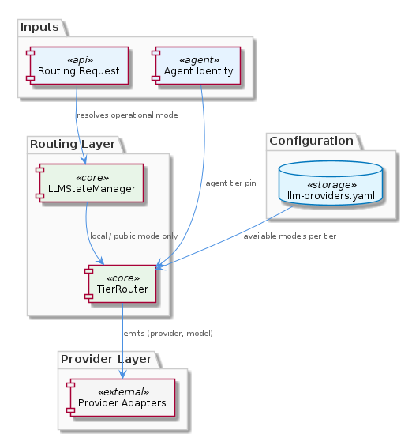
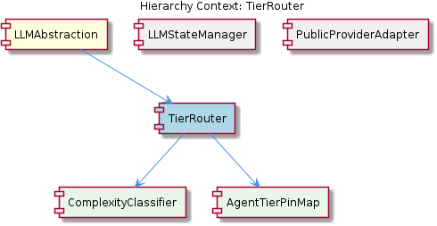

# TierRouter

**Type:** SubComponent

integrations/mcp-server-semantic-analysis/docs/TIERED-MODEL-PROPOSAL.md defines the tiered model selection strategy, distinguishing tiers by task complexity so that lightweight tasks avoid expensive frontier models

# TierRouter — Technical Insight Document

## What It Is

TierRouter is a SubComponent of the LLMAbstraction layer responsible for selecting an appropriate model tier (and thus a concrete provider/model pair) for any given LLM invocation. Its conceptual design is captured in `integrations/mcp-server-semantic-analysis/docs/TIERED-MODEL-PROPOSAL.md` ("Tiered Model Selection Proposal"), and its architectural placement is visualized in `docs/puml/llm-tier-routing.puml`, a PlantUML sequence diagram that shows TierRouter sitting above the individual provider adapters and emitting a `(provider, model)` pair in response to a routing request.

The fundamental purpose of TierRouter is cost and capability matching: lightweight tasks should not consume expensive frontier models, while sufficiently complex tasks should escalate to higher-tier models. Tier definitions themselves are data-driven, sourced from `config/llm-providers.yaml`, which keeps the mapping between tiers and concrete models out of code.

TierRouter is only activated when the operational mode resolved by its sibling LLMStateManager is either `local` or `public` — that is, modes in which multiple model sizes meaningfully exist. In `mock` mode, tier selection is bypassed entirely because no real models are being dispatched.

## Architecture and Design

Architecturally, TierRouter implements a **Strategy + Lookup pipeline** pattern. Routing requests flow through two cooperating child components: ComplexityClassifier, which assesses the task at hand, and AgentTierPinMap, which can override the classifier's decision based on the calling agent's identity. The classifier acts as the entry point for every routing decision, as established by the foundational principle laid out in `TIERED-MODEL-PROPOSAL.md`, while the pin map provides a deterministic escape hatch documented in `integrations/mcp-server-semantic-analysis/docs/architecture/agents.md` ("Agent Architecture").

The sequence captured in `docs/puml/llm-tier-routing.puml` clarifies that TierRouter is a *router*, not a *provider*: it does not invoke models itself. Instead, it returns a `(provider, model)` tuple to the caller, who then dispatches the request through the corresponding provider adapter — for example, the sibling PublicProviderAdapter under `integrations/mcp-server-semantic-analysis/src/providers/`. This separation of routing from execution is the key architectural decision and aligns TierRouter with classical front-controller / dispatcher patterns.

A second important design decision is the **ordering with respect to mode resolution**. Because the tier routing decision is made *after* LLMStateManager resolves the operational mode, TierRouter never needs to reason about `mock` mode. This stratification means TierRouter has a narrower contract than its parent LLMAbstraction: LLMAbstraction handles the three-mode dispatch (`mock`, `local`, `public`), and TierRouter handles only the within-mode model selection.

## Implementation Details

TierRouter's implementation revolves around two contained constructs. **ComplexityClassifier** is invoked first for every routing decision and produces a complexity signal that maps to a tier (e.g., low/medium/high). Per `TIERED-MODEL-PROPOSAL.md`, this complexity-based discrimination is the foundational routing principle inside TierRouter.

**AgentTierPinMap** runs in parallel or as an override path: if the calling agent's identity matches an entry in the map, that agent is pinned to a specific tier regardless of what ComplexityClassifier reports. This makes agent identity a first-class input to tier selection, as described in `docs/architecture/agents.md`. The combination yields a precedence rule: agent pin overrides complexity-based selection.

Once a tier has been chosen, TierRouter consults the available models for that tier from `config/llm-providers.yaml` and emits the resulting `(provider, model)` pair. Because tier-to-model mappings live in YAML rather than code, operators can add new models, retire old ones, or rebalance tiers without code changes. This data-driven posture is one of the explicit design intents stated in the tiered model proposal.

No specific code symbols were enumerated for TierRouter in the current code structure observations, indicating the component is currently in a proposal/design-formalized state with its primary documentation in the markdown and PlantUML artifacts cited above.

## Integration Points

TierRouter's primary upstream integration is with its parent LLMAbstraction. LLMAbstraction is a multi-modal provider abstraction layer that routes LLM calls across `mock`, `local`, and `public` modes; TierRouter is invoked by LLMAbstraction only after mode resolution. The mode itself comes from sibling LLMStateManager, whose `getLLMState()` function in `llm-mock-service.ts` reads `.data/workflow-progress.json` at invocation time. This means TierRouter implicitly inherits LLMStateManager's runtime-switchable behavior — operators can change modes without restart, and TierRouter will simply begin or cease participating accordingly.

Downstream, TierRouter integrates with provider adapters such as the sibling PublicProviderAdapter located under `integrations/mcp-server-semantic-analysis/src/providers/`. The integration contract is intentionally minimal: TierRouter emits `(provider, model)`, and the caller resolves the appropriate adapter. This loose coupling means new provider adapters can be added without modifying TierRouter, provided they are registered in `config/llm-providers.yaml`.

Internally, TierRouter integrates with its children ComplexityClassifier and AgentTierPinMap. The classifier consumes task content/metadata; the pin map consumes the agent identity. Both are driven by external inputs — task payload and caller identity respectively — making TierRouter a pure function from `(task, agent, mode, config)` to `(provider, model)`.

## Usage Guidelines

Developers integrating with TierRouter should observe several conventions. First, **do not bypass mode resolution** — TierRouter must be invoked downstream of LLMStateManager so that it only runs in `local` or `public` modes. Calling it in `mock` mode is meaningless and may indicate a layering violation.

Second, **prefer adjusting `config/llm-providers.yaml` over code changes** when retuning the tier system. Because tier definitions are data-driven, model additions, retirements, and tier rebalancing should happen in configuration. Adding a new model in code would defeat the design intent stated in `TIERED-MODEL-PROPOSAL.md`.

Third, **use AgentTierPinMap sparingly**. Agent pinning overrides complexity-based selection, and excessive pinning will erode the cost-efficiency benefit that motivated the tiered approach. Reserve pins for agents with verified hard requirements — for example, an agent that demonstrably fails at lower tiers or one whose latency budget rules out frontier models.

Finally, treat the `(provider, model)` return value as opaque routing metadata; the actual invocation belongs to the appropriate provider adapter (e.g., PublicProviderAdapter). Conflating routing and execution would re-introduce the coupling that the TierRouter / adapter split is explicitly designed to prevent.

---

### Summary of Key Insights

1. **Architectural patterns identified**: Strategy + Lookup pipeline, Front-controller/Dispatcher (routing decoupled from execution), Data-driven configuration via YAML, Override-precedence pattern (agent pin over complexity classification).
2. **Design decisions and trade-offs**: Routing is separated from execution (loose coupling at cost of an extra indirection); tier mappings live in `config/llm-providers.yaml` (operability vs. compile-time safety); TierRouter is layered below LLMStateManager (narrower contract, no `mock` handling); agent pinning is supported but should be the exception.
3. **System structure insights**: TierRouter is a pure routing function bracketed by LLMStateManager upstream and provider adapters downstream; its children ComplexityClassifier and AgentTierPinMap implement the two complementary selection inputs.
4. **Scalability considerations**: New providers/models scale via YAML edits rather than code; the routing function is stateless aside from configuration, making it horizontally trivial; the cost-tiering itself is a scalability lever, preserving frontier-model capacity for genuinely complex work.
5. **Maintainability assessment**: High — design is documented in `TIERED-MODEL-PROPOSAL.md` and `docs/puml/llm-tier-routing.puml`, configuration is externalized, and responsibilities are sharply partitioned between TierRouter, its children, and sibling adapters. The clear precedence rule (pin → complexity) and the narrow `(provider, model)` output contract reduce the surface area developers must reason about.

## Hierarchy Context

### Parent
- [LLMAbstraction](./LLMAbstraction.md) -- LLMAbstraction is a multi-modal provider abstraction layer that routes LLM calls across three operational modes—mock, local, and public—without requiring callers to be aware of the underlying provider. The mode selection follows a strict priority hierarchy: per-agent overrides take precedence over a global mode, which itself overrides a fallback default of 'public'. This state is persisted in `.data/workflow-progress.json` and read at invocation time, enabling runtime mode switching without service restarts. The component also maintains backward compatibility with a legacy boolean `mockLLM` flag in the same file, ensuring older clients continue to function correctly.

### Children
- [ComplexityClassifier](./ComplexityClassifier.md) -- integrations/mcp-server-semantic-analysis/docs/TIERED-MODEL-PROPOSAL.md ('Tiered Model Selection Proposal') establishes complexity-based tier discrimination as the foundational routing principle, making the classifier the entry point for every routing decision inside TierRouter.
- [AgentTierPinMap](./AgentTierPinMap.md) -- integrations/mcp-server-semantic-analysis/docs/architecture/agents.md ('Agent Architecture') is the primary reference for this construct, documenting how individual agent identities are associated with fixed tiers within the routing pipeline.

### Siblings
- [LLMStateManager](./LLMStateManager.md) -- getLLMState() in llm-mock-service.ts reads .data/workflow-progress.json at invocation time, enabling runtime mode switching without service restarts
- [PublicProviderAdapter](./PublicProviderAdapter.md) -- Provider implementations are located under integrations/mcp-server-semantic-analysis/src/providers/, one adapter per cloud provider as implied by the three-mode architecture

---

*Generated from 5 observations*
