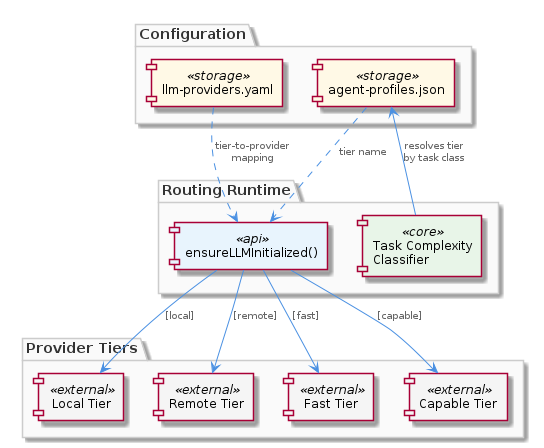
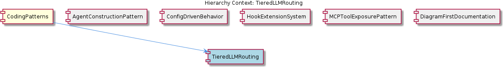

# TieredLLMRouting

**Type:** SubComponent

integrations/mcp-server-semantic-analysis/docs/TIERED-MODEL-PROPOSAL.md formally proposes and documents the tiered model selection approach, classifying tasks into complexity buckets before provider assignment

# TieredLLMRouting — Technical Insight Document

## What It Is

TieredLLMRouting is a routing pattern implemented across the project's configuration and documentation layers, with its canonical specification in `integrations/mcp-server-semantic-analysis/docs/TIERED-MODEL-PROPOSAL.md`. Rather than binding agent tasks directly to specific LLM models or providers, this pattern introduces an intermediate abstraction — a **tier** — that classifies workloads by complexity (e.g., `local`, `remote`, `fast`, `capable`) and lets the system resolve the actual provider endpoint at runtime.

The pattern spans three primary artifacts: the proposal document that defines the conceptual model, `config/llm-providers.yaml` which maps providers to tier labels, and `config/agent-profiles.json` which declares the tier each agent task class should consume. The runtime resolution is handled by the `ensureLLMInitialized()` method, documented in `integrations/mcp-server-semantic-analysis/docs/configuration.md`, which reads the tier assignment from config and resolves it to a concrete provider endpoint at execution time.

As a SubComponent of the parent CodingPatterns entity — specifically a manifestation of the **Externalized Configuration as Runtime Behavior Control** pattern — TieredLLMRouting embodies the project-wide convention that operational decisions about model selection live in config files rather than in TypeScript or Python source code.

## Architecture and Design

The architectural approach is a classic **indirection layer**: task complexity is decoupled from provider identity through the tier abstraction. When an agent needs to execute an LLM-backed operation, it does not name a model; instead, it consults its profile in `config/agent-profiles.json`, which yields a tier name. That tier name is then resolved against `config/llm-providers.yaml`, which holds the provider-to-tier mapping. This two-step lookup means provider changes (swapping `claude-3-5-sonnet` for `gpt-4-turbo` in the `capable` tier, for instance) propagate to every consuming agent without code modifications.

The decision flow itself is documented diagrammatically. `integrations/mcp-server-semantic-analysis/docs/architecture/README.md` references `llm-tier-routing.puml` as the canonical diagram showing how a task's complexity classification flows into a final provider selection. This aligns with the project's sibling **DiagramFirstDocumentation** pattern, where PlantUML diagrams (built on `docs/puml/_standard-style.puml` for visual consistency) serve as the source-of-truth for architectural decisions.

The design trade-off is explicit: by introducing a layer of indirection, the system gives up the immediacy of inline model strings in exchange for centralized, runtime-modifiable routing decisions. The tier labels themselves (`local`, `remote`, `fast`, `capable`) intentionally mix dimensions — locality (`local`/`remote`) and capability (`fast`/`capable`) — reflecting that real-world routing decisions blend cost, latency, and <USER_ID_REDACTED> considerations into a single bucket.

## Implementation Details

The mechanical core of the pattern lives in `ensureLLMInitialized()`, documented in `integrations/mcp-server-semantic-analysis/docs/configuration.md`. This lazy initialization method reads the tier assignment from configuration and resolves the actual provider endpoint at runtime. The lazy-init design echoes the sibling **AgentConstructionPattern**, which prescribes a constructor + lazy-init + execute() lifecycle for agents — here, LLM resolution defers until first actual need, avoiding eager provider connection at import time.

The configuration files act as the substrate of the implementation:

- **`config/llm-providers.yaml`**: Each provider entry carries a tier label. Routing logic references tier names rather than provider-specific model strings, meaning the lookup key is stable across model upgrades.
- **`config/agent-profiles.json`**: Each agent task class references a tier name. Changing a task from lightweight to heavyweight routing is a JSON edit — no compilation, no code review of behavior changes, no redeployment of source.
- **`integrations/mcp-server-semantic-analysis/docs/TIERED-MODEL-PROPOSAL.md`**: Documents the classification of tasks into complexity buckets and the justification for provider assignment per tier.

Notably, the observations report 0 code symbols associated with this entity directly — the implementation is intentionally minimal in terms of dedicated classes. The pattern's "code" is largely the resolution logic embedded in `ensureLLMInitialized()` plus the schema of the config files themselves.

## Integration Points

TieredLLMRouting integrates with several adjacent subsystems. Most directly, it is consumed by the agent layer described in **AgentConstructionPattern** (`integrations/mcp-server-semantic-analysis/docs/architecture/agents.md`): each agent's `execute()` method ultimately invokes `ensureLLMInitialized()` to obtain its provider, parameterized by the agent's profile-declared tier.

It also shares deep structural kinship with sibling **ConfigDrivenBehavior**, which uses the same `config/agent-profiles.json` file to declare per-agent behavioral parameters (concurrency limits, LLM tier choice, etc.). In effect, TieredLLMRouting is the LLM-routing facet of the broader ConfigDrivenBehavior pattern — the tier field in agent-profiles.json is the seam where the two intersect.

The pattern interfaces with the MCP layer indirectly. Tools exposed via the **MCPToolExposurePattern** (e.g., the code-graph-rag MCP tools) that perform LLM-backed analysis flow through the same tier-resolution path. Likewise, runtime hook payloads emitted under the **HookExtensionSystem** contract (`integrations/mcp-constraint-monitor/docs/CLAUDE-CODE-HOOK-FORMAT.md`) can observe provider-selection events without coupling to specific provider identities, because the observable surface is tier-named.

## Usage Guidelines

When working with TieredLLMRouting, developers should follow several conventions implied by the observations:

**Never hard-code model strings in agent logic.** All LLM selection must flow through the tier abstraction. If an agent needs a "more capable" model for a new task class, the correct action is to assign that task class a higher-tier label in `config/agent-profiles.json`, not to special-case the model in source.

**Add new tiers via the proposal document first.** Because `TIERED-MODEL-PROPOSAL.md` is the authoritative specification, introducing a new tier (e.g., a `reasoning` tier for chain-of-thought workloads) should be documented there and reflected in `llm-tier-routing.puml` before being added to `config/llm-providers.yaml`. This preserves the **DiagramFirstDocumentation** convention.

**Treat tier names as a stable API.** Provider mappings under tier labels in `config/llm-providers.yaml` may change frequently (as models evolve), but the tier names themselves are referenced from many agent profiles and should be renamed with care. Tier rename = breaking change.

**Use `ensureLLMInitialized()` rather than direct provider instantiation.** The lazy-init resolver is the only sanctioned entry point. Direct provider construction bypasses tier resolution and breaks the configuration-as-control-plane contract that the parent **CodingPatterns / Externalized Configuration as Runtime Behavior Control** establishes.

**Scalability**: The two-step lookup adds negligible runtime overhead (one file read, cached after `ensureLLMInitialized()`), while enabling horizontal scaling of new task classes without code growth. New providers can be onboarded by adding a YAML entry; new task types by adding a JSON entry.

**Maintainability**: The pattern scores highly on maintainability — the central control surface (two config files plus one resolver method) is small, well-documented, and discoverable from the architecture README. The risk surface is primarily semantic drift between tier names in the two config files; a schema-validation step over `llm-providers.yaml` and `agent-profiles.json` would harden this further.

## Hierarchy Context

### Parent
- [CodingPatterns](./CodingPatterns.md) -- [LLM] **Externalized Configuration as Runtime Behavior Control**: The project enforces a strict separation between behavior and code through a suite of JSON/YAML configuration files under config/. Files such as config/agent-profiles.json, config/health-verification-rules.json, config/llm-providers.yaml, config/knowledge-management.json, and config/hooks-config.json collectively replace what would otherwise be scattered hard-coded logic. A new developer should understand that adding a new agent profile, adjusting an LLM provider's model tier, or modifying a health rule does not require touching TypeScript or Python source files — only the relevant config file. This pattern means that operational changes (e.g., switching a task class from a lightweight to a heavyweight model, or disabling a health rule during an incident) are achievable at runtime or deploy time without code review cycles. The convention also implies that any new subsystem added to the project is expected to declare its configurable parameters in a corresponding config file rather than using environment variables alone or embedding defaults in source.

### Siblings
- [AgentConstructionPattern](./AgentConstructionPattern.md) -- integrations/mcp-server-semantic-analysis/docs/architecture/agents.md documents the agent architecture showing each agent follows a constructor + lazy-init + execute() lifecycle rather than eager initialization at import time
- [ConfigDrivenBehavior](./ConfigDrivenBehavior.md) -- config/agent-profiles.json defines per-agent behavioral parameters (e.g., which LLM tier to use, concurrency limits) so adding a new agent type requires only a new JSON entry, not a code change
- [HookExtensionSystem](./HookExtensionSystem.md) -- integrations/mcp-constraint-monitor/docs/CLAUDE-CODE-HOOK-FORMAT.md specifies the exact JSON payload format that hooks emit on each tool call entry and exit, defining the contract between agents and monitors
- [MCPToolExposurePattern](./MCPToolExposurePattern.md) -- integrations/code-graph-rag/README.md describes the code-graph-rag system exposing its graph query capabilities as MCP tools, not as a Python library import or REST API
- [DiagramFirstDocumentation](./DiagramFirstDocumentation.md) -- docs/puml/_standard-style.puml provides shared color palette, font, and stereotype definitions imported by all other diagrams, ensuring visual consistency across subsystem diagrams

---

*Generated from 5 observations*
