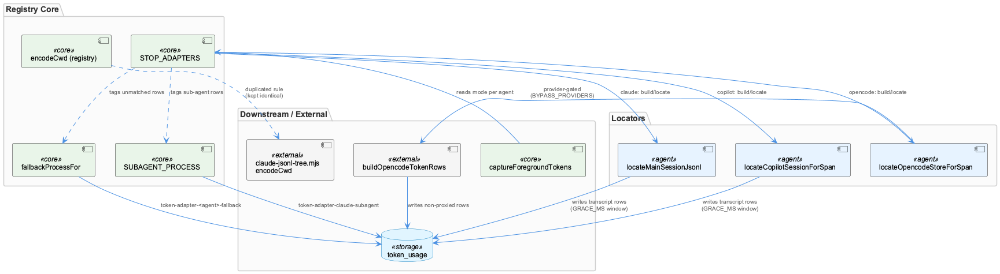
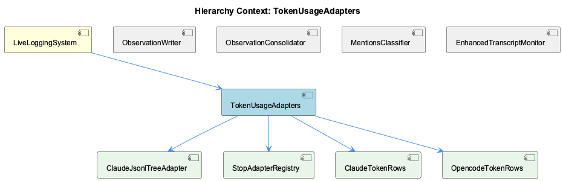

# TokenUsageAdapters

**Type:** SubComponent

## What It Is

TokenUsageAdapters is the token-capture subsystem of LiveLoggingSystem, centered on `lib/lsl/token/stop-adapter-registry.mjs`, which exports the `STOP_ADAPTERS` registry and the locator/provenance functions that drive it. It exists to answer, at "stop" time, how many tokens a foreground agent (claude, copilot, opencode, pi) actually consumed, without double-counting tokens that rapid-llm-proxy has already recorded in `token_usage`. Its children — StopAdapterRegistry, ClaudeJsonlTreeAdapter, ClaudeTokenRows, and OpencodeTokenRows — implement the per-agent transcript discovery and row-building logic that the registry orchestrates.

## Architecture and Design

The core pattern is a Strategy/Adapter hybrid expressed as a keyed data structure rather than a class hierarchy: `STOP_ADAPTERS` maps each agent to either `mode: 'transcript'` (with a `build`/`locate` pair) or `mode: 'stamp-only'` (pi, with no `build` key at all). This lets `captureForegroundTokens` iterate uniformly over all four agents while the *shape* of each entry — not a conditional branch — enforces invariant D-04: only agents that bypass rapid-llm-proxy are eligible for transcript reconstruction. The absence of a `build` property for pi is a structural guarantee against double-counting, not a runtime check that some caller could bypass.

A second pattern is provenance-tagging through a distinguished `process` field instead of new schema: `SUBAGENT_PROCESS` and `fallbackProcessFor` stamp rows so downstream consumers can classify them (foreground vs background, measured vs fallback) without altering the table shape. A third is fail-open error handling: every locator is wrapped in try/catch, failures are reported via non-fatal `stderr.write`, and DB handles are closed in `finally` — the system is designed to degrade to zero captured rows rather than crash the stop-hook path.

## Implementation Details

`locateMainSessionJsonl` (claude) and `locateCopilotSessionForSpan` (copilot) both implement the same locator pattern: find the file whose mtime falls within `[started_at, ended_at + GRACE_MS]`, take the most recent. `GRACE_MS = 5 * 60 * 1000` accounts for the fact that the active transcript is still being appended when stop fires; a strict upper bound would silently yield zero tokens. This fix is duplicated across both functions rather than factored into a shared helper — a known maintenance risk if the grace window ever changes. `locateMainSessionJsonl` further resolves `span?.<COMPANY_NAME_REDACTED>?.cwd || process.cwd()`, a narrow empirically-motivated fix for a ~530× claude undercount in sandboxed worktrees, falling back to `process.cwd()` for interactive `/gsd` sessions that lack `<COMPANY_NAME_REDACTED>.cwd`.

`opencode` is the hybrid case: `locateOpencodeStoreForSpan` is existence-only (a single shared `opencode.db`), and the no-double-count decision is pushed down into `buildOpencodeTokenRows`, which is internally gated by `BYPASS_PROVIDERS` so the same store only emits rows for non-proxied providers — the invariant lives below the registry's mode field for this agent. Locators also intentionally defer ownership/read-safety checks to the downstream `buildXTokenRows` functions rather than re-implementing uid checks at the locator layer.

`encodeCwd` is defined independently in both the registry and `lib/lsl/adapters/claude-jsonl-tree.mjs`, with an explicit comment in the registry cross-referencing the other copy as "the same rule in two places" — a deliberate, acknowledged duplication rather than an oversight.

## Integration Points

Within LiveLoggingSystem, TokenUsageAdapters sits alongside ObservationWriter and ObservationConsolidator but addresses a structurally similar failure class differently: where ObservationWriter's [Raw] fallback rows are logged as "storing" yet silently fail to persist, the registry's `fallbackProcessFor` makes an analogous fallback state (a transcript row with no wire match) an explicitly queryable `process` value rather than an unverifiable log line. Its child ClaudeJsonlTreeAdapter supplies the `encodeCwd` logic mirrored in the registry, and its own `walkSubAgentJsonl`/`SUBAGENT_PATH_RE` sub-agent discovery feeds rows tagged with `SUBAGENT_PROCESS` so they remain foreground-classified but excludable from canonical chat-model selection. StopAdapterRegistry, ClaudeTokenRows, and OpencodeTokenRows are the concrete `build`/`locate` implementations the registry's `STOP_ADAPTERS` entries reference.

## Usage Guidelines

Developers extending this subsystem must treat the `mode` field as the sole gate for transcript reconstruction — adding a `build` function to a proxy-routed agent would silently double-count tokens already captured via rapid-llm-proxy. Any change to `GRACE_MS` must be applied in both `locateMainSessionJsonl` and `locateCopilotSessionForSpan` since the value is duplicated, not shared. Similarly, `encodeCwd` changes must be mirrored between the registry and `claude-jsonl-tree.mjs`, per the existing cross-reference comment. New locators should preserve the fail-open contract (try/catch, non-fatal stderr, `finally`-closed DB handles) rather than allowing a transcript-access failure to abort the stop-hook. Finally, when introducing new row classes, prefer provenance tagging via a distinguished `process` value (as with `SUBAGENT_PROCESS`/`fallbackProcessFor`) over new schema fields, consistent with the pattern used across this component.

## Work Record

What working sessions recorded about this entity — decisions taken, problems hit, and why things are the way they are:

- Per the 'ObservationWriter — Semantic Dedup, Snapshot Promotion, and Raw Fallback Silent' record, ObservationWriter.js has a known failure mode where [Raw] fallback rows are logged as 'storing' yet silently fail to persist. The token-adapter registry's `fallbackProcessFor` provenance tag addresses the analogous risk on the token-capture path (a transcript row inserted without a wire match) by making that fallback state an explicitly queryable `process` value rather than a log line whose truthfulness cannot be verified after the fact — the same failure class, resolved differently on this surface.
- The 'Observation Pipeline — Outage, Backfill, and Data-Loss Modes' record documents that the pipeline can appear 'down' or show 'lost' data despite persistence having actually occurred, or can have real gaps in artifact extraction; the registry's best-effort design (every locator wrapped in try/catch, non-fatal `stderr.write` on failure, DB close in a `finally`) reflects the same operating assumption that this pipeline must degrade to zero captured rows rather than crash the measurement-stop close, trading completeness for reliability under real-world transcript/DB access failures.

## Hierarchy Context

### Parent
- [LiveLoggingSystem](./LiveLoggingSystem.md) -- [SESSION] ObservationWriter.js (per the 'ObservationWriter — Semantic Dedup, Snapshot Promotion, and Raw Fallback Silent' record) mediates all observation persistence between ETM and the database, applying turn-aware semantic dedup and snapshot promotion, but [Raw] fallback observations generated on proxy timeout are logged as 'storing' yet have been repeatedly observed to silently fail to persist

### Children
- [StopAdapterRegistry](./StopAdapterRegistry.md) -- [LLM+CGR] `STOP_ADAPTERS` in lib/lsl/token/stop-adapter-registry.mjs is a keyed-map registry (`claude`, `copilot`, `opencode`, `pi`) where three entries carry `mode: 'transcript'` with a `build`/`locate` pair (`buildClaudeTokenRows`/`locateMainSessionJsonl`, `buildCopilotTokenRows`/`locateCopilotSessionForSpan`, `buildOpencodeTokenRows`/`locateOpencodeStoreForSpan`) and one, `pi`, carries only `{ mode: 'stamp-only' }` with no build property at all. This asymmetry encodes the hard D-04 invariant directly in the data shape rather than in a branch some caller could get wrong: an agent is only eligible for transcript reconstruction if it bypasses rapid-llm-proxy, and the absence of a `build` key (not a flag check) is what prevents `captureForegroundTokens` from ever double-counting a proxy-routed agent's tokens.
- [ClaudeJsonlTreeAdapter](./ClaudeJsonlTreeAdapter.md) -- [LLM] lib/lsl/adapters/claude-jsonl-tree.mjs implements the Path B sub-agent sweep adapter: SUBAGENT_PATH_RE anchors on `.claude/projects/<encoded-cwd>/<parent-uuid>/subagents/agent-<hex>.jsonl`, and buildRow() gates each candidate through a uid ownership check before any parsing occurs, matching the fs uid-check gate referenced as T-51-02-FI in the module header.
- [ClaudeTokenRows](./ClaudeTokenRows.md) -- [CGR] buildClaudeTokenRows (function) in claude-token-rows.mjs
- [OpencodeTokenRows](./OpencodeTokenRows.md) -- [CGR] buildOpencodeTokenRows (function) in opencode-token-rows.mjs

### Siblings
- [ObservationWriter](./ObservationWriter.md) -- [SESSION] ObservationWriter — Semantic Dedup, Snapshot Promotion, and Raw Fallback Silent: [Raw] fallback observations generated on proxy timeout are logged as 'storing' yet have been repeatedly observed to silently fail to persist.
- [ObservationConsolidator](./ObservationConsolidator.md) -- [SESSION] Stage 5 Scheduled Observation Consolidation — Cost Model and Routing Gap: implements a dirty-parent-only scheduled re-consolidation strategy that re-synthesizes only parents with new children, far cheaper than full re-synthesis while nearly matching quality.
- [MentionsClassifier](./MentionsClassifier.md) -- [CGR] MentionsClassifier.js (module) in MentionsClassifier.js
- [EnhancedTranscriptMonitor](./EnhancedTranscriptMonitor.md) -- [CGR] EnhancedTranscriptMonitor (class) in enhanced-transcript-monitor.js
- [ClaudeJsonlTreeAdapter](./ClaudeJsonlTreeAdapter.md) -- [LLM] lib/lsl/adapters/claude-jsonl-tree.mjs implements the Claude sub-agent transcript discovery path via `walkSubAgentJsonl()`, which recursively visits `~/.claude/projects/<encoded-cwd>/<parent-uuid>/subagents/agent-<hex>.jsonl` and filters every candidate through `SUBAGENT_PATH_RE` at the candidate stage rather than after conversion. The regex captures three groups — encoded-cwd, parent session UUID, and agent hex id — that are re-extracted downstream by three separate single-purpose functions (`projectFromClaudeSubagentPath`, `parentSessionFromClaudeSubagentPath`, `agentIdFromClaudeSubagentPath`) instead of being threaded through as a parsed object, so every caller that needs row metadata re-runs the same regex against the same path.

---

*Generated from 10 observations*
